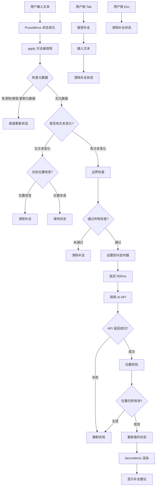
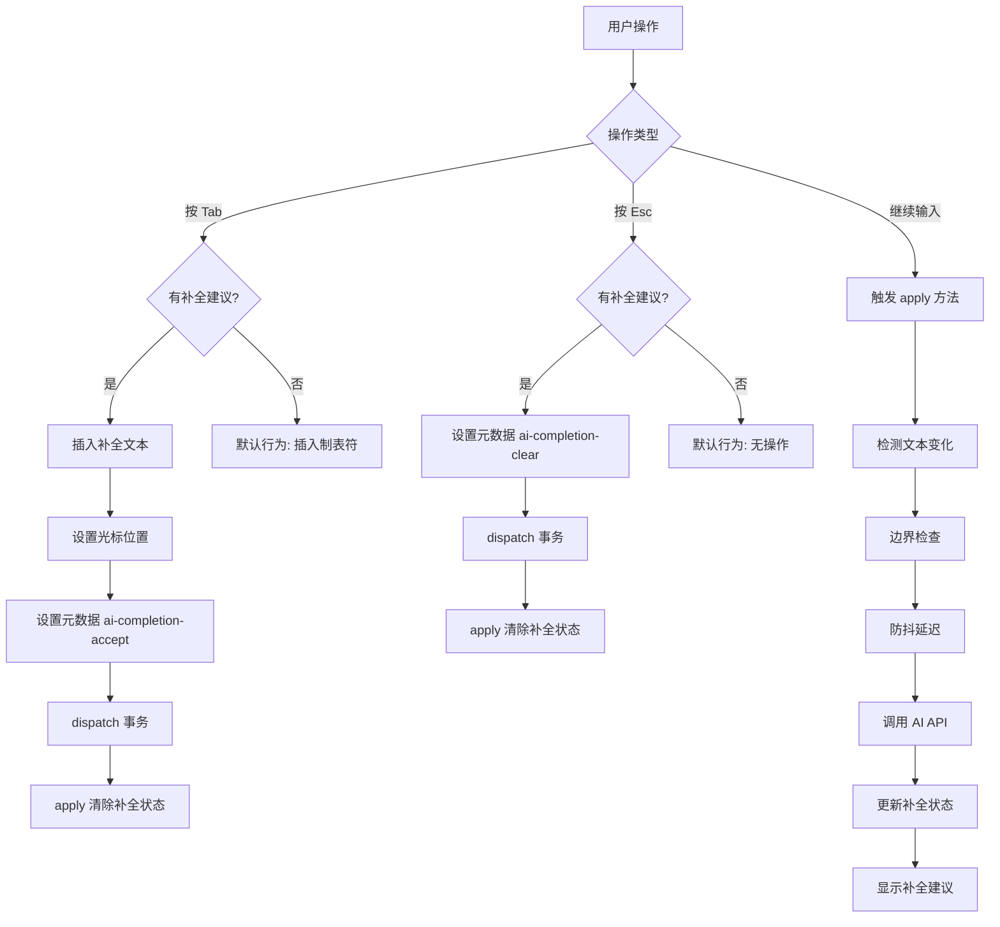

# 在 Markdown 编辑器中实现 AI Tab 补全功能 - 答辩逐字稿

## 第一部分：需求背景

大家好，我今天要讲的是如何在 Markdown 编辑器中实现类似 GitHub Copilot 的 AI Tab 补全功能。

### 我们的目标

我们希望当用户在编辑器中输入文本时，系统能够：

1. 自动提取光标前的文本作为上下文
2. 调用 AI API 生成补全建议
3. 以灰色斜体文本的形式显示在光标位置
4. 用户可以通过 Tab 键接受补全，Esc 键取消，或者继续输入时自动清除

### 核心挑战

这个功能看起来简单，但实际上有几个核心挑战：

第一，**非侵入式显示**。补全建议不能直接写入文档，否则会影响撤销栈，产生数据污染。比如用户不接受补全，但补全已经写入文档了，撤销起来就很麻烦。

第二，**实时响应**。需要监听用户输入，及时触发补全请求。

第三，**异步竞态处理**。AI API 调用是异步的，用户可能在 API 返回前继续输入，这时候补全建议可能显示在错误的位置。

第四，**位置同步**。要确保补全建议显示在正确的位置。

## 第二部分：初期尝试与遇到的问题

### 第一次尝试：DOM 叠加层

最开始，我想的是在编辑器上方叠加一个透明的 DOM 层，通过绝对定位来显示补全建议。

这个方案听起来简单，但实现起来问题很多。

**第一个问题**：光标在文本中间时的定位难题。比如用户输入 `123|45`，光标在中间，我需要精确计算光标在编辑器中的像素位置。这需要获取光标所在行的 DOM 元素，计算光标前文本的宽度，还要考虑字体、字号、行高、字符宽度等等。更麻烦的是，不同浏览器、不同字体的渲染差异会导致计算不准确。

**第二个问题**：滚动同步。编辑器滚动时，叠加层的位置需要同步更新，这又是一个复杂的状态管理问题。

**第三个问题**：输入法兼容。中文输入法的候选词窗口会干扰定位。

**第四个问题**：样式一致性。很难保证补全文本的字体、字号、行高与编辑器完全一致。

所以这个方案虽然思路简单，但实现复杂，维护成本高，而且难以处理各种边界情况。

### 第二次尝试：直接插入文本 + 撤销

既然叠加层不行，我就想，那直接把补全建议插入到文档中，用户不接受时执行撤销操作，不就行了吗？

这个方案听起来更简单，但问题更严重。

**第一个问题**：撤销栈污染。每次补全都会产生一次 Undo 记录，用户需要按多次 Ctrl+Z 才能撤销。而且撤销的行为还不确定，可能撤销到补全之前，也可能只撤销了补全的一部分。

**第二个问题**：数据污染。如果补全插入后用户直接关闭页面，再打开时无法区分是用户输入还是 AI 补全。比如用户输入 `Hello|`，AI 补全插入 `Hello, world!`，用户未接受，直接关闭页面。下次打开时，文档中留下了 `Hello, world!`，用户可能误以为自己输入的。

**第三个问题**：并发冲突。用户快速输入时，补全插入和用户输入会产生竞态条件，导致数据错乱。比如用户输入 `const|`，AI 补全插入 `const message = "hello"`，用户继续输入空格，结果变成了 `const  message = "hello"`，多了空格，位置错乱。

**第四个问题**：视觉干扰。补全文本直接插入会打断用户输入流，光标位置需要跳转，体验很差。

所以这个方案虽然实现简单，但存在严重问题，不适合用于 AI 补全功能。

### 思路转变：学习 VSCode 的实现方式

经过两次失败的尝试，我意识到问题的核心在于：**补全建议不能写入文档模型，只能在视图层显示**。

这让我想到了 VSCode 的 AI 补全功能，也就是 GitHub Copilot。VSCode 中的补全建议是灰色的、半透明的，不会影响文档内容，只有按 Tab 确认后才会写入。这种实现方式完美解决了我们遇到的问题。

于是，我决定深入研究 VSCode 的实现原理，看看它是如何做到"显示但不写入"的。

## 第三部分：学习 VSCode 的实现原理

### VSCode 的虚拟文本机制

在 VSCode 中，无论是 AI 补全（GitHub Copilot）还是传统的代码提示补全，都通过**虚拟文本**机制实现。

虚拟文本是一种**不实际写入文档、仅在编辑器界面渲染显示**的文本内容。它有三个核心特性：

第一，**非侵入性**。虚拟文本不会被保存到文件中，不会占用真实的文档字符位置，只是编辑器在界面上的"视觉层叠加"。

第二，**动态绑定**。虚拟文本和光标位置、代码上下文绑定，会随着光标移动、代码修改实时更新或消失。

第三，**样式区分**。通过半透明、浅灰色等样式，区分真实代码和预览内容。

### VSCode 虚拟文本的实现原理

VSCode 虚拟文本的实现，核心基于**编辑器的分层渲染架构**和**文本模型与视图分离**的设计理念。

**模型-视图分离**

VSCode 的编辑器内核基于 Monaco Editor，核心设计是**模型-视图分离**。

模型层存储真实文档内容，包括字符、行数、偏移量等。文件的读写、保存、编译都基于这个层。这是代码的"数据源"。

视图层将模型层内容渲染到屏幕上，处理光标位置、滚动、高亮等视觉交互。虚拟文本只挂载在视图层。

**关键点**：虚拟文本只存在于视图层，不会被写入模型层。这意味着它只是"看起来存在"，但在编辑器的底层数据结构里没有对应的字符记录。

**视图层叠加渲染机制**

虚拟文本的实现思路是：在视图层叠加渲染，而不修改模型层。

用户看到的界面是：`func tion() {`，其中 `tion() {` 是虚拟文本叠加在这里。但底层数据模型只有 `func|`，只有真实文本，没有虚拟文本。

**工作原理**：

1. 插件监听光标移动、代码修改等事件
2. 根据光标位置计算虚拟文本应该显示的位置
3. 在视图层叠加渲染虚拟文本，不修改模型层
4. 光标移动时销毁虚拟文本，代码修改时重新生成
5. 用户按 Tab 确认时，才将虚拟文本写入模型层

**为什么虚拟文本不会挡住后面的代码？**

虚拟文本的渲染区域是"紧贴光标的额外视觉层"。编辑器自动调整视图布局，让虚拟文本和原有代码在视觉上"前后排列"。通过样式配置（低透明度、灰色字体）区分虚拟文本和真实代码。

### 启发：我们需要类似的机制

通过学习 VSCode 的实现原理，我认识到：

1. **必须使用非侵入式渲染**：补全建议不能写入文档模型
2. **需要装饰器/装饰机制**：在视图层叠加显示，不影响文档结构
3. **需要事件监听**：实时响应输入、光标移动等操作
4. **需要状态管理**：管理补全建议的内容、位置、显示状态

## 第四部分：为什么选择 ProseMirror

### 技术选型的思考

通过学习 VSCode 的实现原理，我认识到需要以下能力：

1. **非侵入式渲染机制**：在视图层叠加显示，不修改文档模型
2. **事件监听能力**：实时响应输入、光标移动等操作
3. **状态管理**：管理补全建议的内容、位置、显示状态
4. **插件系统**：能够扩展编辑器功能

我们的编辑器基于 Tiptap，而 Tiptap 是基于 ProseMirror 的富文本编辑器框架。ProseMirror 恰好提供了我们需要的所有能力：

- **Decoration 机制**：可以在视图层叠加显示内容，不修改文档结构（类似 VSCode 的虚拟文本）
- **Plugin 系统**：可以监听文档变化，管理自己的状态
- **事务元数据**：可以通过元数据在不同阶段传递信息，避免循环触发

### ProseMirror 简介

ProseMirror 是一个用于构建富文本编辑器的工具包，由 Marijn Haverbeke（CodeMirror 的作者）开发。

它的核心架构包括：

**文档模型**：基于 JSON 的树形结构，不可变设计，支持撤销/重做。

**事务机制**：所有文档变化都通过事务进行，可以携带元数据，通过 dispatch 应用变化，支持插件拦截和修改。

**插件系统**：可以监听文档变化，可以修改事务，可以管理自己的状态，可以添加装饰。

**Decoration**：这是 ProseMirror 提供的核心 API，用于在文档上叠加视觉元素，不改变文档结构。Decoration 不修改文档模型，只在视图层渲染，可以绑定到文档的特定位置。

比如创建一个装饰，可以这样写：

```typescript
import { Decoration, DecorationSet } from "@tiptap/pm/view";

// 创建装饰，在指定位置显示自定义元素
const decoration = Decoration.widget(position, widgetElement, {
  side: 1, // 在位置之后显示
});

// 创建装饰集
const decorations = DecorationSet.create(doc, [decoration]);
```

这样就能在视图层叠加显示内容，而不修改文档结构。

### 事务元数据的概念

在 ProseMirror 中，所有文档变化都通过**事务（Transaction）**进行。事务不仅可以描述文档的变化（插入、删除文本等），还可以携带**元数据（Meta）**。

元数据的作用是在事务中传递额外的信息，不改变文档内容。插件可以通过 `tr.getMeta(key)` 读取元数据，也可以通过 `tr.setMeta(key, value)` 设置元数据。

在我们的实现中：

- 用户按 Tab 接受补全时，设置 `ai-completion-accept` 元数据
- 用户按 Esc 取消补全时，设置 `ai-completion-clear` 元数据
- AI API 返回补全建议时，设置 `ai-completion-update` 元数据
- 插件在 `apply` 方法中读取这些元数据，更新补全状态

这样设计的好处是：**避免循环触发**。如果补全更新直接修改文档，会触发新的 `apply` 调用，可能导致无限循环。通过元数据传递信息，可以明确区分"用户输入"和"补全更新"。

## 第五部分：实现方案

### 整体架构

基于 ProseMirror 的插件系统，我实现了 AI 补全扩展。整个流程是这样的：



简单来说就是：用户输入文本后，触发 `apply` 方法，检查元数据，如果没有元数据就检查文本变化，通过边界检查后设置防抖定时器，延迟 500ms 后调用 AI API，API 返回后进行位置校验，校验通过后更新插件状态，`decorations` 方法渲染补全建议，显示在光标位置。

用户按 Tab 时，接受补全，插入文本，清除补全状态。用户按 Esc 时，清除补全状态。

### 核心设计思路

**第一，状态管理**。使用 ProseMirror Plugin 的 `state` 机制管理补全状态。状态包含 `suggestion`（补全文本）和 `position`（补全位置）。通过事务元数据在不同阶段传递补全信息。

**第二，防抖机制**。用户快速输入时，避免频繁调用 AI API。每次新输入都会取消之前的请求，只处理最后一次输入。

防抖的实现很简单：

```typescript
// 在闭包中保存定时器引用
let debounceTimer: NodeJS.Timeout | null = null;

// 每次新输入时清除之前的定时器
if (debounceTimer) {
  clearTimeout(debounceTimer);
  debounceTimer = null;
}

// 设置新的定时器，延迟 500ms 后调用 AI API
debounceTimer = setTimeout(async () => {
  // AI API 调用逻辑
}, 500);
```

这样就能确保用户快速输入时，只处理最后一次输入，避免频繁 API 调用。

**第三，异步竞态防护**。AI API 调用是异步的，用户可能在 API 返回前继续输入。通过双重位置校验确保补全建议只显示在正确的位置。

**第四，非侵入式渲染**。使用 Decoration 机制渲染补全建议，不影响文档结构。补全建议是视觉提示，不拦截用户操作。

### 详细流程说明

`apply` 方法是插件的核心，每次编辑器状态变化时都会被调用。它的处理逻辑分为几个阶段：

**阶段 1：元数据处理（优先级最高）**

元数据是用户操作（Esc/Tab）或 AI 返回的直接结果，需要立即响应。包括 `ai-completion-clear`（用户按 Esc）、`ai-completion-accept`（用户按 Tab）、`ai-completion-update`（AI API 返回补全建议）。

**阶段 2：文本变化检测**

如果没有元数据，检查是否有文本变化。无文本变化时，检查光标位置是否改变，如果改变则清除补全。有文本变化时，排除补全相关操作，进入边界检查。

**阶段 3：边界检查与防抖**

通过边界检查后，设置防抖定时器。边界检查包括：文本选择、代码块、文本长度等。防抖机制延迟 500ms 后调用 AI API，避免频繁请求。双重位置校验：防抖回调执行时和 API 返回后各校验一次，防止异步竞态。

**阶段 4：状态更新与渲染**

AI API 返回后，通过事务元数据更新插件状态。创建事务，设置 `ai-completion-update` 元数据，dispatch 事务，触发 `apply` 方法（回到阶段 1），`decorations` 方法被调用，渲染补全建议。

**关键技术点**：

1. **防抖机制**：用户快速输入时，只处理最后一次输入，避免频繁 API 调用
2. **双重位置校验**：确保补全建议只显示在正确的位置，防止异步竞态
3. **元数据传递**：通过事务元数据在不同阶段传递信息，避免循环触发
4. **边界检查**：提前过滤不需要补全的场景，提升性能和用户体验

### 用户交互流程

用户交互的流程是这样的：



简单来说，用户按 Tab 时，如果有补全建议就插入文本并清除状态，如果没有就执行默认行为。用户按 Esc 时，如果有补全建议就清除，如果没有就无操作。用户继续输入时，触发 `apply` 方法，经过边界检查和防抖延迟后调用 AI API，更新补全状态并显示。

## 第六部分：实现中的关键技术难点

### 难点 1：异步竞态条件

**问题**：AI API 调用是异步的，用户可能在 API 返回前继续输入，导致补全建议显示在错误位置。

**解决方案**：双重位置校验。第一次校验在防抖回调执行时，检查光标位置是否仍然一致。第二次校验在 API 返回后，再次检查光标位置。只有两次校验都通过，才显示补全建议。

具体实现是这样的：

```typescript
// 第一次校验：防抖回调执行时
const currentState = extension.editor.state;
if (currentSelection.from !== currentFrom) {
  return; // 位置已改变，丢弃请求
}

// 调用 AI API...

// 第二次校验：API 返回后
const latestState = extension.editor.state;
if (latestState.selection.from === currentFrom) {
  // 位置仍然一致，更新状态
  tr.setMeta("ai-completion-update", {
    suggestion: suggestionText,
    position: currentFrom,
  });
}
```

这样就能确保补全建议只显示在正确的位置。

### 难点 2：光标位置同步

**问题**：虚拟文本不应该让光标"跳"过去，用户输入时虚拟文本应该直接消失。

**解决方案**：在 `decorations` 方法中校验光标位置，位置不一致时不显示装饰。在 `apply` 方法中检测文本变化，如果有文本变化且不是补全相关操作，则清除补全。

在 `decorations` 方法中，我们这样处理：

```typescript
decorations(state) {
  const pluginState = pluginKey.getState(state);

  // 检查是否有补全建议
  if (!pluginState.suggestion || pluginState.position === null) {
    return DecorationSet.empty;
  }

  // 校验位置有效性：如果光标已移动，不显示补全
  const { selection } = state;
  if (selection.from !== pluginState.position) {
    return DecorationSet.empty;
  }

  // 创建装饰，显示补全建议
  const widget = document.createElement("span");
  widget.style.cssText =
    "color: #9ca3af; " +
    "font-style: italic; " +
    "pointer-events: none; " +
    "user-select: none;";
  widget.textContent = pluginState.suggestion;

  return DecorationSet.create(state.doc, [
    Decoration.widget(pluginState.position, widget, {
      side: 1,  // 在光标后显示
      ignoreSelection: true  // 不影响选择
    })
  ]);
}
```

这样就能确保虚拟文本不会让光标"跳"过去，用户输入时虚拟文本会直接消失。

### 难点 3：边界情况处理

我们处理了以下边界情况：

- **选中状态**：有文本选择时清除补全
- **代码块**：代码块内不显示文本补全
- **文本长度**：文本太短时不触发补全
- **撤销重做**：通过事务元数据同步状态

### 性能优化

1. **防抖机制**：减少 API 调用次数
2. **位置校验**：避免无效的状态更新
3. **边界检查**：提前过滤不需要补全的场景
4. **静默失败**：API 错误不影响用户编辑体验

## 第七部分：总结

### 实现路径回顾

我的实现路径是这样的：

1. **需求明确**：在 Markdown 编辑器中实现 AI Tab 补全功能
2. **初期尝试**：直接插入文本方案遇到撤销栈污染、数据污染等问题
3. **学习借鉴**：研究 VSCode 的虚拟文本机制，理解模型-视图分离的设计
4. **技术选型**：选择 ProseMirror 作为编辑器基础，利用其 Decoration 机制
5. **实现方案**：通过 ProseMirror 插件系统实现非侵入式补全功能

### 核心设计思路

AI 补全扩展的核心设计思路是：

1. **状态驱动**：使用 ProseMirror Plugin 状态管理补全信息
2. **防抖优化**：避免频繁 API 调用，提升性能和用户体验
3. **竞态防护**：双重位置校验确保补全建议的准确性
4. **非侵入式**：使用 Decoration 机制，不影响文档结构和用户操作

### 关键技术点

- **ProseMirror Plugin 系统**：管理状态、监听变化、渲染装饰
- **Decoration 机制**：非侵入式渲染，类似 VSCode 的虚拟文本
- **事务元数据**：在不同阶段传递补全信息，避免循环触发
- **双重位置校验**：确保补全建议显示在正确的位置
- **防抖机制**：减少 API 调用，提升性能

### 与 VSCode 的对比

| 维度          | VSCode                 | ProseMirror 实现           |
| ------------- | ---------------------- | -------------------------- |
| 虚拟文本机制  | Monaco Editor 原生支持 | 通过 Decoration 实现       |
| 模型-视图分离 | 完全分离               | 耦合较紧，但可通过插件解耦 |
| 实现复杂度    | 相对简单（API 完善）   | 需要处理更多边界情况       |
| 性能          | 视图层直接渲染，性能好 | 需要重新计算文档，性能略低 |
| 功能完整性    | 支持所有场景           | 需要逐步完善边界情况       |

### 未来优化方向

1. **性能优化**：大文档时的渲染性能优化
2. **边界情况**：完善 IME 输入法、移动端等场景的处理
3. **用户体验**：支持自定义快捷键、补全建议的样式定制
4. **功能扩展**：支持多行补全、代码块内的补全等

---

整个流程通过 `apply` 方法的状态更新逻辑和 `decorations` 方法的渲染逻辑，实现了从用户输入到补全建议显示的完整闭环。虽然实现过程复杂，但最终实现了类似 VSCode 的虚拟文本效果，为 Markdown 编辑器提供了良好的 AI 补全体验。

谢谢大家！
