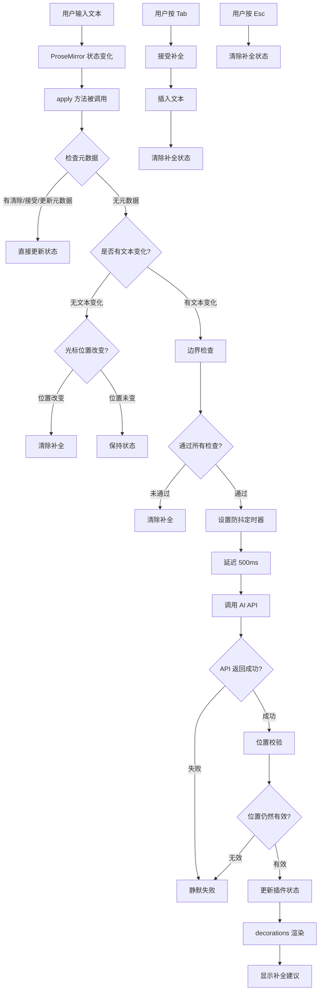
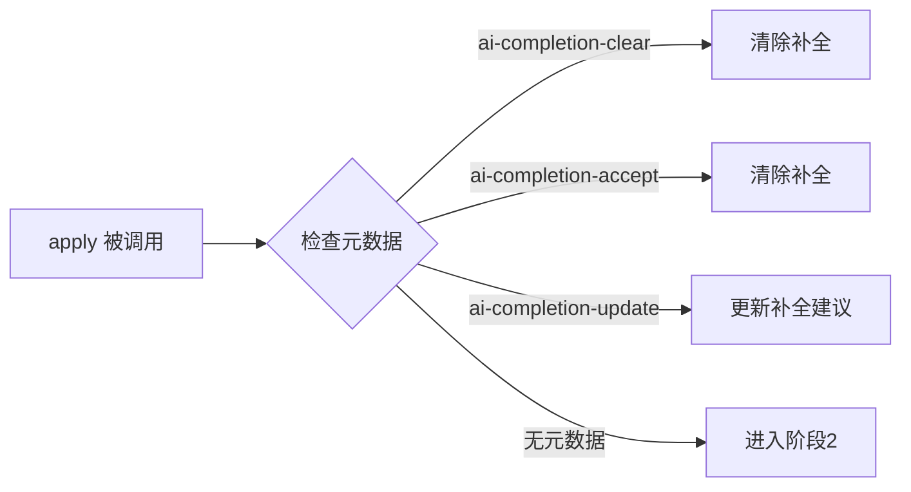
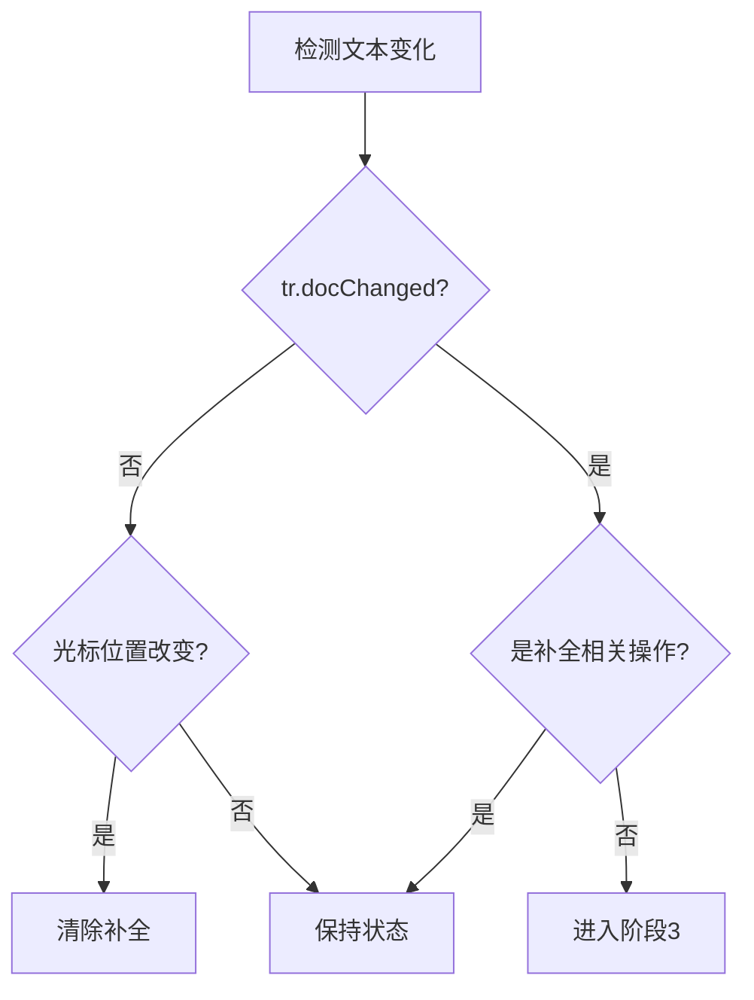
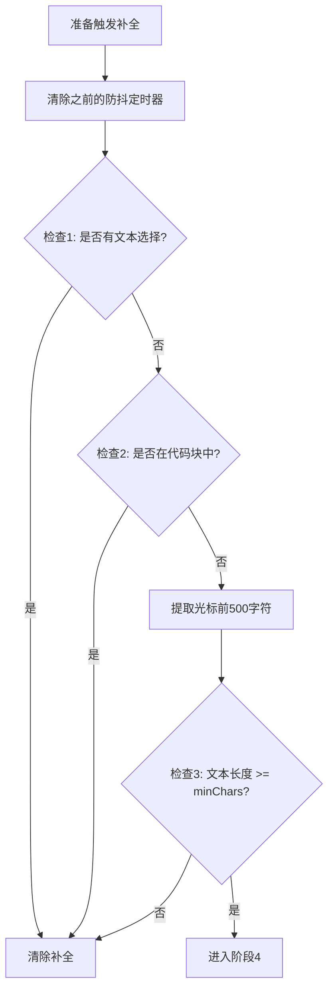
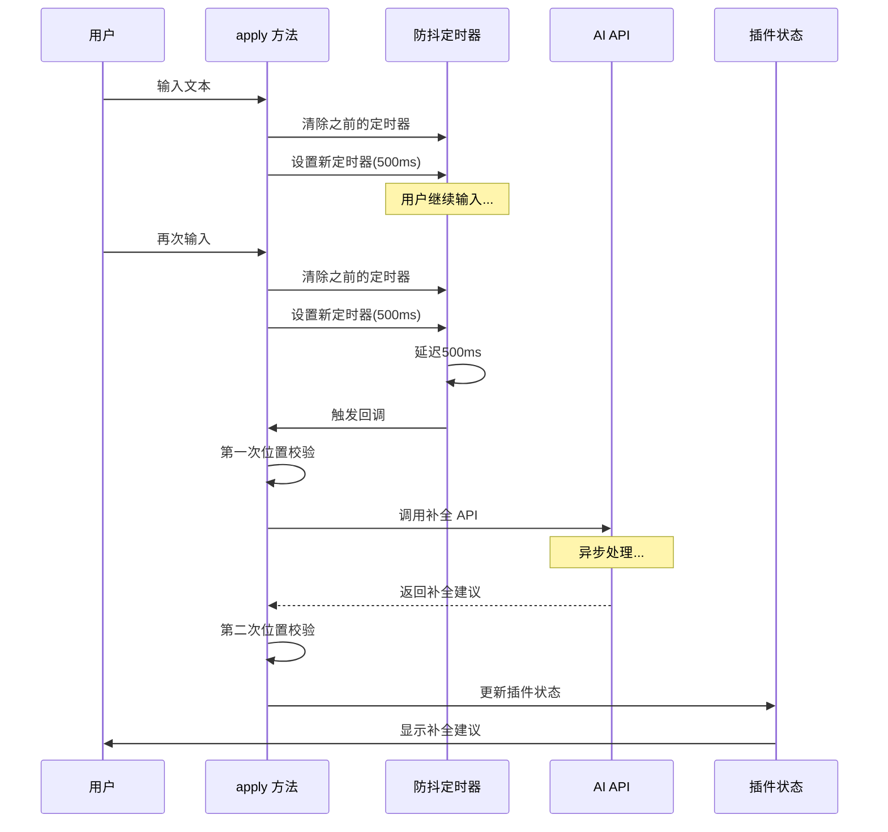
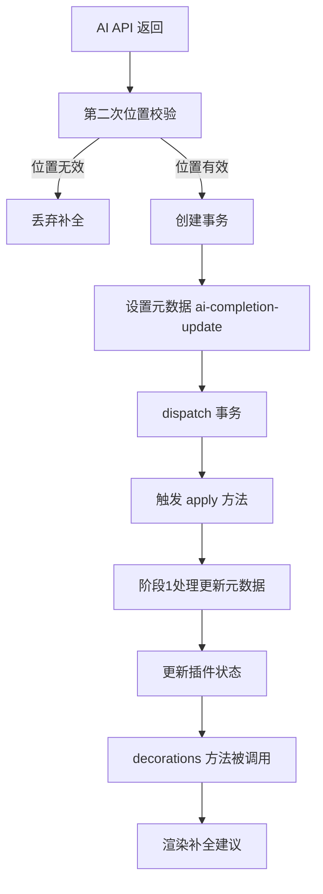
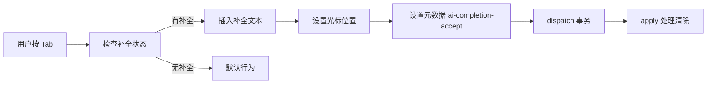
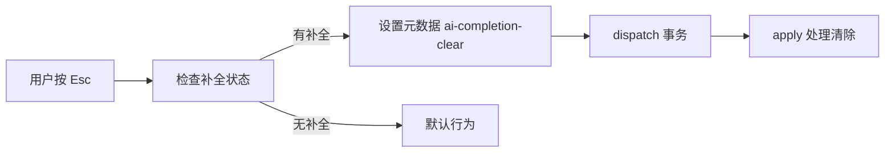

# AI 补全扩展技术文档

## 第一部分：需求背景

### 目标：在 Markdown 编辑器中实现 AI Tab 补全功能

我们希望为 Markdown 编辑器添加类似 GitHub Copilot 的实时内联补全功能。当用户在编辑器中输入文本时，系统应该：

1. **自动提取上下文**：获取光标前的文本内容作为上下文
2. **调用 AI API**：基于上下文生成补全建议
3. **显示补全建议**：以灰色斜体文本的形式显示在光标位置
4. **用户交互**：
   - 按 `Tab` 键接受补全，将建议文本插入文档
   - 按 `Esc` 键取消补全，清除建议
   - 继续输入时，补全建议自动消失

### 核心挑战

- **非侵入式显示**：补全建议不能直接写入文档，否则会影响撤销栈、产生数据污染
- **实时响应**：需要监听用户输入，及时触发补全请求
- **异步竞态处理**：AI API 是异步的，用户可能在 API 返回前继续输入
- **位置同步**：确保补全建议显示在正确的位置

## 第二部分：初期尝试与遇到的问题

### 方案 A：直接插入文本 + 撤销

**思路**：补全建议直接插入到文档中，用户不接受时执行撤销操作。

**实现尝试**：

```typescript
// 伪代码
const handleAIResponse = (suggestion: string) => {
  // 直接插入补全文本
  editor.insertText(suggestion);

  // 用户不接受时撤销
  if (userRejects) {
    editor.undo();
  }
};
```

**遇到的问题**：

| 问题              | 说明                                                               | 影响       |
| ----------------- | ------------------------------------------------------------------ | ---------- |
| **撤销栈污染**    | 每次补全都会产生一次 Undo 记录，用户需要按多次 Ctrl+Z              | 用户体验差 |
| **断网/关闭页面** | 补全插入后用户直接关闭页面，再打开时无法区分是用户输入还是 AI 补全 | 数据污染   |
| **并发冲突**      | 用户快速输入时，补全插入和用户输入会产生竞态条件                   | 数据错乱   |
| **视觉干扰**      | 补全文本直接插入会打断用户输入流，光标位置需要跳转                 | 注意力分散 |
| **性能问题**      | 每次补全都需要修改文档模型，触发编辑器重新计算整个文档树           | 性能下降   |

**具体场景示例**：

```
场景 1：断网后关闭页面
用户输入：Hello|
AI 补全插入：Hello, world!  (直接写入文档)
用户未接受，直接关闭页面
下次打开 → 文档中留下了 "Hello, world!"，用户可能误以为自己输入的

场景 2：撤销栈污染
用户输入：function add(|
AI 补全：a, b) { return a + b; }
用户不接受，按 Ctrl+Z
结果：可能撤销到补全之前，也可能只撤销了补全的一部分
需要按多次 Ctrl+Z 才能回到 "function add(" 状态

场景 3：并发冲突
用户输入：const|
AI 补全插入：const message = "hello"
用户继续输入：  (空格)
实际结果：const  message = "hello"  (多了空格，位置错乱)
```

**结论**：直接插入方案存在严重问题，不适合用于 AI 补全功能。

### 方案 B：使用 DOM 叠加层

**思路**：在编辑器上方叠加一个透明的 DOM 层，通过绝对定位显示补全建议。

**实现尝试**：

```typescript
// 伪代码
const showSuggestion = (text: string, position: Position) => {
  const overlay = document.createElement("div");
  overlay.style.position = "absolute";
  overlay.style.color = "#9ca3af";
  overlay.style.fontStyle = "italic";
  overlay.textContent = text;
  // 计算光标位置并定位
  editorContainer.appendChild(overlay);
};
```

**遇到的问题**：

1. **位置计算困难**：需要精确计算光标在编辑器中的像素位置，不同字体、字号、行高都会影响计算
2. **滚动同步**：编辑器滚动时，叠加层位置需要同步更新
3. **输入法兼容**：中文输入法（IME）的候选词窗口会干扰定位
4. **移动端适配**：虚拟键盘弹出时位置计算更复杂
5. **样式一致性**：难以保证补全文本的字体、字号、行高与编辑器完全一致

**结论**：DOM 叠加层方案实现复杂，维护成本高，且难以处理各种边界情况。

## 第三部分：学习 VSCode 的实现原理

### VSCode 的虚拟文本（Virtual Text）机制

在 VSCode 中，AI 补全功能通过**虚拟文本**机制实现。虚拟文本是一种**不实际写入文档、仅在编辑器界面渲染显示**的文本内容。

#### 核心特性

1. **非侵入性**
   - 虚拟文本不会被保存到文件中
   - 不会占用真实的文档字符位置
   - 只是编辑器在界面上的 "视觉层叠加"
   - 对代码的编译、运行、版本控制没有任何影响
   - 例如：AI 补全的半透明建议，不按 Tab 确认就不会出现在真实代码里

2. **动态渲染与绑定**
   - 通常和光标位置、代码上下文绑定
   - 会随着光标移动、代码修改实时更新或消失
   - 光标移动到其他行，虚拟文本自动隐藏
   - 继续输入自定义代码，虚拟文本会被覆盖并消失

3. **样式可定制**
   - 可设置为半透明、浅灰色
   - 区分真实代码和预览内容
   - 避免视觉混淆

#### VSCode 虚拟文本的实现原理

VSCode 虚拟文本的实现，核心基于**编辑器的分层渲染架构**和**文本模型与视图分离**的设计理念。

**1. 文本模型（Text Model）与视图（View）分离**

VSCode 的编辑器内核基于 Monaco Editor，核心设计是**模型-视图分离**：

```
模型层（Model）
  ├─ 存储真实文档内容
  ├─ 字符、行数、偏移量等
  ├─ 文件的读写、保存、编译都基于这个层
  └─ 这是代码的「数据源」

视图层（View）
  ├─ 将模型层内容渲染到屏幕上
  ├─ 处理光标位置、滚动、高亮等视觉交互
  └─ 虚拟文本只挂载在视图层
```

**关键点**：虚拟文本只存在于视图层，不会被写入模型层。这意味着它只是 "看起来存在"，但在编辑器的底层数据结构里没有对应的字符记录。

**2. 装饰器 API（Decorator API）**

虚拟文本的渲染，依赖 Monaco Editor 提供的 `createDecorator` 装饰器 API：

```
插件定义装饰器规则
  ├─ 指定位置（光标后的偏移量、行末等）
  ├─ 指定内容（要显示的提示文本）
  └─ 指定样式（颜色、透明度、字体等）

编辑器在视图层渲染
  ├─ 叠加渲染虚拟文本
  ├─ 不改变模型层的字符偏移量
  └─ 虚拟文本不占用真实的「字符位置」

事件触发时更新或销毁
  ├─ 光标移动 → 更新或销毁装饰器
  ├─ 代码修改 → 重新生成虚拟文本
  └─ 按 Tab 确认 → 写入模型层
```

**3. 事件驱动的动态更新机制**

虚拟文本会随着操作动态变化，依赖 VSCode 的事件监听机制：

```
插件监听核心事件
  ├─ onDidChangeCursorPosition  // 光标移动
  └─ onDidChangeTextDocument    // 代码修改

触发事件时重新计算
  ├─ 光标移走 → 销毁装饰器
  └─ 代码改变 → 重新生成虚拟文本
```

**AI 补全的完整流程**：

1. 用户输入代码
2. 插件实时监听输入内容
3. 生成补全建议
4. 通过装饰器 API 渲染成虚拟文本
5. 用户按 Tab 键
6. 插件把虚拟文本写入模型层，转化为真实代码

#### 为什么虚拟文本不会挡住后面的代码？

装饰器 API 支持「内联无占位渲染」：

```
实际文档：    func|
虚拟文本层：     tion() {  (灰色，半透明)

视觉效果：    func tion() {
              ↑    ↑
           真实  虚拟
```

- 虚拟文本的渲染区域是「紧贴光标的额外视觉层」
- 编辑器自动调整视图布局，让虚拟文本和原有代码在视觉上 "前后排列"
- 通过样式配置（低透明度、灰色字体）区分虚拟文本和真实代码

### 启发：我们需要类似的机制

通过学习 VSCode 的实现原理，我们认识到：

1. **必须使用非侵入式渲染**：补全建议不能写入文档模型
2. **需要装饰器/装饰机制**：在视图层叠加显示，不影响文档结构
3. **需要事件监听**：实时响应输入、光标移动等操作
4. **需要状态管理**：管理补全建议的内容、位置、显示状态

## 第四部分：ProseMirror 简介

### 什么是 ProseMirror

ProseMirror 是一个用于构建富文本编辑器的工具包，由 Marijn Haverbeke（CodeMirror 的作者）开发。它提供了构建现代、可扩展的富文本编辑器所需的核心功能。

### 核心架构

ProseMirror 采用**文档模型（Document Model）**和**事务（Transaction）**的设计：

```
文档模型（Document）
  ├─ 基于 JSON 的树形结构
  ├─ 节点（Node）和标记（Mark）
  ├─ 不可变（Immutable）设计
  └─ 支持撤销/重做

事务（Transaction）
  ├─ 描述文档的变化
  ├─ 可以携带元数据（Meta）
  ├─ 通过 dispatch 应用变化
  └─ 支持插件拦截和修改

插件系统（Plugin）
  ├─ 可以监听文档变化
  ├─ 可以修改事务
  ├─ 可以管理自己的状态
  └─ 可以添加装饰（Decoration）
```

### 关键概念

#### 1. 文档模型（Document Model）

ProseMirror 的文档是一个树形结构，类似于 DOM，但更轻量：

```typescript
// 文档结构示例
{
  type: "doc",
  content: [
    {
      type: "paragraph",
      content: [
        { type: "text", text: "Hello " },
        { type: "text", marks: [{ type: "strong" }], text: "world" }
      ]
    }
  ]
}
```

#### 2. 事务（Transaction）

所有文档变化都通过事务进行：

```typescript
// 创建事务
const tr = state.tr;
tr.insertText("Hello", pos);
tr.setMeta("my-meta", { key: "value" });
view.dispatch(tr);
```

#### 3. 插件（Plugin）

插件可以扩展编辑器功能：

```typescript
const myPlugin = new Plugin({
  state: {
    init() {
      return { count: 0 };
    },
    apply(tr, value) {
      // 处理事务，更新状态
      return { count: value.count + 1 };
    },
  },
  view(editorView) {
    // 插件视图初始化
    return {
      update(view, prevState) {
        // 状态更新时的回调
      },
      destroy() {
        // 清理资源
      },
    };
  },
});
```

#### 4. 装饰（Decoration）

装饰用于在文档上叠加视觉元素，不改变文档结构：

```typescript
// 创建装饰
const decoration = Decoration.widget(pos, widgetElement, {
  side: 1, // 在位置之后显示
  key: "my-widget",
});

// 装饰集
const decorations = DecorationSet.create(doc, [decoration]);
```

### ProseMirror 的优势

1. **强大的插件系统**：可以轻松扩展功能
2. **状态管理**：插件可以管理自己的状态
3. **装饰机制**：支持非侵入式渲染（类似 VSCode 的虚拟文本）
4. **事务机制**：所有变化都通过事务，支持撤销/重做
5. **类型安全**：基于 TypeScript，提供完整的类型定义

### 为什么选择 ProseMirror

对于我们的 AI 补全功能，ProseMirror 提供了：

1. **Decoration 机制**：可以像 VSCode 一样在视图层叠加补全建议，不写入文档
2. **Plugin 系统**：可以监听文档变化，管理补全状态
3. **事务元数据**：可以通过元数据传递补全信息，避免循环触发
4. **状态管理**：插件可以管理补全建议的内容、位置等状态

## 第五部分：使用 ProseMirror 插件的实现方案

### 整体架构

基于 ProseMirror 的插件系统，我们实现了 AI 补全扩展：



### 核心设计思路

#### 1. 状态管理

- 使用 ProseMirror Plugin 的 `state` 机制管理补全状态
- 状态包含：`suggestion`（补全文本）和 `position`（补全位置）
- 通过事务元数据（meta）在不同阶段传递补全信息

#### 2. 防抖机制

- 用户快速输入时，避免频繁调用 AI API
- 每次新输入都会取消之前的请求，只处理最后一次输入

#### 3. 异步竞态防护

- AI API 调用是异步的，用户可能在 API 返回前继续输入
- 通过双重位置校验确保补全建议只显示在正确的位置

#### 4. 非侵入式渲染

- 使用 Decoration 机制渲染补全建议，不影响文档结构
- 补全建议是视觉提示，不拦截用户操作

### 详细流程说明

#### 阶段 1：元数据处理（优先级最高）



**思路说明**：

- 元数据是最高优先级的处理，因为它们是用户操作（Esc/Tab）或 AI 返回的直接结果
- 这些操作需要立即响应，不经过其他逻辑判断

#### 阶段 2：文本变化检测



**思路说明**：

- 只有真正的文本变化才需要触发补全请求
- 光标移动但不输入文本时，如果位置改变则清除补全（补全建议是针对之前位置的）
- 排除补全相关的元数据变化，避免循环触发

#### 阶段 3：边界检查



**边界检查说明**：

1. **文本选择检查**
   - 用户选择文本时，可能想要替换或删除，不需要补全
   - 避免在错误时机显示补全

2. **代码块检查**
   - 代码块的补全应该由专门的代码编辑器处理
   - 文本补全只适用于普通文本内容

3. **文本长度检查**
   - 文本太短时，上下文不足，补全质量差
   - 避免无意义的 API 调用

#### 阶段 4：防抖延迟与 AI 请求



**防抖机制说明**：

1. **为什么需要防抖？**
   - 用户快速输入时，每次输入都触发 API 调用会导致：
     - 大量无效请求（前面的请求会被后面的输入覆盖）
     - 服务器压力大
     - 用户体验差（补全建议频繁闪烁）

2. **防抖实现**
   - 每次新输入时，清除之前的定时器
   - 只保留最后一次输入的定时器
   - 延迟 500ms 后调用 API（用户停止输入 500ms 后才请求）

3. **异步竞态防护**
   - **第一次校验**：防抖回调执行时，检查光标位置是否仍然一致
   - **第二次校验**：API 返回后，再次检查光标位置
   - 双重校验确保补全建议只显示在正确的位置

#### 阶段 5：状态更新与渲染



**状态更新流程**：

1. **为什么使用元数据更新？**
   - 不能直接在异步回调中修改状态
   - 需要通过事务机制更新状态
   - 元数据是 ProseMirror 推荐的状态更新方式

2. **渲染机制**
   - `decorations` 方法在每次状态变化时被调用
   - 检查插件状态，如果有补全建议则创建装饰
   - 装饰以灰色斜体文本显示在光标位置

### 关键代码片段说明

#### 1. 防抖定时器管理

```typescript
// 在闭包中保存定时器引用
let debounceTimer: NodeJS.Timeout | null = null;

// 每次新输入时清除之前的定时器
if (debounceTimer) {
  clearTimeout(debounceTimer);
  debounceTimer = null;
}

// 设置新的定时器
debounceTimer = setTimeout(async () => {
  // AI API 调用逻辑
}, extension.options.debounceMs);
```

**设计要点**：

- 定时器保存在闭包中，避免被垃圾回收
- 每次清除旧定时器，确保只处理最后一次输入

#### 2. 双重位置校验

```typescript
// 第一次校验：防抖回调执行时
const currentState = extension.editor.state;
if (currentSelection.from !== currentFrom) {
  return; // 位置已改变，丢弃请求
}

// 第二次校验：API 返回后
const latestState = extension.editor.state;
if (latestState.selection.from === currentFrom) {
  // 位置仍然一致，更新状态
  tr.setMeta("ai-completion-update", {
    suggestion: suggestionText,
    position: currentFrom,
  });
}
```

**设计要点**：

- 第一次校验：避免处理过期的请求
- 第二次校验：确保 API 返回后位置仍然有效
- 双重校验确保补全建议的准确性

#### 3. 装饰渲染

```typescript
decorations(state) {
  const pluginState = pluginKey.getState(state);

  // 检查是否有补全建议
  if (!pluginState.suggestion || pluginState.position === null) {
    return DecorationSet.empty;
  }

  // 校验位置有效性
  if (selection.from !== pluginState.position) {
    return DecorationSet.empty;
  }

  // 创建装饰
  const widget = document.createElement("span");
  widget.style.cssText = "color: #9ca3af; font-style: italic; ...";
  widget.textContent = pluginState.suggestion;

  return DecorationSet.create(state.doc, [
    Decoration.widget(pluginState.position, widget, { side: 1 })
  ]);
}
```

**设计要点**：

- 使用 `Decoration.widget` 创建不影响文档结构的装饰
- 装饰样式设置为不拦截鼠标事件（`pointer-events: none`）
- 每次状态变化时重新计算装饰

### 用户交互流程

#### Tab 键接受补全



#### Esc 键取消补全



## 第六部分：技术难点与解决方案

### 在 Markdown 编辑器实现 VSCode 效果的技术难点

虽然 ProseMirror 提供了 Decoration 机制，但要实现类似 VSCode 的虚拟文本效果，仍面临以下挑战：

#### 1. 编辑器架构差异

| 维度     | VSCode (Monaco)    | ProseMirror/Tiptap      |
| -------- | ------------------ | ----------------------- |
| 核心模型 | 简单的字符串数组   | 复杂的 Node 树结构      |
| 装饰系统 | 原生支持，API 完善 | 需要自己实现 Decoration |
| 光标管理 | 单一光标模型       | 多选区、复杂 Selection  |
| 渲染层   | 视图层完全独立     | 视图和模型耦合较紧      |

**问题**：ProseMirror 的 Decoration 机制是设计好的，但要做到 VSCode 那种「紧贴光标、不影响输入」的效果，需要处理很多边界情况。

#### 2. 光标位置同步问题

```
用户输入：Hello|
虚拟文本： Hello World
问题：光标应该在 "Hello|" 还是 "Hello |"？

VSCode：虚拟文本不影响光标位置，仍在 |
ProseMirror：Decoration.widget 显示在光标后，但光标位置计算复杂
```

**难点**：

- 虚拟文本不应该让光标"跳"过去
- 用户输入时，虚拟文本应该被"挤"开还是直接消失？
- 光标左右移动时，虚拟文本何时显示/隐藏？

**解决方案**：在 `decorations` 方法中校验光标位置，位置不一致时不显示装饰。

#### 3. 文本输入的冲突处理

```
场景：用户在有虚拟文本时继续输入

初始状态：Hello| World  (World 是虚拟文本)
用户输入：空格
期望结果：Hello |  (虚拟文本消失)
实际可能：Hello  World  (虚拟文本被推开，但样式混乱)
```

**难点**：

- 需要拦截每一次输入事件
- 判断输入是否应该清除虚拟文本
- 处理中文输入法（IME）的复杂状态

**解决方案**：在 `apply` 方法中检测文本变化，如果有文本变化且不是补全相关操作，则清除补全。

#### 4. 样式渲染的复杂性

VSCode 可以直接控制 DOM 渲染，但 ProseMirror/Tiptap 需要通过：

```
ProseMirror 层级
Document Node
  └─ Paragraph Node
      └─ Text Node ("Hello")
      └─ Decoration.widget (虚拟文本容器)
          └─ span 元素 (样式控制)
```

**问题**：

- Widget 的位置计算（`side: 1` 还是 `side: -1`）
- Widget 的高度、行高如何与真实文本对齐？
- 换行时虚拟文本如何处理？
- 不同字号、字体时对齐问题

**解决方案**：使用 `Decoration.widget` 的 `side: 1` 参数，让装饰显示在位置之后，并通过 CSS 样式确保视觉对齐。

#### 5. 性能和响应性

```
每次输入触发：
1. ProseMirror 事务更新
2. 重新计算 Document
3. 重新计算 Decorations
4. DOM 更新
5. 虚拟文本重新渲染

VSCode：
1. 视图层直接渲染虚拟文本
2. 不触发表面模型更新
```

**问题**：

- ProseMirror 的每次状态更新都会触发整个文档的重新计算
- 虚拟文本的频繁更新可能导致性能问题
- 大文档时更明显

**解决方案**：

- 防抖机制减少 API 调用
- 位置校验避免无效的状态更新
- 边界检查提前过滤不需要补全的场景

#### 6. 边界情况处理

| 场景     | 问题                                                 | 解决方案                           |
| -------- | ---------------------------------------------------- | ---------------------------------- |
| 选中状态 | 用户选中一段文本时，虚拟文本应该显示在哪里？         | 有文本选择时清除补全               |
| 多光标   | ProseMirror 支持多选区，虚拟文本应该为哪个光标显示？ | 只支持单光标场景                   |
| 代码块   | 代码块内是否需要不同的补全逻辑？                     | 代码块内不显示文本补全             |
| 表格     | 在表格单元格内输入，虚拟文本如何处理？               | 表格内支持补全，但需要特殊处理     |
| 拖拽     | 用户拖拽选中时，虚拟文本如何响应？                   | 拖拽时清除补全                     |
| 复制粘贴 | 复制时是否包含虚拟文本？粘贴时如何处理？             | 虚拟文本不参与复制，粘贴时清除补全 |
| 撤销重做 | Undo/Redo 栈如何与虚拟文本状态同步？                 | 通过事务元数据同步状态             |

#### 7. IME 输入法的兼容

```
中文输入流程：
1. 用户按拼音字母
2. 显示候选词窗口
3. 用户选择候选词
4. 确认输入

问题：
- 拼音输入阶段是否显示虚拟文本？
- 候选词选择时虚拟文本如何处理？
- 确认后虚拟文本是否需要重新计算？
```

**解决方案**：在 IME 输入过程中，通过检测 `compositionstart` 和 `compositionend` 事件，在输入法激活时暂停补全，输入法结束后重新触发。

#### 8. 移动端兼容

- 移动端没有物理 Tab 键，如何接受补全？
- 虚拟键盘弹出时，虚拟文本的位置如何计算？
- 触摸事件和鼠标事件的处理差异

**解决方案**：移动端可以通过点击补全建议或添加自定义按钮来接受补全。

### 性能优化

1. **防抖机制**：减少 API 调用次数
2. **位置校验**：避免无效的状态更新
3. **边界检查**：提前过滤不需要补全的场景
4. **静默失败**：API 错误不影响用户编辑体验

### 潜在问题与解决方案

#### 问题 1：异步竞态条件

**场景**：用户快速输入，多个 API 请求同时进行，后发的请求可能先返回。

**解决方案**：

- 双重位置校验
- 每次新输入清除旧定时器
- 只处理位置一致的补全建议

#### 问题 2：补全建议显示在错误位置

**场景**：API 返回时，用户已移动光标。

**解决方案**：

- 在 `decorations` 方法中再次校验位置
- 位置不一致时不显示装饰

#### 问题 3：频繁 API 调用

**场景**：用户快速输入时，每次输入都触发 API 调用。

**解决方案**：

- 防抖机制：延迟 500ms 后才调用 API
- 每次新输入清除旧定时器

## 第七部分：总结

### 实现路径回顾

1. **需求明确**：在 Markdown 编辑器中实现 AI Tab 补全功能
2. **初期尝试**：直接插入文本方案遇到撤销栈污染、数据污染等问题
3. **学习借鉴**：研究 VSCode 的虚拟文本机制，理解模型-视图分离的设计
4. **技术选型**：选择 ProseMirror 作为编辑器基础，利用其 Decoration 机制
5. **实现方案**：通过 ProseMirror 插件系统实现非侵入式补全功能

### 核心设计思路

AI 补全扩展的核心设计思路是：

1. **状态驱动**：使用 ProseMirror Plugin 状态管理补全信息
2. **防抖优化**：避免频繁 API 调用，提升性能和用户体验
3. **竞态防护**：双重位置校验确保补全建议的准确性
4. **非侵入式**：使用 Decoration 机制，不影响文档结构和用户操作

### 关键技术点

- **ProseMirror Plugin 系统**：管理状态、监听变化、渲染装饰
- **Decoration 机制**：非侵入式渲染，类似 VSCode 的虚拟文本
- **事务元数据**：在不同阶段传递补全信息，避免循环触发
- **双重位置校验**：确保补全建议显示在正确的位置
- **防抖机制**：减少 API 调用，提升性能

### 与 VSCode 的对比

| 维度          | VSCode                 | ProseMirror 实现           |
| ------------- | ---------------------- | -------------------------- |
| 虚拟文本机制  | Monaco Editor 原生支持 | 通过 Decoration 实现       |
| 模型-视图分离 | 完全分离               | 耦合较紧，但可通过插件解耦 |
| 实现复杂度    | 相对简单（API 完善）   | 需要处理更多边界情况       |
| 性能          | 视图层直接渲染，性能好 | 需要重新计算文档，性能略低 |
| 功能完整性    | 支持所有场景           | 需要逐步完善边界情况       |

### 未来优化方向

1. **性能优化**：大文档时的渲染性能优化
2. **边界情况**：完善 IME 输入法、移动端等场景的处理
3. **用户体验**：支持自定义快捷键、补全建议的样式定制
4. **功能扩展**：支持多行补全、代码块内的补全等

整个流程通过 `apply` 方法的状态更新逻辑和 `decorations` 方法的渲染逻辑，实现了从用户输入到补全建议显示的完整闭环。虽然实现过程复杂，但最终实现了类似 VSCode 的虚拟文本效果，为 Markdown 编辑器提供了良好的 AI 补全体验。
