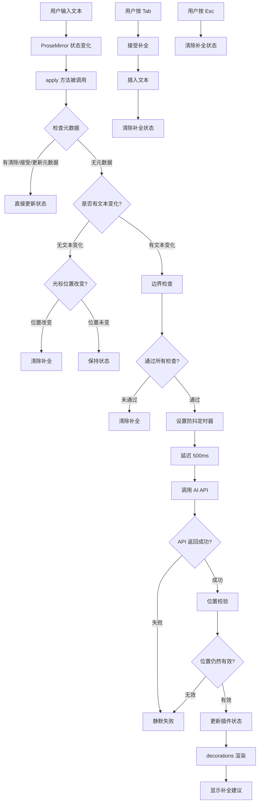
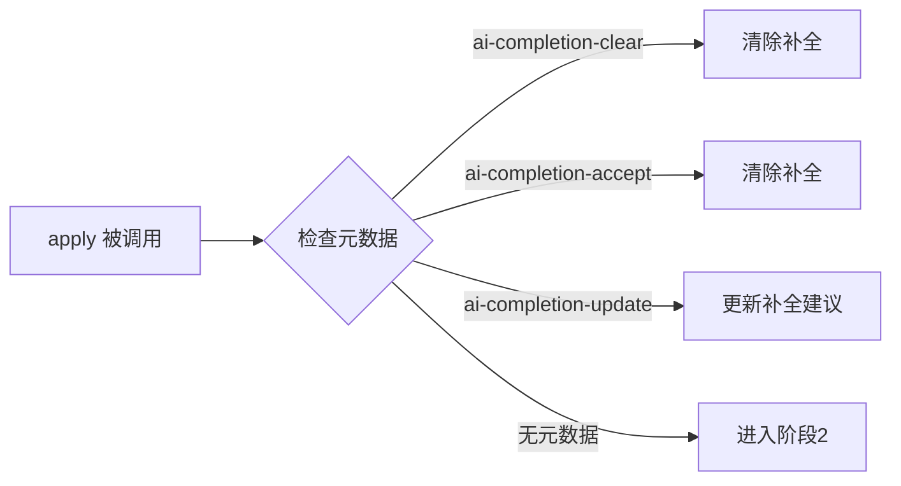
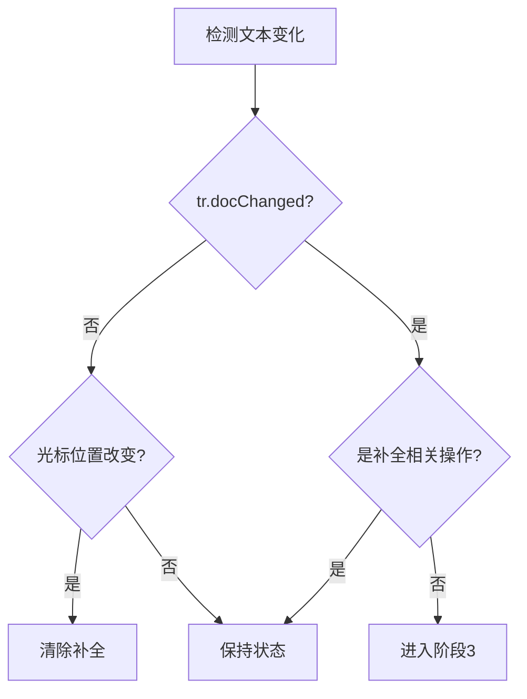
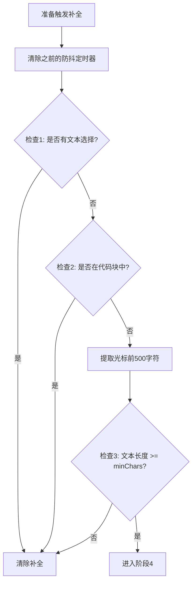
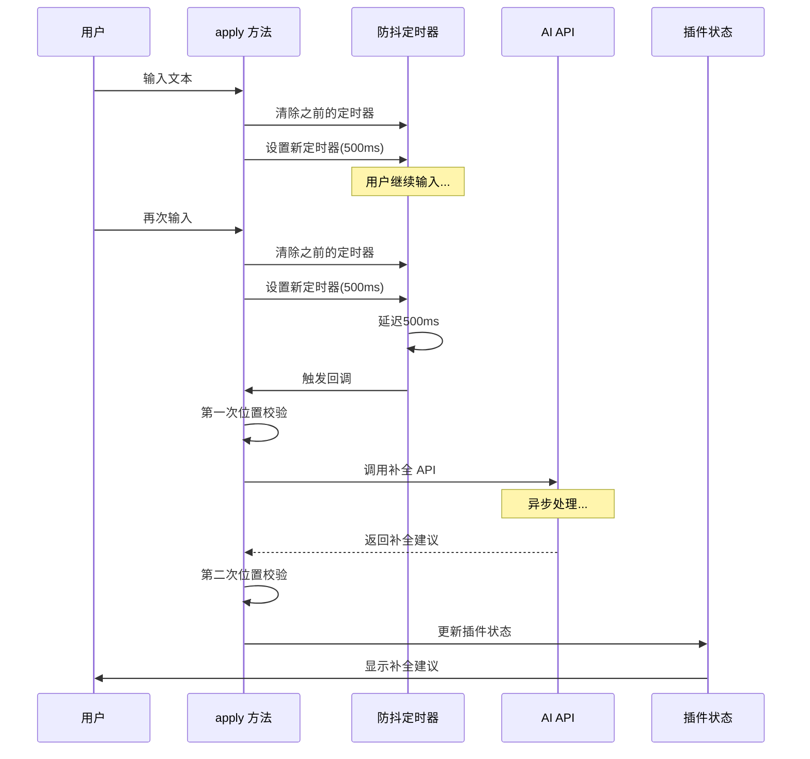
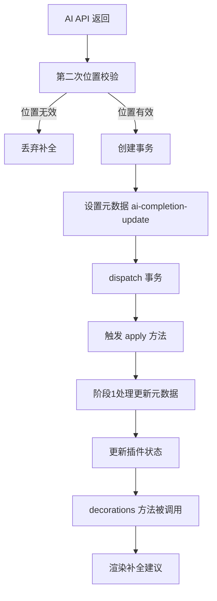
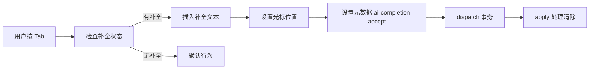
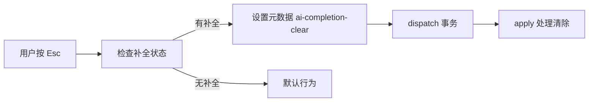

# AI 补全扩展技术文档

## 概述

AI 补全扩展实现了类似 GitHub Copilot 的实时内联补全功能。当用户在编辑器中输入文本时，系统会自动提取上下文并调用 AI API 生成补全建议，以灰色斜体文本的形式显示在光标位置。

## 核心设计思路

### 1. 状态管理

- 使用 ProseMirror Plugin 的 `state` 机制管理补全状态
- 状态包含：`suggestion`（补全文本）和 `position`（补全位置）
- 通过事务元数据（meta）在不同阶段传递补全信息

### 2. 防抖机制

- 用户快速输入时，避免频繁调用 AI API
- 每次新输入都会取消之前的请求，只处理最后一次输入

### 3. 异步竞态防护

- AI API 调用是异步的，用户可能在 API 返回前继续输入
- 通过双重位置校验确保补全建议只显示在正确的位置

### 4. 非侵入式渲染

- 使用 Decoration 机制渲染补全建议，不影响文档结构
- 补全建议是视觉提示，不拦截用户操作

## 整体架构流程图



## 详细流程说明

### 阶段 1：元数据处理（优先级最高）



**思路说明：**

- 元数据是最高优先级的处理，因为它们是用户操作（Esc/Tab）或 AI 返回的直接结果
- 这些操作需要立即响应，不经过其他逻辑判断

### 阶段 2：文本变化检测



**思路说明：**

- 只有真正的文本变化才需要触发补全请求
- 光标移动但不输入文本时，如果位置改变则清除补全（补全建议是针对之前位置的）
- 排除补全相关的元数据变化，避免循环触发

### 阶段 3：边界检查



**边界检查说明：**

1. **文本选择检查**
   - 用户选择文本时，可能想要替换或删除，不需要补全
   - 避免在错误时机显示补全

2. **代码块检查**
   - 代码块的补全应该由专门的代码编辑器处理
   - 文本补全只适用于普通文本内容

3. **文本长度检查**
   - 文本太短时，上下文不足，补全质量差
   - 避免无意义的 API 调用

### 阶段 4：防抖延迟与 AI 请求



**防抖机制说明：**

1. **为什么需要防抖？**
   - 用户快速输入时，每次输入都触发 API 调用会导致：
     - 大量无效请求（前面的请求会被后面的输入覆盖）
     - 服务器压力大
     - 用户体验差（补全建议频繁闪烁）

2. **防抖实现**
   - 每次新输入时，清除之前的定时器
   - 只保留最后一次输入的定时器
   - 延迟 500ms 后调用 API（用户停止输入 500ms 后才请求）

3. **异步竞态防护**
   - **第一次校验**：防抖回调执行时，检查光标位置是否仍然一致
   - **第二次校验**：API 返回后，再次检查光标位置
   - 双重校验确保补全建议只显示在正确的位置

### 阶段 5：状态更新与渲染



**状态更新流程：**

1. **为什么使用元数据更新？**
   - 不能直接在异步回调中修改状态
   - 需要通过事务机制更新状态
   - 元数据是 ProseMirror 推荐的状态更新方式

2. **渲染机制**
   - `decorations` 方法在每次状态变化时被调用
   - 检查插件状态，如果有补全建议则创建装饰
   - 装饰以灰色斜体文本显示在光标位置

## 关键代码片段说明

### 1. 防抖定时器管理

```typescript
// 在闭包中保存定时器引用
let debounceTimer: NodeJS.Timeout | null = null;

// 每次新输入时清除之前的定时器
if (debounceTimer) {
  clearTimeout(debounceTimer);
  debounceTimer = null;
}

// 设置新的定时器
debounceTimer = setTimeout(async () => {
  // AI API 调用逻辑
}, extension.options.debounceMs);
```

**设计要点：**

- 定时器保存在闭包中，避免被垃圾回收
- 每次清除旧定时器，确保只处理最后一次输入

### 2. 双重位置校验

```typescript
// 第一次校验：防抖回调执行时
const currentState = extension.editor.state;
if (currentSelection.from !== currentFrom) {
  return; // 位置已改变，丢弃请求
}

// 第二次校验：API 返回后
const latestState = extension.editor.state;
if (latestState.selection.from === currentFrom) {
  // 位置仍然一致，更新状态
  tr.setMeta("ai-completion-update", {
    suggestion: suggestionText,
    position: currentFrom,
  });
}
```

**设计要点：**

- 第一次校验：避免处理过期的请求
- 第二次校验：确保 API 返回后位置仍然有效
- 双重校验确保补全建议的准确性

### 3. 装饰渲染

```typescript
decorations(state) {
  const pluginState = pluginKey.getState(state);

  // 检查是否有补全建议
  if (!pluginState.suggestion || pluginState.position === null) {
    return DecorationSet.empty;
  }

  // 校验位置有效性
  if (selection.from !== pluginState.position) {
    return DecorationSet.empty;
  }

  // 创建装饰
  const widget = document.createElement("span");
  widget.style.cssText = "color: #9ca3af; font-style: italic; ...";
  widget.textContent = pluginState.suggestion;

  return DecorationSet.create(state.doc, [
    Decoration.widget(pluginState.position, widget, { side: 1 })
  ]);
}
```

**设计要点：**

- 使用 `Decoration.widget` 创建不影响文档结构的装饰
- 装饰样式设置为不拦截鼠标事件（`pointer-events: none`）
- 每次状态变化时重新计算装饰

## 用户交互流程

### Tab 键接受补全



### Esc 键取消补全



## 性能优化

1. **防抖机制**：减少 API 调用次数
2. **位置校验**：避免无效的状态更新
3. **边界检查**：提前过滤不需要补全的场景
4. **静默失败**：API 错误不影响用户编辑体验

## 潜在问题与解决方案

### 问题 1：异步竞态条件

**场景**：用户快速输入，多个 API 请求同时进行，后发的请求可能先返回。

**解决方案**：

- 双重位置校验
- 每次新输入清除旧定时器
- 只处理位置一致的补全建议

### 问题 2：补全建议显示在错误位置

**场景**：API 返回时，用户已移动光标。

**解决方案**：

- 在 `decorations` 方法中再次校验位置
- 位置不一致时不显示装饰

### 问题 3：频繁 API 调用

**场景**：用户快速输入时，每次输入都触发 API 调用。

**解决方案**：

- 防抖机制：延迟 500ms 后才调用 API
- 每次新输入清除旧定时器

## 总结

AI 补全扩展的核心设计思路是：

1. **状态驱动**：使用 ProseMirror Plugin 状态管理补全信息
2. **防抖优化**：避免频繁 API 调用，提升性能和用户体验
3. **竞态防护**：双重位置校验确保补全建议的准确性
4. **非侵入式**：使用 Decoration 机制，不影响文档结构和用户操作

整个流程通过 `apply` 方法的状态更新逻辑和 `decorations` 方法的渲染逻辑，实现了从用户输入到补全建议显示的完整闭环。

---

## 附录：VSCode 虚拟文本与实现原理

### 什么是虚拟文本（Virtual Text）

在 VSCode 中，虚拟文本是一种**不实际写入文档、仅在编辑器界面渲染显示**的文本内容，核心作用是提供预览、提示或辅助信息，同时不影响真实的代码文件内容和结构。

#### 核心特性

1. **非侵入性**
   - 虚拟文本不会被保存到文件中
   - 不会占用真实的文档字符位置
   - 只是编辑器在界面上的 "视觉层叠加"
   - 对代码的编译、运行、版本控制没有任何影响
   - 例如：AI 补全的半透明建议，不按 Tab 确认就不会出现在真实代码里

2. **动态渲染与绑定**
   - 通常和光标位置、代码上下文绑定
   - 会随着光标移动、代码修改实时更新或消失
   - 光标移动到其他行，虚拟文本自动隐藏
   - 继续输入自定义代码，虚拟文本会被覆盖并消失

3. **样式可定制**
   - 可设置为半透明、浅灰色
   - 区分真实代码和预览内容
   - 避免视觉混淆

#### 典型应用场景

| 场景        | 说明                                     |
| ----------- | ---------------------------------------- |
| AI 代码补全 | GitHub Copilot、TabNine 等的灰色补全建议 |
| 语法提示    | 变量类型、函数返回值、语法警告等         |
| 调试辅助    | 变量值实时显示、断点条件提示等           |

#### 虚拟文本 vs 普通文本

| 特性             | 虚拟文本                 | 普通文本               |
| ---------------- | ------------------------ | ---------------------- |
| 是否写入文件     | 否（仅界面渲染）         | 是（保存后持久化）     |
| 是否影响文档结构 | 否（不占字符位置）       | 是（占用真实字符位置） |
| 可编辑性         | 不可直接编辑，需触发指令 | 可直接编辑、删除、修改 |

### VSCode 虚拟文本的实现原理

VSCode 虚拟文本的实现，核心基于**编辑器的分层渲染架构**和**文本模型与视图分离**的设计理念，简单来说就是「数据和显示分开管理」，虚拟文本只存在于「显示层」，不碰真实的「数据层」。

#### 核心环节

**1. 文本模型（Text Model）与视图（View）分离**

VSCode 的编辑器内核基于 Monaco Editor，核心设计是**模型-视图分离**：

```
模型层（Model）
  ├─ 存储真实文档内容
  ├─ 字符、行数、偏移量等
  ├─ 文件的读写、保存、编译都基于这个层
  └─ 这是代码的「数据源」

视图层（View）
  ├─ 将模型层内容渲染到屏幕上
  ├─ 处理光标位置、滚动、高亮等视觉交互
  └─ 虚拟文本只挂载在视图层
```

**关键点**：虚拟文本只存在于视图层，不会被写入模型层。这意味着它只是 "看起来存在"，但在编辑器的底层数据结构里没有对应的字符记录。

**2. 装饰器 API（Decorator API）**

虚拟文本的渲染，依赖 Monaco Editor 提供的 `createDecorator` 装饰器 API：

```
插件定义装饰器规则
  ├─ 指定位置（光标后的偏移量、行末等）
  ├─ 指定内容（要显示的提示文本）
  └─ 指定样式（颜色、透明度、字体等）

编辑器在视图层渲染
  ├─ 叠加渲染虚拟文本
  ├─ 不改变模型层的字符偏移量
  └─ 虚拟文本不占用真实的「字符位置」

事件触发时更新或销毁
  ├─ 光标移动 → 更新或销毁装饰器
  ├─ 代码修改 → 重新生成虚拟文本
  └─ 按 Tab 确认 → 写入模型层
```

**3. 事件驱动的动态更新机制**

虚拟文本会随着操作动态变化，依赖 VSCode 的事件监听机制：

```
插件监听核心事件
  ├─ onDidChangeCursorPosition  // 光标移动
  └─ onDidChangeTextDocument    // 代码修改

触发事件时重新计算
  ├─ 光标移走 → 销毁装饰器
  └─ 代码改变 → 重新生成虚拟文本
```

**AI 补全的完整流程**：

1. 用户输入代码
2. 插件实时监听输入内容
3. 生成补全建议
4. 通过装饰器 API 渲染成虚拟文本
5. 用户按 Tab 键
6. 插件把虚拟文本写入模型层，转化为真实代码

#### 为什么虚拟文本不会挡住后面的代码？

装饰器 API 支持「内联无占位渲染」：

```
实际文档：    func|
虚拟文本层：     tion() {  (灰色，半透明)

视觉效果：    func tion() {
              ↑    ↑
           真实  虚拟
```

- 虚拟文本的渲染区域是「紧贴光标的额外视觉层」
- 编辑器自动调整视图布局，让虚拟文本和原有代码在视觉上 "前后排列"
- 通过样式配置（低透明度、灰色字体）区分虚拟文本和真实代码

### Markdown 富文本编辑器的虚拟文本

Markdown 富文本编辑器没有 VSCode 中那样被明确命名的 "虚拟文本" 概念，但存在功能和原理高度相似的实现：

#### 1. 所见即所得（WYSIWYG）模式的实时渲染

输入 `**加粗文本**` 时：

- 编辑器立刻显示出加粗的视觉效果
- `**` 符号可能会淡化显示或隐藏
- 仅作为底层语法支撑
- 原始 Markdown 字符串保持不变

**典型案例**：MarkText（基于 Muya 内核，采用虚拟 DOM 实现实时预览）

#### 2. AI 辅助编辑的临时补全提示

集成 AI 的编辑器在输入时会：

- 生成后续内容建议
- 以浅灰色、半透明样式显示在光标后方
- 仅作为视觉提示
- 确认后才写入文档
- 继续自定义输入会自动消失

#### 3. 语法辅助与错误提示

- 表格列数不匹配 → 显示浅灰色的 "列数不一致" 提示
- 未闭合的引用语法 `>` → 出现补全建议的提示文本
- 这些提示不会被保存到文件

### 开源带 Copilot 功能的 Markdown 编辑器

| 编辑器        | 特点                                                               | 协议       |
| ------------- | ------------------------------------------------------------------ | ---------- |
| **AiEditor**  | AI 驱动，支持 ChatGPT/文心一言/讯飞星火，AI 续写、优化、校对、翻译 | LGPL-2.1   |
| **Novel**     | 灵感源于 Notion，基于 Tiptap + Vercel AI SDK，自动补全语句         | MIT        |
| **MarkFlowy** | 轻量级（10MB），跨平台，一键翻译、文章摘要、对话导出               | TypeScript |

### 什么是 WYSIWYG 编辑器

**WYSIWYG** = What You See Is What You Get（所见即所得）

让用户在编辑内容时，看到的界面效果和最终生成的效果完全一致。

#### 核心特点

- **直观性**：无需掌握代码（HTML、Markdown），像 Word 一样编辑
- **降低门槛**：非技术人员友好

#### 常见应用

- 办公软件：Microsoft Word、WPS
- 在线编辑器：博客后台、公众号编辑器、论坛发帖框
- 网页制作：Dreamweaver 可视化模式

#### 与标记型编辑器对比

| 类型           | 编辑方式                   | 预览           |
| -------------- | -------------------------- | -------------- |
| WYSIWYG 编辑器 | 直接看到最终效果           | 实时预览       |
| 标记型编辑器   | 输入特定语法（`**加粗**`） | 需要预览或渲染 |

---

### 方案对比：虚拟文本 vs 直接插入

#### 方案 A：虚拟文本（推荐）

补全建议以装饰层显示在光标后（不写入文档），用户按 Tab 确认后才写入真实文本。

#### 方案 B：直接插入 + 撤销

补全建议直接插入到文档中，用户不接受时执行撤销操作。

#### 方案 B 的弊端

| 问题              | 说明                                                               | 影响       |
| ----------------- | ------------------------------------------------------------------ | ---------- |
| **撤销栈污染**    | 每次补全都会产生一次 Undo 记录，用户需要按多次 Ctrl+Z              | 用户体验差 |
| **断网/关闭页面** | 补全插入后用户直接关闭页面，再打开时无法区分是用户输入还是 AI 补全 | 数据污染   |
| **并发冲突**      | 用户快速输入时，补全插入和用户输入会产生竞态条件                   | 数据错乱   |
| **视觉干扰**      | 补全文本直接插入会打断用户输入流，光标位置需要跳转                 | 注意力分散 |
| **性能问题**      | 每次补全都需要修改文档模型，触发 ProseMirror 重新计算整个文档树    | 性能下降   |

**具体场景示例**：

```
场景 1：断网后关闭页面
用户输入：Hello|
AI 补全插入：Hello, world!  (直接写入文档)
用户未接受，直接关闭页面
下次打开 → 文档中留下了 "Hello, world!"，用户可能误以为自己输入的

场景 2：撤销栈污染
用户输入：function add(|
AI 补全：a, b) { return a + b; }
用户不接受，按 Ctrl+Z
结果：可能撤销到补全之前，也可能只撤销了补全的一部分
需要按多次 Ctrl+Z 才能回到 "function add(" 状态

场景 3：并发冲突
用户输入：const|
AI 补全插入：const message = "hello"
用户继续输入：  (空格)
实际结果：const  message = "hello"  (多了空格，位置错乱)
```

---

### 在 Markdown 编辑器实现 VSCode 效果的技术难点

如果尝试在 Markdown 编辑器（如 ProseMirror、Tiptap）中实现类似 VSCode 的虚拟文本效果，会面临以下挑战：

#### 1. 编辑器架构差异

| 维度     | VSCode (Monaco)    | ProseMirror/Tiptap      |
| -------- | ------------------ | ----------------------- |
| 核心模型 | 简单的字符串数组   | 复杂的 Node 树结构      |
| 装饰系统 | 原生支持，API 完善 | 需要自己实现 Decoration |
| 光标管理 | 单一光标模型       | 多选区、复杂 Selection  |
| 渲染层   | 视图层完全独立     | 视图和模型耦合较紧      |

**问题**：ProseMirror 的 Decoration 机制是设计好的，但要做到 VSCode 那种「紧贴光标、不影响输入」的效果，需要处理很多边界情况。

#### 2. 光标位置同步问题

```
用户输入：Hello|
虚拟文本： Hello World
问题：光标应该在 "Hello|" 还是 "Hello |"？

VSCode：虚拟文本不影响光标位置，仍在 |
ProseMirror：Decoration.widget 显示在光标后，但光标位置计算复杂
```

**难点**：

- 虚拟文本不应该让光标"跳"过去
- 用户输入时，虚拟文本应该被"挤"开还是直接消失？
- 光标左右移动时，虚拟文本何时显示/隐藏？

#### 3. 文本输入的冲突处理

```
场景：用户在有虚拟文本时继续输入

初始状态：Hello| World  (World 是虚拟文本)
用户输入：空格
期望结果：Hello |  (虚拟文本消失)
实际可能：Hello  World  (虚拟文本被推开，但样式混乱)
```

**难点**：

- 需要拦截每一次输入事件
- 判断输入是否应该清除虚拟文本
- 处理中文输入法（IME）的复杂状态

#### 4. 样式渲染的复杂性

VSCode 可以直接控制 DOM 渲染，但 ProseMirror/Tiptap 需要通过：

```
ProseMirror 层级
Document Node
  └─ Paragraph Node
      └─ Text Node ("Hello")
      └─ Decoration.widget (虚拟文本容器)
          └─ span 元素 (样式控制)
```

**问题**：

- Widget 的位置计算（`side: 1` 还是 `side: -1`）
- Widget 的高度、行高如何与真实文本对齐？
- 换行时虚拟文本如何处理？
- 不同字号、字体时对齐问题

#### 5. 性能和响应性

```
每次输入触发：
1. ProseMirror 事务更新
2. 重新计算 Document
3. 重新计算 Decorations
4. DOM 更新
5. 虚拟文本重新渲染

VSCode：
1. 视图层直接渲染虚拟文本
2. 不触发表面模型更新
```

**问题**：

- ProseMirror 的每次状态更新都会触发整个文档的重新计算
- 虚拟文本的频繁更新可能导致性能问题
- 大文档时更明显

#### 6. 边界情况太多

| 场景     | 问题                                                 |
| -------- | ---------------------------------------------------- |
| 选中状态 | 用户选中一段文本时，虚拟文本应该显示在哪里？         |
| 多光标   | ProseMirror 支持多选区，虚拟文本应该为哪个光标显示？ |
| 代码块   | 代码块内是否需要不同的补全逻辑？                     |
| 表格     | 在表格单元格内输入，虚拟文本如何处理？               |
| 拖拽     | 用户拖拽选中时，虚拟文本如何响应？                   |
| 复制粘贴 | 复制时是否包含虚拟文本？粘贴时如何处理？             |
| 撤销重做 | Undo/Redo 栈如何与虚拟文本状态同步？                 |

#### 7. IME 输入法的兼容

```
中文输入流程：
1. 用户按拼音字母
2. 显示候选词窗口
3. 用户选择候选词
4. 确认输入

问题：
- 拼音输入阶段是否显示虚拟文本？
- 候选词选择时虚拟文本如何处理？
- 确认后虚拟文本是否需要重新计算？
```

VSCode 有完善的 IME 处理机制，但在 Web 编辑器中需要自己处理这些复杂逻辑。

#### 8. 移动端兼容

- 移动端没有物理 Tab 键，如何接受补全？
- 虚拟键盘弹出时，虚拟文本的位置如何计算？
- 触摸事件和鼠标事件的处理差异

### 实现建议

如果要在 ProseMirror 中实现类似效果：

```
核心思路（简化版）：
1. 使用 PluginKey 管理补全状态
2. 在 apply 方法中监听文档变化
3. 防抖后调用 AI API
4. 返回时通过 tr.setMeta 更新状态
5. decorations 方法中创建 Decoration.widget
6. 处理 Tab/Esc 按键
7. 处理所有边界情况
```

**建议**：

- 先实现最小可用版本（MVP）
- 只处理最常见场景
- 逐步添加边界情况处理
- 充分测试中文输入、撤销、复制粘贴等场景

---

## 总结

VSCode 的虚拟文本机制是「模型-视图分离」架构的典型应用，通过装饰器 API 在视图层叠加临时内容，不影响底层数据模型。在 Web 编辑器中实现类似功能需要处理大量复杂边界情况，建议采用渐进式开发，先验证核心价值再逐步完善。
