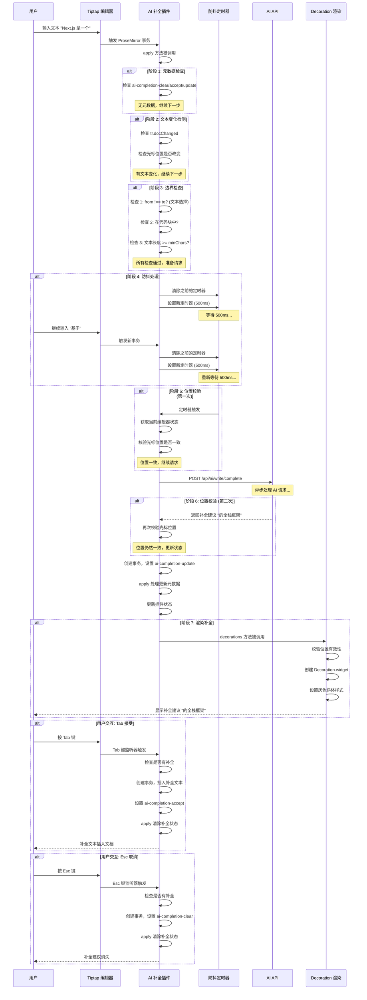
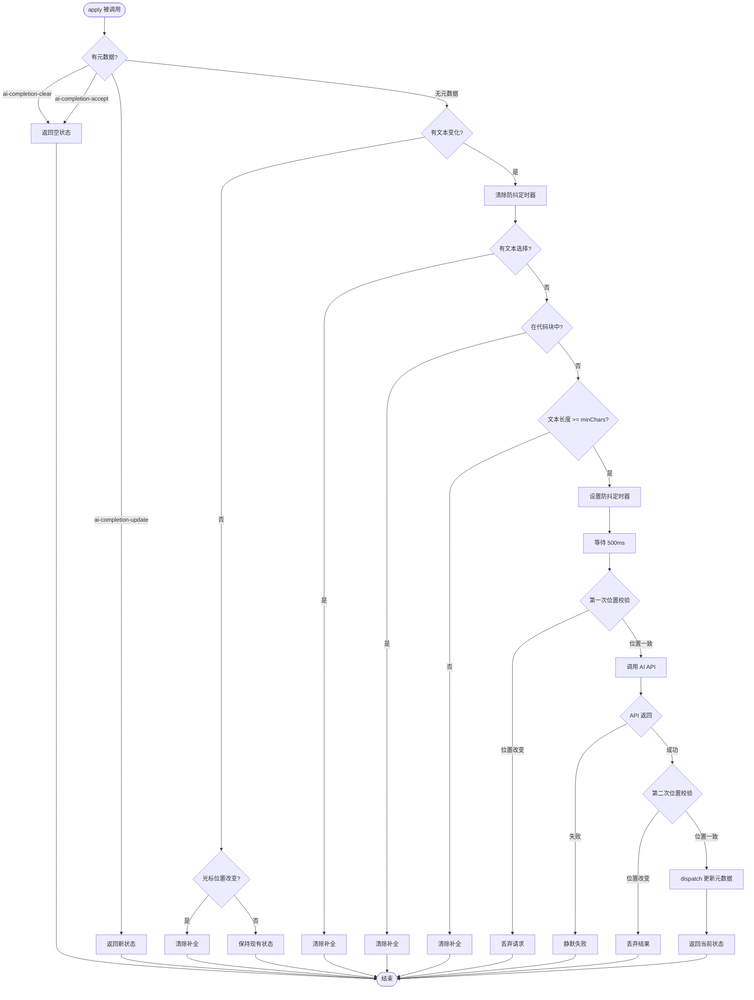

# AI 补全扩展技术文档

## 第一部分：需求背景与目标

### 功能需求

在 Markdown 编辑器中实现类似 GitHub Copilot 的实时内联 AI 补全功能：

```
用户输入: Next.js 是一个基于 React 的|
AI 提示:   全栈框架，它提供了... (灰色斜体显示)
用户按 Tab: 全栈框架，它提供了... (插入文档)
用户按 Esc: 提示消失
```

### 核心交互流程

1. **自动触发**: 用户输入文本时自动提取上下文
2. **智能生成**: 调用 AI API 生成补全建议
3. **非侵入显示**: 以灰色斜体文本内联显示在光标位置
4. **用户控制**:
   - `Tab` 键接受补全
   - `Esc` 键取消补全
   - 继续输入自动清除补全

### 核心挑战

| 挑战             | 说明                                       | 影响         |
| ---------------- | ------------------------------------------ | ------------ |
| **非侵入式显示** | 补全不能写入文档，否则影响撤销栈和数据污染 | 用户体验差   |
| **实时响应**     | 需要监听用户输入，及时触发补全             | 功能可用性   |
| **异步竞态**     | AI API 是异步的，用户可能在返回前继续输入  | 显示错误位置 |
| **位置同步**     | 确保补全建议始终在正确位置显示             | 功能准确性   |

---

## 第二部分：实现方案探索

### 方案对比

#### 方案 A：直接插入文本 + 撤销 ❌

```typescript
// 伪代码
const handleAIResponse = (suggestion: string) => {
  editor.insertText(suggestion); // 直接插入
  if (userRejects) {
    editor.undo(); // 不接受时撤销
  }
};
```

**致命问题**:

```
场景 1: 撤销栈污染
用户输入: function add(|
AI 插入: function add(a, b) { return a + b; }
用户按 Ctrl+Z → 可能只撤销一部分，需要多次撤销

场景 2: 数据污染
用户输入: Hello|
AI 插入: Hello, world!
用户直接关闭页面 → 下次打开文档中留下了 "Hello, world!"

场景 3: 并发冲突
用户输入: const|
AI 插入: const message = "hello"
用户继续输入空格 → 实际结果: const  message = "hello" (位置错乱)
```

#### 方案 B：DOM 叠加层 ❌

```typescript
// 伪代码
const overlay = document.createElement("div");
overlay.style.position = "absolute";
overlay.style.color = "#9ca3af";
overlay.textContent = suggestion;
editorContainer.appendChild(overlay);
```

**技术难点**:

1. **位置计算困难**: 需要精确计算光标像素位置
2. **滚动同步**: 编辑器滚动时叠加层位置需要同步
3. **输入法干扰**: 中文 IME 候选词窗口干扰定位
4. **样式一致性**: 难以保证字体、行高完全一致
5. **移动端适配**: 虚拟键盘弹出时位置计算复杂

#### 方案 C：ProseMirror Decoration ✅

**核心思路**: 利用 ProseMirror 的插件系统和装饰机制，在视图层渲染补全建议，不修改文档模型。

```
ProseMirror 文档模型 (真实数据)
  └─ 不包含补全建议

ProseMirror 视图层 (用户看到的)
  └─ 包含补全建议的 Decoration
  └─ 补全建议不影响文档模型
```

---

## 第三部分：最终实现方案

### 技术栈

- **编辑器基础**: Tiptap (基于 ProseMirror 的 React 编辑器)
- **状态管理**: ProseMirror Plugin State
- **渲染机制**: ProseMirror Decoration
- **AI 集成**: Kimi API (Moonshot AI)

### 核心架构

```
┌─────────────────────────────────────────────────────────────┐
│                      AI 补全扩展架构                          │
├─────────────────────────────────────────────────────────────┤
│                                                               │
│  ┌───────────────┐         ┌───────────────┐                │
│  │   用户输入     │────────▶│  ProseMirror   │                │
│  │  (键盘/鼠标)   │         │     事务       │                │
│  └───────────────┘         └───────┬───────┘                │
│                                     │                         │
│                                     ▼                         │
│                          ┌──────────────────┐                │
│                          │   apply 方法      │                │
│                          │  (状态更新核心)   │                │
│                          └─────────┬────────┘                │
│                                    │                         │
│           ┌────────────────────────┼────────────────────────┐│
│           │           │            │            │            ││
│           ▼           ▼            ▼            ▼            ││
│  ┌────────────┐ ┌──────────┐ ┌──────────┐ ┌──────────┐    ││
│  │元数据处理   │ │边界检查   │ │防抖定时器 │ │位置校验   │    ││
│  │(优先级最高) │ │(4项检查)  │ │(500ms)   │ │(双重校验) │    ││
│  └────────────┘ └─────┬────┘ └─────┬────┘ └─────┬────┘    ││
│                      │            │            │            ││
│                      ▼            ▼            ▼            ││
│                ┌───────────────────────────────┐            ││
│                │        AI API 调用            │            ││
│                │  POST /api/ai/write/complete  │            ││
│                └───────────────┬───────────────┘            ││
│                                │                            ││
│                                ▼                            ││
│                      ┌──────────────────┐                   ││
│                      │  decorations 方法 │                   ││
│                      │  (渲染补全建议)   │                   ││
│                      └─────────┬────────┘                   ││
│                                │                            ││
│                                ▼                            ││
│                      ┌──────────────────┐                   ││
│                      │   用户交互处理    │                   ││
│                      │  (Tab/Esc 键)     │                   ││
│                      └──────────────────┘                   ││
│                                                               │
└─────────────────────────────────────────────────────────────┘
```

### 完整数据流



---

## 第四部分：核心实现详解

### 1. 插件状态管理

#### 状态结构

```typescript
/**
 * 插件状态：存储当前的补全建议和位置
 */
interface PluginState {
  /** 补全建议文本，null 表示没有建议 */
  suggestion: string | null;
  /** 补全建议显示的位置（文档中的字符偏移量） */
  position: number | null;
}

/**
 * 插件键（PluginKey）
 * 用于在插件状态、键盘快捷键和装饰渲染之间共享数据
 */
const pluginKey = new PluginKey<PluginState>("aiCompletion");
```

**设计要点**:

1. **状态与文档分离**: 补全状态不存储在文档中，只存在于插件状态
2. **位置追踪**: 记录补全建议对应的光标位置，用于校验
3. **单一数据源**: 所有组件通过 `pluginKey` 访问同一状态

### 2. apply 方法：状态更新核心

#### 完整流程图



#### 阶段 1：元数据处理（优先级最高）

```typescript
apply(tr, value, oldState, newState) {
  // 情况 1：用户按 Esc 键，清除补全建议
  if (tr.getMeta("ai-completion-clear")) {
    return { suggestion: null, position: null };
  }

  // 情况 2：用户按 Tab 键接受补全，清除建议
  if (tr.getMeta("ai-completion-accept")) {
    return { suggestion: null, position: null };
  }

  // 情况 3：AI API 返回补全建议，更新状态
  const update = tr.getMeta("ai-completion-update");
  if (update) {
    return {
      suggestion: update.suggestion,
      position: update.position,
    };
  }

  // ... 后续处理
}
```

**为什么元数据优先级最高？**

1. **即时响应**: 用户操作（Esc/Tab）需要立即生效
2. **避免循环**: AI 返回的更新通过元数据传递，避免直接修改状态
3. **清晰职责**: 元数据处理是明确的控制指令，优先于自动逻辑

#### 阶段 2：文本变化检测

```typescript
// 判断是否有实际的文本变化
const isTextChange =
  tr.docChanged &&
  !tr.getMeta("ai-completion") &&
  !tr.getMeta("ai-completion-accept");

if (!isTextChange) {
  const { selection } = newState;
  // 光标位置改变，清除补全
  if (value.position !== null && selection.from !== value.position) {
    return { suggestion: null, position: null };
  }
  return value; // 保持现有状态
}
```

**关键逻辑**:

1. **排除补全相关变化**: 补全本身的操作不应触发新的补全
2. **光标移动检测**: 光标移动到其他位置时，补全建议不再有效
3. **状态保持**: 无变化时保持现有状态，避免不必要的重新渲染

#### 阶段 3：边界检查（4 项检查）

```typescript
// 边界检查 1：文本选择检查
if (from !== to) {
  return { suggestion: null, position: null };
}

// 边界检查 2：代码块检查
const codeBlock = $from.node(-1)?.type.name === "codeBlock";
if (codeBlock) {
  return { suggestion: null, position: null };
}

// 边界检查 3：提取上下文
const CONTEXT_LENGTH = 500;
const textBeforeCursor = newState.doc.textBetween(
  Math.max(0, from - CONTEXT_LENGTH),
  from
);

// 边界检查 4：文本长度检查
if (textBeforeCursor.trim().length < minChars) {
  return { suggestion: null, position: null };
}
```

**边界检查的设计理由**:

| 检查项     | 原因                      | 处理方式          |
| ---------- | ------------------------- | ----------------- |
| 文本选择   | 选择文本时可能想替换/删除 | 清除补全          |
| 代码块     | 代码块应有专门的代码补全  | 清除补全          |
| 上下文长度 | 避免请求过长              | 限制 500 字符     |
| 最小长度   | 上下文太短补全质量差      | 小于 3 字符不触发 |

#### 阶段 4：防抖与异步处理

```typescript
// 记录当前光标位置（用于后续校验）
const currentFrom = from;

// 清除之前的定时器
if (debounceTimer) {
  clearTimeout(debounceTimer);
  debounceTimer = null;
}

// 设置新的防抖定时器
debounceTimer = setTimeout(async () => {
  try {
    // 第一次位置校验
    const currentState = extension.editor.state;
    if (currentState.selection.from !== currentFrom) {
      return; // 位置已改变，丢弃请求
    }

    // 调用 AI API
    const response = await fetch(apiEndpoint, {
      method: "POST",
      headers: { "Content-Type": "application/json" },
      body: JSON.stringify({
        content: currentState.doc.textContent,
        cursorPosition: currentFrom,
      }),
    });

    const data = await response.json();
    const suggestionText = data.suggestions?.[0]?.text;

    if (suggestionText && suggestionText.length > 0) {
      // 第二次位置校验
      const latestState = extension.editor.state;
      if (latestState.selection.from === currentFrom) {
        // 通过元数据更新状态
        const tr = latestState.tr;
        tr.setMeta("ai-completion-update", {
          suggestion: suggestionText,
          position: currentFrom,
        });
        extension.editor.view.dispatch(tr);
      }
    }
  } catch (error) {
    console.error("AI 补全错误:", error);
  }
}, extension.options.debounceMs);

return value;
```

**防抖机制的设计要点**:

1. **取消而非队列**: 新输入取消旧请求，不保留旧请求
2. **延迟执行**: 等待用户停止输入 500ms 后才请求
3. **静默失败**: API 错误不影响用户编辑体验
4. **双重校验**: 防抖回调时和 API 返回时各校验一次位置

### 3. decorations 方法：非侵入式渲染

```typescript
decorations(state) {
  // 步骤 1：获取插件状态
  const pluginState = pluginKey.getState(state) as PluginState;

  if (!pluginState.suggestion || pluginState.position === null) {
    return DecorationSet.empty;
  }

  // 步骤 2：校验位置有效性
  try {
    const resolved = state.doc.resolve(pluginState.position);
    if (!resolved) {
      return DecorationSet.empty;
    }
  } catch {
    return DecorationSet.empty;
  }

  // 校验光标位置
  const { selection } = state;
  if (selection.from !== pluginState.position) {
    return DecorationSet.empty;
  }

  // 步骤 3：创建装饰
  const widget = document.createElement("span");
  widget.className = "ai-completion-suggestion";
  widget.style.cssText =
    "color: #9ca3af; " +
    "font-style: italic; " +
    "pointer-events: none; " +
    "user-select: none;";
  widget.textContent = pluginState.suggestion;

  const decoration = Decoration.widget(pluginState.position, widget, {
    side: 1, // 在光标后显示
    ignoreSelection: true, // 不影响文本选择
  });

  return DecorationSet.create(state.doc, [decoration]);
}
```

**装饰渲染的关键设计**:

1. **样式设计**:
   - `color: #9ca3af`: 浅灰色，不抢夺注意力
   - `font-style: italic`: 斜体，区分于正常文本
   - `pointer-events: none`: 不拦截鼠标事件
   - `user-select: none`: 不可选中

2. **位置设计**:
   - `side: 1`: 在光标后显示
   - `ignoreSelection: true`: 不影响文本选择

3. **三次校验**:
   - 状态检查: 确保有补全建议
   - 位置有效性: 确保位置在文档范围内
   - 光标一致性: 确保光标仍在补全位置

### 4. 键盘快捷键处理

#### Tab 键：接受补全

```typescript
Tab: ({ editor }) => {
  const pluginState = pluginKey.getState(editor.state) as PluginState;

  if (pluginState?.suggestion && pluginState.position !== null) {
    const { suggestion } = pluginState;
    const { state, view } = editor;
    const { tr } = state;
    const from = state.selection.from;

    // 插入补全文本
    tr.insertText(suggestion);

    // 设置光标到插入文本的末尾
    const newPos = from + suggestion.length;
    tr.setSelection(TextSelection.create(tr.doc, newPos));

    // 标记为接受补全
    tr.setMeta("ai-completion-accept", true);

    // 应用事务
    view.dispatch(tr);

    return true; // 已处理 Tab 键
  }

  return false; // 允许默认行为
};
```

**流程说明**:

1. **检查补全**: 确保有有效的补全建议
2. **插入文本**: 将补全文本插入到光标位置
3. **调整光标**: 将光标移动到插入文本的末尾
4. **清除状态**: 通过元数据标记清除补全状态
5. **阻止默认**: 返回 true 阻止默认的制表符插入

#### Esc 键：取消补全

```typescript
Escape: ({ editor }) => {
  const pluginState = pluginKey.getState(editor.state) as PluginState;

  if (pluginState?.suggestion) {
    // 通过事务元数据清除补全建议
    editor.view.dispatch(editor.state.tr.setMeta("ai-completion-clear", true));
    return true;
  }

  return false;
};
```

**简洁设计**: 直接通过元数据清除补全，apply 方法会处理元数据并更新状态。

---

## 第五部分：技术难点与解决方案

### 难点 1：异步竞态条件

#### 问题描述

```
时间线：
t0: 用户输入 "Hello"，触发请求 A
t1: 用户输入 " World"，触发请求 B
t2: 请求 B 返回（建议 "!"）
t3: 请求 A 返回（建议 ", beautiful"）

问题：请求 A 虽然触发较早，但返回较晚，此时用户已输入 " World"
      如果接受请求 A 的建议，会显示在错误位置
```

#### 解决方案：双重位置校验

```typescript
// 第一次校验：防抖回调执行时
debounceTimer = setTimeout(async () => {
  const currentState = extension.editor.state;
  if (currentState.selection.from !== currentFrom) {
    return; // 位置已改变，丢弃请求
  }
  // ... 调用 API
}, debounceMs);

// 第二次校验：API 返回后
const latestState = extension.editor.state;
if (latestState.selection.from === currentFrom) {
  // 位置仍然一致，更新状态
  tr.setMeta("ai-completion-update", {
    suggestion: suggestionText,
    position: currentFrom,
  });
}
```

**双重校验的作用**:

1. **第一次校验**: 防抖回调执行时，检查光标是否还在触发位置
2. **第二次校验**: API 返回后，再次检查光标位置是否一致
3. **确保准确**: 只有两次校验都通过，才显示补全建议

### 难点 2：非侵入式渲染

#### 问题描述

如何在不修改文档模型的情况下，在界面上显示补全建议？

#### 解决方案：ProseMirror Decoration

```
文档模型 (真实数据):
{
  type: "paragraph",
  content: [
    { type: "text", text: "Hello" }
  ]
}

视图层 (用户看到的):
Hello world! (blue)
      ^^^^^^ 补全建议，通过 Decoration 渲染

 Decoration 不会修改文档模型，只是视觉层的叠加
```

**关键实现**:

```typescript
const decoration = Decoration.widget(position, widget, {
  side: 1, // 在位置后显示
  ignoreSelection: true, // 不影响选择
});
```

**Decoration 的优势**:

1. **不修改文档**: 文档模型保持纯净
2. **不污染撤销栈**: 补全建议不影响撤销/重做
3. **不影响编辑**: 用户可以继续输入，补全自动消失
4. **样式灵活**: 可以完全自定义样式

### 难点 3：频繁 API 调用

#### 问题描述

```
用户快速输入: H e l l o
每次输入都触发 API 调用 → 5 次请求，只有最后一次有意义
结果：服务器压力大，用户体验差（补全闪烁）
```

#### 解决方案：防抖机制

```typescript
// 每次新输入时清除旧定时器
if (debounceTimer) {
  clearTimeout(debounceTimer);
  debounceTimer = null;
}

// 设置新定时器
debounceTimer = setTimeout(async () => {
  // 只有这个定时器会执行
  // 之前的定时器都已被清除
}, debounceMs);
```

**防抖的效果**:

```
输入: H    e    l    l    o
时间: t0   t1   t2   t3   t4
      ↓    ↓    ↓    ↓    ↓
定时器: A→B  A→B  A→B  A→B  A→B
                  清除  清除  清除  清除  清除
                               ↓
                              只有 B 执行
```

### 难点 4：边界情况处理

#### 场景 1：文本选择

```
问题：用户选择文本 "Hello" 时，补全应该显示在哪里？
解决：有文本选择时，不显示补全
```

```typescript
if (from !== to) {
  return { suggestion: null, position: null };
}
```

#### 场景 2：代码块

```
问题：代码块内的补全应该由代码编辑器处理
解决：检测光标是否在代码块内，如果是则不显示补全
```

```typescript
const codeBlock = $from.node(-1)?.type.name === "codeBlock";
if (codeBlock) {
  return { suggestion: null, position: null };
}
```

#### 场景 3：光标移动

```
问题：光标移动到其他位置，补全建议不再有效
解决：检测光标位置是否改变，如果改变则清除补全
```

```typescript
if (value.position !== null && selection.from !== value.position) {
  return { suggestion: null, position: null };
}
```

#### 场景 4：文本太短

```
问题：上下文太短，补全质量差
解决：设置最小字符数限制
```

```typescript
if (textBeforeCursor.trim().length < minChars) {
  return { suggestion: null, position: null };
}
```

### 难点 5：状态同步问题

#### 问题描述

如何在插件状态、键盘快捷键和装饰渲染之间同步数据？

#### 解决方案：PluginKey

```typescript
// 模块级别的 PluginKey
const pluginKey = new PluginKey<PluginState>("aiCompletion");

// 在 apply 方法中更新状态
apply(tr, value, oldState, newState) {
  if (update) {
    return { suggestion: update.suggestion, position: update.position };
  }
}

// 在 decorations 方法中读取状态
decorations(state) {
  const pluginState = pluginKey.getState(state) as PluginState;
  // ... 使用 pluginState
}

// 在键盘快捷键中读取状态
Tab: ({ editor }) => {
  const pluginState = pluginKey.getState(editor.state) as PluginState;
  // ... 使用 pluginState
}
```

**PluginKey 的作用**:

1. **单一数据源**: 所有组件通过同一个 key 访问状态
2. **状态同步**: ProseMirror 自动管理状态同步
3. **类型安全**: TypeScript 提供完整的类型检查

### 难点 6：循环触发问题

#### 问题描述

```
用户输入 → apply → 插入补全 → 触发新事务 → apply → ...
可能导致无限循环
```

#### 解决方案：元数据标记

```typescript
// 在 Tab 键处理中标记
tr.setMeta("ai-completion-accept", true);

// 在 apply 方法中检查
const isTextChange =
  tr.docChanged &&
  !tr.getMeta("ai-completion") &&
  !tr.getMeta("ai-completion-accept");

// 补全相关的操作不会触发新的补全请求
```

**元数据的作用**:

1. **标记操作类型**: 区分用户输入和补全操作
2. **避免循环**: 补全操作不会触发新的补全
3. **清晰逻辑**: 明确不同操作的优先级

---

## 第六部分：API 集成

### 补全 API 设计

#### 端点

```
POST /api/ai/write/complete
```

#### 请求格式

```json
{
  "content": "Next.js 是一个基于 React 的",
  "cursorPosition": 20,
  "context": "最近 500 字符",
  "style": "专业"
}
```

#### 响应格式

```json
{
  "suggestions": [
    {
      "text": "全栈框架",
      "confidence": 0.8
    }
  ],
  "tokensUsed": 15
}
```

### Prompt 设计

#### System Prompt

```typescript
const COMPLETION_SYSTEM_MESSAGE = `# Role: 智能写作续写专家

## Rules
1. 续写内容必须与上下文自然衔接，不能产生突兀感
2. 必须严格保持原文的写作风格，包括语调、用词习惯等
3. 续写长度控制在 5-30 个汉字之间
4. 只返回续写内容，不要重复上下文中的任何内容
5. 如果是代码块，必须保持代码风格、缩进和语法一致
6. 续写内容应该符合上下文的逻辑发展
7. 不要添加任何解释、说明或格式标记
8. 直接输出续写内容，不要添加"续写："等前缀`;
```

#### User Prompt

```typescript
function buildCompletionPrompt(
  context: string,
  style: string = "专业"
): string {
  return `# Role: 智能写作续写专家

## Goals
- 深入理解上下文的语境、写作意图和逻辑发展
- 识别原文的写作风格（${style}）和表达方式
- 生成与上下文自然衔接的续写内容

## Input
上下文内容：
${context}

## OutputFormat
- 直接输出续写内容，不包含任何前缀、后缀或格式标记
- 续写长度必须严格控制在 5-30 个汉字之间`;
}
```

**Prompt 设计要点**:

1. **明确角色**: 定义 AI 的角色和职责
2. **清晰规则**: 明确输出格式和长度限制
3. **上下文感知**: 传递最近的 500 字符作为上下文
4. **风格保持**: 要求 AI 保持原文的写作风格

---

## 第七部分：插件使用指南

### 基本使用

```tsx
import { EditorContent } from "@/tiptap/react";
import { AICompletion } from "@/lib/editor/ai-completion-extension";

function MyEditor() {
  return (
    <EditorContent
      extensions={[
        AICompletion.configure({
          debounceMs: 500, // 防抖延迟（毫秒）
          minChars: 3, // 最小字符数
          apiEndpoint: "/api/ai/write/complete", // API 端点
        }),
      ]}
    />
  );
}
```

### 配置选项

| 选项          | 类型     | 默认值                     | 说明                 |
| ------------- | -------- | -------------------------- | -------------------- |
| `debounceMs`  | `number` | `500`                      | 防抖延迟时间（毫秒） |
| `minChars`    | `number` | `3`                        | 触发补全的最小字符数 |
| `apiEndpoint` | `string` | `"/api/ai/write/complete"` | AI 补全 API 端点     |

### 与 Novel 编辑器集成

```tsx
import { EditorRoot, EditorContent, StarterKit } from "novel";
import { AICompletion } from "@/lib/editor/ai-completion-extension";

<EditorRoot>
  <EditorContent
    extensions={[
      StarterKit.configure({}),
      AICompletion.configure({
        debounceMs: 500,
        minChars: 3,
        apiEndpoint: "/api/ai/write/complete",
      }),
    ]}
    onUpdate={({ editor }) => {
      // 编辑器内容变化
      const markdown = jsonToMarkdown(editor.getJSON());
      onChange(markdown);
    }}
  />
</EditorRoot>;
```

### 交互流程

```
1. 用户输入文本
   ↓
2. 等待 500ms（防抖）
   ↓
3. 调用 AI API
   ↓
4. 显示补全建议（灰色斜体）
   ↓
5. 用户选择：
   - 按 Tab: 接受补全，插入文档
   - 按 Esc: 取消补全
   - 继续输入: 补全自动消失
```

---

## 第八部分：性能优化

### 1. 防抖机制

```typescript
// 减少不必要的 API 调用
debounceTimer = setTimeout(async () => {
  // 只有用户停止输入 500ms 后才执行
}, debounceMs);
```

**效果**: 用户快速输入时，只触发最后一次输入的 API 调用

### 2. 位置校验

```typescript
// 避免无效的状态更新
if (selection.from !== pluginState.position) {
  return DecorationSet.empty;
}
```

**效果**: 光标移动后不显示补全，避免无效渲染

### 3. 边界检查

```typescript
// 提前过滤不需要补全的场景
if (from !== to) return; // 文本选择
if (codeBlock) return; // 代码块
if (text.length < minChars) return; // 文本太短
```

**效果**: 减少不必要的 API 调用和状态更新

### 4. 静默失败

```typescript
try {
  // AI API 调用
} catch (error) {
  console.error("AI 补全错误:", error);
  // 不抛出错误，不影响用户编辑
}
```

**效果**: API 错误不影响用户编辑体验

---

## 第九部分：总结与展望

### 实现路径回顾

```
需求分析
  ↓
方案探索
  ├─ 方案 A: 直接插入 ❌ (撤销栈污染)
  ├─ 方案 B: DOM 叠加 ❌ (位置计算困难)
  └─ 方案 C: Decoration ✅ (非侵入式渲染)
  ↓
技术实现
  ├─ 状态管理: ProseMirror Plugin State
  ├─ 渲染机制: ProseMirror Decoration
  ├─ 防抖优化: 双重位置校验
  └─ 边界检查: 4 项检查
  ↓
功能完善
  ├─ 键盘快捷键: Tab/Esc
  ├─ API 集成: Kimi API
  └─ Prompt 优化: 结构化提示
  ↓
测试优化
  ├─ 性能优化: 防抖、校验
  └─ 边界情况: 各种场景处理
```

### 核心技术亮点

1. **非侵入式渲染**: 使用 ProseMirror Decoration 实现类似 VSCode 的虚拟文本效果
2. **双重位置校验**: 解决异步竞态条件问题
3. **防抖机制**: 减少不必要的 API 调用
4. **边界检查**: 处理各种边界情况
5. **元数据驱动**: 通过元数据传递状态，避免循环触发

### 与 VSCode 的对比

| 维度          | VSCode (Monaco)        | ProseMirror 实现           |
| ------------- | ---------------------- | -------------------------- |
| 虚拟文本机制  | Monaco Editor 原生支持 | 通过 Decoration 实现       |
| 模型-视图分离 | 完全分离               | 耦合较紧，但可通过插件解耦 |
| 实现复杂度    | 相对简单（API 完善）   | 需要处理更多边界情况       |
| 性能          | 视图层直接渲染，性能好 | 需要重新计算文档，性能略低 |
| 功能完整性    | 支持所有场景           | 需要逐步完善边界情况       |

### 未来优化方向

1. **性能优化**:
   - 大文档时的渲染性能优化
   - 减少不必要的重新计算

2. **功能扩展**:
   - 支持多行补全
   - 代码块内的补全
   - 多光标支持

3. **用户体验**:
   - 支持自定义快捷键
   - 补全建议的样式定制
   - 补全历史的记录和管理

4. **边界情况**:
   - IME 输入法的兼容性
   - 移动端的适配
   - 拖拽和复制粘贴的处理

### 关键代码文件

| 文件                                                                            | 说明                 |
| ------------------------------------------------------------------------------- | -------------------- |
| [ai-completion-extension.ts](../../src/lib/editor/ai-completion-extension.ts)   | AI 补全扩展核心实现  |
| [route.ts](../../src/app/api/ai/write/complete/route.ts)                        | AI 补全 API 端点     |
| [completion.ts](../../src/lib/ai/prompts/completion.ts)                         | AI 补全 Prompt 模板  |
| [novel-editor-wrapper.tsx](../../src/components/admin/novel-editor-wrapper.tsx) | Novel 编辑器包装组件 |

---

## 附录：常见问题

### Q1: 为什么不直接使用 VSCode 的方案？

**A**: VSCode 使用的是 Monaco Editor，它原生支持虚拟文本。而我们的编辑器基于 ProseMirror，需要自己实现类似的机制。

### Q2: 为什么使用元数据而不是直接修改状态？

**A**:

1. **避免循环**: 直接修改状态可能触发新的补全请求
2. **清晰职责**: 元数据明确表示操作类型
3. **ProseMirror 推荐**: ProseMirror 推荐通过元数据传递信息

### Q3: 为什么需要双重位置校验？

**A**:

1. **第一次校验**: 防抖回调执行时，检查光标是否还在触发位置
2. **第二次校验**: API 返回后，再次检查光标位置是否一致
3. **确保准确**: 只有两次校验都通过，才显示补全建议

### Q4: 如何处理中文输入法？

**A**: 当前实现中，IME 输入会触发文本变化，清除补全建议。未来可以优化为检测 IME 状态，在输入过程中暂停补全。

### Q5: 如何扩展支持代码补全？

**A**:

1. 检测光标是否在代码块内
2. 如果是代码块，调用专门的代码补全 API
3. 使用代码风格的 Prompt 和模型

---

**文档版本**: v2.0
**最后更新**: 2025-01-06
**作者**: Spring Broken AI Blog System
