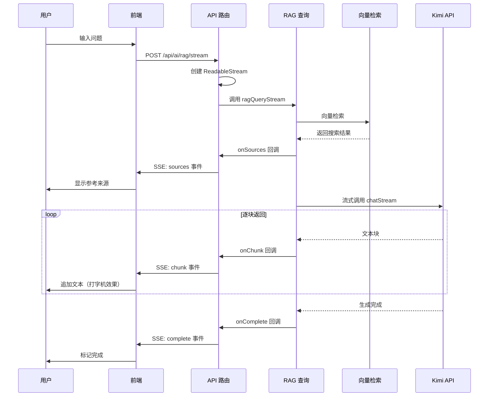

# RAG 流式输出实现 - 答辩逐字稿

## 第一部分：需求背景

大家好，我今天要讲的是如何实现 RAG 智能问答的流式输出，也就是让 AI 的回答逐字显示，实现打字机效果，提升用户体验。

### 核心问题

在开始之前，我先回答两个关键问题：

**第一个问题：请求是发了一次还是多次？**

答案是**只发一次请求**。前端发送一个 POST 请求到 `/api/ai/rag/stream`，然后保持连接打开，持续接收数据。

**第二个问题：响应是响应了一次还是多次？**

答案是**响应是一次，但数据是分多次推送的**。服务器通过 SSE（Server-Sent Events）协议，在同一个 HTTP 响应中分多次推送数据块，直到回答生成完成。

### 为什么需要流式输出？

传统的实现方式是：用户提问 → 等待 AI 生成完整回答 → 一次性返回 → 显示结果。这种方式的问题是，用户需要等待很长时间，特别是回答比较长的时候，用户体验很差。

流式输出的好处是：用户提问后，AI 每生成一点文本就推送一点，前端实时显示，用户立即看到反馈，感觉响应更快。

## 第二部分：整体流程

整个流程是这样的：



简单来说就是：

1. **用户提问** → 前端发送一个 POST 请求
2. **后端接收请求** → 创建 SSE 流，保持连接打开
3. **向量检索** → 同步完成，立即发送来源信息（sources 事件）
4. **调用 Kimi API** → 使用流式模式，Kimi 逐块返回文本
5. **后端转发** → 每收到一个文本块，就通过 SSE 发送给前端（chunk 事件）
6. **前端接收** → 实时解析 SSE 数据，更新 UI，实现打字机效果
7. **回答完成** → 发送完成事件（complete 事件），关闭连接

**关键点**：

- 整个过程中只有**一个 HTTP 请求**，但数据是**分多次推送**的
- 使用 SSE 协议，服务器可以主动推送数据，不需要前端轮询
- 前端使用 `ReadableStream` 读取流式数据，实时更新 UI

## 第三部分：技术方案

### 核心技术

我们使用了三个核心技术：

1. **Server-Sent Events (SSE)** - 服务器主动推送数据，保持长连接
2. **ReadableStream** - 浏览器流式读取响应，实时处理数据
3. **OpenAI SDK 流式 API** - Kimi API 支持流式输出，逐块返回文本

### 为什么选择 SSE？

SSE 相比其他方案有几个优势：

- **简单**：基于 HTTP，不需要 WebSocket 的复杂握手
- **自动重连**：浏览器原生支持自动重连
- **单向推送**：适合服务器向客户端推送数据的场景
- **标准协议**：兼容性好，不需要额外库

## 第四部分：实现细节

### 1. AI 客户端流式调用

**文件**: `src/lib/ai/client.ts`

核心是调用 Kimi API 时设置 `stream: true`，这样 API 会逐块返回文本，而不是等全部生成完再返回。

关键代码是这样的：

```typescript
// 创建流式请求
const stream = await this.client.chat.completions.create({
  stream: true, // 启用流式输出
  // ... 其他参数
});

// 逐块处理流式响应
for await (const chunk of stream) {
  const content = chunk.choices[0]?.delta?.content || "";
  if (content) {
    onChunk?.(content); // 实时回调每个文本块
  }
}
```

**工作原理**：

- `stream: true` 告诉 Kimi API 使用流式模式
- `for await...of` 循环会等待每个数据块，Kimi 每生成一点文本就返回一个块
- `onChunk` 回调函数在每次收到文本块时被调用，可以实时传递给前端

这样就能实现 AI 每生成一点文本，我们就收到一点，而不是等全部生成完。

### 2. RAG 流式查询

**文件**: `src/lib/ai/rag.ts`

#### 回调接口设计

我们设计了一个回调接口，用来处理流式数据：

```typescript
export interface RAGStreamCallbacks {
  onSources?: (sources: RAGResponse["sources"]) => void; // 来源信息
  onChunk?: (chunk: string) => void; // 文本块
  onComplete?: (result: {
    tokensUsed?: number;
    mode?: "rag" | "fallback";
  }) => void; // 完成
  onError?: (error: Error) => void; // 错误
}
```

这样设计的好处是，不同阶段的数据可以通过不同的回调函数处理，逻辑清晰。

#### 流式查询流程

流式查询的流程是这样的：

```typescript
export async function ragQueryStream(
  question: string,
  options: RAGOptions = {},
  callbacks: RAGStreamCallbacks = {}
): Promise<void> {
  // 1. 向量检索（非流式）
  const searchResults = await vectorStore.search(queryVector, { limit: 5 });

  // 2. 发送来源信息（立即）
  callbacks.onSources?.(sources);

  // 3. 构建上下文和 Prompt
  const prompt = buildRAGPrompt(question, context);

  // 4. 流式调用 LLM
  const result = await aiClient.chatStream(
    messages,
    options,
    callbacks.onChunk // 每个文本块都会触发回调
  );

  // 5. 完成回调
  callbacks.onComplete?.({
    mode: "rag",
    tokensUsed: result.tokensUsed,
  });
}
```

**设计思路**：

- 向量检索是同步的，先完成再开始流式输出
- 来源信息立即发送，用户可以提前看到参考文章，不用等 AI 生成完
- LLM 回答部分使用流式输出，实现打字机效果

这样设计的好处是，用户可以在 AI 生成回答之前就看到参考来源，体验更好。

### 3. 流式 API 路由

**文件**: `src/app/api/ai/rag/stream/route.ts`

这是整个流程的核心。API 路由创建一个 `ReadableStream`，保持连接打开，然后通过 SSE 协议推送数据。

**SSE 数据格式**：

SSE 的数据格式是这样的：

```
event: sources
data: {"sources": [...]}

event: chunk
data: {"chunk": "文本块"}

event: complete
data: {"tokensUsed": 150, "mode": "rag"}

event: error
data: {"error": "错误信息"}
```

每个事件包含两部分：`event:` 后面是事件类型，`data:` 后面是 JSON 格式的数据。两个换行符 `\n\n` 表示一个事件结束。

**工作原理**：

1. 创建 `ReadableStream`，保持连接打开
2. 执行 RAG 查询，通过回调函数接收数据
3. 每次收到数据（来源、文本块、完成、错误），就按照 SSE 格式推送给前端
4. 响应头设置为 `text/event-stream`，告诉浏览器这是流式数据

关键代码：

```typescript
const stream = new ReadableStream({
  async start(controller) {
    const sendEvent = (type: string, data: any) => {
      const message = `event: ${type}\ndata: ${JSON.stringify(data)}\n\n`;
      controller.enqueue(encoder.encode(message));
    };

    await ragQueryStream(question, options, {
      onSources: (sources) => sendEvent("sources", { sources }),
      onChunk: (chunk) => sendEvent("chunk", { chunk }),
      onComplete: (result) => {
        sendEvent("complete", result);
        controller.close();
      },
      onError: (error) => {
        sendEvent("error", { error: error.message });
        controller.close();
      },
    });
  },
});

return new Response(stream, {
  headers: {
    "Content-Type": "text/event-stream",
    "Cache-Control": "no-cache",
    Connection: "keep-alive",
  },
});
```

关键点：

- `ReadableStream` 允许服务器持续推送数据
- SSE 格式：`event: 事件类型\ndata: JSON数据\n\n`
- 响应头 `Connection: keep-alive` 保持连接打开
- `Content-Type: text/event-stream` 告诉浏览器这是 SSE 流

### 4. 前端流式读取

**文件**: `src/components/admin/rag-chat.tsx`

前端使用 `fetch` API 发起请求，然后通过 `ReadableStream` 读取流式数据。

**工作流程**：

1. 发送 POST 请求，获取响应对象
2. 使用 `response.body.getReader()` 获取流式读取器
3. 循环读取数据块，使用 `TextDecoder` 解码
4. 解析 SSE 格式，提取事件类型和数据
5. 根据事件类型更新 React 状态：
   - `sources` 事件：更新参考来源
   - `chunk` 事件：追加文本内容，实现打字机效果
   - `complete` 事件：标记完成
   - `error` 事件：显示错误

关键代码：

```typescript
const response = await fetch("/api/ai/rag/stream", {
  method: "POST",
  headers: { "Content-Type": "application/json" },
  body: JSON.stringify({ question }),
});

const reader = response.body?.getReader();
const decoder = new TextDecoder();
let buffer = "";

while (true) {
  const { done, value } = await reader.read();
  if (done) break;

  buffer += decoder.decode(value, { stream: true });

  // 解析 SSE 格式
  const lines = buffer.split("\n\n");
  buffer = lines.pop() || ""; // 保留不完整的消息

  for (const line of lines) {
    const [eventLine, dataLine] = line.split("\n");
    const event = eventLine.replace("event: ", "");
    const data = JSON.parse(dataLine.replace("data: ", ""));

    if (event === "sources") {
      setSources(data.sources);
    } else if (event === "chunk") {
      setContent((prev) => prev + data.chunk); // 追加文本
    } else if (event === "complete") {
      setIsLoading(false);
    }
  }
}
```

**关键点**：

- 使用 `buffer` 处理不完整的 SSE 消息（可能一次读取到多个事件，或一个事件分多次读取）
- 每次收到 `chunk` 事件就更新状态，触发 UI 重渲染，实现打字机效果
- 状态更新使用函数式更新，确保拿到最新状态

## 第五部分：完整数据流

完整的数据流是这样的：

```
1. 用户输入问题
   ↓
2. 前端发送一个 POST 请求到 /api/ai/rag/stream
   ↓
3. 后端创建 ReadableStream，保持连接打开
   ↓
4. 执行向量检索（同步，很快完成）
   ↓
5. 立即发送 sources 事件 → 前端显示参考来源
   ↓
6. 构建 Prompt，调用 aiClient.chatStream
   ↓
7. Kimi API 开始流式返回文本
   ↓
8. 每收到一个文本块 → 触发 onChunk 回调
   ↓
9. 后端通过 SSE 发送 chunk 事件
   ↓
10. 前端 ReadableStream 读取数据
   ↓
11. 解析 SSE 格式，更新 React 状态
   ↓
12. UI 实时显示（打字机效果）
   ↓
13. 回答生成完成 → 发送 complete 事件 → 关闭连接
```

**关键理解**：

- 整个过程只有**一个 HTTP 请求**，但数据是**持续推送**的
- 向量检索完成后立即发送来源，用户不用等 AI 生成完就能看到参考文章
- AI 生成是流式的，每生成一点就推送一点，实现打字机效果

## 第六部分：优势与特点

### 1. 用户体验提升

**即时反馈**：用户立即看到 AI 开始回答，不用等待。

**打字机效果**：逐字显示，更有交互感，就像真人在打字一样。

**来源提前显示**：在回答生成前就能看到参考文章，用户可以提前了解信息来源。

### 2. 性能优化

**首字节时间 (TTFB) 降低**：不需要等待完整回答，第一个字节很快就能返回。

**感知延迟降低**：用户感觉响应更快，因为立即看到反馈。

**可中断性**：理论上可以中断流式请求（虽然我们当前没有实现）。

### 3. 技术优势

**标准协议**：使用 SSE 标准，兼容性好，不需要额外库。

**自动重连**：EventSource 支持自动重连（虽然我们当前使用 fetch，但可以切换）。

**错误处理**：流式错误也能及时传递，不会等到最后才发现问题。

## 第七部分：实现中的技术难点

### 难点 1：SSE 消息解析

**问题**：SSE 消息可能一次读取到多个事件，或者一个事件分多次读取，需要正确处理。

**解决方案**：使用 `buffer` 累积数据，按 `\n\n` 分割事件，保留不完整的消息。

```typescript
let buffer = "";

while (true) {
  const { done, value } = await reader.read();
  if (done) break;

  buffer += decoder.decode(value, { stream: true });

  // 按 \n\n 分割完整的事件
  const lines = buffer.split("\n\n");
  buffer = lines.pop() || ""; // 保留不完整的消息

  // 处理完整的事件
  for (const line of lines) {
    // 解析事件...
  }
}
```

### 难点 2：频繁的状态更新

**问题**：每次收到 `chunk` 事件就更新状态，可能触发大量重渲染，影响性能。

**解决方案**：使用函数式更新，确保拿到最新状态，React 会自动优化渲染。

```typescript
setContent((prev) => prev + data.chunk); // 函数式更新
```

### 难点 3：错误处理

**问题**：流式过程中可能出现网络中断、JSON 解析错误等问题。

**解决方案**：

- 使用 try-catch 包裹整个读取过程
- 处理不完整的 JSON 数据
- 前端需要处理流式错误事件

## 第八部分：注意事项

### 1. 错误处理

- 流式过程中可能出现网络中断
- 需要处理不完整的 JSON 数据
- 前端需要处理流式错误事件

### 2. 性能考虑

- 频繁的状态更新可能影响性能（当前实现已优化）
- 长回答会产生大量小更新（可考虑批量更新）

### 3. 兼容性

- SSE 需要 HTTP/1.1 或 HTTP/2
- 某些代理服务器可能不支持流式传输
- 移动网络可能不稳定

## 第九部分：总结

### 核心思想

流式输出的核心是：**一个请求，多次推送**。

### 技术实现

1. **后端**：使用 `ReadableStream` 创建 SSE 流，保持连接打开，逐块推送数据
2. **AI 调用**：使用 OpenAI SDK 的 `stream: true`，Kimi API 逐块返回文本
3. **前端**：使用 `fetch` + `ReadableStream` 读取 SSE，实时解析并更新 UI

### 实现效果

通过流式输出，我们实现了：

- ✅ **打字机效果**：AI 回答逐字显示，更有交互感
- ✅ **即时反馈**：用户立即看到 AI 开始回答，不用等待
- ✅ **来源提前显示**：在回答生成前就能看到参考文章
- ✅ **性能优化**：首字节时间降低，感知延迟降低

这样既保证了用户体验（打字机效果、即时反馈），又保持了代码的简洁性和可维护性。

### 未来优化方向

1. **批量更新**：累积多个 chunk 后批量更新，减少渲染次数
2. **中断功能**：允许用户中断流式请求
3. **重连机制**：网络中断时自动重连
4. **进度指示**：显示回答生成进度
5. **降级方案**：流式失败时自动降级为普通请求

谢谢大家！
