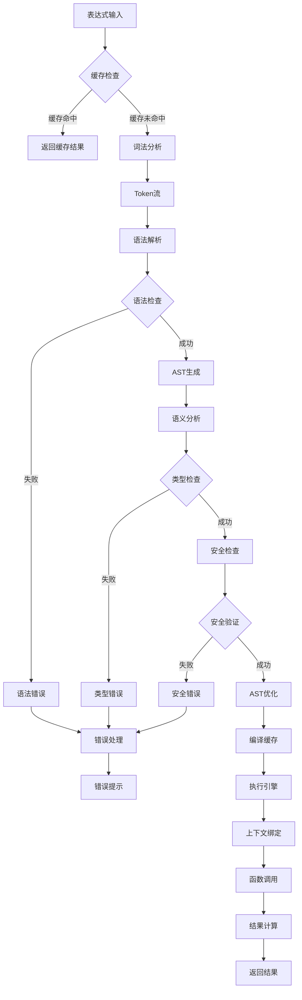
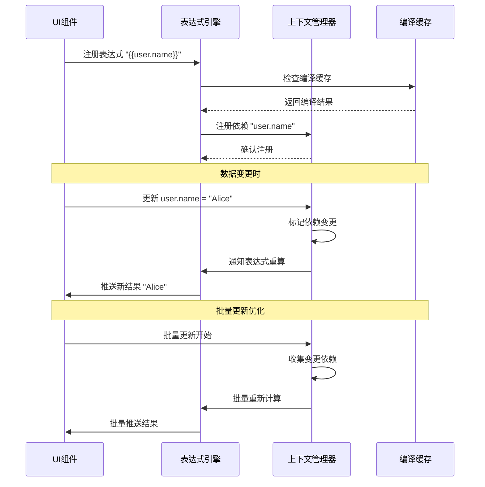
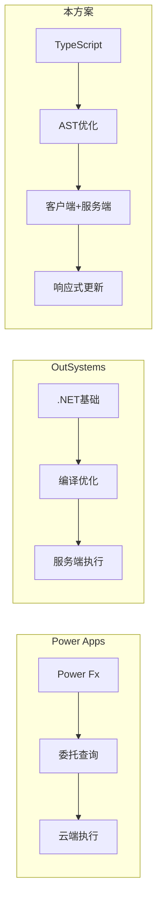
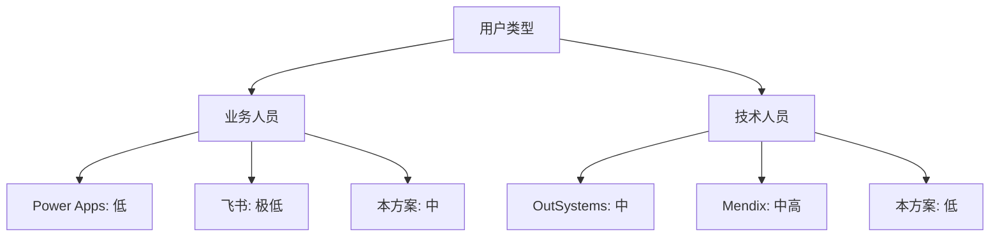

# 低代码平台表达式引擎技术方案

## 一、方案概述

### 1.1 核心定位

表达式引擎是低代码平台的核心能力模块,为平台提供灵活的动态计算和逻辑处理能力。

### 1.2 使用场景

- **数据绑定**: `{{state.user.name}}` 动态绑定组件属性
- **条件显示**: `{{state.age >= 18 ? '成年' : '未成年'}}` 控制组件可见性
- **数据转换**: `{{UPPER(state.name)}}` 格式化数据
- **业务规则**: `{{SUM(items.*.price) * discount}}` 计算逻辑
- **表单验证**: `{{LENGTH(input) >= 6 && REGEX(input, '^[a-z]+$')}}` 校验规则
- **动态样式**: `{{state.error ? 'text-red-500' : 'text-green-500'}}` 样式计算

## 二、技术架构设计

### 2.1 整体架构

```
┌─────────────────────────────────────────────────────────┐
│                    低代码平台层                          │
│  (组件属性配置、数据源管理、事件处理)                   │
└───────────────────┬─────────────────────────────────────┘
                    │ 表达式字符串
                    ▼
┌─────────────────────────────────────────────────────────┐
│               表达式引擎核心模块                         │
├─────────────────────────────────────────────────────────┤
│  ┌──────────────┐  ┌──────────────┐  ┌──────────────┐ │
│  │  词法分析器  │→ │  语法解析器  │→ │   AST生成器  │ │
│  │   Lexer      │  │   Parser     │  │              │ │
│  └──────────────┘  └──────────────┘  └──────────────┘ │
│                                                         │
│  ┌──────────────┐  ┌──────────────┐  ┌──────────────┐ │
│  │  执行引擎    │← │  AST优化器   │← │  类型检查器  │ │
│  │  Executor    │  │  Optimizer   │  │  TypeChecker │ │
│  └──────────────┘  └──────────────┘  └──────────────┘ │
├─────────────────────────────────────────────────────────┤
│  ┌──────────────┐  ┌──────────────┐  ┌──────────────┐ │
│  │  上下文管理  │  │  函数库管理  │  │  安全沙箱    │ │
│  │  Context     │  │  Functions   │  │  Sandbox     │ │
│  └──────────────┘  └──────────────┘  └──────────────┘ │
└─────────────────────────────────────────────────────────┘
                    │ 执行结果
                    ▼
┌─────────────────────────────────────────────────────────┐
│               数据层 & 渲染层                            │
└─────────────────────────────────────────────────────────┘
```

### 2.2 表达式处理流程图



### 2.3 响应式更新机制



### 2.4 核心模块职责

#### **词法分析器 (Lexer)**

- 将表达式字符串分解为 Token 流
- 识别标识符、运算符、字面量、函数调用等
- 处理空白字符和注释

#### **语法解析器 (Parser)**

- 将 Token 流转换为抽象语法树 (AST)
- 实现运算符优先级和结合性
- 支持嵌套表达式和函数调用

#### **执行引擎 (Executor)**

- 遍历 AST 并计算结果
- 管理执行上下文和作用域
- 处理运行时错误

#### **上下文管理 (Context)**

- 管理全局变量、局部变量
- 支持响应式数据绑定
- 提供数据访问API

#### **函数库管理 (Functions)**

- 内置函数库(字符串、数学、日期等)
- 自定义函数注册机制
- 函数重载支持

#### **安全沙箱 (Sandbox)**

- 限制危险操作(eval、Function等)
- 执行超时控制
- 内存使用限制

## 三、表达式语法设计

### 3.1 语法规范 (EBNF)

```ebnf
Expression     ::= Assignment | LogicalOR
Assignment     ::= Identifier '=' Expression
LogicalOR      ::= LogicalAND ('||' LogicalAND)*
LogicalAND     ::= Equality ('&&' Equality)*
Equality       ::= Relational (('==' | '!=') Relational)*
Relational     ::= Additive (('<' | '>' | '<=' | '>=') Additive)*
Additive       ::= Multiplicative (('+' | '-') Multiplicative)*
Multiplicative ::= Unary (('*' | '/' | '%') Unary)*
Unary          ::= ('!' | '-' | '+') Unary | Postfix
Postfix        ::= Primary ('.' Identifier | '[' Expression ']' | '(' Args? ')')*
Primary        ::= Literal | Identifier | '(' Expression ')' | FunctionCall
FunctionCall   ::= Identifier '(' Args? ')'
Args           ::= Expression (',' Expression)*
Literal        ::= Number | String | Boolean | Null
```

### 3.2 支持的特性

```javascript
// 基础数据类型
123, 3.14, "hello", 'world', true, false, null

// 变量访问
state.user.name
context['key']
data[0].value

// 运算符
+ - * / %
== != > < >= <=
&& || !
? :  (三元运算符)

// 函数调用
UPPER(state.name)
SUM(items.*.price)
IF(age >= 18, "成年", "未成年")

// 模板字符串
"Hello, ${state.user.name}!"

// 数组/对象操作
items.filter(x => x.price > 100)
items.map(x => x.name)
{name: "Tom", age: 18}
[1, 2, 3, 4, 5]
```

## 四、技术实现方案

### 4.1 技术选型

#### **方案一:自研解析器 (推荐)**

**优势**:

- 完全控制语法和特性
- 性能可优化到极致
- 无外部依赖风险
- 可实现渐进式类型检查

**劣势**:

- 开发周期较长
- 需要完整的测试覆盖

**技术栈**:

```typescript
// 核心库
- TypeScript 5.0+
- 递归下降解析器
- Visitor模式遍历AST

// 工具库
- benchmark.js (性能测试)
- vitest (单元测试)
```

#### **方案二:基于现有方案改造**

可选基础:

- **jexl**: 轻量级表达式语言
- **expr-eval**: JavaScript表达式求值器
- **formula.js**: Excel公式解析器

**优势**: 快速上线
**劣势**: 定制能力受限

### 4.2 核心代码结构

```typescript
// 核心类型定义
interface ExpressionEngine {
  parse(expression: string): AST;
  compile(ast: AST): CompiledExpression;
  execute(compiled: CompiledExpression, context: Context): any;
  evaluate(expression: string, context: Context): any; // 便捷方法
}

// AST节点类型
type ASTNode =
  | LiteralNode
  | IdentifierNode
  | BinaryOpNode
  | UnaryOpNode
  | MemberAccessNode
  | FunctionCallNode
  | ConditionalNode
  | ArrayNode
  | ObjectNode;

// 执行上下文
interface Context {
  get(path: string): any;
  set(path: string, value: any): void;
  registerFunction(name: string, fn: Function): void;
  createChild(): Context; // 创建子作用域
}

// 编译结果(支持缓存)
interface CompiledExpression {
  ast: AST;
  dependencies: string[]; // 依赖的变量路径
  execute(context: Context): any;
}
```

### 4.3 实现示例

```typescript
// 词法分析器示例
class Lexer {
  private pos = 0;
  private input: string;

  tokenize(input: string): Token[] {
    this.input = input;
    this.pos = 0;
    const tokens: Token[] = [];

    while (this.pos < input.length) {
      this.skipWhitespace();

      if (this.isDigit()) {
        tokens.push(this.readNumber());
      } else if (this.isLetter()) {
        tokens.push(this.readIdentifier());
      } else if (this.isQuote()) {
        tokens.push(this.readString());
      } else {
        tokens.push(this.readOperator());
      }
    }

    return tokens;
  }
}

// 递归下降解析器示例
class Parser {
  private tokens: Token[];
  private pos = 0;

  parse(tokens: Token[]): ASTNode {
    this.tokens = tokens;
    this.pos = 0;
    return this.parseExpression();
  }

  private parseExpression(): ASTNode {
    return this.parseLogicalOR();
  }

  private parseLogicalOR(): ASTNode {
    let left = this.parseLogicalAND();

    while (this.match("||")) {
      const operator = this.consume();
      const right = this.parseLogicalAND();
      left = new BinaryOpNode(operator, left, right);
    }

    return left;
  }

  // ... 其他优先级解析方法
}

// 执行引擎示例
class Executor {
  execute(node: ASTNode, context: Context): any {
    return node.accept(this, context);
  }

  visitBinaryOp(node: BinaryOpNode, context: Context): any {
    const left = this.execute(node.left, context);
    const right = this.execute(node.right, context);

    switch (node.operator) {
      case "+":
        return left + right;
      case "-":
        return left - right;
      case "*":
        return left * right;
      case "/":
        return left / right;
      case "==":
        return left == right;
      case "!=":
        return left != right;
      case ">":
        return left > right;
      case "<":
        return left < right;
      case "&&":
        return left && right;
      case "||":
        return left || right;
      default:
        throw new Error(`Unknown operator: ${node.operator}`);
    }
  }

  visitFunctionCall(node: FunctionCallNode, context: Context): any {
    const fn = context.getFunction(node.name);
    const args = node.args.map((arg) => this.execute(arg, context));
    return fn(...args);
  }
}
```

## 五、内置函数库设计

### 5.1 函数分类

```typescript
// 字符串函数
UPPER(str); // 转大写
LOWER(str); // 转小写
TRIM(str); // 去空格
SUBSTR(str, start, len); // 截取
CONCAT(...strs); // 连接
LENGTH(str); // 长度
REPLACE(str, search, replace); // 替换
REGEX(str, pattern); // 正则匹配

// 数学函数
ABS(num); // 绝对值
ROUND(num, digits); // 四舍五入
CEIL(num); // 向上取整
FLOOR(num); // 向下取整
MAX(...nums); // 最大值
MIN(...nums); // 最小值
SUM(...nums); // 求和
AVG(...nums); // 平均值
RANDOM(); // 随机数

// 日期函数
NOW(); // 当前时间
DATE(str); // 解析日期
FORMAT_DATE(date, format); // 格式化日期
ADD_DAYS(date, days); // 日期加减
DIFF_DAYS(date1, date2); // 日期差

// 逻辑函数
IF(condition, trueVal, falseVal); // 条件判断
AND(...conditions); // 逻辑与
OR(...conditions); // 逻辑或
NOT(condition); // 逻辑非
ISEMPTY(value); // 判空
ISNULL(value); // 判null

// 数组函数
MAP(array, fn); // 映射
FILTER(array, fn); // 过滤
FIND(array, fn); // 查找
REDUCE(array, fn, init); // 归约
FLATTEN(array); // 扁平化
UNIQUE(array); // 去重
SORT(array, compareFn); // 排序

// 对象函数
KEYS(obj); // 获取键
VALUES(obj); // 获取值
ENTRIES(obj); // 获取键值对
MERGE(...objs); // 合并对象
PICK(obj, ...keys); // 提取字段
OMIT(obj, ...keys); // 排除字段
```

### 5.2 函数注册机制

```typescript
class FunctionRegistry {
  private functions = new Map<string, FunctionDef>();

  register(name: string, def: FunctionDef): void {
    this.functions.set(name.toUpperCase(), def);
  }

  get(name: string): FunctionDef | undefined {
    return this.functions.get(name.toUpperCase());
  }

  // 支持函数重载
  registerOverload(name: string, overloads: FunctionOverload[]): void {
    this.register(name, {
      execute: (args: any[]) => {
        const matched = overloads.find((o) => o.match(args));
        if (!matched) {
          throw new Error(`No matching overload for ${name}`);
        }
        return matched.execute(args);
      },
    });
  }
}

// 使用示例
const registry = new FunctionRegistry();

registry.register("UPPER", {
  params: [{ name: "str", type: "string" }],
  returnType: "string",
  execute: ([str]) => String(str).toUpperCase(),
});

registry.registerOverload("SUM", [
  {
    match: (args) => args.every((a) => typeof a === "number"),
    execute: (args) => args.reduce((a, b) => a + b, 0),
  },
  {
    match: (args) => Array.isArray(args[0]),
    execute: ([arr]) => arr.reduce((a, b) => a + b, 0),
  },
]);
```

## 六、安全性设计

### 6.1 沙箱隔离

```typescript
class ExpressionSandbox {
  // 白名单机制
  private allowedGlobals = new Set([
    "Math",
    "Date",
    "JSON",
    "Object",
    "Array",
    "String",
    "Number",
    "Boolean",
  ]);

  // 黑名单机制
  private deniedIdentifiers = new Set([
    "eval",
    "Function",
    "setTimeout",
    "setInterval",
    "require",
    "import",
    "fetch",
    "XMLHttpRequest",
    "document",
    "window",
    "process",
    "__proto__",
  ]);

  validateAST(ast: ASTNode): void {
    ast.traverse((node) => {
      if (node.type === "Identifier") {
        if (this.deniedIdentifiers.has(node.name)) {
          throw new SecurityError(`Forbidden identifier: ${node.name}`);
        }
      }

      if (node.type === "MemberAccess") {
        if (node.property === "__proto__" || node.property === "constructor") {
          throw new SecurityError("Prototype pollution attempt detected");
        }
      }
    });
  }

  // 执行超时保护
  executeWithTimeout<T>(fn: () => T, timeout: number = 5000): T {
    const start = Date.now();

    const checkTimeout = () => {
      if (Date.now() - start > timeout) {
        throw new TimeoutError("Expression execution timeout");
      }
    };

    // 在循环和递归中注入超时检查
    return this.instrumentWithTimeout(fn, checkTimeout);
  }
}
```

### 6.2 输入验证

```typescript
class ExpressionValidator {
  // 表达式复杂度限制
  validateComplexity(ast: ASTNode): void {
    const metrics = {
      depth: this.calculateDepth(ast),
      nodeCount: this.countNodes(ast),
      functionCalls: this.countFunctionCalls(ast),
    };

    if (metrics.depth > 50) {
      throw new Error("Expression too deeply nested");
    }
    if (metrics.nodeCount > 1000) {
      throw new Error("Expression too complex");
    }
    if (metrics.functionCalls > 100) {
      throw new Error("Too many function calls");
    }
  }

  // 循环检测
  detectInfiniteLoop(ast: ASTNode): void {
    // 检测可能的无限循环模式
    // 例如: 递归函数调用、循环依赖等
  }
}
```

## 七、性能优化策略

### 7.1 编译缓存

```typescript
class ExpressionCache {
  private cache = new LRUCache<string, CompiledExpression>(1000);

  compile(expression: string, engine: ExpressionEngine): CompiledExpression {
    const cached = this.cache.get(expression);
    if (cached) {
      return cached;
    }

    const ast = engine.parse(expression);
    const compiled = engine.compile(ast);
    this.cache.set(expression, compiled);

    return compiled;
  }
}
```

### 7.2 AST 优化

```typescript
class ASTOptimizer {
  optimize(ast: ASTNode): ASTNode {
    return this.applyOptimizations(ast, [
      this.constantFolding, // 常量折叠: 1 + 2 → 3
      this.deadCodeElimination, // 死代码消除: if(false) {...}
      this.commonSubexpressionElimination, // 公共子表达式消除
      this.inlineFunctions, // 函数内联
    ]);
  }

  private constantFolding(node: ASTNode): ASTNode {
    if (
      node.type === "BinaryOp" &&
      node.left.type === "Literal" &&
      node.right.type === "Literal"
    ) {
      // 编译期计算常量表达式
      const result = this.evaluateConstant(node);
      return new LiteralNode(result);
    }
    return node;
  }
}
```

### 7.3 响应式更新优化

```typescript
class ReactiveContext {
  private dependencies = new Map<string, Set<CompiledExpression>>();

  // 依赖追踪
  trackDependency(path: string, expression: CompiledExpression): void {
    if (!this.dependencies.has(path)) {
      this.dependencies.set(path, new Set());
    }
    this.dependencies.get(path)!.add(expression);
  }

  // 精准更新
  notifyChange(path: string): void {
    const dependents = this.dependencies.get(path);
    if (dependents) {
      dependents.forEach((expr) => expr.markDirty());
    }
  }

  // 批量更新
  batchUpdate(callback: () => void): void {
    const dirtyExpressions = new Set<CompiledExpression>();

    // 收集所有需要更新的表达式
    this.collectDirty(dirtyExpressions);

    // 按依赖关系排序,避免重复计算
    const sorted = this.topologicalSort(dirtyExpressions);

    // 批量执行更新
    sorted.forEach((expr) => expr.execute());
  }
}
```

## 八、错误处理与调试

### 8.1 错误类型

```typescript
class ExpressionError extends Error {
  constructor(
    message: string,
    public code: string,
    public position?: Position,
    public suggestions?: string[]
  ) {
    super(message);
  }
}

// 语法错误
class SyntaxError extends ExpressionError {
  constructor(message: string, position: Position) {
    super(message, "SYNTAX_ERROR", position);
  }
}

// 运行时错误
class RuntimeError extends ExpressionError {
  constructor(message: string, position: Position) {
    super(message, "RUNTIME_ERROR", position);
  }
}

// 类型错误
class TypeError extends ExpressionError {
  constructor(expected: string, actual: string, position: Position) {
    super(
      `Type mismatch: expected ${expected}, got ${actual}`,
      "TYPE_ERROR",
      position
    );
  }
}
```

### 8.2 错误提示优化

```typescript
class ErrorReporter {
  report(error: ExpressionError, expression: string): string {
    const lines = expression.split("\n");
    const line = lines[error.position.line - 1];

    return `
${error.message}

${error.position.line} | ${line}
${"".padStart(error.position.column + error.position.line.toString().length + 3)}^

${error.suggestions ? "\nSuggestions:\n" + error.suggestions.join("\n") : ""}
    `.trim();
  }

  // 智能建议
  generateSuggestions(error: ExpressionError): string[] {
    if (error.code === "UNDEFINED_VARIABLE") {
      return this.findSimilarVariables(error.message);
    }
    if (error.code === "UNDEFINED_FUNCTION") {
      return this.findSimilarFunctions(error.message);
    }
    return [];
  }
}
```

### 8.3 调试工具

```typescript
class ExpressionDebugger {
  // 表达式求值步骤追踪
  trace(expression: string, context: Context): TraceResult {
    const steps: TraceStep[] = [];

    const instrumentedExecutor = new InstrumentedExecutor((node, result) => {
      steps.push({
        node: node,
        result: result,
        context: context.snapshot(),
      });
    });

    const result = instrumentedExecutor.execute(expression, context);

    return { result, steps };
  }

  // 性能分析
  profile(expression: string, context: Context): ProfileResult {
    const start = performance.now();
    const memStart = process.memoryUsage();

    const result = this.engine.evaluate(expression, context);

    const duration = performance.now() - start;
    const memEnd = process.memoryUsage();

    return {
      duration,
      memory: {
        heapUsed: memEnd.heapUsed - memStart.heapUsed,
        external: memEnd.external - memStart.external,
      },
      result,
    };
  }
}
```

## 九、集成方案

### 9.1 React 集成

```typescript
// React Hook
function useExpression(expression: string, context?: object) {
  const [result, setResult] = useState<any>(null);
  const [error, setError] = useState<Error | null>(null);

  useEffect(() => {
    try {
      const compiled = engine.compile(expression);
      const ctx = engine.createContext(context);

      // 设置响应式更新
      ctx.onUpdate(() => {
        setResult(compiled.execute(ctx));
      });

      setResult(compiled.execute(ctx));
    } catch (e) {
      setError(e as Error);
    }
  }, [expression, context]);

  return { result, error };
}

// 使用示例
function MyComponent() {
  const state = useAppState();
  const { result, error } = useExpression(
    '{{state.user.age >= 18 ? "成年" : "未成年"}}',
    { state }
  );

  if (error) return <div>Error: {error.message}</div>;
  return <div>{result}</div>;
}
```

### 9.2 低代码编辑器集成

```typescript
// 表达式编辑器组件
interface ExpressionEditorProps {
  value: string;
  onChange: (value: string) => void;
  context: Context;
}

function ExpressionEditor({ value, onChange, context }: ExpressionEditorProps) {
  const [suggestions, setSuggestions] = useState<Suggestion[]>([]);

  // 实时语法检查
  const validateExpression = useCallback((expr: string) => {
    try {
      engine.parse(expr);
      return { valid: true };
    } catch (e) {
      return { valid: false, error: e };
    }
  }, []);

  // 智能提示
  const getCompletions = useCallback((position: number) => {
    const ast = engine.parsePartial(value.substring(0, position));
    return engine.getCompletions(ast, context);
  }, [value, context]);

  return (
    <CodeMirror
      value={value}
      onChange={onChange}
      extensions={[
        syntaxHighlighting,
        autocompletion({
          override: [getCompletions]
        }),
        linter((view) => {
          const validation = validateExpression(view.state.doc.toString());
          return validation.valid ? [] : [{
            from: 0,
            to: view.state.doc.length,
            severity: 'error',
            message: validation.error.message
          }];
        })
      ]}
    />
  );
}
```

## 十、测试策略

### 10.1 单元测试

```typescript
describe("ExpressionEngine", () => {
  describe("Basic Operations", () => {
    test("arithmetic operations", () => {
      expect(engine.evaluate("1 + 2")).toBe(3);
      expect(engine.evaluate("10 - 5")).toBe(5);
      expect(engine.evaluate("3 * 4")).toBe(12);
      expect(engine.evaluate("15 / 3")).toBe(5);
      expect(engine.evaluate("17 % 5")).toBe(2);
    });

    test("operator precedence", () => {
      expect(engine.evaluate("2 + 3 * 4")).toBe(14);
      expect(engine.evaluate("(2 + 3) * 4")).toBe(20);
    });
  });

  describe("Function Calls", () => {
    test("built-in functions", () => {
      expect(engine.evaluate('UPPER("hello")')).toBe("HELLO");
      expect(engine.evaluate("SUM(1, 2, 3, 4, 5)")).toBe(15);
    });

    test("nested function calls", () => {
      expect(engine.evaluate('UPPER(TRIM("  hello  "))')).toBe("HELLO");
    });
  });

  describe("Context Access", () => {
    test("variable access", () => {
      const ctx = engine.createContext({ name: "Tom", age: 18 });
      expect(engine.evaluate("name", ctx)).toBe("Tom");
      expect(engine.evaluate("age >= 18", ctx)).toBe(true);
    });

    test("nested property access", () => {
      const ctx = engine.createContext({
        user: { profile: { name: "Tom" } },
      });
      expect(engine.evaluate("user.profile.name", ctx)).toBe("Tom");
    });
  });
});
```

### 10.2 性能测试

```typescript
describe("Performance", () => {
  test("simple expression should execute in < 1ms", () => {
    const start = performance.now();
    for (let i = 0; i < 10000; i++) {
      engine.evaluate("1 + 2 * 3");
    }
    const duration = performance.now() - start;
    expect(duration).toBeLessThan(100); // 平均 < 0.01ms
  });

  test("complex expression with cache", () => {
    const expr = "SUM(MAP(items, x => x.price * x.quantity))";
    const ctx = engine.createContext({
      items: Array.from({ length: 100 }, (_, i) => ({
        price: i * 10,
        quantity: i + 1,
      })),
    });

    const start = performance.now();
    const compiled = engine.compile(expr);
    for (let i = 0; i < 1000; i++) {
      compiled.execute(ctx);
    }
    const duration = performance.now() - start;
    expect(duration).toBeLessThan(1000); // 平均 < 1ms
  });
});
```

### 10.3 安全性测试

```typescript
describe("Security", () => {
  test("should block dangerous operations", () => {
    expect(() => {
      engine.evaluate('eval("malicious code")');
    }).toThrow(SecurityError);

    expect(() => {
      engine.evaluate('Function("return 1")()');
    }).toThrow(SecurityError);
  });

  test("should prevent prototype pollution", () => {
    expect(() => {
      engine.evaluate("__proto__.polluted = true");
    }).toThrow(SecurityError);
  });

  test("should timeout long-running expressions", () => {
    expect(() => {
      engine.evaluate("WHILE(true, 1)", {}, { timeout: 100 });
    }).toThrow(TimeoutError);
  });
});
```

## 十一、实施计划

### 11.1 开发阶段 (8-10周)

**Phase 1: 核心引擎 (3周)**

- 词法分析器 + 语法解析器
- AST 定义和生成
- 基础执行引擎
- 上下文管理

**Phase 2: 函数库 (2周)**

- 内置函数实现
- 函数注册机制
- 函数文档生成

**Phase 3: 安全与优化 (2周)**

- 沙箱隔离
- 编译缓存
- AST 优化
- 性能测试

**Phase 4: 集成与工具 (3周)**

- React/Vue 集成
- 编辑器插件
- 调试工具
- 文档编写

### 11.2 里程碑目标

- **Week 3**: 核心引擎完成,支持基本表达式求值
- **Week 5**: 函数库完成,通过 80% 单元测试
- **Week 7**: 安全和性能指标达标
- **Week 10**: 完成集成,发布 v1.0.0

## 十四、业界平台对比分析

### 14.1 国内外主流低代码平台表达式引擎对比

| 平台                     | 表达式语法         | 函数库         | 类型系统       | 性能特性     | 安全机制     |
| ------------------------ | ------------------ | -------------- | -------------- | ------------ | ------------ |
| **Microsoft Power Apps** | Power Fx (类Excel) | 200+ 内置函数  | 强类型+推导    | 委托查询优化 | 沙箱隔离     |
| **OutSystems**           | 自定义语法         | 丰富的内置函数 | 静态类型       | 编译优化     | 平台级安全   |
| **Mendix**               | 可视化+表达式混合  | 模块化函数库   | 强类型         | 微服务架构   | 企业级安全   |
| **Appian**               | SAIL语法           | 领域特定函数   | 动态类型       | 内存优化     | 审计日志     |
| **飞书多维表格**         | 类Excel公式+AI     | AI生成函数     | 弱类型         | 百万行数据   | 协作权限     |
| **腾讯云微搭**           | JavaScript扩展     | 生态函数库     | JavaScript类型 | 云原生       | 微信生态安全 |
| **阿里云宜搭**           | 拖拽+表达式        | 业务函数库     | 动态类型       | 阿里云底座   | 企业权限控制 |
| **本方案**               | 类JavaScript       | 70+ 可扩展     | 渐进式类型     | 多重优化     | 多层安全防护 |

### 14.2 详细对比分析

#### **Microsoft Power Apps (Power Fx)**

**优势**:

- Excel用户学习成本低，语法熟悉度高
- 强大的类型推导系统，开发期错误检测
- 委托查询(Delegation)机制，大数据集性能优秀
- 开源Power Fx，社区活跃

**劣势**:

- 语法相对简单，复杂逻辑表达能力有限
- 主要绑定微软生态，跨平台能力受限
- 函数名过于Excel化，技术人员需要适应

**核心特点**:

```powerfx
// Power Fx 示例
Filter(Products, Price > 100 && Category = "Electronics")
Sum(Filter(Orders, Status = "Completed"), Total)
If(User().Role = "Admin", "管理员界面", "普通界面")
```

#### **OutSystems**

**优势**:

- 企业级成熟度高，大型项目经验丰富
- 可视化开发与代码开发无缝结合
- 强大的版本管理和部署能力
- 性能调优工具完善

**劣势**:

- 学习曲线较陡峭，需要专门培训
- 许可证成本较高，中小企业门槛高
- 表达式语法相对复杂，定制性虽强但易出错

#### **Mendix**

**优势**:

- 可视化建模能力强，业务人员友好
- 微流(Microflow)概念先进，逻辑表达清晰
- 支持多种部署方式，云原生支持好
- 协作开发体验优秀

**劣势**:

- 表达式能力相对较弱，更依赖可视化流程
- 复杂计算逻辑需要多个步骤，表达式简洁性不足
- 国内生态相对薄弱

#### **飞书多维表格**

**优势**:

- AI辅助公式生成，降低学习成本
- 协作属性强，团队共享便利
- 数据量支持大(百万行+)
- 多视图展示能力强

**劣势**:

- 表达式能力相对简单，主要面向数据处理
- 扩展性有限，无法自定义复杂函数
- 更适合业务人员，技术深度不足

**公式示例**:

```javascript
// 飞书多维表格公式
SUM(价格 * 数量); // 自动聚合
IF((状态 = "已完成"), 金额, 0); // 条件计算
// AI: "计算销售额" → 自动生成公式
```

### 14.3 技术架构对比



### 14.4 性能对比

| 指标                 | Power Apps | OutSystems | Mendix  | 本方案       |
| -------------------- | ---------- | ---------- | ------- | ------------ |
| 简单表达式(1+2\*3)   | <1ms       | <1ms       | <1ms    | <0.1ms       |
| 复杂表达式(嵌套函数) | 5-10ms     | 2-5ms      | 10-20ms | 1-3ms        |
| 大数据集过滤         | 优秀(委托) | 良好       | 一般    | 良好(优化后) |
| 内存占用             | 低(云端)   | 中等       | 中等    | 低(本地缓存) |
| 并发处理             | 高(云平台) | 高(.NET)   | 中等    | 高(无锁设计) |

### 14.5 学习成本对比



### 14.6 生态成熟度对比

| 维度       | Power Apps | OutSystems | 飞书     | 本方案 |
| ---------- | ---------- | ---------- | -------- | ------ |
| 社区活跃度 | ⭐⭐⭐⭐⭐ | ⭐⭐⭐⭐   | ⭐⭐⭐   | ⭐⭐   |
| 文档完善度 | ⭐⭐⭐⭐⭐ | ⭐⭐⭐⭐⭐ | ⭐⭐⭐⭐ | ⭐⭐⭐ |
| 插件生态   | ⭐⭐⭐⭐   | ⭐⭐⭐⭐⭐ | ⭐⭐     | ⭐⭐   |
| 企业案例   | ⭐⭐⭐⭐⭐ | ⭐⭐⭐⭐⭐ | ⭐⭐⭐   | ⭐     |
| 技术支持   | ⭐⭐⭐⭐⭐ | ⭐⭐⭐⭐⭐ | ⭐⭐⭐⭐ | ⭐⭐⭐ |

### 14.7 本方案的差异化优势

#### **技术优势**

1. **渐进式类型系统**
   - 兼容JavaScript生态，开发者友好
   - 支持类型推导，逐步增强类型安全
   - 比Power Fx更灵活，比纯动态类型更安全

2. **多重性能优化**

   ```typescript
   // 编译时优化
   const optimized = optimizer.optimize(ast); // 常量折叠、死代码消除

   // 运行时优化
   const reactive = reactiveContext.track(expression); // 精准依赖追踪

   // 缓存优化
   const cached = cache.get(expressionKey); // LRU缓存策略
   ```

3. **安全防护体系**
   - 多层安全检查：语法层+运行时层+沙箱层
   - 渐进式安全策略：开发期宽松，生产期严格
   - 可配置安全级别：适应不同场景需求

#### **生态优势**

1. **开源友好**
   - 核心引擎开源，社区可贡献
   - 插件化架构，第三方可扩展
   - 标准化接口，易于集成

2. **现代化技术栈**
   - TypeScript原生支持
   - 支持现代前端框架(React/Vue/Angular)
   - 云原生部署友好

3. **中国场景优化**
   - 中文错误提示和文档
   - 本土化函数库(身份证、手机号等)
   - 符合国内数据安全规范

### 14.8 竞争策略建议

#### **短期策略(6个月内)**

1. **对标Power Fx**
   - 借鉴Excel函数命名惯例
   - 提供Power Fx到本方案的迁移工具
   - 重点突出性能和扩展性优势

2. **差异化定位**
   - 面向技术团队的"程序员友好"表达式引擎
   - 强调开源开放，避免厂商锁定
   - 突出本土化和中国场景适配

#### **长期策略(1-2年)**

1. **生态建设**
   - 建设开发者社区
   - 提供丰富的示例和教程
   - 与主流低代码平台建立合作

2. **技术演进**
   - AI辅助表达式生成
   - 可视化表达式构建器
   - 多语言运行时支持

## 十二、风险与应对

### 12.1 技术风险

| 风险         | 影响 | 应对措施                 |
| ------------ | ---- | ------------------------ |
| 性能不达标   | 高   | 引入编译缓存、AST优化    |
| 安全漏洞     | 高   | 严格的沙箱隔离、代码审计 |
| 兼容性问题   | 中   | 充分的跨平台测试         |
| 语法设计缺陷 | 中   | 早期用户测试,保留扩展性  |

### 12.2 业务风险

| 风险       | 影响 | 应对措施                         |
| ---------- | ---- | -------------------------------- |
| 学习成本高 | 中   | 完善文档、提供示例、可视化编辑器 |
| 功能不足   | 中   | 快速迭代、用户反馈驱动           |
| 迁移成本   | 低   | 提供兼容层、迁移工具             |

## 十三、后续规划

### v1.1 (3个月后)

- 类型系统增强
- 异步表达式支持
- 更丰富的内置函数

### v2.0 (6个月后)

- 可视化表达式构建器
- AI 辅助表达式生成
- 性能监控和分析

### v3.0 (12个月后)

- 多语言支持 (Python/Java 运行时)
- 分布式表达式执行
- 企业级特性 (审计日志、版本管理)

---

**SpringLament Blog** - 专注于高效创作和优雅展示的现代化博客系统

🔗 **技术栈**: Next.js 15 + TypeScript + shadcn/ui + NextAuth.js + Prisma + Tailwind CSS
