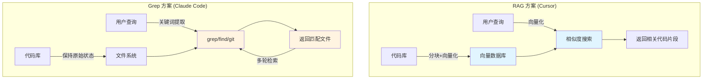

> 本来是想顺应部门的战略写一篇关于全栈基础知识的文章，但是最近涌现了很多五花八门不同形式的AI辅助编程工具（包括但不限于CodeX、Claude Code等），公司的MiCode也开始大范围推广并且取得了不错的效果，而且最近好像又开始鼓励AI方面的分享，想了想还是写一篇文章来简单介绍下不同形式AI工具的原理，以及我日常Vibe Coding的感想。

从发展历程来看，当前的AI编程工具可以大致分为三代：第一代以GitHub Copilot（类似的有Codeium、Mi Copilot等代码提示插件）为代表，第二代以Cursor（类似的有Trace、Windsurf等AI IDE）为代表，第三代则是以Claude Code（类似的有Gemini CLI、MiCode等终端命令行工具）为代表

虽然没有时间去体验市面上所有的 AI 工具，但我想这三个产品对于 AI 辅助编程而言还是有里程碑式意义的。

下面将简单介绍下这三种AI编程工具的发展历程以及它们关于上下文的不同处理方式，然后再结合这些原理简单聊一下如何更好地进行 "Vibe Coding"


## 到底什么是Vibe Coding

Vibe Coding（氛围编程）这一概念最早由Andrej Karpathy（前特斯拉AI总监，OpenAI创始成员之一）在一条推特上提出。


基于原文的内容，我们可以提炼出Vibe Coding的几个核心特征：

1. **忘记代码的存在**：完全沉浸在与AI的对话中，不再关注具体的代码实现
2. **完全不手动干预**：即使是小bug也交由AI修复，而非手动修改
3. **跳过代码审查**：不再详细review AI生成的代码，只关注最终效果

因此，`Vibe Coding`本质上描述的是一种全新的编程范式——完全基于与LLM的对话来进行程序开发。

由于`Vibe Coding`这一术语缺乏明确的中文对应概念，目前业界普遍将所有AI辅助编程行为都统称为`Vibe Coding`。
但严格来说，当前的AI技术尚未达到真正意义上的`Vibe Coding`水平（即完全无需编写代码且无需代码审查）。
所以我个人认为对于目前大家用AI写代码更准确的说法应该是**AI辅助编程**，亦或者说应该称为**Context Coding**（基于上下文的编程）。

## Context Coding

为什么说当前阶段应该叫Context Coding而不是Vibe Coding更合适呢?
因为我个人认为从GitHub Copilot到Cursor再到Claude Code等工具的AI编程能力不断提升，除了大模型本身编程能力的增强（如从GPT升级到Claude）之外，另一个关键因素是上下文工程（Context Engineering）能力的显著提升。

在大模型能力不变的前提下，AI辅助编程的所有提升都源于向LLM传递更合适的上下文信息。无论是Chat、RAG、Rules、MCP，还是Claude Code最新推出的Skills功能，以及未来可能出现的各种新技术，其本质都是围绕上下文优化展开的。

因此，下面我将简单介绍一下这三类AI编程工具分别是如何传递上下文给大模型的，只有简单了解原理之后，我们才能知道如何做才能更好的使用AI进行辅助编程。

### GitHub Copilot

GitHub Copilot是大多数开发者接触的第一款AI辅助编程工具。除了AI对话功能外，最令人印象深刻的是其**代码补全能力**。

Copilot能够根据当前代码文件的上下文进行智能补全。它会将光标位置的代码上下文提供给LLM，据此生成代码建议。

基于这一特性，开发者可以采用"注释驱动开发"的模式：先编写函数注释，让Copilot基于注释生成函数实现，再进行细节调整。这种模式显著提升了编码效率。


但是有一个关键的问题是，Copilot**只能将当前打开窗口的代码文件作为上下文**，无法利用其他文件或整个项目的上下文信息。
这导致LLM无法提供跨文件的代码建议，例如当我们在A文件中实现了某个方法，切换到B文件时，LLM缺少A文件的上下文，无法生成基于该方法的调用代码。对于需要跨多个文件协同修改的编程任务，在当时几乎无法实现。

正是在这样的背景下，提供更强大上下文能力的Cursor应运而生。

### Cursor

> Copilot推出后，市场上涌现出大量IDE插件形式的AI辅助工具，它们主要在prompt工程和LLM选择上进行优化。直到Cursor以完整AI IDE的形态出现，这一领域的竞争格局才基本确立。

Cursor相比GitHub Copilot在多个维度都有显著提升，比如支持让大模型直接编辑代码（即早期的Agent功能）。但本文重点要探讨的是Cursor的上下文工程创新。

Cursor在上下文工程方面的第一个关键突破，是采用RAG（Retrieval Augmented Generation，检索增强生成）技术对整个代码库进行索引，并通过语义（向量）搜索为LLM提供项目级别的上下文。

当使用Cursor打开一个新项目时，在Cursor Settings的Indexing设置中，可以看到Cursor正在索引整个项目，并实时显示已索引的文件数量。


下面深入探讨其技术原理。Cursor的代码库检索通过Codebase Indexing流程实现，本质上是对整个代码仓库进行RAG处理，将代码转换为可搜索的向量表示。

#### Cursor RAG 的工作原理

> 如果你不理解下面的描述，可以简单理解为我们用cursor打开一个项目的时候，它就把项目所有的代码都存到了一个数据库里，然后每次我们问问题的时候会在数据库里查询跟我们的问题最相似的代码，然后一同把查到的代码+问题丢给大模型处理

在我们用cursor打开一个项目时，Cursor 会启动一个 Codebase Indexing 流程，这一步主要有 7 个步骤：

> 不懂什么是向量数据库的可以看这篇文章：https://guangzhengli.com/blog/zh/vector-database
> 更多cursor Rag方案的细节可以看这篇文章：todo

1. 你的工作区文件会与 Cursor 的服务器安全同步，确保索引始终最新。
2. 遍历项目目录，读取并预处理所有代码文件，文件被拆分为有意义的片段，聚焦函数、类和逻辑代码块，而非任意文本段。
3. 每个片段都通过embedding算法转为向量表示，生成能捕捉语义的数学"指纹"。
4. 这些向量嵌入存储在专用的向量数据库中，支持在数百万代码片段中进行高速相似度搜索。
5. 当你询问问题的时候，cursor会把你的问题和提供给它的上下文用与处理代码相同的embedding算法转为向量。
6. 系统将你的查询向量与已存储的嵌入向量进行比对，找到最相似的代码片段。
7. 返回混淆的文件路径和行号信息、客户端根据返回的路径和行号本地读取代码片段
8. AI模型结合用户查询和代码上下文生成最终答案

基于这种能力，Cursor 可以检索出和你当前对话相关的代码上下文，并一同提供给 LLM。这样 LLM 有了多个文件的上下文后，可以做到：

- 能够实现跨文件的Tab提示
- 修复涉及多个文件的bug
- 重构整个模块
- 添加需要修改多处文件代码的新功能

在这个基础上，Cursor 也支持直接 @ 某个文件/文件夹来给 LLM 提供上下文，并且在后续加上了索引 Git 历史记录的能力。

从上下文工程的角度来讲，可以说 Cursor 比 Copilot 成功的地方在于，**Cursor 给 LLM 提供了更全面的代码上下文**，并且给了用户更自主控制上下文的能力。

这些功能无一例外都是为了给 LLM 提供更丰富、更合适的上下文而展开的，所以我更愿意称它为 Context Coding。

### Claude Code

在 Cursor 以各种优化上下文工程保持领先状态时，Claude Code 以一种完全意想不到的方式杀入了比赛。

> 还不懂claude code怎么用的可以看下这篇文章 [Claude Code 核心：深度介绍 MCP+Agent+斜杆命令+Hook 一文通](https://mp.weixin.qq.com/s/7g5DugzATAIX1by4yAYtTg)
> 
> 由于Cursor能解决我开发中的大部分问题，所以Claude Code问世后很长时间我都没有使用过，直到有一天有一个问题在Cursor上纠缠了很久还是没解决，于是想要尝试一下Claude Code。
> 但是实际使用下来非常容易上手，并且编程效果不输给 Cursor，甚至部分情况下实际效果还要超越 Cursor。

在使用两周后，个人感觉在中小型编程任务中，Claude Code 的效果和 Cursor 差不多（两个工具都是使用 Claude 4 sonnet），Cursor 在实际编程体验上还是要更便捷一点，因为还是会使用 command + K 或者 Tab 补全。

但在大型编程任务中，例如一次要检索修改超过 10 个文件的情况下（可以理解为上下文特别多的时候），Claude Code 的编程效果远超 Cursor。我认为根本原因在于 Claude Code 给 LLM 提供上下文的方式与Cursor完全不同，而且内容要比Cursor多的多。

Claude Code 每次一上来就先通过终端命令开始分析代码库的项目结构和基本的技术栈信息，这与 Cursor 关注点在具体的任务和少数的代码文件中不同，Claude Code 以一种更全局的视角先分析项目整体情况，然后再开始开发。虽然这肯定会消耗更多 Token，但是有了这些项目整体信息后，Claude Code 编写的代码确实更加符合项目原本的开发模式和编码规范。

Claude Code 选择了一套和 Cursor 完全不同的检索代码上下文的方案，那就是基于 Unix 工具的检索方案。 例如使用 grep, find, git, cat 等等终端命令而不是 RAG 的方案。

> 这种方案一般来讲更加符合程序员的编程习惯，例如程序员在做某个编程任务时，如果不熟悉代码，一般会从某个关键方法名或者对象名称开始，一层一层的开始模糊搜索或者正则搜索。直到找全了业务相关的代码，再开始编程。

Claude Code 选择的就是这种上下文工程模式，在你提问之后，基于你的提问进行关键词不断检索，直到找到项目中所有需要的上下文代码，然后再开始编程，亦或者是一轮一轮的对话、编程和检索，一直重复这个过程，直到 LLM 认为找全了上下文。

#### RAG跟grep到底哪个好



RAG 一派认为 grep 方案的召回率低，检索出大量不相关的内容，不仅费 token，并且效率慢，因为 LLM 需要不断对话和不断检索新的上下文。

grep 一派则认为复杂的编程任务需要精准的上下文，而 RAG 的方案在代码检索的精度上，表现的并不佳，毕竟代码的语义相似度不等于代码关联的上下文，更不等于业务上下文。

并且像 Cursor 这种基于文件哈希值的 Merkle 树的索引更新同步的方案，在大量重构代码时，或者是索引服务器负载时，检索出来的是过时的代码，提供过时的上下文。

这两种观点各有道理。Claude Code在速度和Token消耗上确实不如RAG方案，而Cursor在处理复杂任务时的表现也确实不如Claude Code——这是实际使用中能明显感受到的差异。

但从实用角度来看，在大语言模型能力尚未完全成熟的当下，速度和Token消耗可以暂时让位于问题解决能力——毕竟，能否最终解决工程问题才是AI编程工具的首要目标。从这个角度看，Claude Code的方案更值得采用。

当然，这并不意味着Grep方案就是终极答案。可以预见，在不久的将来，成熟的AI IDE会同时提供RAG和Grep两种能力，根据具体场景选择性使用。Cursor必然会加强Grep方案的支持，而不会完全依赖RAG。

#### Cursor跟Claude Code到底哪个好

传统编辑器AI工具的核心问题在于**缺乏全局视角**。典型的使用场景是：打开一个文件，选中几行代码，然后让AI进行修改。这种交互模式天然地将开发者的思维局限在**当前文件**甚至**当前几行代码**的范围内。

对于刚从传统编程转向AI辅助编程的开发者来说，这种模式确实提供了良好的过渡——开发者仍然保留着对代码的掌控感：AI写得不满意？随时可以自己接手。但如果想要进入深度的Vibe Coding状态，充分发挥AI的潜力，这种"随时准备接管"的心态反而会成为障碍。实践表明，减少人工干预的频次和时机，往往能获得更好的效率和效果。

更严重的问题是状态同步：AI基于上下文认为文件处于A状态，但开发者已经手动将其修改为B状态，此时继续让AI基于其认知进行修改，结果往往是要么产生混乱，要么AI需要重新读取所有内容。解决这类同步问题消耗的时间，有时甚至超过直接编写代码。

命令行工具从设计理念上就有所不同：没有图形界面，没有实时代码提示，开发者在过程中难以直接进行"微调"。但正是这种"简陋"，让它能够更深入地理解和操作整个项目。它不会被某个文件或某几行代码限制视野，而是从项目根目录开始，建立对整个代码库的全局认知。去除编辑器这个中间层后，开发者难以直接修改代码，这在一定程度上"促使"开发者更充分地使用AI，提供更多信息和反馈，反而能发挥更大效能。

我个人目前认为还是claude code这种命令行形式的AI工具更好用一点，市面上也存在着其他不少基于命令行的 code agent，像是 Crush，Gemini CLI 等等。但自己实测下来，它们现在和 claude code 还存在很大差距。claude code 作为"软硬件一体"解决方案带来了巨大的优化空间：Anthropic 既是模型提供方，又是工具开发方，这种垂直整合让他们可以针对具体使用场景进行深度优化。这就像苹果/特斯拉的生态系统一样，当它们同时控制硬件和软件时，能做到的事情远超各自为战的组合。其他竞品要么受限于模型能力，要么受限于工具设计，很难达到 AI 这种浑然一体的使用体验。

客观来说，两者的差异更多源于使用方式和模型质量，而非架构本身。Claude Code背靠Anthropic，模型质量有保障；更关键的是，它在Token使用上相对宽松，这种"充裕"的资源投入确实带来了质的飞跃。

### 提升Context Coding效果的实践方法

了解了不同AI产品的技术原理后，如何更好地进行AI辅助编程？

既然AI辅助编程的核心在于向LLM传递合适的上下文，那么借鉴日常开发的思维模式，往往能帮助我们更好地理解如何构建有效的上下文。

#### 给LLM提供一次性的项目基础信息和编程规范

假设我们要开发新项目，那么通常来讲你将代码库 clone 后，第一件事一般是先了解项目的技术栈有哪些，然后浏览代码库的目录结构，并试图理解大致的项目目录结构和分层，尝试了解每个类型的命名文件是干什么的。这些流程对我们日常了解一个新项目都非常有帮助。

所以我们给 LLM 提供的上下文，最好也包含代码库的大致技术栈(用了哪些技术栈和工具)，目录结构(项目结构和分层)和对应的文件是做什么的(文件命名及其含义)。

因为 LLM 默认每一个新的 session 都没有以往的记忆，缺少上述这些上下文，所以我们也最好将这些信息存到指令文件，或者叫规则文件中，例如 GitHub Copilot 的 `.github/copilot-instructions.md` 文件，Cursor 对应的 `.rulers` 文件夹和 Claude Code 的 `CLAUDE.md` 文件。MiCode的AGENT.md等

> 现阶段每个 AI Agent 都使用不同的规则文件命名，没有统一。所以如果你团队中同时使用多个 AI Agent，或者像我一样同时使用 Cursor / Claude Code 等工具，可以考虑采用 [Ruler](https://github.com/intellectronica/ruler) 这个开源项目来统一管理指令文件。

有了上述信息后，LLM 每次新的对话都能获取整体项目的基本上下文的信息再编程，这和我们一般先看这些信息，然后再去开发需求的习惯一致。

> 需要注意的是，这类上下文不是越多越好，特别是容易过时的上下文信息，例如文件目录、容易被重构的文件和工具类，一旦这些信息发生了改变，但是却没有同步到指令规则文件中，带来的危害比不提供这些上下文更大。这类文件如何维护更新是一个难题，特别对于大型团队项目来讲。

这个流程可以显著降低复杂任务下 LLM 的幻觉问题，我观察到 Claude Code 的 Coding 开发流程基本都使用这一套模式，实现上可能有些差别。

根据你的项目要求，和团队需要的编程规范，选择性的加入一些思路和规范到你的团队项目指令规则文件中，对 LLM 来讲也是非常有用的上下文。

像 Claude Code 这类的行业巨头，最近就内置了 `/context` 命令，可以非常直观的看到已经使用的上下文里面，不同类型工具的占比，包括还有多少剩余的上下文。


其实从这也能看出 Claude 团队对 Context Engineering 有深刻的理解，站在开发的角度来思考编程时应该如何管理上下文。

帮助你使用 LLM 的时候知道还剩余了多少 token，是否会随时触发压缩过程？是否需要提前压缩上下文？哪些提示词的 token 占比较大，可以帮助你了解和清楚 token 占用情况，例如是否有无效的 MCP 和工具占比过大的时候。

这应该是我见过第一个将 context 使用情况暴露给用户的 AI 工具，也是在上下文工程领域观察到不断进步的一个 AI 工具。

LLM 的提升和上下文工程之间的关系，就像之前内存硬件的提升和软件的内存控制管理不冲突一样，在 LLM 大模型和上下文容量都不容易提升的时候，谁提供的上下文更好，谁的上下文工程做的更好，更容易脱颖而出。这与 AI 编程无关，任何 AI 产品都如此。

#### 合理利用上下文窗口

由于AI模型的上下文窗口存在容量限制，我们需要在有限空间内最大化信息价值。以下是一些实用的技巧：

**Action 1：进行清晰的问题描述**

在上面的原理部分，我们介绍了模型是如何进行代码库理解的（向量匹配、意图拆解后进行模糊搜索、调用链溯源等）。因此，在描述问题时，我们最好能给出具体的功能、文件名、方法名、代码块，让模型能够通过语义检索等方式，用较短的路径找到代码，避免在检索这部分混杂太多弱相关内容，干扰上下文。

**Action 4：给出多元化的信息**

我们不只可以粘代码、图片进去，还可以让模型参考网页、Git历史、当前打开的文件等，这些 IDE 类的工具支持的比较好，因为是在IDE环境里面，而CLI在终端中，限制就要多一些（但更灵活）。

**Action 3：尽可能地使用Revert和新开对话**

省上下文是一方面，维持上下文的简洁对模型回答质量提升也是有帮助的。因此，如果你的新问题跟历史对话关系不大，就最好新开一个对话。

在多轮对话中，如果有一个步骤出错，最好的方式也是回退到之前出错的版本，基于现状重新调整 prompt 和更新上下文；而不是通过对话继续修改。否则可能导致上下文中存在过多无效内容。

**Action 2：把控上下文长度**

现在不少工具都支持上下文占用量展示，比如显示之前的对话占用的上下文窗口比例。超出这个比例之后，工具会对历史内容进行压缩，保证对话的正常进行。


但被压缩后的信息会缺失细节，所以建议大家在处理复杂问题时，采用上下文窗口大的模型/模式，尽量避免压缩。

### 如何更好地节省 Token

#### Token 计算机制简介

Token 其实就是 AI 处理文本的最小单位，每次问答时，输入的所有内容（系统提示词、你的问题、上下文、历史对话、规则、工具调用结果等）都会累计成这一次的总 Token 数。不同模型支持的上下文容量不同，Token 用太多容易导致超限被裁剪或压缩。

AI 编程工具里通用的 Token 计算大致如下：

总 Token = SystemPrompt + 用户输入（问题、粘贴的代码、图片等）+ 各类 Rule + 对话历史 + 工具返回内容

具体数字因细节不同差异很大，但一个基本思路是，每多添加一条信息（如对话历史、代码、文件、工具结果），总 Token 就会增加，最终影响模型理解的上下文范围。

#### 节省 Token 的实用方法&案例

- **聚焦问题，减少无关内容**  
  问题描述越精炼越好，把和核心问题无关的冗余上下文、无效沟通、解释说明等删减掉。例如直接说明“某个文件的 fetchData 方法报错”而不是贴一堆调用链。

- **按需粘贴代码/片段**  
  不要整个大文件都粘贴，只贴相关方法或关键片段。例如只给相关函数体，而非全文件。

- **适当精简对话历史**  
  只保留本次问题相关的历史上下文，业务不相关的对话可以新开会话或者手动删除历史，避免累计 Token 超限。

这些小技巧不仅能有效节省 Token，还能提升 LLM 回答的相关性和精确度，避免不必要的信息膨胀，尤其适合上下文窗口不大的模型。

### 提示词工程

> Garbage in, garbage out

AI 发展至今，我个人感觉提示词工程的效果**逐渐弱化**，AI IDE 和插件本身就自带好几千字甚至上万字的系统提示词，有时候自己附加提示词他甚至会无视（例如你很难让 AI 不要写测试、文档，他总会自动写）。

角色扮演和思维链之类的提示词效果已经不明显，进入玄学的提升范畴。在 IDE 里现在比较好用的提示词应该基本只剩单样本和少样本提示词 (One-Shot & Few-Shot)。

> 具体的提示词技巧可以参考这篇文章：[prompt提示词](https://mi.feishu.cn/docx/TnuAdxYnqo8YGnxXv1DcGYLLn5e)
> 还有一个流派是给 IDE 设定一堆 [Rule 提示词](https://github.com/steipete/agent-rules)：
> 例如我之前写的AI单测Prompt、实际上就是一大堆Rule：[AI单测Prompt调优版](https://mi.feishu.cn/docx/BrBwdHamCodyQDx0TOmceniBn4e)

总结下来，就是**提示词优先提供信息型的内容，而不是指令型的内容**。

### 认识 AI工具 的边界和长处

就像所有工具一样， AI 辅助编程也有自己擅长和不擅长的领域。认清这些边界，才能让你的 vibe coding 之旅更加顺畅。

如果你让 AI 分析一段复杂的代码逻辑，理解各个模块之间的调用关系，然后画一张时序图或者架构图，它会完成得相当出色。这种需要理解和总结的任务，正是 LLM 的看家本领。又或者，你想快速实现一个算法、搭建一个项目框架、编写测试用例，AI 都能给你满意的答案。

但是，如果你希望让AI百分百还原设计稿，或者进行某些需要精确匹配的复杂重构，或者是开发一些和业务逻辑强耦合的功能，那么AI生成的代码大概率不会让你很满意。LLM 毕竟说到底也只是一个概率生成器，**这类需要 100% 准确性的任务，从起源上就不是 LLM 的强项**。
或者说你写Prompt以及调教AI花费的时间和精力大于手写代码的时候，那还是自己写比较好。

### 思考先行还是实践先行

最近Claude Code和Cursor都提供了一个很有意思的功能：Plan Mode。在这个模式下，你可以先和 AI 进行充分的讨论，制定详细的实施计划，然后再开始实际的编码工作。
这就引出了一个有趣的话题：我们是应该追求先想清楚再动手，还是先动手搞出东西来之后再慢慢改？

在传统软件开发领域，这个争论也由来已久。瀑布派说要先设计后实现，敏捷派说要快速迭代。到了 AI 时代，这个问题又有了新的含义。

哪种方式更好呢？：我个人认为要看情况。

如果你是个经验丰富的开发者或者对项目架构已经有了清晰的认识，那么先进行充分的规划确实能让后续的实现更加顺畅。特别是对于那些需要遵循特定架构模式的既有项目，Plan Mode 能帮你确保 AI 生成的代码符合项目规范。
比如：“这个功能你只需要改xx文件，在配置里加一条xxx配置” “这部分内容已经有类似实现了，你参考现有实现和模式开发即可”， 这种讨论能让 AI 更好地理解项目的整体结构，生成的代码质量更高，开发者对具体代码的掌控也更好。

但如果你对某个技术栈完全不熟悉，或者正在做一个全新的探索性项目，那么让“先干起来”可能反而是更好的选择。

> 例如最近在解决项目中Iframe在Chrome里出现跨域的问题的时候，由于自己对Angular、Nginx以及原本项目的跨域配置不熟悉，所以我无从下手制定计划
> 这种情况下，很多时候你根本不知道自己不知道什么。所以不如让 AI 先把代码写出来，看一下它的代码以及think的思路，然后继续学习相应的知识或者继续对话迭代结局问题。

最后想说的是，Plan Mode 还有个隐藏的好处：它能帮你整理思路。有时候你觉得自己想清楚了，但真要说出来或者写下来，才发现还有很多细节没考虑到。和 AI 的对话过程，其实也是一个自我梳理的过程。这算是“橡皮鸭调试法”的变种，在 vibe coding 时代依然很有价值。

Claude Code 的 Best practices [官方博文](https://www.anthropic.com/engineering/claude-code-best-practices)中介绍了几种常见的 workflow，比如：

- 探索，计划，编码，提交
- 编写测试，提交，编码，迭代，提交
- 编写代码，截图，迭代

相比于直接用 prompt 命令 AI 开始干活，先指导它对代码库的现状进行理解，往往会得到更好的结果。参考这些常见 workflow 并逐渐发展出自己的使用 AI 的 style，也是一种成长。

### 小步迭代还是一次搞定

vibe coding 可以在十几分钟内生成上千行代码，甚至一口气完成整个项目。这种“生产力爆炸”带来了一个新问题：我们应该如何使用这种能力？

我见过的使用方式大致分两派。一派是“小步快跑”：每次只让 AI 完成一个小功能，验证没问题后再进行下一步。
另一派是“一步到位”：直接把整个需求扔给 AI，让它一次性生成所有代码。更极端的，还有人会开启 `--dangerously-skip-permissions` 模式（也就是cursor所谓的 yolo 模式），让 AI 可以不经确认就执行任何操作。

两种方式我都深度尝试过，结论是：**如果能选，小步迭代往往总是更好的选择**。

举个例子，有次我想重构一个模块，大概涉及十几个个文件的修改。在我理清思路写了一个长Prompt之后，然后就看着 AI 开始疯狂输出代码。几分钟后，上千行代码的修改完毕，编译也通过了。

然而，实际开始尝试时，噩梦开始了。首先是一个小 bug，因为上千行的修改肯定是懒得看的，所以只能描述情况，让 AI 去修复；修复过程中又引入了新问题；再修复，又有新问题…几轮下来，代码库已经面目全非。由于一次性改动太多，开发者失去了掌控，对于修改不理解，也就无法辨别哪些修改是必要的，哪些又是 AI 为了修复新 bug 临时加上的。最后的结果，往往只能是 git reset 整个修改，重新开始。
而且很可能会出现如果一次性生成了几千行代码，但是其中关键链路实现的思路跟你想要的有偏差，那么这几千行代码可能全都要撤销（耗费了大量的 Token）。

这类经历让我明白了一个道理：AI 生成代码的能力很强，但它对整体架构的把握和长期维护的考虑还是有限的。一次性生成太多代码，就像是在黑暗中狂奔——你可能跑得很快，但也可能一头撞上墙。而且，当出现问题时，调试的复杂度会呈指数级增长。

相比之下，小步迭代的好处显而易见：

1.  **可控性高**：每次只改动一小部分，出问题了也容易定位和回滚。
2.  **能够理解**：你能跟上 AI 的思路，理解每一步在做什么。
3.  **质量保证**：可以在每一步后进行测试，确保代码质量。
4.  **学习机会**：通过观察 AI 的实现方式，你也能学到新东西。

当然，我不是说“一次搞定”就完全不可取：在进行新功能实现时，如果已经进行了充分讨论和规划，那么确实不太需要人类的监督，AI 就可以完成大部分工作。如果你真的想尝试“一次搞定”的开发方式，我有几个建议：

2.  **做好版本控制**：在开始之前创建新分支，随时准备回滚。
3.  **分模块进行**：即使要一次性完成很多功能，也尽量按模块来组织，不要把所有东西混在一起。
4.  **交叉评审**：AI 生成的代码看起来能跑，但可能隐藏着各种问题，对于生成的代码，不要照单全收。最简单的方式，就是找到另一个 AI，将变更喂进去，看看有什么需要改进的地方，这种迭代往往能收获不错的结果。

### 任务规模和上下文制约

人类和 AI 在某个方面惊人地相似：处理小任务时游刃有余，面对大项目就容易手忙脚乱。对 AI 来说，这个问题更加明显，因为它还要面对一个硬性限制——200k 的上下文窗口。在当前动辄模型给 1M 窗口的年代，这个限制又是确实相当痛苦。

体感上来说，普通使用个十几二十分钟，你就会看到上下文使用量飙到 90% 以上。这时候 AI 就像一个塞满东西的行李箱，再想往里装点什么都困难。更糟糕的是，如果在执行任务的过程中触发了自动压缩，整个 agent 可能会陷入混乱，忘记自己在做什么，或者陷入死循环重复做一件事。

所以，如何在有限的上下文窗口内完成复杂任务，就成了使用 AI 的一门必修课。

#### 任务拆解是关键

与其直接让 AI “帮我开发一个 Next.js 全栈博客”，不如先和它一起把任务拆分清楚。比如：

```
我：帮我拆分一下开发 Next.js 博客的主要任务
AI：可以，建议按以下步骤来做：
1. 初始化 Next.js 项目和项目结构
2. 设计博客文章的数据表和接口
3. 实现文章的增删改查功能
4. 添加用户登录注册
5. 集成评论和标签功能
6. 优化前端 UI
7. 部署上线
...
```

对于一个 session 难以完成的任务，可以让 AI 把讨论内容进行文档化，保存到项目里（比如 `dev-note/auth-implementation-plan.md`）。这样，即使换了新的 session，你也可以让 AI 读取这个文档，快速恢复上下文。

#### 使用 Subagent

AI 最近推出的 Subagent 功能在一定程度上缓解了这个问题。在以前，当 AI 使用 Task 工具进行任务时，实际上是在一个全新的上下文中进行工作。这相当于扩展了主 Session 的上下文窗口。

以前我们只能通过 prompt 技巧来“诱导”AI 使用 Task 工具，效果时好时坏。现在有了专门的 subagent 配置，稳定性大大提升。你可以为不同类型的任务创建专门的 agent：

- 代码分析 agent：专门负责理解现有代码结构
- 代码审查 agent：检查代码质量和潜在问题
- 测试 agent：编写和运行测试用例
- Git agent：处理代码提交和 PR

通过合理链式调用这些 agent，即使是大型任务也有机会能在同一个 Session 里有条不紊地完成。每个 agent 都在独立的上下文中工作，不会相互干扰，也不会耗尽主 session 的上下文。

#### 在合适的时机手动 compact

虽然 AI 会自动进行上下文压缩，但我的经验是：主动出击会更好。当你看到上下文使用量接近用满时，不妨手动执行 `/compact` 命令。这可以让压缩发生在一个更自然的断点进行。比如刚完成一个功能模块，或者刚跑完一轮测试。这时候压缩，AI 不太会丢失重要信息。而如果等到自动压缩，可能正好在你改代码改到一半的时候触发，那就很容易出问题。

另一个技巧是：对于相对独立的任务，干脆新开一个 session。反正你已经把任务计划文档化了，新 session 读取文档就能快速上手。这比在一个快要爆炸的 session 里硬撑要明智得多。

当前在 AI 辅助编程中，上下文窗口依然是稀缺资源，要像管理内存一样管理它。合理规划、及时清理、必要时“换个房间”，才能让 vibe coding 的体验保持流畅。

### 善用命令和周边工具

#### Command

我个人有个观点：**凡是重复了两次以上的类似prompt都应该用命令（Command）来表述！**

比如每次写完业务代码之后，开始写单测时每次都要输入："执行npm run test运行测试并修复失败的用例"。如果发现自己在重复类似的请求，立刻停下来，花一分钟配置一个command。

Command相比subagent有个优势：它拥有完整的当前会话上下文。如果你的任务和当前正在进行的工作高度相关，那么command的效率会更高。比如我常用的几个：

- `/test-and-fix`：运行测试，如果有失败自动尝试修复
- `/review`：对当前新增的代码进行代码审查，删除无用注释、try catch、useMemo等
- `/commit-smart`：分析改动，生成合适的commit message并提交

#### Hooks

[Hooks](https://code.claude.com/docs/zh-CN/hooks)功能更强大，可以在特定事件触发时自动执行命令或LLM评估，实现复杂的自动化工作流。

**核心机制**：

- **事件触发**：、用户提交prompt后（UserPromptSubmit）、会话开始结束后（SessionStart/SessionEnd）、支持工具使用前后（PreToolUse/PostToolUse）等多种时机
- **执行类型**：支持bash命令（`type: "command"`）和基于LLM的智能评估（`type: "prompt"`）

这里举一个我个人常用的实际场景，例如我们每次开发完都需要在测试环境部署自己的代码交给测试同学来进行验证，每次都要在开发分支执行git push、然后git checkout test切换到测试分支、再在测试分支执行git pull、git merge feature/feat1-xxx（合并开发分支的代码），git push、npm run tag
这一系列命令既繁琐又重复，所以我们就可以写一个bash脚本，并且把这个脚本配置在cc对话结束的hook里，这样每次开发完代码关闭对话的时候cc都会执行这一串命令

**配置示例**：

```json
{
  "hooks": {
    "SessionEnd": [
      {
        "hooks": [
          {
            "type": "command",
            "command": "$CLAUDE_PROJECT_DIR/scripts/auto-deploy.sh"
          }
        ]
      }
    ]
  }
}
```

Hooks的价值在于将重复性工作自动化，减少手动操作，提升开发效率。

#### MCP

[MCP（Model Context Protocol，模型上下文协议）](https://onevcat.com/2025/02/mcp/)是由Anthropic推出的开放标准，旨在统一大语言模型与外部数据源和工具之间的通信协议。MCP采用Client-Server架构，通过标准化接口让AI模型能够安全访问本地及远程数据。

**核心架构**：

- **MCP Client**：集成在Claude Code等AI应用中，负责与MCP Server通信
- **MCP Server**：提供具体功能的服务端，如文件系统访问、API调用、数据库查询等
- **传输层**：支持stdio、SSE（基于HTTP）等多种通信方式

例如可以通过专门的MCP Server获取实时API文档，解决训练数据过时的问题。比如Apple文档大量使用JavaScript渲染，WebFetch抓不到内容，但通过apple-docs-mcp可以获取最新准确的API文档。

MCP的价值在于将AI编程工具从通用工具转变为针对性更强的开发助手，通过标准化协议实现了AI模型与各种外部系统的无缝集成。

#### Skills

[Agent Skills](https://code.claude.com/docs/zh-CN/skills#agent-skills)是Claude Code中的模块化功能扩展机制，通过包含说明、脚本和资源的组织化文件夹来增强Claude的专业能力。

> 简单来说，skills就像是给大模型安装了一个“插件”，表现形式就是新建一个.claude/skills/xxx-skills,其中每个skills又包含插件的使用文档，执行命令，资源等等，每次出发关键词的时候大模型都会去调用这个插件执行任务。
> **核心特点**：

- **模型调用**：Skills由Claude根据请求和描述自主决定何时使用，无需用户显式调用
- **模块化设计**：每个Skill包含`SKILL.md`文件和可选的支持文件（脚本、模板等）
- **分层存储**：支持个人Skills（`~/.claude/skills/`）、项目Skills（`.claude/skills/`）和插件Skills

**与MCP的区别**：

- **Skills**：专注于打包特定领域的专业知识和工作流，通过Markdown文档向Claude提供指导
- **MCP**：提供外部系统集成的标准协议，主要解决数据访问和工具调用问题

**实际应用**：

- **PDF处理Skills**：集成PDF文本提取、表单填充、文档合并等功能

Skills通过将专业知识打包成可发现的功能，让Claude能够在适当的上下文中自动应用相关专业技能，显著提升了AI在特定领域的表现。

#### 超越代码编写的应用场景

Claude Code的能力远不止代码编写，可以应用于开发流程的多个环节：

- **代码提交和PR管理**：完成代码后，让Claude Code分析变更、生成commit message、推送代码、创建Pull Request。其生成的PR描述往往比手工编写更加清晰规范。
- **技术文档编写**：让Claude Code分析代码生成API文档、更新README、编写使用示例。生成的文档通常更加规范完整，且避免了语法错误。
- **任务管理更新**：完成任务后，让Claude Code更新ticket状态、添加评论、创建子任务，减少在Web界面上的重复操作。
- **数据处理任务**：需要批量处理文件、格式转换、数据清洗时，直接描述需求即可，无需维护大量一次性脚本。

### Vibe Coding 的迭代速度

其实现在普通的chat已经能解决大部分问题了，但是现在很多AI在很短的时间推出了很多崭新的功能：比如自定义命令让我们避免重复输入一样的 prompt，Hooks 功能可以在各种事件触发时自动执行命令，Subagent 则解决了上下文窗口的限制问题。我个人感觉这些功能都算锦上添花，简单了解学习之后还是能提高我们的开发效率的（有点类似之前多学几个vscode快捷键提升开发效率）

但是最最重要的是，我们需要的不仅仅是更快的开发速度，还有思考的时间和成长的空间。保持这份清醒，可能比掌握任何具体的技巧都更重要。
