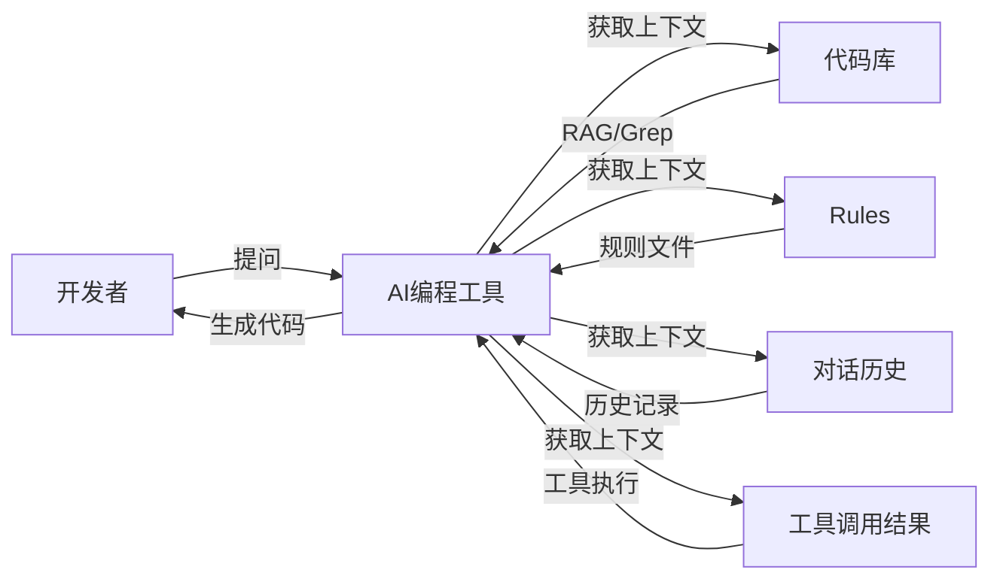

本来是想顺应部门的节奏分享一篇关于全栈基础知识的博客，但是最近涌现了很多五花八门不同形式的AI辅助编程工具（包括但不限于CodeX、Claude Code等），公司的MiCode也开始大范围推广并且取得了不错的效果，而且最近好像又开始鼓励AI方面的分享，想了想还是写一篇博客来表达我对各种AI工具的理解以及日常Vibe Coding的一些技巧。

在我看来，这些所有的AI工具大概可以归为三类，第一类是以GitHub Copilot为代表，第二是 Cursor（包含Trace、Windsurf等），第三是 Claude Code（Gemini CLI）。

虽然没有时间去体验市面上所有的 AI IDE，但我想这三个产品对于 AI 辅助编程而言还是有里程碑式意义的，也可以说我是积累了一些经验来谈一谈 Vibe Coding 的。

## 到底什么是Vibe Coding

Vibe Coding (中文翻译为氛围编程)这个名字是从 Andrej Karpathy（前特斯拉人工智能总监，OpenAI 的创始成员之一）的这条推特开始的。


原文：

> There's a new kind of coding I call "vibe coding", where you fully give in to the vibes, embrace exponentials, and forget that the code even exists. It's possible because the LLMs (e.g. Cursor Composer w Sonnet) are getting too good. Also I just talk to Composer with SuperWhisper so I barely even touch the keyboard. I ask for the dumbest things like "decrease the padding on the sidebar by half" because I'm too lazy to find it. I "Accept All" always, I don't read the diffs anymore. When I get error messages I just copy paste them in with no comment, usually that fixes it. The code grows beyond my usual comprehension, I'd have to really read through it for a while. Sometimes the LLMs can't fix a bug so I just work around it or ask for random changes until it goes away. It's not too bad for throwaway weekend projects, but still quite amusing. I'm building a project or webapp, but it's not really coding - I just see stuff, say stuff, run stuff, and copy paste stuff, and it mostly works.

基于原文的内容，我认为 Andrej Karpathy 对于 vibe coding 的定义有几个关键点：

1. forget the code even exists -> 忘记有代码的存在。
2. 几乎不手动参与编程，再小的错误也通过 AI 来修复而不是手动更改。
3. AI 写的代码不再 review，只看结果，不满意的话继续对话。
4. 对于一次性的项目来说，并不糟糕，并且相当有趣。

所以我理解 vibe coding 的意思从最开始是谈论一个新的编程方式，是一种完全基于 LLM 对话来编程的方式。

可能是因为 vibe coding 不好翻译或者没有明确意义的原因，感觉目前大家只要是通过 AI 工具来辅助编程，或者是通过 AI 来编写代码的方式，都统一称为 Vibe Coding 了。

但其实我个人认为目前AI并没有达到完全Vibe Coding的阶段（也就是不需要写任何代码并且不需要review）。我理解现在使用AI来进行代码撰写只能称为AI辅助编程或者Context Coding，也就是基于上下文编程。

当前这两种编程方式是有本质区别的，但是我还是想在谈论 vibe coding 之前，先来谈论一下基础的 AI 辅助编程方式。

## Context Coding

原因是我个人认为 AI 编程的进步，除了最重要的大模型的编程能力变强之外（例如模型从 GPT 升级到 Claude）还有一个重大的提升，不同 AI 编程工具的上下文工程（Context Engineering）能力更强了。



被大家广泛讨论的最强 AI 编程工具，基本上是从 GitHub Copilot 到 Cursor，再到 Claude Code，我认为这些产品成功的原因是上下文工程（Context Engineering）更加科学了。

在大模型不变的情况下，AI 辅助编程的所有提升都是基于给 LLM(大语言模型) 传递更合适的上下文这个基本原理展开的，无论是 Chat, RAG, Rules, MCP亦或是Claude code最近出的skills 还是未来更酷的一些其它技术。

所以我们以给 LLM 提供合适的上下文这个视角出发，先来剖析一下这些产品的特性，从中学习如何更好的使用 AI 来辅助编程。

### GitHub Copilot

相信大部分人最开始接触的 AI 辅助编程工具都是从 GitHub Copilot 开始的，除了集成 AI 对话功能外，给我印象最深刻的莫过于代码补全功能。

GitHub Copilot 最开始的成功在于，它是第一个将代码上下文共享给 LLM 的集大成者，主要体现在两个能力上：

第一个是可以将当前 IDE 打开窗口的代码提供给 LLM，并且可以针对当前窗口的代码进行提问并给出建议。

这在当时(2023年)是一个非常大的惊喜，因为当时大多数人都是将代码复制到 ChatGPT 中，然后从 ChatGPT 中复制代码到 IDE 中。

第二个是可以根据当前代码文件的上下文进行补全操作，Copilot 将光标所在位置的代码上下文提供给了 LLM，LLM 据此给出了建议。

基于这个Copilot的源流，我们写代码的时候就可以使用一个技巧：先写函数注释，让 Copilot 基于注释生成对应的函数，然后我再去修改方法的一些细节，这个模式大大加快了一些编码的速度。

但是在当时 Copilot 的缺点也非常明显，首先是模型能力不够，GPT 3.5在编程方面幻觉问题太严重，并且能够接受的上下文非常有限，所以在当时，实际全量接受 LLM 给出的建议和代码补全的概率非常有限。并且当时 Copilot+ GPT 3.5 还没有能够直接编辑代码的能力，需要手动从 LLM 给出的建议中复制代码。

还有一个是当时 Copilot 只能把当前打开的窗口的代码文件的上下文给到 LLM，所以 LLM 无法根据其它文件或者整个项目的上下文给出建议，这也是为什么GitHub Copilot没办法像Cursor那样，即使你跨越了不同的文件，也能提供精准的代码提示。

导致有时候你在一个代码文件中实现了一个方法，切换到另一个文件时，LLM 并没有那个方法文件的上下文，无法给出基于那个方法的调用补全。更别说如果一个编程任务要跨越几个文件进行共同检索和修改的话，在当时是无法想象的。

所以在这种情况下，提供更好上下文的 Cursor 就脱颖而出了。

### Cursor

在 Copilot 出现后，市场上出现了大量的 IDE 插件形式 AI 辅助工具，区别只是在 prompt 和 LLM 上优化而已。直到 Cursor 这种以完整 AI IDE 形式的工具出现，AI 插件辅助编程的竞争才告一段落。

> 这里闲聊一下和上下文工程无关的技术提升，第一是 Cursor 针对 Tab 自动补全能力设计了专有模型，给我最深的印象是速度非常快，并且非常精准，接受代码补全的概率相当高，当时有戏称程序员从 Copy 工程师变为了 Tab 工程师。第二是当时 Claude 3.5 Sonnet 模型的出现，比 GPT 模型拥有更强大的编程能力，加上上下文长度增加和直接编辑文件能力。可以说当时 Cursor Tab 模型加上 Claude 3.5 Sonnet 模型两个能力的叠加，从此让 AI 辅助编程从"代码补全工具"进化为了"编程智能体"。

Cursor相对于GitHub Copilot在方方面面都提升很多，例如可以直接让大模型编辑代码（也就是最初的Agent功能），但是我今天主要想讲的是Cursor 的上下文工程。

Cursor 在上下文工程的第一个关键突破就是使用 RAG(Retrieval Augmented Generation) 将项目整个 codebase 进行索引，并以语义(向量)搜索的方式给 LLM 提供整个项目的上下文。

如果你注意过的话，就会发现使用 Cursor 打开一个新的项目，在 Cursor Settings 的 Indexing 的设置中，Cursor 会开始索引你的整个项目，并且你可以看到目前索引了多少文件。


我们详细介绍一下这背后的原理。Cursor 的代码库检索是通过 Codebase Indexing 流程实现的，它其实就是在对整个代码仓库做 RAG，即将你的代码转换为可搜索的向量。

### Cursor RAG 的工作原理

在用户导入项目时，Cursor 会启动一个 Codebase Indexing 流程，这一步主要有 7 个步骤：

1. 你的工作区文件会与 Cursor 的服务器安全同步，确保索引始终最新。
2. 文件被拆分为有意义的片段，聚焦函数、类和逻辑代码块，而非任意文本段。
3. 每个片段使用 AI 模型转为向量表示，生成能捕捉语义的数学"指纹"。
4. 这些向量嵌入存储在专用的向量数据库中，支持在数百万代码片段中进行高速相似度搜索。
5. 当你搜索时，查询会用与处理代码相同的 AI 模型转为向量。
6. 系统将你的查询向量与已存储的嵌入向量进行比对，找到最相似的代码片段。
7. 你会获得包含文件位置和上下文的相关代码片段，并按与查询的语义相似度排序。

### 索引构建的详细流程

**项目初始化阶段：**

- 扫描项目文件夹，建立文件清单
- 计算Merkle树哈希值，用于后续变更检测
- 根据.gitignore和.cursorignore规则过滤文件
- 执行初始Merkle树同步到服务器

**增量同步机制：**

- 系统每10分钟执行一次变更检测
- 通过哈希值比较识别文件变更
- 仅上传发生变更的文件，实现增量同步

**服务器端处理：**

- 对同步的文件进行分块处理
- 计算文件内容的向量表示
- 并行存储到Turbopuffer数据库和AWS缓存


### 用户查询流程

**查询向量化：**

- 用户提交自然语言查询
- 本地计算查询的向量表示，捕获语义信息

**相似度搜索：**

- 使用Turbopuffer数据库进行最近邻搜索
- 基于向量相似度找到最相关的代码片段
- 返回混淆的文件路径和行号信息

**代码片段获取：**

- 客户端根据返回的路径和行号本地读取代码片段
- 确保获取的是用户环境中的实际代码内容

**AI答案生成：**

- 将代码片段上传到服务器
- AI模型结合用户查询和代码上下文生成最终答案


Turbopuffer 是基于对象存储从头构建的无服务器向量和全文搜索，如果你不太清楚向量搜索，你可以简单理解为语义搜索，可以搜索出意思相近的词。

### Merkle Tree 增量块验证

Cursor 的代码库检索是使用RAG实现的，在召回信息完整的同时做到了极致的检索速度，体验下来要比Claude Code 快很多。为了保证这一性能优势，需要在检索的每一个步骤都保持高速。

- **导入**：Indexing是离线的，核心是 Chunking & Embedding，一般在10分钟左右完成，与仓库总代码量有关。不过一次导入终生享受，这个时间成本并不影响体验；在indexing建立好之前，Cursor 会通过基础工具（比如grep）来进行代码检索，保证可用性。
- **查询**：query 的 embedding 和向量检索都是在线的，可以做到秒级。
- **增量导入**：因为我们的修改是实时的，且可能发生在任何阶段，所以需要一种能够快速判断"哪些代码是新增的 / 被更新了"的方法。

对于"增量导入"的部分，Cursor 实际使用了一种数据结构——Merkle Tree。实际上我们常用的版本控制工具Git的底层用的也是这种数据结构。

**什么是Merkle Tree：**

默克尔树（Merkle Tree）也叫哈希树，是一种树形数据结构：

- 叶子节点（Leaf Node）：每个叶子节点存储的是某个数据块的加密哈希值。
- 非叶子节点（Branch/Inner Node）：每个非叶子节点存储的是其所有子节点哈希值拼接后的哈希。


下面是一个 Merkle Tree 的简化示例：


**Merkle Tree 的作用：**

1. **高效验证**：要证明某个数据块属于这棵树，只需要提供从该叶子节点到根节点路径上的"兄弟节点"哈希值。验证复杂度为O(log n)，而不是O(n)。

2. **数据完整性保证**：只要根哈希（Merkle Root）保持不变，就能确保整个数据集未被篡改。任何底层数据的修改都会导致根哈希发生变化。

3. **增量同步**：通过比较不同版本的Merkle Tree，可以快速定位发生变化的数据块，实现高效的增量同步。


**Merkle Tree功能总结：**

- **高效完整性校验，防篡改**：每个对象都用哈希值唯一标识，任何内容变动都会导致哈希变化。只要根哈希（commit 哈希）没变，说明整个项目历史、内容都没被篡改。
- **高效对比和查找变更**：只需对比 tree 或 commit 的哈希，就能快速判断两次提交是否完全一致。递归对比 tree 结构，可以高效定位到具体变动的文件和内容。
- **高效存储与去重**：相同内容的文件或目录结构只存一份，极大节省空间。没有变动的部分直接复用历史对象，无需重复存储。

如果你想要对 embedding 和向量数据库有更多了解。可以查看我 2023 年的博客 [GPT 应用开发和思考](https://guangzhengli.com/blog/zh/gpt-embeddings) 和 [向量数据库](https://guangzhengli.com/blog/zh/vector-database)。

基于这种能力，Cursor 可以检索出和你当前对话相关的代码上下文，并一同提供给 LLM。这样 LLM 有了多个文件的上下文后，可以做到：

- 实现跨文件的方法调用
- 修复涉及多个文件的bug
- 重构整个模块
- 添加需要修改多处文件代码的新功能

在这个基础上，Cursor 也支持直接 @ 某个文件/文件夹来给 LLM 提供上下文，并且在后续加上了索引 Git 历史记录的能力。

从上下文工程的角度来讲，可以说 Cursor 比 Copilot 成功的地方在于，Cursor 给 LLM 提供了更全面的代码上下文，并且给了用户更自主控制上下文的能力。

除此之外，Cursor 在后续添加了文档的索引功能，可以帮助你给 LLM 提供最新的技术文档上下文。并且添加了 Rules 相关的功能，可以给 LLM 提供通用的编程规则，确保 LLM 生成的代码与你的项目架构、编码风格和技术栈保持一致。

这些功能无一例外都是为了给 LLM 提供更丰富、更合适的上下文而展开的，所以我更愿意称它为 Context Coding。

### Claude Code

在 Cursor 以各种优化上下文工程保持领先状态时，Claude Code 以一种完全意想不到的方式杀入了比赛。

虽然之前没有体验过终端命令行这种 AI 产品的形态，最开始产品发布的时候，我只是被 Unix 风格吸引，想要尝试一下。但是实际使用下来非常容易上手，并且编程效果不输给 Cursor，甚至部分情况下实际效果还要超越 Cursor。

实际测试编写 Next.js 程序，在中小型编程任务中，Claude Code 的效果和 Cursor 差不多，毕竟我两个工具通常情况下都是使用 Claude 4 sonnet 或者 Opus 模型，Cursor 在实际编程体验上还是要更便捷一点，因为还是会使用 command + K 或者 Tab 补全。

但在大型编程任务中，例如一次要检索修改超过 10 个文件的情况下，Claude Code 的编程效果远超 Cursor。我认为根本原因在于 Claude Code 给 LLM 提供上下文采用的是"量大管饱"的策略。

Cursor 因为是大模型基座提供商(例如 Claude)的下游产品，如果想要在商业领域取得成功，那么就需要在用户付费和实际 Tokens 的使用上取得平衡。所以有了很多引起程序员不满的调整模型速度、使用次数限制、自动引入低能力模型的各种骚操作。

与 Cursor 不同的是，Claude Code 由于本身是大语言模型基座提供商 Anthropic 的产品，在消耗 tokens 这件事上并没有那么畏手畏脚。

Claude Code 每次一上来就先通过终端命令开始分析代码库的项目结构和基本的技术栈信息，这与 Cursor 关注点在具体的任务和少数的代码文件中不同，Claude Code 以一种更全局的视角先分析项目整体情况，然后再开始开发。虽然这肯定是更加消耗 tokens ，但是有了这些项目整体信息后，Claude Code 编写的代码确实更加符合项目原本的开发模式和编码规范。

Claude Code 选择了一套和 Cursor 完全不同的检索代码上下文的方案，那就是基于 Unix 工具的检索方案。 例如使用 grep, find, git, cat 等等终端命令而不是 RAG 的方案。

> 这种方案一般来讲更加符合程序员的编程习惯，例如程序员在做某个编程任务时，如果不熟悉代码，一般会从某个关键方法名或者对象名称开始，一层一层的开始模糊搜索或者正则搜索。直到找全了业务相关的代码，再开始编程。

Claude Code 选择的就是这种上下文工程模式，在你提问之后，基于你的提问进行关键词不断检索，直到找到项目中所有需要的上下文代码，然后再开始编程，亦或者是一轮一轮的对话、编程和检索，一直重复这个过程，直到 LLM 认为找全了上下文。

### Claude Code 的模型调用机制

与 Cursor 类似，Claude Code 也有自己的一套模型调用提示词，准确来说，这是一套完整的上下文工程。这里面有用户环境、用户问题、系统提示词、工作过程管理（自动生成并按顺序执行TODO）等部分。

Claude Code 的系统提示词大致如下：

```
You are Claude Code, Anthropic's official CLI for Claude. You are an interactive CLI tool that helps users with software engineering tasks. Use the instructions below and the tools available to you to assist the user.
```

这套提示词设计体现了 Anthropic 对模型和用户体验的深度洞察，很多常见的痛点（比如生成太多单测、非最小范围修改）问题，已经被写进了 Claude Code 的系统提示词中。

Claude Code 选择这个和 Cursor RAG 不同的方案后，社区中有大量的争议出现。


RAG 一派认为 grep 方案的召回率低，检索出大量不相关的内容，不仅费 token，并且效率慢，因为 LLM 需要不断对话和不断检索新的上下文。

grep 一派则认为复杂的编程任务需要精准的上下文，而 RAG 的方案在代码检索的精度上，表现的并不佳，毕竟代码的语义相似度不等于代码关联的上下文，更不等于业务上下文。

并且像 Cursor 这种基于文件哈希值的 Merkle 树的索引更新同步的方案，在大量重构代码时，或者是索引服务器负载时，检索出来的是过时的代码，提供过时的上下文。

这两派的说法其实都是有道理的，Claude Code 在速度和 tokens 消耗上不如 RAG 方案，Cursor 在复杂任务下表现不如 Claude Code，体验下来我觉得也是事实。

但结合来看我觉得在大语言模型能力没有溢出的时代，可以先不考虑速度和 token 消耗的事情，毕竟最终能否解决某个工程问题才是当前最重要的事情，也是所有 AI 编程工具的第一目标。从这一方面来看，Claude Code 更符合选择。

当然，并不是说我完全同意 grep 的方案，我觉得在未来一段时间内，完整的 AI IDE 一定会提供 RAG + Grep 两种能力，在不同的情况下选择性使用，像 Cursor 一定会在 grep 方案上发力，而不是全依靠 RAG 的方案。

### 如何更好的 Context Coding

既然我们已经简单了解了不同 AI 产品的原理，那么应该如何更好地进行AI辅助编程呢？

既然 AI 辅助 Coding 的关键在于给 LLM(大语言模型) 传递更合适的上下文，那么有时候借鉴我们自己日常的开发思路其实能够更好地帮助我们理解：如何给 LLM 传递更好的上下文。

#### 合理利用上下文窗口

由于AI模型的上下文窗口存在容量限制，我们需要在有限空间内最大化信息价值。以下是一些实用的技巧：

**Action 1：进行清晰的问题描述**

在上面的原理部分，我们介绍了模型是如何进行代码库理解的（向量匹配、意图拆解后进行模糊搜索、调用链溯源等）。因此，在描述问题时，我们最好能给出具体的功能、文件名、方法名、代码块，让模型能够通过语义检索等方式，用较短的路径找到代码，避免在检索这部分混杂太多弱相关内容，干扰上下文。

**Action 2：把控上下文长度**

现在不少工具都支持上下文占用量展示，比如显示之前的对话占用的上下文窗口比例。超出这个比例之后，工具会对历史内容进行压缩，保证对话的正常进行。


但被压缩后的信息会缺失细节，所以建议大家在处理复杂问题时，采用上下文窗口大的模型/模式，尽量避免压缩。

**Action 3：尽可能地使用Revert和新开对话**

省上下文是一方面，维持上下文的简洁对模型回答质量提升也是有帮助的。因此，如果你的新问题跟历史对话关系不大，就最好新开一个对话。

在多轮对话中，如果有一个步骤出错，最好的方式也是回退到之前出错的版本，基于现状重新调整 prompt 和更新上下文；而不是通过对话继续修改。否则可能导致上下文中存在过多无效内容。

这里回滚在IDE类型的工具里操作很方便，点一下"Revert"按钮即可。不过如果使用的是 Claude Code 等 CLI 类型的工具，回滚起来就没有这么方便，可以考虑在中间步骤多进行commit。

**Action 4：给出多元化的信息**

我们不只可以粘代码、图片进去，还可以让模型参考网页、Git历史、当前打开的文件等，这些 IDE 类的工具支持的比较好，因为是在IDE环境里面，而CLI在终端中，限制就要多一些（但更灵活）。


#### 项目基础信息和编程规范

假如你需要进入一个新的项目组，你只有这个项目需要的技术和框架基础知识(LLM 也只有技术和框架基础)。

那么通常来讲你将代码库 clone 后，第一件事一般是先了解项目的技术栈有哪些，然后浏览代码库的目录结构，并试图理解大致的项目目录结构和分层，尝试了解每个类型的命名文件是干什么的。这些流程对我们日常了解一个新项目都非常有帮助。

所以我们给 LLM 提供的上下文，最好也包含代码库的大致技术栈(用了哪些技术栈和工具)，目录结构(项目结构和分层)和对应的文件是做什么的(文件命名及其含义)。

因为 LLM 默认每一个新的 session 都没有以往的记忆，缺少上述这些上下文，所以我们也最好将这些信息存到指令文件，或者叫规则文件中，例如 GitHub Copilot 的 `.github/copilot-instructions.md` 文件，Cursor 对应的 `.rulers` 文件夹和 Claude Code 的 `CLAUDE.md` 文件。MiCode的AGENT.md等

> 现阶段每个 AI Agent 都使用不同的规则文件命名，没有统一。所以如果你团队中同时使用多个 AI Agent，或者像我一样同时使用 Cursor / Claude Code 等工具，可以考虑采用 [Ruler](https://github.com/intellectronica/ruler) 这个开源项目来统一管理指令文件。

有了上述信息后，LLM 每次新的对话都能获取整体项目的基本上下文的信息再编程，这和我们一般先看这些信息，然后再去开发需求的习惯一致。

从这个角度出发，我们还能联想到更多项目基础上下文，例如常规开发时，除了我们了解上述的上下文之外，还会去看这个新项目的常用命令，例如 install packages, lint, test, build 等命令。包括还会去找工具类，查看有哪些公共的方法，新项目的核心业务模块，核心方法和核心文件分别在哪里，都是干什么的。有了这些信息我们才能更好地进行编程开发。

所以既然上述的信息对我们开发一个不熟悉的项目非常有帮助，那么理论上来讲它对于 LLM 大模型(可以简单理解为只有技术基础能力的实习生) 也就非常有帮助。

> 需要注意的是，这类上下文不是越多越好，特别是容易过时的上下文信息，例如文件目录、容易被重构的文件和工具类，一旦这些信息发生了改变，但是却没有同步到指令规则文件中，带来的危害比不提供这些上下文更大。这类文件如何维护更新是一个难题，特别对于大型团队项目来讲。

这个流程可以显著降低复杂任务下 LLM 的幻觉问题，我观察到 Claude Code 的 Coding 开发流程基本都使用这一套模式，实现上可能有些差别。

当然，像这一类成熟的开发思路和编程规范我们可以联想到更多：

- 渐进式的修改，小步提交
- 从现有的代码学习，找到2-3个类似的实现，尽可能使用相同的库/工具
- 代码让人看得懂比显摆技巧更重要
- 一个函数只解决一个问题，如果需要解释，那就太复杂了
- 没有充分理由，就不要引入新的工具

根据你的项目要求，和团队需要的编程规范，选择性的加入一些思路和规范到你的团队项目指令规则文件中，对 LLM 来讲也是非常有用的上下文。

> 当然，即使你将现在所有的编程规范和代码整洁之道加入到规则文件中，目前 LLM 也不太可能每次都写出抽象层次和健壮性足够好的代码，就我个人经验而言，想要 LLM 写好抽象还是太难了，可能用来训练的代码就没有太多写好抽象的代码吧。

除了项目基础信息和编程规范外，开发常用的工具和调试技巧对于 LLM 来讲也是好的上下文来源。

例如我们在日常开发中，如果需要调用某个第三方库或者最新的方法/API，最常见的就是访问他们的官方文档，然后查询最新的方法名字/API 路径等。对于 LLM 来讲也一样，训练的数据会过时，所以最好传入最新的文档给 LLM，我们可以通过 context7 等 MCP 来解决这个问题。

调试问题也是一样，你可以让 LLM 在有问题的代码的每一个角落都打上日志，模仿 IDE 的 debug 模式，这样可以让 LLM 获得足够多的调试信息输入，就像我们在 debug 模式中看到每一个方法的入参出参等一样。当然你也可以通过 MCP 等方式获取浏览器控制台日志、网络搜索回答等方式获取足够好的上下文给到 LLM。

讲到这里，相信大家也能明白，我举的这些例子，并不是想要说明上面的这些指令和规则文件是银弹，是能解决所有 AI 辅助编程的规则和指令。

而是想要表明，既然 AI 辅助编程的核心在于传递合适的上下文，那么我们在 LLM 效果不佳的时候，不如从我们常见和熟悉的开发思路和编程习惯入手，去思考如何传递更好的上下文给到 LLM。无论这个方式是 Rules，还是 MCP，一切围绕上下文工程这个目标展开。

像 Claude Code 这类的行业巨头，最近就内置了 `/context` 命令，可以非常直观的看到已经使用的上下文里面，不同类型工具的占比，包括还有多少剩余的上下文。


其实从这也能看出 Claude 团队对 Context Engineering 有深刻的理解，站在开发的角度来思考编程时应该如何管理上下文。

帮助你使用 LLM 的时候知道还剩余了多少 token，是否会随时触发压缩过程？是否需要提前压缩上下文？哪些提示词的 token 占比较大，可以帮助你了解和清楚 token 占用情况，例如是否有无效的 MCP 和工具占比过大的时候。

这应该是我见过第一个将 context 使用情况暴露给用户的 AI 工具，也是在上下文工程领域观察到不断进步的一个 AI 工具。

LLM 的提升和上下文工程之间的关系，就像之前内存硬件的提升和软件的内存控制管理不冲突一样，在 LLM 大模型和上下文容量都不容易提升的时候，谁提供的上下文更好，谁的上下文工程做的更好，更容易脱颖而出。这与 AI 编程无关，任何 AI 产品都如此。

## AI Coding个人技巧

### Token计算机制

了解 Token 计算机制有助于我们更好地理解 AI 编程工具的工作原理，以及如何优化我们的使用方式。

我们知道不同 model 都有不同大小的上下文，上下文越大的模型自然能接受更大的提问信息。在 AI 编程工具中，我们的任意一次聊天，大致会产生如下的 token 计算：

**初始 Token 组成：**

初始输入 = SystemPrompt + 用户问题 + Rules + 对话历史

其中：

- **用户问题**：我们输入的文字 + 主动添加的上下文（图片、项目目录、文件）
- **Rules**：project rule + user rule + memories

**工具调用后的 Token 累积：**

AI 编程工具接收用户信息后开始调用 tools 获取更为详细的信息，并为问题回答做准备：

总 Token = 初始输入 + 所有工具调用结果

**举个例子：**

假设用户粘贴了一段代码，以及一张相关图片，询问"这个函数有什么问题？"，然后 AI 需要调用工具来分析代码。

**初始Token组成：**

- SystemPrompt：约500 tokens（例如："你是一个专业的代码审查助手，能够分析代码问题并提供改进建议..."）
- 用户问题：约200 tokens（用户输入文字 + 代码 + 图片）
- Rules：约800 tokens（项目规则、用户规则等）
- 对话历史：约300 tokens

初始输入 = 500 + 200 + 800 + 300 = 1800 tokens

**工具调用后的Token累积：**

- 工具调用1：读取文件内容，约2000 tokens
- 工具调用2：代码搜索，约1500 tokens
- 工具调用3：语法检查，约300 tokens

工具调用结果 = 2000 + 1500 + 300 = 3800 tokens

**最终Token计算：**

总Token = 1800 + 3800 = 5600 tokens

这就是多轮对话后，LLM看到的实际上下文内容。理解这个机制有助于我们：

- 了解为什么某些操作会消耗更多 tokens
- 优化我们的提问方式，减少不必要的 token 消耗
- 理解上下文窗口限制的原因

### 提示词工程

> Garbage in, garbage out

AI 发展至今，提示词工程的效果逐渐弱化，AI IDE 和插件本身就自带好几千字甚至上万字的系统提示词，有时候自己附加提示词他甚至会无视（例如你很难让 Augment 不要写测试、文档，他总会自动写）。

角色扮演和思维链之类的提示词效果已经不明显，进入玄学的提升范畴。在 IDE 里现在比较好用的提示词应该基本只剩单样本和少样本提示词 (One-Shot & Few-Shot)。

还有一个流派是给 IDE 设定一堆 [Rule 提示词](https://github.com/steipete/agent-rules)：

- [commit.mdc](https://github.com/steipete/agent-rules/blob/main/project-rules/commit.mdc)
- [check.mdc](https://github.com/steipete/agent-rules/blob/main/project-rules/check.mdc)

又或者 [Kiro](https://github.com/heihuzicity-tech/ClaudeCode-Kiro-Workflow) 搞的那套：

- 阶段 1：需求澄清，将模糊想法转化为结构化需求文档
- 阶段 2：设计与研究，基于需求开发综合设计方案
- 阶段 3：任务规划，基于需求和设计创建可执行的实施计划
- 阶段 4：任务执行，按照 SPECS 文档执行实施任务

我曾经做过一次完整的流程，检查需求文档耗费精力，做一堆任务耗费时间也耗费 Token，结果没有特别好。kiro 自动生成的 task，最后几步可能会搞些看起来很高级的优化，但实则不推荐，本着能用就行的原则，一路上只要你觉得代码符合你的审美，最后的优化可能是过度优化。

总结下来，就是**提示词优先提供信息型的内容，而不是指令型的内容**。

### Vibe Coding 的迭代速度

说到 vibe coding，最让我震撼的其实不是模型有多智能或者是能完成什么尖端任务，而是由它带来的产品迭代速度的提升。有个有意思的现象：Claude Code 本身就是 Anthropic 内部 dogfooding 的产物：从六月中旬我开始使用到现在，短短一个半月时间里，我们见证了很多崭新的功能：自定义命令让我们避免重复输入一样的 prompt，[Hooks](https://code.claude.com/docs/zh-CN/hooks) 功能可以在各种事件触发时自动执行命令，Subagent 则解决了上下文窗口的限制问题。这种更新频率，放在传统软件开发时代简直是天方夜谭。

不光是 CC，整个 AI 辅助开发领域都在以令人眩晕的速度前进。几天甚至几小时完成一个产品，不再是不可能的任务。

说实话，有时候我会怀念那个慢工出细活的年代。但现实就是这样，技术的车轮滚滚向前，你要么跟上，要么被碾过。去适应和利用它，而不是被裹挟前进，可能才是新时代的立命之本。如果这篇文章你只能记住一句话，那我希望是这句：**在 vibe coding 时代，千万别让工具把自己逼死。**效率是提高了，但人还是人，我们需要的不仅仅是更快的开发速度，还有思考的时间和生活的空间。

### 从传统 Editor AI 的转换

在投身 CC 之前，我也算是各种 AI 编辑器的老用户了。从最早期的 Cursor，到后来的 Windsurf，再到 GitHub Copilot 和各种 VS Code 插件如 Cline，基本上市面上叫得出名字的我都试过。但说实话，这些 Editor AI 工具并没有像 CC 这样给我带来那么大的冲击和震撼。

我想，这类编辑器工具最大的问题可能是**缺少全局感**。想象一下你使用这些编辑器 AI 时的经典场景：打开一个文件，选中几行代码，然后让 AI 帮你改改。这种交互模式天然就把开发者的思维框在了**当前文件**甚至**当前这几行**的范围内。这种模式对于刚从传统编程过渡到 AI 辅助编程的开发者来说，确实是个不错的起点。毕竟，你还保留着对代码的掌控感：AI 写得不好？没关系，我随时准备自己上。但问题是，如果你真的想进入深度的 vibe coding 状态，让 AI 发挥最大潜力，这种随时准备接管的心态反而会成为阻碍。人类开发者的干预时机和直接下场写代码的时候越少，最终呈现出的效率和效果反而越好。

另外更致命的是同步问题：AI 在上下文中认为文件是 A 状态，实际文件已经被开发者插手改成 B 状态了，然后你让 AI 基于它的认知继续修改，结果可想而知：要么产生混乱，要么 AI 需要再读一遍所有内容。有时候光是解决这种不同步带来的问题，花的时间就比写代码还多。

而命令行工具从理念上就不同：没有华丽的界面，没有实时的代码提示，开发者在过程中难以直接插手“微调”。但恰恰是这种简陋，反而让它能够更深入地理解和操作整个项目。它不会被某个文件或某几行代码限制视野，而是从项目的根目录开始，建立起对整个代码库的认知。没有了编辑器这个中间层，开发者想直接修改代码变难了，这在某种程度上“强迫”你更多地依赖和使用 AI，给它更多信息和反馈，这反而能发挥出更大的效能。

当然，我不是说编辑器 AI 就一无是处。本质上，当前两者的差异更多来自于使用方式和模型质量，而非架构设计。CC 背靠 Anthropic 这棵大树，模型质量自然没得说。更关键的是，它可以肆无忌惮地使用 token（虽然最近加了 weekly 限制），这种量大管饱的豪横，确实在末端引起了质变，让最终效果好了不止一个档次。如果让编辑器 AI 也能随便烧 token，可能效果未必会差到哪里去。

但现实就是现实，至少在当下，如果你想体验真正的 vibe coding，CC 可能是唯一选择。

### 认识 CC 的边界和长处

就像所有工具一样，CC 或者说 AI 辅助编程，也有自己擅长和不擅长的领域。认清这些边界，才能让你的 vibe coding 之旅更加顺畅。

如果你让 CC 分析一段复杂的代码逻辑，理解各个模块之间的调用关系，然后画一张时序图或者架构图，它会完成得相当出色。这种需要理解和总结的任务，正是 LLM 的看家本领。又或者，你想快速实现一个算法、搭建一个项目框架、编写测试用例，CC 都能给你满意的答案。

但是，千万别指望它在所有场景下都能大杀四方。比如说，你想在整个代码库里做一次全局的变量重命名，或者进行某些需要精确匹配的复杂重构，那老老实实用 IDE 的重构功能会靠谱得多。LLM 毕竟说到底也只是一个概率生成器，**这类需要 100% 准确性的任务，从起源上就不是 LLM 的强项**。如果你真的需要使用 AI 帮助完成这类任务，那么请它写一段脚本去执行并修改代码，往往会比直接指挥它去修改文件，要来的靠谱。

市面上也存在着其他不少基于命令行的 code agent，像是 Crush，Gemini CLI 等等。但实测下来，它们现在和 CC 还存在很大差距。CC 作为“软硬件一体”解决方案带来了巨大的优化空间：Anthropic 既是模型提供方，又是工具开发方，这种垂直整合让他们可以针对具体使用场景进行深度优化。这就像苹果的生态系统——当你同时控制硬件和软件时，能做到的事情远超各自为战的组合。其他竞品要么受限于模型能力，要么受限于工具设计，很难达到 CC 这种浑然一体的使用体验。

### 思考先行还是实践先行

CC 提供了一个很有意思的功能：Plan Mode。在这个模式下，你可以先和 AI 进行充分的讨论，制定详细的实施计划，然后再开始实际的编码工作。这就引出了一个有趣的话题：我们是应该追求先想清楚再动手，还是先动手搞出东西来之后再慢慢改？

在传统软件开发领域，这个争论也由来已久。瀑布派说要先设计后实现，敏捷派说要快速迭代。到了 AI 时代，这个问题又有了新的含义。

我见过两种极端的使用方式。第一种是“规划魔”：进入 Plan Mode 后，和 AI 讨论个把小时，上下文用光两三次，从架构设计到具体实现，从错误处理到性能优化，事无巨细地规划每一个细节。等到真正开始写代码时，基本上 AI 就是照着计划一步步执行。另一种则是“莽夫流”：上来就是一句“给我实现一个 XXX 功能”，然后就看着 AI 噼里啪啦地写代码，写完了发现不对再改，改完了又发现新问题，如此循环往复。

哪种方式更好？也许乍看下来先规划再执行更好？但我的答案可能会让你失望：要看情况。

如果你是个经验丰富的开发者，对项目架构已经有了清晰的认识，那么先进行充分的规划确实能让后续的实现更加顺畅。特别是对于那些需要遵循特定架构模式的既有项目，Plan Mode 能帮你确保 AI 生成的代码符合项目规范。我自己就经常在 Plan Mode 里和 AI 讨论：“我们的项目使用了 MVVM 架构，新功能应该怎么拆分到各个层？” “这部分内容已经有类似实现了，你需要参考现有实现和模式”， 这种讨论能让 AI 更好地理解项目的整体结构，生成的代码质量更高，开发者对具体代码的掌控也更好。

但如果你对某个技术栈完全不熟悉，或者正在做一个全新的探索性项目，那么“先干起来”可能反而是更好的选择。这种情况下，很多时候你根本不知道自己不知道什么。所以与其空想，不如让 AI 先写个原型出来，跑起来看看效果，发现问题再迭代。这种方式特别适合那些“短平快”的项目，或者你只是想快速验证一个想法。

我个人的偏好？我更喜欢先进入 Plan Mode，和 AI 讨论后再开始实施。对我来说，日常维护已有代码库的工作是占大头的，我需要更稳定和可靠的迭代，先 plan 有利于我掌控全局。但在接触新技术栈时，我也不太愿意直接莽起来。不同技术栈下，很多开发的理念是共通的：如何组织可维护的架构（不仅为了人类，也为了 AI 今后进行维护，合理的组织结构还是必要的），如何调度和安排代码以保证高效，各个模块的连接方式等。就算是新技术栈，适当的讨论相比无脑梭哈，也提供了一种更有效的学习方式。但是这样做的代价是慢，如果着急上线功能，或者写的是可以无视代码质量的"快消品"，那么事无巨细的 plan 可能就不太适用了。

最后想说的是，Plan Mode 还有个隐藏的好处：它能帮你整理思路。有时候你觉得自己想清楚了，但真要说出来或者写下来，才发现还有很多细节没考虑到。和 AI 的对话过程，其实也是一个自我梳理的过程。这算是“橡皮鸭调试法”的变种，在 vibe coding 时代依然很有价值。

Claude Code 的 Best practices [官方博文](https://www.anthropic.com/engineering/claude-code-best-practices)中介绍了几种常见的 workflow，比如：

- 探索，计划，编码，提交
- 编写测试，提交，编码，迭代，提交
- 编写代码，截图，迭代

相比于直接用 prompt 命令 CC 开始干活，先指导它对代码库的现状进行理解，往往会得到更好的结果。参考这些常见 workflow 并逐渐发展出自己的使用 AI 的 style，也是一种成长。

### 小步迭代还是放飞自我

在手工编程时代，一天能写几百行代码就算是高产了。但 vibe coding 彻底改变了游戏规则：现在，你可以在十几分钟内生成上千行代码，甚至一口气完成整个项目。这种“生产力爆炸”带来了一个新问题：我们应该如何使用这种能力？

我见过的使用方式大致分两派。一派是“小步快跑”：每次只让 AI 完成一个小功能，验证没问题后再进行下一步。另一派是“一步到位”：直接把整个需求扔给 AI，让它一次性生成所有代码。更极端的，还有人会开启 `--dangerously-skip-permissions` 模式（也就是所谓的 yolo 模式），让 AI 可以不经确认就执行任何操作。

两种方式我都深度尝试过，结论是：**如果能选，小步迭代往往总是更好的选择**。

举个例子，有次我想重构一个模块，大概涉及七八个文件的修改。我当时想，既然 AI 这么厉害，那让它一次性搞定吧！于是我详细描述了需求，然后就看着 CC 开始疯狂输出代码。几分钟后，上千行代码的修改完毕，编译也通过了。我心想：这也太爽了吧！

然而，实际开始尝试时，噩梦开始了。首先是一个小 bug，因为上千行的修改肯定是懒得看的，所以只能描述情况，让 AI 去修复；修复过程中又引入了新问题；再修复，又有新问题…几轮下来，代码库已经面目全非。由于一次性改动太多，开发者失去了掌控，对于修改不理解，也就无法辨别哪些修改是必要的，哪些又是 AI 为了修复新 bug 临时加上的。最后的结果，往往只能是 git reset 整个修改，重新开始。

这类经历让我明白了一个道理：AI 生成代码的能力很强，但它对整体架构的把握和长期维护的考虑还是有限的。一次性生成太多代码，就像是在黑暗中狂奔——你可能跑得很快，但也可能一头撞上墙。而且，当出现问题时，调试的复杂度会呈指数级增长。

相比之下，小步迭代的好处显而易见：

1.  **可控性高**：每次只改动一小部分，出问题了也容易定位和回滚。
2.  **能够理解**：你能跟上 AI 的思路，理解每一步在做什么。
3.  **质量保证**：可以在每一步后进行测试，确保代码质量。
4.  **学习机会**：通过观察 AI 的实现方式，你也能学到新东西。

当然，我不是说“放飞自我”就完全不可取：在进行新功能实现时，如果已经进行了充分讨论和规划，那么确实不太需要人类的监督，CC 就可以完成大部分工作。如果你真的想尝试“放飞自我”的开发方式，我有几个建议：

1.  **必须有完善的测试**：采用 TDD 的方式，先写测试（当然这也是 AI 来写），再让 AI 实现功能。这样至少能保证基本的正确性。
2.  **做好版本控制**：在开始之前创建新分支，随时准备回滚。
3.  **分模块进行**：即使要一次性完成很多功能，也尽量按模块来组织，不要把所有东西混在一起。
4.  **交叉评审**：AI 生成的代码看起来能跑，但可能隐藏着各种问题，对于生成的代码，不要照单全收。最简单的方式，就是找到另一个 AI，将变更喂进去，看看有什么需要改进的地方，这种迭代往往能收获不错的结果。

### 任务规模和上下文制约

人类和 AI 在某个方面惊人地相似：处理小任务时游刃有余，面对大项目就容易手忙脚乱。对 CC 来说，这个问题更加明显，因为它还要面对一个硬性限制——200k 的上下文窗口。在当前动辄模型给 1M 窗口的年代，这个限制又是确实相当痛苦。

体感上来说，普通使用个十几二十分钟，你就会看到上下文使用量飙到 90% 以上。这时候 CC 就像一个塞满东西的行李箱，再想往里装点什么都困难。更糟糕的是，如果在执行任务的过程中触发了自动压缩，整个 agent 可能会陷入混乱，忘记自己在做什么，或者陷入死循环重复做一件事。

所以，如何在有限的上下文窗口内完成复杂任务，就成了使用 CC 的一门必修课。

#### 任务拆解是关键

与其给 AI 一个笼统的“帮我完成 XXX 系统”的需求，不如先把大任务拆解成具体的小任务。这一步最好在 Plan Mode 中进行，让 AI 帮你一起梳理。比如：

```
我：我想实现一个用户认证系统，帮我拆解需求
AI：好的，让我们拆解一下需要完成的任务：
1. 设计数据库表结构（用户表、会话表等）
2. 实现注册功能（验证、加密、存储）
3. 实现登录功能（验证、生成 token）
4. 实现中间件（验证 token、刷新机制）
5. 添加测试用例
...
```

对于一个 session 难以完成的任务，可以让 AI 把讨论内容进行文档化，保存到项目里（比如 `dev-note/auth-implementation-plan.md`）。这样，即使换了新的 session，你也可以让 AI 读取这个文档，快速恢复上下文。

#### 使用 Subagent

CC 最近推出的 Subagent 功能在一定程度上缓解了这个问题。在以前，当 CC 使用 Task 工具进行任务时，实际上是在一个全新的上下文中进行工作。这相当于扩展了主 Session 的上下文窗口。

以前我们只能通过 prompt 技巧来“诱导”CC 使用 Task 工具，效果时好时坏。现在有了专门的 subagent 配置，稳定性大大提升。你可以为不同类型的任务创建专门的 agent：

- 代码分析 agent：专门负责理解现有代码结构
- 代码审查 agent：检查代码质量和潜在问题
- 测试 agent：编写和运行测试用例
- Git agent：处理代码提交和 PR

通过合理链式调用这些 agent，即使是大型任务也有机会能在同一个 Session 里有条不紊地完成。每个 agent 都在独立的上下文中工作，不会相互干扰，也不会耗尽主 session 的上下文。

#### 在合适的时机手动 compact

虽然 CC 会自动进行上下文压缩，但我的经验是：主动出击会更好。当你看到上下文使用量接近用满时，不妨手动执行 `/compact` 命令。这可以让压缩发生在一个更自然的断点进行。比如刚完成一个功能模块，或者刚跑完一轮测试。这时候压缩，AI 不太会丢失重要信息。而如果等到自动压缩，可能正好在你改代码改到一半的时候触发，那就很容易出问题。

另一个技巧是：对于相对独立的任务，干脆新开一个 session。反正你已经把任务计划文档化了，新 session 读取文档就能快速上手。这比在一个快要爆炸的 session 里硬撑要明智得多。

当前在 AI 辅助编程中，上下文窗口依然是稀缺资源，要像管理内存一样管理它。合理规划、及时清理、必要时“换个房间”，才能让 vibe coding 的体验保持流畅。

### 善用命令和周边工具

#### Command 和 Hooks

我有个暴论：**凡是重复了两次以上的类似 prompt 都应该用命令来表述！**

每次都输入类似的 prompt 真的非常无趣：“运行测试并修复失败的用例”、“提交代码时请使用规范的 commit message”…如果你发现自己在重复类似的请求，立刻停下来，花一分钟配置一个 command。

Command 相比 subagent 有个巨大的优势：它拥有完整的当前会话上下文。如果你的任务和当前正在进行的工作高度相关，那么 command 的效率会更高。比如我常用的几个：

- `/test-and-fix`：运行测试，如果有失败自动尝试修复
- `/review`：对当前修改进行代码审查，给出改进建议
- `/commit-smart`：分析改动，生成合适的 commit message 并提交

至于 Hooks，说实话我用得不多。理论上它能在特定事件触发时自动执行命令，比如每次提交前自动运行测试。但实际使用中，我更喜欢保持一定的控制权，不太喜欢太多自动化的东西在背后悄悄运行。不过这纯属个人偏好，如果你的工作流比较固定，Hooks 确实能省不少事。

#### MCP

通过 [MCP](https://onevcat.com/2025/02/mcp/) 补充模型不知道的知识。我最常用的几个场景：

**1\. 最新的 Apple 文档**

Apple 的文档页面大量使用 JavaScript 渲染，因此 CC 的 WebFetch 抓不到内容。但通过 [apple-docs-mcp](https://github.com/kimsungwhee/apple-docs-mcp)，我可以获取最新最准确的 API 文档。这对 iOS 开发来说简直是救命稻草。

**2\. 项目管理集成**

通过 [mcp-atlassian](https://github.com/sooperset/mcp-atlassian) 连接 JIRA，可以让 CC 直接读取和更新任务状态，或者自动将分析的情况和实现进行回复，保持沟通畅通。

**3\. LSP 支持**

CC 暂时还原生支持 LSP，但通过 [mcp-language-server](https://github.com/isaacphi/mcp-language-server)，可以获得准确的代码补全和类型信息。特别是对于那些 CC 不太熟悉的语言，这个功能价值巨大。

配置 MCP 可能需要一点时间，但绝对物有所值。它让 CC 从一个通用的工具变成了为你量身定制的助手。

#### 编译、分析和测试

永远记住：AI 生成的代码，未经测试都是废品。

我的工作流程通常是这样的：

1.  在 CLAUDE.md 中详细列出项目的编译命令、测试命令、linter 配置
2.  每完成一个小功能，立即编译
3.  编译通过后，运行相关测试
4.  测试通过后，运行 linter 和 formatter

听起来很繁琐？其实配置好之后，这些都可以通过简单的命令和 subagent 完成。关键是要让这些步骤成为习惯，而不是等全部写完再说。

如果你的项目支持 TDD，那就更好了。先让 AI 根据需求写测试，然后再实现功能。这样生成的代码质量通常会高很多，因为 AI 有了明确的目标。

当然，根据编译器的废柴程度（你们大概应该知道我在说谁..）和项目的规模，编译一次的时间代价可能会很大。这种情况下，我会拆分模块，尽量只去编译改过的模块。如果这比较困难，那么也可以使用 `git worktree` 来创建多个工作目录：这样你可以让多个任务并行进行，互不干扰，也算是弥补等待编译所带来的时间损失。

#### Code 之外，大有可为

别把 CC 只当成写代码的工具，它的能力远不止于此。

我现在的日常使用场景：

- 代码提交和 PR：写完代码后，直接让 CC 分析改动、生成 commit message、推送代码、创建 PR。它生成的 PR 描述往往比我自己写的还要清晰。
- 撰写技术文档和 wiki: 让 CC 分析代码生成 API 文档、更新 README、编写使用示例。它的文档往往更加规范和完整，甚至不会出现语法错误。
- JIRA 更新：完成任务后，让 CC 更新 ticket 状态、添加评论回复用户、甚至创建新的子任务。再也不用在网页上点来点去了。
- 数据处理：需要批量处理文件、转换格式、清洗数据？以前我会写脚本，现在直接描述需求让 CC 来做。而且每次需求不同时，不用维护一堆一次性脚本了。

更有意思的是 CC 解锁了随时随地工作的可能性。通过像是 [VibeTunnel](https://vibetunnel.sh/) 或者任意手机 SSH 客户端，配合 Tailscale，我可以在任何地方连接到家里的工作机器，用手机指挥 CC 干活。虽然不适合与 CC 进行复杂的计划和交互，但处理一些简单的需求，比如跑个脚本、修个小 bug，更新下文档什么的，是完全没问题的。出门在外突然想到什么，立刻就能实现，这种感觉很奇妙。

最后，回到文章开头的那句话：在 vibe coding 时代，千万别让工具把自己逼死。技术是为人服务的，不是相反；工作是让人有机会追寻和思考自我的，而不是让自己迷失。保持这份清醒，可能比掌握任何具体的技巧都更重要。
