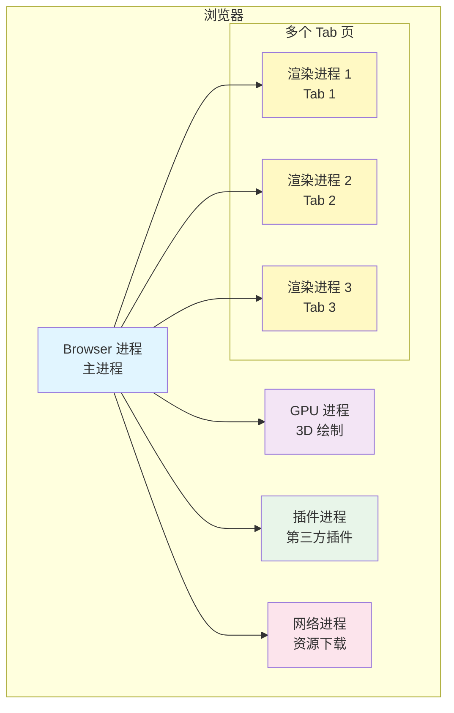
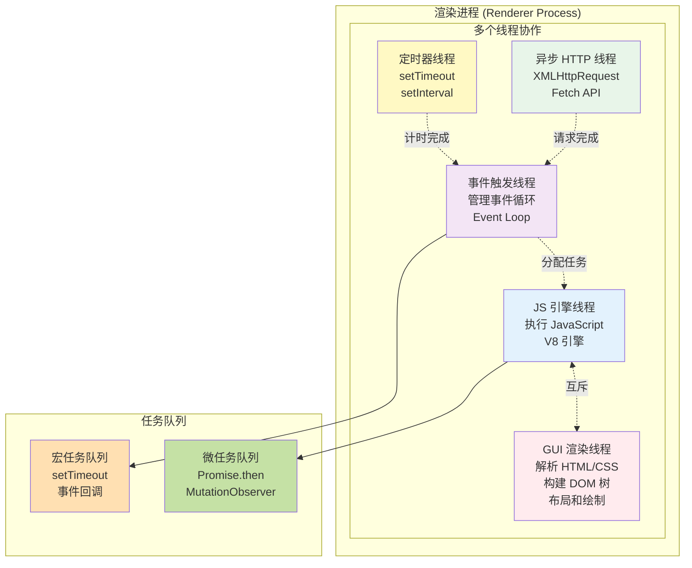
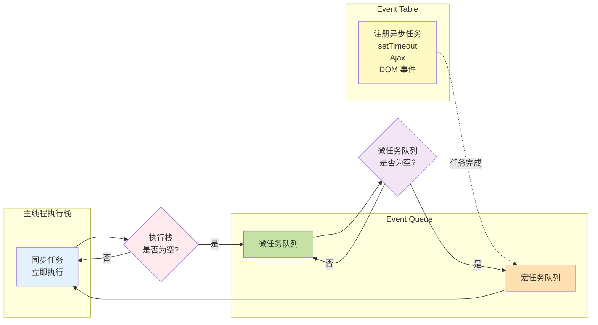
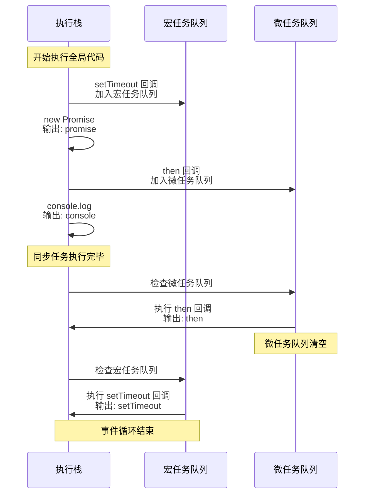
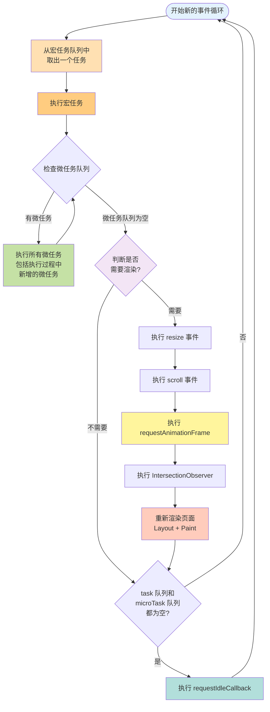
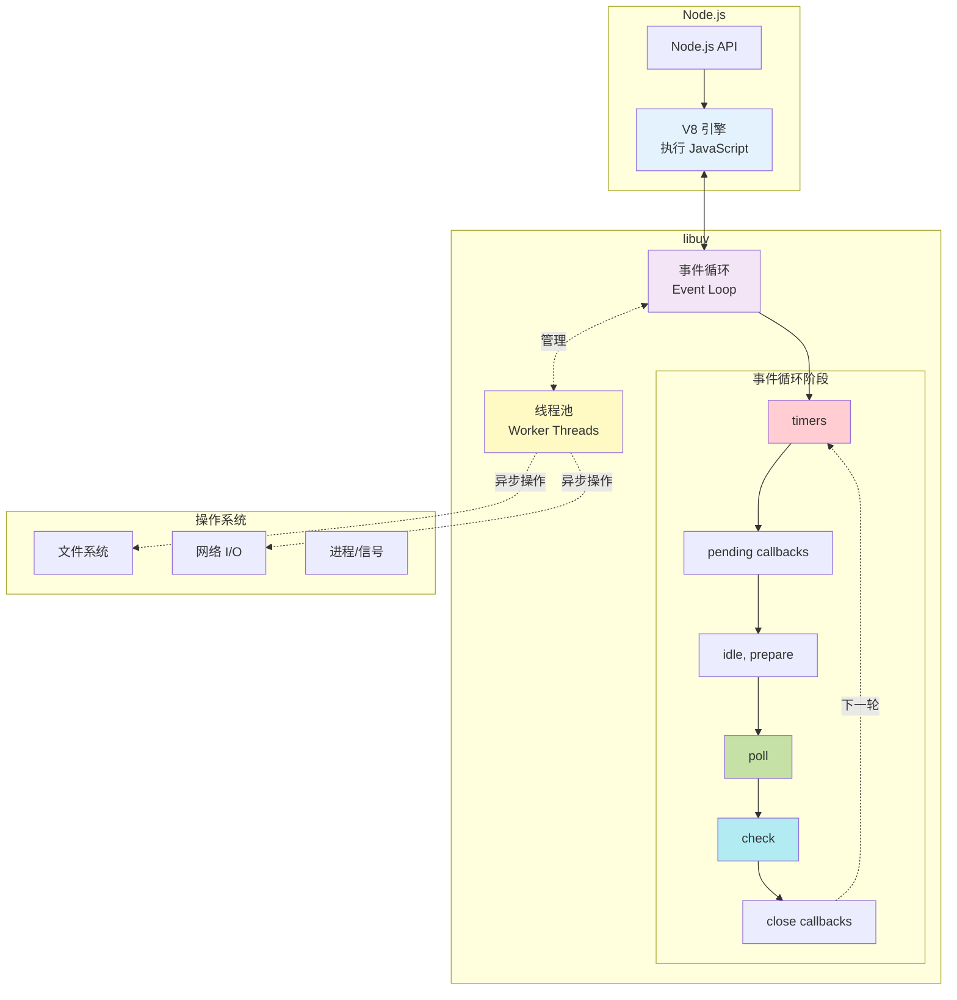
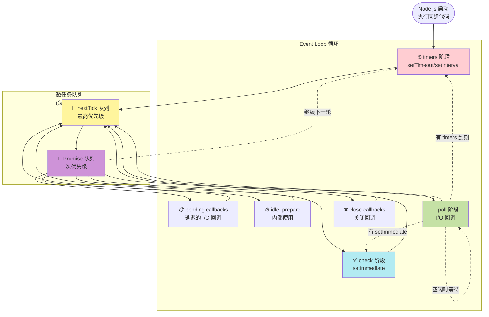

## 前言

> JavaScript 在设计之初是作为浏览器脚本语言，主要用于与用户进行页面交互和操纵 DOM。因此，为避免由不可预测的用户操作可能带来的复杂的并发问题，JavaScript 只能设计成单线程的，这也是这门语言的核心特征之一。

关于 Event Loop 的文章很多，但是有很多只是在讲「宏任务」、「微任务」，我先提出几个深入的问题：

1. 每一轮 Event Loop 都会伴随着渲染吗？
2. `requestAnimationFrame` 在哪个阶段执行，在渲染前还是后？在 `microTask` 的前还是后？
3. `requestIdleCallback` 在哪个阶段执行？如何去执行？在渲染前还是后？在 `microTask` 的前还是后？
4. `resize`、`scroll` 这些事件是何时去派发的？
5. GUI 渲染线程与 JS 引擎线程为什么互斥？

这些问题并不是刻意想刁难你，如果你不知道这些，那你可能并不能在遇到一个动画需求的时候合理的选择 `requestAnimationFrame`，你可能在做一些需求的时候想到了 `requestIdleCallback`，但是你不知道它运行的时机，只是胆战心惊的去用它，祈祷不要出线上 bug。

本文将从**浏览器进程线程模型**开始，深入到**事件循环机制**，再到 **Node.js 事件循环**，从头到尾系统地梳理一遍，形成完整的知识体系。

---

## 一、浏览器多进程架构

### 1.1 进程与线程的区别

在深入事件循环之前，我们需要先理解进程和线程的概念：

**形象的比喻：**

- **进程**是一个工厂，工厂有它的独立资源
- 工厂之间相互独立
- **线程**是工厂中的工人，多个工人协作完成任务
- 工厂内有一个或多个工人
- 工人之间共享工厂的空间

**更准确的理解：**

- 工厂的资源 → 系统分配的内存（独立的一块内存）
- 工厂之间的相互独立 → 进程之间相互独立
- 多个工人协作完成任务 → 多个线程在进程中协作完成任务
- 工厂内有一个或多个工人 → 一个进程由一个或多个线程组成
- 工人之间共享空间 → 同一进程下的各个线程之间共享程序的内存空间（包括代码段、数据集、堆等）

**官方定义：**

- **进程**是 CPU 资源分配的最小单位（是能拥有资源和独立运行的最小单位）
- **线程**是 CPU 调度的最小单位（线程是建立在进程的基础上的一次程序运行单位）

**重要提示：**

- 不同进程之间也可以通信，不过代价较大
- 现在通用的叫法：**单线程与多线程**，都是指**在一个进程内**的单和多

### 1.2 浏览器的多进程架构

现代浏览器（如 Chrome）采用**多进程架构**，主要包含以下进程：

#### 1.2.1 Browser 进程（浏览器主进程）

- 浏览器的主进程，**只有一个**
- 负责浏览器界面显示，与用户交互（如前进、后退等）
- 负责各个页面的管理，创建和销毁其他进程
- 将 Renderer 进程得到的内存中的 Bitmap，绘制到用户界面上
- 网络资源的管理、下载等

#### 1.2.2 第三方插件进程

- 每种类型的插件对应一个进程
- 仅当使用该插件时才创建

#### 1.2.3 GPU 进程

- 最多一个
- 用于 3D 绘制等

#### 1.2.4 渲染进程（浏览器内核）

- 默认每个 Tab 页面一个进程，互不影响
- 主要负责页面渲染、脚本执行、事件处理等
- **这是本文的重点关注对象**

> **验证方式：** 打开 Chrome 的 `任务管理器`（菜单 → 更多工具 → 任务管理器），可以看到多个进程

**强化记忆：在浏览器中打开一个网页相当于新起了一个进程（进程内有自己的多线程）**

#### 浏览器多进程架构图



### 1.3 浏览器渲染进程的多线程

**渲染进程是多线程的**，主要包含以下常驻线程：

#### 1.3.1 GUI 渲染线程

- 负责渲染浏览器界面，解析 HTML、CSS，构建 DOM 树和 RenderObject 树，布局和绘制等
- 当界面需要重绘（Repaint）或由于某种操作引发回流（Reflow）时，该线程就会执行
- **注意：GUI 渲染线程与 JS 引擎线程是互斥的**，当 JS 引擎执行时 GUI 线程会被挂起，GUI 更新会被保存在一个队列中等到 JS 引擎空闲时立即被执行

#### 1.3.2 JS 引擎线程

- 也称为 JS 内核，负责处理 JavaScript 脚本程序（例如 V8 引擎）
- JS 引擎线程负责解析 JavaScript 脚本，运行代码
- JS 引擎一直等待着任务队列中任务的到来，然后加以处理
- **一个 Tab 页（renderer 进程）中无论什么时候都只有一个 JS 线程在运行 JS 程序**
- **注意：GUI 渲染线程与 JS 引擎线程是互斥的**，所以如果 JS 执行的时间过长，会造成页面的渲染不连贯，导致页面渲染加载阻塞

#### 1.3.3 事件触发线程

- 归属于浏览器而不是 JS 引擎，用来控制事件循环
- 当 JS 引擎执行代码块如 `setTimeout` 时（也可来自浏览器内核的其他线程，如鼠标点击、AJAX 异步请求等），会将对应任务添加到事件线程中
- 当对应的事件符合触发条件被触发时，该线程会把事件添加到待处理队列的队尾，等待 JS 引擎的处理
- **注意：由于 JS 的单线程关系，所以这些待处理队列中的事件都得排队等待 JS 引擎处理（当 JS 引擎空闲时才会去执行）**

#### 1.3.4 定时触发器线程

- 传说中的 `setInterval` 与 `setTimeout` 所在线程
- 浏览器定时计数器并不是由 JavaScript 引擎计数的（因为 JavaScript 引擎是单线程的，如果处于阻塞线程状态就会影响计时的准确）
- 因此通过单独线程来计时并触发定时（计时完毕后，添加到事件队列中，等待 JS 引擎空闲后执行）
- **注意：W3C 在 HTML 标准中规定，要求 setTimeout 中低于 4ms 的时间间隔算为 4ms**

#### 1.3.5 异步 HTTP 请求线程

- 在 XMLHttpRequest 连接后是通过浏览器新开一个线程请求
- 将检测到状态变更时，如果设置有回调函数，异步线程就产生状态变更事件，将这个回调再放入事件队列中，再由 JavaScript 引擎执行

#### 渲染进程多线程架构图



### 1.4 为什么 GUI 渲染线程与 JS 引擎线程互斥？

由于 JavaScript 是可操纵 DOM 的，如果在修改这些元素属性同时渲染界面（即 JS 线程和 UI 线程同时运行），那么渲染线程前后获得的元素数据就可能不一致了。

因此为了防止渲染出现不可预期的结果，浏览器设置 **GUI 渲染线程与 JS 引擎为互斥的关系**，当 JS 引擎执行时 GUI 线程会被挂起，GUI 更新则会被保存在一个队列中等到 JS 引擎线程空闲时立即被执行。

**这也解释了为什么 JS 执行时间过长会阻塞页面加载。**

### 1.5 WebWorker 与 JS 多线程

前文中提到 JS 引擎是单线程的，而且 JS 执行时间过长会阻塞页面，那么 JS 就真的对 CPU 密集型计算无能为力吗？

所以，HTML5 中支持了 `Web Worker`。

**MDN 的官方解释：**

> Web Worker 为 Web 内容在后台线程中运行脚本提供了一种简单的方法。线程可以执行任务而不干扰用户界面。

**理解 Worker：**

- 创建 Worker 时，JS 引擎向浏览器申请开一个子线程（子线程是浏览器开的，完全受主线程控制，而且不能操作 DOM）
- JS 引擎线程与 worker 线程间通过特定的方式通信（postMessage API，需要通过序列化对象来与线程交互特定的数据）

所以，如果有非常耗时的工作，请单独开一个 Worker 线程，这样里面不管如何翻天覆地都不会影响 JS 引擎主线程，只待计算出结果后，将结果通信给主线程即可。

**注意：JS 引擎是单线程的，这一点的本质仍然未改变，Worker 可以理解是浏览器给 JS 引擎开的外挂，专门用来解决那些大量计算问题。**

---

## 二、事件循环基础概念

### 2.1 什么是事件循环？

JavaScript 是**单线程**的，这意味着所有任务都需要排队执行。但是，有些任务是非常耗时的（比如网络请求、定时器等），如果让这些任务也在主线程上同步执行，就会阻塞后续代码的执行。

因此，JavaScript 将任务分为：

- **同步任务**：在主线程上排队执行的任务，只有前一个任务执行完毕，才能执行后一个任务
- **异步任务**：不进入主线程、而进入"任务队列"（task queue）的任务

**事件循环的运行机制：**

1. 同步和异步任务分别进入不同的执行"场所"，同步的进入主线程，异步的进入 Event Table 并注册函数
2. 当指定的事情完成时，Event Table 会将这个函数移入 Event Queue
3. 主线程内的任务执行完毕为空，会去 Event Queue 读取对应的函数，进入主线程执行
4. 上述过程会不断重复，也就是常说的 **Event Loop（事件循环）**

JS 引擎存在 monitoring process 进程,会持续不断的检查主线程执行栈是否为空，一旦为空，就会去 Event Queue 那里检查是否有等待被调用的函数。

#### 事件循环基础流程图



### 2.2 宏任务和微任务

在 JavaScript 中，任务分为**宏任务（Macro Task）**和**微任务（Micro Task）**，它们的执行顺序是不同的。

#### 2.2.1 宏任务（Macro Task）

**常见的宏任务包括：**

- 脚本（整体代码 script）
- `setTimeout` 和 `setInterval`
- `setImmediate`（Node.js 环境）
- I/O 操作
- UI rendering（UI 渲染）
- `postMessage`
- `MessageChannel`

#### 2.2.2 微任务（Micro Task）

**常见的微任务包括：**

- `Promise.then()`、`Promise.catch()`、`Promise.finally()`
- `process.nextTick`（Node.js 环境，优先级高于 Promise）
- `MutationObserver`（监视对 DOM 树所做更改）
- `queueMicrotask`（直接创建微任务的 API）

#### 2.2.3 执行顺序

事件循环的顺序，决定 JS 代码的执行顺序：

1. 进入整体代码（宏任务）后，开始第一次循环
2. 接着执行所有的微任务
3. 然后再次从宏任务开始，找到其中一个任务队列执行完毕
4. 再执行所有的微任务
5. 如此循环往复

**重点：**

- 一次事件循环中，**会执行一个宏任务**，然后**执行所有的微任务**
- 微任务永远在下一个宏任务之前执行

### 2.3 基础示例

让我们通过一个简单的例子来理解基础的事件循环：

```js
setTimeout(function () {
  console.log("setTimeout");
});

new Promise(function (resolve) {
  console.log("promise");
  resolve();
}).then(function () {
  console.log("then");
});

console.log("console");
```

**执行流程分析：**

1. 这段代码作为宏任务，进入主线程
2. 先遇到 `setTimeout`，那么将其回调函数注册后分发到宏任务 Event Queue
3. 接下来遇到了 `Promise`，`new Promise` 立即执行，输出 "promise"，`then` 函数分发到微任务 Event Queue
4. 遇到 `console.log()`，立即执行，输出 "console"
5. 整体代码 script 作为第一个宏任务执行结束，检查微任务队列，发现了 `then` 在微任务 Event Queue 里面，执行，输出 "then"
6. 第一轮事件循环结束，开始第二轮循环，从宏任务 Event Queue 开始。发现了 `setTimeout` 对应的回调函数，立即执行，输出 "setTimeout"
7. 结束

**最终输出顺序：** `promise` → `console` → `then` → `setTimeout`

#### 执行过程可视化



---

## 三、浏览器中的事件循环详解

### 3.1 完整的事件循环流程

根据 [HTML 官方规范](https://html.spec.whatwg.org/multipage/webappapis.html#task-queue)，浏览器的事件循环流程如下：

1. **从任务队列中取出一个宏任务并执行**

2. **检查微任务队列，执行并清空微任务队列**
   - 如果在微任务的执行中又加入了新的微任务，也会在这一步一起执行

3. **进入更新渲染阶段，判断是否需要渲染**
   - 这里有一个 `rendering opportunity` 的概念
   - **不一定每一轮 event loop 都会对应一次浏览器渲染**
   - 要根据屏幕刷新率、页面性能、页面是否在后台运行来共同决定
   - 通常来说这个渲染间隔是固定的（所以多个 task 很可能在一次渲染之间执行）

   浏览器会尽可能的保持帧率稳定：
   - 例如页面性能无法维持 60fps（每 16.66ms 渲染一次）的话，浏览器就会选择 30fps 的更新速率，而不是偶尔丢帧
   - 如果浏览器上下文不可见，那么页面会降低到 4fps 左右甚至更低

   如果满足以下条件，也会跳过渲染：
   - 浏览器判断更新渲染不会带来视觉上的改变
   - `map of animation frame callbacks` 为空，也就是帧动画回调为空

4. **如果决定本轮不需要渲染，那么下面的几步也不会继续运行**
   - 有时候浏览器希望两次「定时器任务」是合并的
   - 它们之间只会穿插着 microTask 的执行
   - 而不会穿插屏幕渲染相关的流程（比如 `requestAnimationFrame`）

5. **对于需要渲染的文档，如果窗口的大小发生了变化，执行监听的 `resize` 方法**

6. **对于需要渲染的文档，如果页面发生了滚动，执行 `scroll` 方法**

7. **对于需要渲染的文档，执行帧动画回调，也就是 `requestAnimationFrame` 的回调**

8. **对于需要渲染的文档，执行 IntersectionObserver 的回调**

9. **对于需要渲染的文档，重新渲染绘制用户界面**

10. **判断 task 队列和 microTask 队列是否都为空，如果是的话，则进行 Idle 空闲周期的算法，判断是否要执行 `requestIdleCallback` 的回调函数**

**关于 resize 和 scroll：**

- 并不是到了这一步才去执行滚动和缩放
- 浏览器会立刻帮你滚动视图
- 根据 [CSSOM 规范](https://drafts.csswg.org/cssom-view/#scrolling-events)所讲，浏览器会保存一个 `pending scroll event targets`
- 等到事件循环中的 scroll 这一步，去派发一个事件到对应的目标上，驱动它去执行监听的回调函数而已
- resize 也是同理

#### 完整的浏览器事件循环流程图



### 3.2 多任务队列

`task` 队列并不是我们想象中的那样只有一个。

根据规范里的描述：

> An event loop has one or more task queues.

事件循环中可能会有**一个或多个**任务队列，这些队列分别为了处理：

1. 鼠标和键盘事件
2. 其他的一些 Task

浏览器会在保持任务顺序的前提下，可能分配**四分之三的优先权**给鼠标和键盘事件，保证用户的输入得到最高优先级的响应，而剩下的优先级交给其他 Task，并且保证不会"饿死"它们。

**这个规范也导致了 Vue 2.0.0-rc.7 版本的一个问题：**

- Vue 的 `nextTick` 从微任务 `MutationObserver` 更换成宏任务 `postMessage`
- 在用户持续滚动的情况下 `nextTick` 任务被延后了很久才去执行
- 导致动画跟不上滚动
- 最终尤大还是改回了 microTask 去实现 `nextTick`

---

## 四、requestAnimationFrame 详解

### 4.1 rAF 的特性

> 以下内容中 `requestAnimationFrame` 简称为 `rAF`

在解读规范的过程中，我们发现 `requestAnimationFrame` 的回调有两个特征：

1. **在重新渲染前调用**
2. **很可能在宏任务之后不调用**

为什么要在重新渲染前去调用？

- 因为 rAF 是官方推荐的用来做一些流畅动画所应该使用的 API
- 做动画不可避免的会去更改 DOM
- 如果在渲染之后再去更改 DOM，那就只能等到下一轮渲染机会的时候才能去绘制出来了
- 这显然是不合理的

**rAF 在浏览器决定渲染之前给你最后一个机会去改变 DOM 属性**，然后很快在接下来的绘制中帮你呈现出来，所以这是做流畅动画的不二选择。

### 4.2 闪烁动画示例

假设我们现在想要快速的让屏幕上闪烁红、蓝两种颜色，保证用户可以观察到。

#### 4.2.1 使用 setTimeout（错误示范）

如果我们用 setTimeout 来写，并且带着我们长期的误解「宏任务之间一定会伴随着浏览器绘制」：

```js
setTimeout(() => {
  document.body.style.background = "red";
  setTimeout(() => {
    document.body.style.background = "blue";
  });
});
```

**结果分析：**

- 这个结果是非常不可控的
- 如果这两个 Task 之间正好遇到了浏览器认定的渲染机会，那么它会重绘，否则就不会
- 由于这俩宏任务的间隔周期太短了，所以很大概率是不会重绘的
- 如果你把延时调整到 17ms 那么重绘的概率会大很多（60fps 的一个指标）
- 但是也会出现很多不绘制的情况，所以并不稳定
- 如果你依赖这个 API 来做动画，那么就很可能会造成**掉帧**

#### 4.2.2 使用 rAF（正确示范）

我们用一个递归函数来模拟 10 次颜色变化的动画：

```js
let i = 10;
let req = () => {
  i--;
  requestAnimationFrame(() => {
    document.body.style.background = "red";
    requestAnimationFrame(() => {
      document.body.style.background = "blue";
      if (i > 0) {
        req();
      }
    });
  });
};

req();
```

**结果分析：**

- 浏览器会非常规律的把这 10 组也就是 20 次颜色变化绘制出来
- 每一帧都能保证颜色的变化被渲染
- 不会出现掉帧的情况

### 4.3 定时器合并

在事件循环流程的第 4 点中提到了，定时器宏任务可能会直接跳过渲染。

看一下以下的代码：

```ts
setTimeout(() => {
  console.log("sto");
  requestAnimationFrame(() => console.log("rAF"));
});
setTimeout(() => {
  console.log("sto");
  requestAnimationFrame(() => console.log("rAF"));
});

queueMicrotask(() => console.log("mic"));
queueMicrotask(() => console.log("mic"));
```

**直觉上的顺序：**

```
mic
mic
sto
rAF
sto
rAF
```

**实际输出：**

```
mic
mic
sto
sto
rAF
rAF
```

浏览器会合并这两个定时器任务，他们之间只会穿插着 microTask 的执行，而不会穿插屏幕渲染相关的流程。

---

## 五、requestIdleCallback 详解

### 5.1 rIC 的概念

> 以下内容中 `requestIdleCallback` 简称为 `rIC`

`requestIdleCallback` 是浏览器提供给我们的空闲调度算法，意图是让我们把一些计算量较大但是又没那么紧急的任务放到空闲时间去执行，不要去影响浏览器中优先级较高的任务，比如动画绘制、用户输入等等。

**React 的时间分片渲染**就想要用到这个 API，不过目前浏览器支持的不给力，React 团队是自己用 `postMessage` 实现了一套。

### 5.2 渲染有序进行

这种有序的 `浏览器 → 用户 → 浏览器 → 用户` 的调度基于一个前提：

- 我们要把任务切分成比较小的片
- 不能说浏览器把空闲时间让给你了，你去执行一个耗时 10s 的任务
- 那肯定也会把浏览器给阻塞住

这就要求我们去读取 rIC 提供给你的 `deadline` 里的时间，去动态的安排我们切分的小任务。

### 5.3 渲染长期空闲

还有一种情况，也有可能在几帧的时间内浏览器都是空闲的，并没有发生任何影响视图的操作，它也就不需要去绘制页面。

这种情况下为什么还是会有 **50ms** 的 deadline 呢？

- 因为浏览器为了提前应对一些可能会突发的用户交互操作，比如用户输入文字
- 如果给的时间太长了，你的任务把主线程卡住了，那么用户的交互就得不到回应了
- **50ms 可以确保用户在无感知的延迟下得到回应**

### 5.4 重要特性

草案中还提到：

1. **当浏览器判断这个页面对用户不可见时**，这个回调执行的频率可能被降低到 10 秒执行一次，甚至更低

2. **如果浏览器的工作比较繁忙**，不能保证它会提供空闲时间去执行 rIC 的回调，而且可能会长期的推迟下去
   - 如果你需要保证你的任务在一定时间内一定要执行掉
   - 那么你可以给 rIC 传入第二个参数 `timeout`
   - 这会强制浏览器不管多忙，都在超过这个时间之后去执行 rIC 的回调函数
   - 所以要谨慎使用，因为它会打断浏览器本身优先级更高的工作

3. **最长期限为 50 毫秒**
   - 研究表明，人们通常认为 100 毫秒内对用户输入的响应是瞬时的
   - 将闲置截止期限设置为 50ms 意味着即使在闲置任务开始后立即发生用户输入
   - 浏览器仍然有剩余的 50ms 可以在其中响应用户输入而不会产生用户可察觉的滞后

4. **每次调用 `timeRemaining()` 函数**判断是否有剩余时间的时候
   - 如果浏览器判断此时有优先级更高的任务，那么会动态的把这个值设置为 0
   - 否则就是用预先设置好的 `deadline - now` 去计算
   - 这个 `timeRemaining()` 的计算非常动态，会根据很多因素去决定

### 5.5 动画示例

#### 5.5.1 基础动画 + rIC

```html
<!DOCTYPE html>
<html lang="en">
  <head>
    <meta charset="UTF-8" />
    <meta name="viewport" content="width=device-width, initial-scale=1.0" />
    <title>rIC 示例</title>
    <style>
      #SomeElementYouWantToAnimate {
        height: 200px;
        width: 200px;
        background: red;
        position: absolute;
      }
    </style>
  </head>
  <body>
    <div id="SomeElementYouWantToAnimate"></div>
    <script>
      var start = null;
      var element = document.getElementById("SomeElementYouWantToAnimate");

      function step(timestamp) {
        if (!start) start = timestamp;
        var progress = timestamp - start;
        element.style.left = Math.min(progress / 10, 200) + "px";
        if (progress < 2000) {
          window.requestAnimationFrame(step);
        }
      }

      // 动画
      window.requestAnimationFrame(step);

      // 空闲调度
      window.requestIdleCallback(() => {
        alert("rIC 在空闲时执行");
      });
    </script>
  </body>
</html>
```

**结果分析：**

- `alert` 在最开始的时候就执行了
- 因为我们每一帧仅仅是把 left 的值移动了一下
- 做了这一个简单的渲染，没有占满空闲时间
- 所以可能在最开始的时候，浏览器就找到机会去调用 rIC 的回调函数了

#### 5.5.2 繁忙的动画 + rIC

如果我们在 step 函数中加一个很重的任务：

```js
function step(timestamp) {
  if (!start) start = timestamp;
  var progress = timestamp - start;
  element.style.left = Math.min(progress / 10, 200) + "px";

  // 添加一个重任务
  let i = 1000;
  while (i > 0) {
    console.log("i", i);
    i--;
  }

  if (progress < 2000) {
    window.requestAnimationFrame(step);
  }
}
```

**结果分析：**

- 由于浏览器的每一帧都"太忙了"
- 导致它真的就无视我们的 rIC 函数了
- rIC 的回调一直没有被执行

#### 5.5.3 使用 timeout 参数

```js
// 空闲调度
window.requestIdleCallback(
  () => {
    alert("rIC");
  },
  { timeout: 500 }
);
```

**结果分析：**

- 浏览器会在大概 500ms 的时候
- 不管有多忙，都去强制执行 rIC 函数
- 这个机制可以防止我们的空闲任务被"饿死"

---

## 六、复杂示例分析

### 6.1 微任务/宏任务执行顺序题目

下面是一个比较复杂的例子，考察对事件循环机制的理解：

```js
setTimeout(function () {
  console.log("set1");
  new Promise(function (resolve) {
    resolve();
  }).then(function () {
    new Promise(function (resolve) {
      resolve();
    }).then(function () {
      console.log("then4");
    });
    console.log("then2");
  });
});

new Promise(function (resolve) {
  console.log("pr1");
  resolve();
}).then(function () {
  console.log("then1");
});

setTimeout(function () {
  console.log("set2");
});

console.log(2);

new Promise(function (resolve) {
  resolve();
}).then(function () {
  console.log("then3");
});
```

### 6.2 执行过程详细分析

让我们逐步分析这个代码的执行顺序。为了理解异步代码的执行顺序，需要清楚 JavaScript 的事件循环机制，包括宏任务（macro-task）和微任务（micro-task）的执行顺序。

#### 第一步：同步任务（直接执行）

首先，JavaScript 先执行同步代码，所有的同步代码会进入主线程并立即执行。

1. **遇到第一个 `setTimeout`**
   - 将回调函数注册，加入宏任务队列
   - 此时不执行回调内容

2. **遇到第一个 `new Promise`**

   ```js
   new Promise(function (resolve) {
     console.log("pr1"); // (1) 同步执行
     resolve();
   }).then(function () {
     console.log("then1"); // 加入微任务队列
   });
   ```

   - `new Promise` 的构造函数是同步执行的
   - 输出：`pr1`
   - `then` 回调加入微任务队列

3. **遇到第二个 `setTimeout`**
   - 将回调函数注册，加入宏任务队列
   - 此时不执行回调内容

4. **遇到 `console.log(2)`**
   - 输出：`2`

5. **遇到第二个 `new Promise`**

   ```js
   new Promise(function (resolve) {
     resolve(); // 同步执行
   }).then(function () {
     console.log("then3"); // 加入微任务队列
   });
   ```

   - `new Promise` 的构造函数是同步执行的（虽然内部没有 console）
   - `then` 回调加入微任务队列

**此时的状态：**

- 已输出：`pr1`、`2`
- 微任务队列：`[then1 回调, then3 回调]`
- 宏任务队列：`[setTimeout1 回调, setTimeout2 回调]`

#### 第二步：执行微任务队列

同步任务执行完毕后，主线程检查微任务队列。由于 `Promise.then` 是微任务，它会优先于 `setTimeout` 等宏任务执行。

1. **执行第一个微任务**

   ```js
   function () {
     console.log("then1");
   }
   ```

   - 输出：`then1`

2. **执行第二个微任务**

   ```js
   function () {
     console.log("then3");
   }
   ```

   - 输出：`then3`

**此时的状态：**

- 已输出：`pr1`、`2`、`then1`、`then3`
- 微任务队列：`[]`（已清空）
- 宏任务队列：`[setTimeout1 回调, setTimeout2 回调]`

#### 第三步：执行第一个宏任务

同步任务和微任务都执行完毕后，开始执行宏任务队列中的第一个任务。

**执行第一个 `setTimeout` 的回调：**

```js
function () {
  console.log("set1");  // (1) 输出
  new Promise(function (resolve) {
    resolve();  // (2) 同步执行
  }).then(function () {  // (3) 加入微任务队列
    new Promise(function (resolve) {
      resolve();
    }).then(function () {
      console.log("then4");
    });
    console.log("then2");
  });
}
```

1. 输出：`set1`
2. `new Promise` 构造函数同步执行（内部只是 resolve）
3. `then` 回调加入当前的微任务队列

**此时的状态：**

- 已输出：`pr1`、`2`、`then1`、`then3`、`set1`
- 微任务队列：`[新的 then 回调]`
- 宏任务队列：`[setTimeout2 回调]`

#### 第四步：执行当前的微任务队列

在执行下一个宏任务之前，需要先清空微任务队列。

**执行微任务：**

```js
function () {
  new Promise(function (resolve) {
    resolve();  // (1) 同步执行
  }).then(function () {  // (2) 加入微任务队列
    console.log("then4");
  });
  console.log("then2");  // (3) 输出
}
```

1. `new Promise` 构造函数同步执行
2. 内部的 `then` 回调加入微任务队列
3. 输出：`then2`

**此时的状态：**

- 已输出：`pr1`、`2`、`then1`、`then3`、`set1`、`then2`
- 微任务队列：`[then4 回调]`
- 宏任务队列：`[setTimeout2 回调]`

**继续执行微任务队列：**

```js
function () {
  console.log("then4");
}
```

- 输出：`then4`

**此时的状态：**

- 已输出：`pr1`、`2`、`then1`、`then3`、`set1`、`then2`、`then4`
- 微任务队列：`[]`（已清空）
- 宏任务队列：`[setTimeout2 回调]`

#### 第五步：执行第二个宏任务

**执行第二个 `setTimeout` 的回调：**

```js
function () {
  console.log("set2");
}
```

- 输出：`set2`

**此时的状态：**

- 已输出：`pr1`、`2`、`then1`、`then3`、`set1`、`then2`、`then4`、`set2`
- 微任务队列：`[]`
- 宏任务队列：`[]`

### 6.3 完整的输出顺序

```
pr1
2
then1
then3
set1
then2
then4
set2
```

### 6.4 关键点总结

1. **同步代码优先执行**：`new Promise` 的构造函数是同步的
2. **微任务优先于宏任务**：每个宏任务执行完后，都会清空微任务队列
3. **微任务可以产生新的微任务**：在微任务执行过程中产生的新微任务会在当前轮次中执行
4. **宏任务按顺序执行**：setTimeout 按照注册顺序依次执行
5. **Promise.then 是微任务**：永远在下一个宏任务之前执行

#### 复杂示例执行流程图

```mermaid
gantt
    title 事件循环执行时间线
    dateFormat X
    axisFormat %L

    section 同步代码
    输出 pr1           :0, 1
    输出 2             :1, 2

    section 微任务轮次1
    输出 then1         :2, 3
    输出 then3         :3, 4

    section 宏任务1
    输出 set1          :4, 5

    section 微任务轮次2
    输出 then2         :5, 6
    输出 then4         :6, 7

    section 宏任务2
    输出 set2          :7, 8
```



---

## 七、Node.js 事件循环

Node.js 的事件循环与浏览器有所不同，它基于 `libuv` 实现。

### 7.1 Libuv

在 JavaScript 的所有宿主环境中，无论是浏览器还是 Node.js，事件循环机制都不是 **ECMAScript** 的语言规范定义的：

- 浏览器中的事件循环是根据 **HTML 标准**实现的
- Node.js 中的事件循环则是基于 `libuv` 实现的

**libuv 是什么？**

- 一个用 C 语言实现的高性能解决单线程非阻塞异步 I/O 的开源库
- 本质上它是对常见操作系统底层异步 I/O 操作的封装
- 在 Node.js 底层，Node API 的实现其实就是调用的它

**libuv 的作用：**

- 浏览器事件循环中执行异步任务的其他线程是由浏览器本身提供的
- 多线程调度是由渲染主线程完成的
- 而在 Node.js 中，这都是 `libuv` 完成的

几乎每个 Node API 都有**异步执行版本**：

- `libuv` 直接负责它们的执行
- `libuv` 会开启一个线程池
- 主线程执行到异步操作后，`libuv` 就会在线程池中调度空闲线程去执行
- 可以说 `libuv` 为 Node.js 提供了整个事件循环功能

#### Libuv 架构图



### 7.2 Node.js 事件循环的阶段

与浏览器中一样，在 Node.js 中 JS 最开始在**主线程**上执行：

- 执行同步任务
- 发出异步请求
- 规划定时器生效时间
- 执行 `process.nextTick` 等

这时事件循环还没开始。

在上述过程中：

- 如果没有异步操作，代码在执行完成后便**直接退出**
- 如果有异步操作，`libuv` 会把不同的异步任务分配给不同的线程，形成事件循环
- 在同步代码执行完后，Node.js 便会进入事件循环，依次执行不同队列中的任务
- `libuv` 会以异步的方式将任务的执行结果返回给 **V8 引擎**
- V8 引擎再返回给用户

### 7.3 Node.js 的消息队列

Node.js 事件循环中的消息队列共有 **8** 个，若引用之前宏队列、微队列的说法，具体可划分为：

#### 7.3.1 宏队列

1. **timers（重要）**
   - 执行 `setTimeout` 和 `setInterval` 的回调

2. **pending callbacks**
   - 调用上一次事件循环没在 poll 阶段立刻执行，而延迟的 I/O 回调函数

3. **idle, prepare**
   - 仅供 Node.js 内部使用

4. **poll（重要）**
   - 检索新的 I/O 事件
   - 执行与 I/O 相关的回调

5. **check（重要）**
   - 执行 `setImmediate` 的回调

6. **close callbacks**
   - 执行所有注册 close 事件的回调函数

#### 7.3.2 微队列

1. **nextTick**
   - `process.nextTick` 的回调
   - **优先级高于 Promise**

2. **Promise**
   - Promise 的 then、catch、finally 回调

#### Node.js 事件循环各阶段流程图



### 7.4 重要阶段详解

#### 7.4.1 timers（计时器队列）

负责处理 `setTimeout` 和 `setInterval` 定义的回调函数。

**重要特性：**

- 不管在浏览器中还是 Node.js 中，所有的定时器回调函数都**不能保证**到达时间后立即执行
- 一是因为从计算机硬件和底层操作系统来看，计时器的实现本身就是不精准的
- 二是因为 poll 阶段对 timers 阶段的深刻影响
- 在没有满足 poll 阶段的结束条件前，就无法进入下一次事件循环的 timers 阶段
- 即使 timers 队列中已经有计时器到期的回调函数

#### 7.4.2 poll（轮询队列）

该阶段会处理除 timers 和 check 队列外的绝大多数 I/O 回调任务，如：

- 文件读取
- 监听用户请求等

**运行方式：**

1. **如果 poll 队列中有回调任务**
   - 则依次执行回调直到清空队列

2. **如果 poll 队列中没有回调任务**
   - 若其他队列中后续可能会出现回调任务
     - 则一直等待
     - 等其他队列中后续的回调任务来临时，结束该阶段，开启下一次事件循环

   - 若等待时间超过预设的时间限制
     - 也会自动进入下一次事件循环

   - 若其他队列中后续不可能再出现回调任务了
     - 则立即结束该阶段
     - 并在本轮事件循环完成后，退出 Node 程序

> **注意：**poll 阶段的超时时间在进入 poll 阶段之前计算。

#### 7.4.3 check（检查队列）

负责处理 `setImmediate` 定义的回调函数。

**与 setTimeout 的区别：**

- `setTimeout` 需要定时器观察者内部去检查代码中的定时器是否超过定时时间
- `setImmediate` 则是**直接**将回调任务**加入**到 check 队列
- 所以总的来说，`setImmediate` 的执行效率要远高于 `setTimeout`

**无法预测的情况：**

```js
setTimeout(() => {
  console.log("setTimeout");
}, 0);

setImmediate(() => {
  console.log("setImmediate");
});

// 上述代码是无法预测先输出哪个的
// 因为即使 setTimeout(xxx, 0)，在计算机运算慢的情况下也不能立刻加入 timers 队列
```

### 7.5 微任务的特殊性

严格意义上讲，`nextTick` 和 `Promise` 也不属于事件循环。

**执行规则：**

- 在事件循环中，每次打算进入下个阶段之前
- 必须要先依次反复清空 `nextTick` 和 `Promise` 队列
- 直到两个队列完全没有即将要到来的任务的时候再进入下个阶段

**优先级：**

- `nextTick` 队列的优先级**高于** `Promise` 队列
- 所以 `process.nextTick` 是 Node.js 中执行**最快**的异步操作

**使用方式：**

- 通过 `process.nextTick()` 将回调函数加入 nextTick 队列
- 通过 `Promise.resolve().then()` 将回调函数加入 Promise 队列

### 7.6 Node.js 示例分析

```js
async function async1() {
  console.log("async1 start");
  await async2();
  console.log("async1 end");
}

async function async2() {
  console.log("async2");
}

console.log("script start");

setTimeout(function () {
  console.log("setTimeout0");
}, 0);

setTimeout(function () {
  console.log("setTimeout3");
}, 3);

setImmediate(() => console.log("setImmediate"));

process.nextTick(() => console.log("nextTick"));

async1();

new Promise(function (resolve) {
  console.log("promise1");
  resolve();
  console.log("promise2");
}).then(function () {
  console.log("promise3");
});

console.log("script end");
```

**执行分析：**

1. **同步代码执行**
   - 输出：`script start`
   - 遇到 `setTimeout(0)` 和 `setTimeout(3)`，交给计时器线程开始计时
   - 遇到 `setImmediate`，立刻将回调加入 check 队列
   - 遇到 `process.nextTick`，立刻将回调加入 nextTick 队列
   - 执行 `async1`，输出：`async1 start`
   - `await async2()` 立刻执行 `async2()`，输出：`async2`
   - 将后续回调包装成 Promise.then() 加入 Promise 队列
   - 执行 `new Promise()`，输出：`promise1`、`promise2`
   - 将 `.then()` 里的回调加入 Promise 队列
   - 执行最后的 console.log，输出：`script end`

   **已有输出：** `script start`、`async1 start`、`async2`、`promise1`、`promise2`、`script end`

2. **清空微任务队列**
   - 先执行 nextTick 队列，输出：`nextTick`
   - 执行 Promise 队列，依次输出：`async1 end`、`promise3`

3. **进入 timers 阶段**
   - 由于不确定计时器线程是否已经完成对 setTimeout(0) 和 setTimeout(3) 的检查
   - 无法预测它们与 check 队列中的 setImmediate 谁先输出

**输出顺序：**

```
script start
async1 start
async2
promise1
promise2
script end
nextTick
async1 end
promise3
// 剩下的 setTimeout0、setTimeout3、setImmediate 顺序不定
// 唯一能确定的是 setTimeout0 在 setTimeout3 前输出
// setImmediate 可能在 setTimeout0 前也可能在 setTimeout3 之后，也可能在两者中间
```

### 7.7 不精准的计时器示例

```js
const fs = require("fs");
const start = Date.now();

setTimeout(() => {
  console.log("setTimeout exec", Date.now() - start);
}, 200);

fs.readFile("./index.js", "utf-8", (err, data) => {
  console.log("file read");
  const start = Date.now();
  while (Date.now() - start < 300) {}
});

// 输出结果：
// file read
// setTimeout exec 313ms
```

**分析：**

1. 进入事件循环后，定时器还没到时间，timers 队列空，来到 poll 阶段
2. 读取文件需要一定时间，poll 队列空，等待
3. 文件读取完成，回调函数加入 poll 队列，执行输出 `file read`，开启循环，阻塞 300ms
4. 定时器到时间，回调函数加入 timers 队列，由于 poll 阶段未结束，被阻塞，等待
5. poll 中的循环结束，检测到 timers 中有任务，结束 poll 阶段，开始下一次事件循环
6. 执行 timers 中的回调函数，输出 `setTimeout exec 313ms`

**计时器回调函数并没有在计时器到达时立即执行！**

---

## 八、总结

通过本文的学习过程，我们可以整理出以下的几个关键点：

### 8.1 浏览器进程与线程

1. **浏览器是多进程的**，包括 Browser 进程、渲染进程、GPU 进程、插件进程等
2. **渲染进程是多线程的**，包括 GUI 渲染线程、JS 引擎线程、事件触发线程、定时触发器线程、异步 HTTP 请求线程
3. **GUI 渲染线程与 JS 引擎线程互斥**，这是为了防止渲染出现不可预期的结果
4. **JS 是单线程的**，但是可以通过 WebWorker 来利用多核 CPU

### 8.2 事件循环机制

1. **事件循环不一定每轮都伴随着重渲染**，但是如果有微任务，一定会伴随着微任务执行
2. **决定浏览器视图是否渲染的因素很多**，浏览器是非常聪明的
3. **微任务永远在下一个宏任务之前执行**
4. **一次事件循环：一个宏任务 + 所有微任务**

### 8.3 动画与性能

1. **requestAnimationFrame 在重新渲染屏幕之前执行**，非常适合用来做动画
2. **requestIdleCallback 在渲染屏幕之后执行**，并且是否有空执行要看浏览器的调度
3. **如果一定要 rIC 在某个时间内执行，请使用 timeout 参数**
4. **resize 和 scroll 事件其实自带节流**，它只在 Event Loop 的渲染阶段去派发事件到 EventTarget 上

### 8.4 Node.js 事件循环

1. **Node.js 的事件循环基于 libuv 实现**
2. **Node.js 有多个消息队列**，包括 timers、poll、check 等宏队列，以及 nextTick、Promise 微队列
3. **process.nextTick 的优先级高于 Promise**
4. **定时器不保证精确时间执行**，受到 poll 阶段的影响
5. **setImmediate 的执行效率高于 setTimeout**

### 8.5 实践建议

1. **使用 rAF 做动画**，而不是 setTimeout
2. **使用 rIC 做低优先级任务**，但要注意设置 timeout
3. **理解微任务和宏任务的执行顺序**，避免写出预期外的代码
4. **在 Node.js 中使用 process.nextTick 时要谨慎**，避免阻塞事件循环
5. **长时间运行的任务考虑使用 WebWorker**，避免阻塞主线程

---

## 参考资料

1. [HTML 官方规范 - Event loops](https://html.spec.whatwg.org/multipage/webappapis.html#event-loops)
2. [从浏览器多进程到 JS 单线程，JS 运行机制最全面的一次梳理](https://segmentfault.com/a/1190000012925872)
3. [浏览器从输入 URL 到页面渲染加载的过程](https://juejin.cn/post/7316775422187061300)
4. [Event Loop 浏览器与 Node.js 事件循环详解](https://juejin.cn/post/7326803868326592539)
5. [MDN - requestAnimationFrame](https://developer.mozilla.org/zh-CN/docs/Web/API/Window/requestAnimationFrame)
6. [MDN - requestIdleCallback](https://developer.mozilla.org/zh-CN/docs/Web/API/Window/requestIdleCallback)
7. [CSSOM 规范 - Scrolling Events](https://drafts.csswg.org/cssom-view/#scrolling-events)

---
