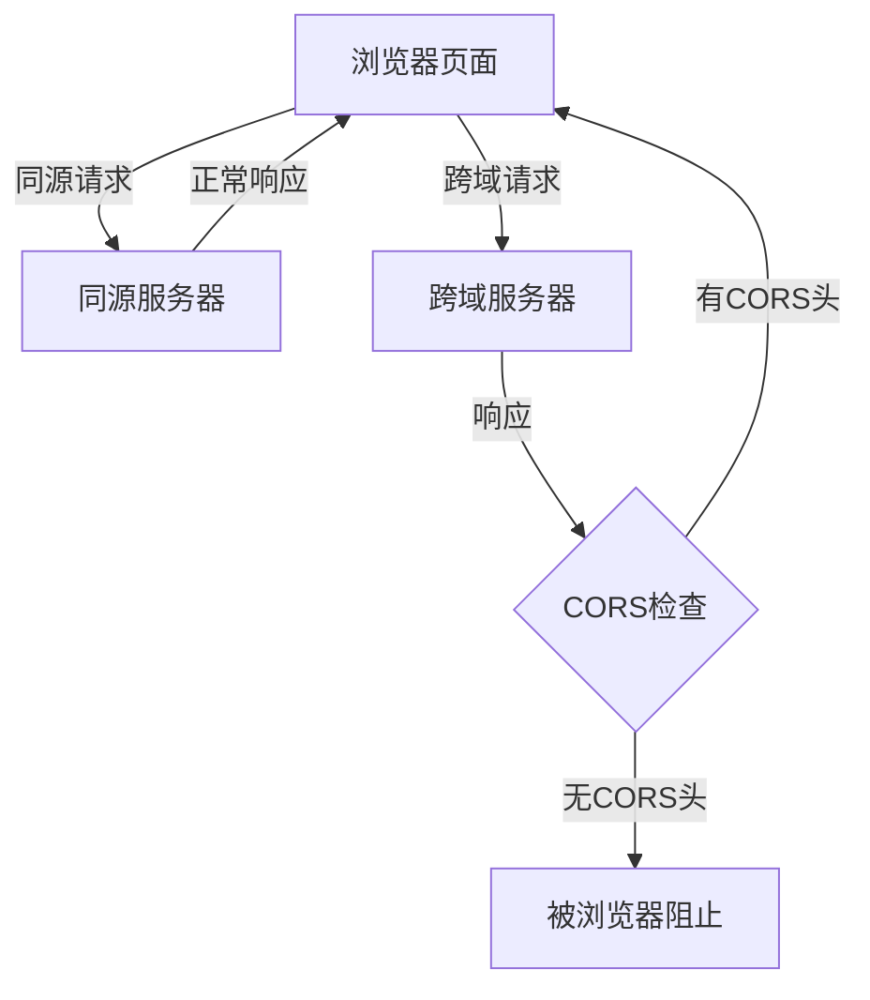
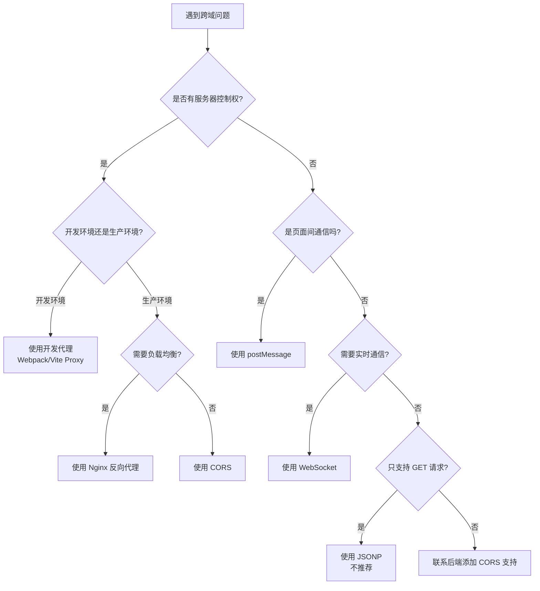

# 万字长文带你理清楚前端跨域所有解决方案的细节

> 前段时间chrome更新了204版本之后，由于新版的chrome把iframe 放在了独立的进程渲染，导致公司的的一个angular子应用使用iframe嵌套在主应用中发生了跨域，心想在解决问题的时候顺便把跨域相关的知识全部整理一遍吧

## 一、什么是跨域?

跨域问题本质上是浏览器的**同源策略**(Same-Origin Policy, SOP)造成的。这是浏览器的一个安全机制,用来保护用户的隐私和数据安全。

### 理解"源"的概念

在我刚开始学习前端时,对"源"这个概念有点模糊。后来我发现,其实很简单——一个 URL 的"源"就是由**协议**、**域名**和**端口号**三部分组成的。只有这三者**完全相同**,浏览器才认为是同源。

举个例子,我来对比几个 URL:

```
https://www.example.com:443/api/users
```

与下面这些 URL 是否同源?

```
http://www.example.com:443/api/users       ✗ 协议不同(https vs http)
https://api.example.com:443/api/users      ✗ 域名不同(www vs api)
https://www.example.com:8080/api/users     ✗ 端口不同(443 vs 8080)
https://www.example.com:443/api/posts      ✓ 同源(只是路径不同)
```

### 同源策略限制了什么?

同源策略主要限制以下几个方面:

1. **Ajax 请求**: 可以向不同源服务器发起请求，但浏览器会限制 JavaScript 代码读取非同源响应的内容（比如无法访问 response 数据）。也就是说，跨域的 Ajax 请求可以发出，但响应会被同源策略拦截，页面拿不到数据。这就是常见的“跨域请求被阻止”问题。
2. **DOM 访问**: 不能访问跨域 iframe 的 DOM
3. **Cookie/LocalStorage/IndexDB**: 不能读取跨域的存储数据



## 二、前端跨域解决方案详解

接下来,我会详细介绍我在实际项目中用过的各种跨域解决方案,每种方案都会给出完整的代码示例和优劣势分析。

### 方案一:CORS(跨域资源共享)⭐⭐⭐⭐⭐

CORS 是我最推荐的跨域解决方案,也是现代 Web 开发的标准做法。它通过服务器设置响应头来告诉浏览器:"这个跨域请求是允许的"。

#### 实现示例

**前端代码**(不需要特殊处理):

```javascript
// 使用 fetch
fetch("https://api.example.com/users", {
  method: "POST",
  headers: {
    "Content-Type": "application/json",
  },
  body: JSON.stringify({ name: "John" }),
})
  .then((response) => response.json())
  .then((data) => console.log(data))
  .catch((error) => console.error("Error:", error));
```

**后端代码**(Node.js + Express):

```javascript
const express = require("express");
const app = express();

// 简单配置 - 允许所有域名访问
app.use((req, res, next) => {
  res.header("Access-Control-Allow-Origin", "*");
  res.header("Access-Control-Allow-Methods", "GET, POST, PUT, DELETE, OPTIONS");
  res.header("Access-Control-Allow-Headers", "Content-Type, Authorization");

  // 处理预检请求
  if (req.method === "OPTIONS") {
    return res.sendStatus(200);
  }
  next();
});

// 更安全的配置 - 只允许特定域名
app.use((req, res, next) => {
  const allowedOrigins = ["https://www.mysite.com", "https://app.mysite.com"];
  const origin = req.headers.origin;

  if (allowedOrigins.includes(origin)) {
    res.header("Access-Control-Allow-Origin", origin);
  }

  res.header("Access-Control-Allow-Methods", "GET, POST, PUT, DELETE");
  res.header("Access-Control-Allow-Headers", "Content-Type, Authorization");
  res.header("Access-Control-Allow-Credentials", "true"); // 允许携带 Cookie
  res.header("Access-Control-Max-Age", "86400"); // 预检请求缓存 24 小时

  if (req.method === "OPTIONS") {
    return res.sendStatus(200);
  }
  next();
});

app.post("/users", (req, res) => {
  res.json({ message: "User created successfully" });
});

app.listen(3000);
```

#### CORS 的两种请求类型

在使用 CORS 时,我发现请求分为两种类型:

**1. 简单请求**

满足以下条件的请求:

- 请求方法是 GET、HEAD 或 POST
- Content-Type 是 text/plain、multipart/form-data 或 application/x-www-form-urlencoded
- 没有自定义请求头

简单请求会直接发送,浏览器自动在请求头加上 `Origin` 字段。

**2. 预检请求(Preflight)**

不满足简单请求条件的,浏览器会先发送一个 OPTIONS 请求进行"预检":

```
OPTIONS /users HTTP/1.1
Origin: https://www.mysite.com
Access-Control-Request-Method: PUT
Access-Control-Request-Headers: Content-Type
```

服务器响应后,浏览器才会发送真正的请求。

#### 优劣势分析

**优势:**

- ✅ 标准化方案,浏览器原生支持
- ✅ 支持所有 HTTP 方法(GET、POST、PUT、DELETE 等)
- ✅ 安全性高,服务器可以精确控制哪些域名可以访问
- ✅ 支持携带 Cookie 和自定义请求头

**劣势:**

- ❌ 需要服务器端配置支持
- ❌ 老旧浏览器(IE10 以下)支持不完善
- ❌ 预检请求会增加一次 HTTP 请求(可通过 max-age 缓存优化)

**适用场景:**

- 现代 Web 应用的首选方案
- 需要支持复杂请求的场景
- 有服务器控制权的项目

---

### 方案二:JSONP ⭐⭐

#### 原理说明

JSONP 利用了 `<script>` 标签不受同源策略限制的特性。原理就是:

1. 前端定义一个回调函数
2. 创建一个 `<script>` 标签,src 指向跨域 URL,并带上回调函数名
3. 服务器返回一段 JavaScript 代码,调用这个回调函数并传入数据
4. 浏览器执行这段代码,数据就被传递给了回调函数

#### 实现示例

**前端代码**:

```javascript
// 手动实现 JSONP
function jsonp(url, callbackName, callback) {
  // 创建 script 标签
  const script = document.createElement("script");

  // 定义全局回调函数
  window[callbackName] = function (data) {
    callback(data);
    // 清理
    document.body.removeChild(script);
    delete window[callbackName];
  };

  // 设置 src,拼接回调函数名
  script.src = `${url}?callback=${callbackName}`;
  document.body.appendChild(script);
}

// 使用示例
jsonp("https://api.example.com/users", "handleUserData", function (data) {
  console.log("收到数据:", data);
});
```

#### 优劣势分析

**优势:**

- ✅ 兼容性好,支持老旧浏览器(IE6+)
- ✅ 实现简单,不需要复杂配置
- ✅ 前端可以完全控制,不依赖服务器特殊配置

**劣势:**

- ❌ 只支持 GET 请求
- ❌ 安全性低,容易受到 XSS 攻击
- ❌ 错误处理困难,无法获取 HTTP 状态码
- ❌ 服务器必须专门为 JSONP 返回特定格式
- ❌ 可能遭受 CSRF 攻击

**适用场景:**

- 只需要 GET 请求获取数据
- 需要兼容非常老的浏览器
- 第三方服务只提供 JSONP 接口(如早期的一些地图、天气 API)

**现状:** 由于安全性和功能限制,JSONP 已经逐渐被 CORS 取代,不建议在新项目中使用。

---

### 方案三:开发环境代理(Webpack DevServer / Vite) ⭐⭐⭐⭐⭐

这是我在开发环境中最常用的方案。通过配置开发服务器代理,让它帮我们转发请求,完全不需要修改业务代码。

#### Webpack DevServer 配置

**webpack.config.js**:

```javascript
module.exports = {
  // ...其他配置
  devServer: {
    port: 8080,
    proxy: {
      // 方式一:简单配置
      "/api": "http://localhost:3000",

      // 方式二:详细配置
      "/api": {
        target: "http://localhost:3000", // 后端服务器地址
        changeOrigin: true, // 修改请求头中的 host 为 target
        pathRewrite: {
          "^/api": "", // 重写路径,去掉 /api 前缀
        },
      },

      // 方式三:多个代理规则
      "/api/v1": {
        target: "http://localhost:3000",
        changeOrigin: true,
        pathRewrite: { "^/api/v1": "/v1" },
      },
      "/api/v2": {
        target: "http://localhost:4000",
        changeOrigin: true,
        pathRewrite: { "^/api/v2": "/v2" },
      },

      // 方式四:条件代理
      "/api": {
        target: "http://localhost:3000",
        changeOrigin: true,
        bypass: function (req, res, proxyOptions) {
          // 根据请求路径决定是否代理
          if (req.headers.accept.indexOf("html") !== -1) {
            return "/index.html"; // 返回本地文件
          }
        },
      },

      // 方式五:WebSocket 代理
      "/socket.io": {
        target: "http://localhost:3000",
        ws: true, // 启用 WebSocket 代理
        changeOrigin: true,
      },
    },
  },
};
```

**前端代码**(完全不需要改动):

```javascript
// 开发环境:请求会被代理到 http://localhost:3000/users
// 生产环境:需要配置实际的后端地址
fetch("/api/users")
  .then((response) => response.json())
  .then((data) => console.log(data));
```

#### Vite 配置

**vite.config.js**:

```javascript
import { defineConfig } from "vite";

export default defineConfig({
  server: {
    port: 5173,
    proxy: {
      // 方式一:简单配置
      "/api": {
        target: "http://localhost:3000",
        changeOrigin: true,
        rewrite: (path) => path.replace(/^\/api/, ""),
      },

      // 方式二:多个代理
      "/api/v1": {
        target: "http://localhost:3000",
        changeOrigin: true,
        rewrite: (path) => path.replace(/^\/api\/v1/, "/v1"),
      },

      // 方式三:使用正则表达式
      "^/api/.*": {
        target: "http://localhost:3000",
        changeOrigin: true,
        rewrite: (path) => path.replace(/^\/api/, ""),
      },

      // 方式四:配置请求头
      "/api": {
        target: "http://localhost:3000",
        changeOrigin: true,
        configure: (proxy, options) => {
          proxy.on("proxyReq", (proxyReq, req, res) => {
            // 可以在这里修改请求头
            proxyReq.setHeader("X-Custom-Header", "value");
          });
          proxy.on("proxyRes", (proxyRes, req, res) => {
            // 可以在这里修改响应
            console.log("代理响应:", proxyRes.statusCode);
          });
        },
      },
    },
  },
});
```

#### Create React App 配置

**package.json**:

```json
{
  "name": "my-app",
  "proxy": "http://localhost:3000"
}
```

或者使用 **src/setupProxy.js**(更灵活):

```javascript
const { createProxyMiddleware } = require("http-proxy-middleware");

module.exports = function (app) {
  app.use(
    "/api",
    createProxyMiddleware({
      target: "http://localhost:3000",
      changeOrigin: true,
      pathRewrite: {
        "^/api": "",
      },
      onProxyReq: function (proxyReq, req, res) {
        console.log("代理请求:", req.path);
      },
    })
  );

  // 可以配置多个代理
  app.use(
    "/socket",
    createProxyMiddleware({
      target: "http://localhost:4000",
      ws: true,
      changeOrigin: true,
    })
  );
};
```

#### Next.js 配置

**next.config.js**:

```javascript
module.exports = {
  async rewrites() {
    return [
      {
        source: "/api/:path*",
        destination: "http://localhost:3000/:path*",
      },
    ];
  },
};
```

#### 优劣势分析

**优势:**

- ✅ 前端代码无需任何改动
- ✅ 配置简单,开箱即用
- ✅ 支持所有 HTTP 方法和请求类型
- ✅ 完美模拟生产环境
- ✅ 支持 WebSocket 代理
- ✅ 可以同时代理多个后端服务

**劣势:**

- ❌ 仅适用于开发环境
- ❌ 生产环境需要其他方案(如 Nginx)
- ❌ 每个项目都需要配置

**适用场景:**

- 本地开发调试
- 前后端分离项目
- 微服务架构(需要代理多个服务)

**最佳实践:**

```javascript
// 1. 使用环境变量管理 API 地址
// .env.development
VITE_API_BASE_URL=/api

// .env.production
VITE_API_BASE_URL=https://api.production.com

// 2. 在代码中使用
const API_BASE_URL = import.meta.env.VITE_API_BASE_URL;
fetch(`${API_BASE_URL}/users`);

// 3. 封装请求函数
const request = (url, options) => {
  const baseURL = import.meta.env.DEV ? '/api' : 'https://api.production.com';
  return fetch(`${baseURL}${url}`, options);
};
```

---

### 方案四:Nginx 反向代理 ⭐⭐⭐⭐⭐

Nginx 反向代理是我在生产环境中最常用的方案。它性能好、稳定可靠,适合处理高并发场景。

#### 基本配置

**nginx.conf**:

```nginx
server {
    listen 80;
    server_name www.mysite.com;

    # 前端静态文件
    location / {
        root /var/www/html;
        index index.html;
        try_files $uri $uri/ /index.html; # 支持 SPA 路由
    }

    # 代理后端 API
    location /api/ {
        proxy_pass http://localhost:3000/; # 注意末尾的斜杠
        proxy_set_header Host $host;
        proxy_set_header X-Real-IP $remote_addr;
        proxy_set_header X-Forwarded-For $proxy_add_x_forwarded_for;
        proxy_set_header X-Forwarded-Proto $scheme;
    }
}
```

#### 高级配置

```nginx
# 负载均衡配置
upstream backend {
    server 127.0.0.1:3000 weight=3;
    server 127.0.0.1:3001 weight=2;
    server 127.0.0.1:3002 weight=1;
    keepalive 32; # 保持连接数
}

server {
    listen 80;
    server_name www.mysite.com;

    # 启用 gzip 压缩
    gzip on;
    gzip_types text/plain text/css application/json application/javascript text/xml application/xml;
    gzip_min_length 1000;

    # 前端静态资源
    location / {
        root /var/www/html;
        index index.html;
        try_files $uri $uri/ /index.html;

        # 静态资源缓存
        location ~* \.(jpg|jpeg|png|gif|ico|css|js)$ {
            expires 7d;
            add_header Cache-Control "public, immutable";
        }
    }

    # API 代理(去掉 /api 前缀)
    location /api/ {
        proxy_pass http://backend/; # 使用负载均衡

        # 重写路径(可选)
        rewrite ^/api/(.*)$ /$1 break;

        # 设置请求头
        proxy_set_header Host $host;
        proxy_set_header X-Real-IP $remote_addr;
        proxy_set_header X-Forwarded-For $proxy_add_x_forwarded_for;
        proxy_set_header X-Forwarded-Proto $scheme;

        # 超时配置
        proxy_connect_timeout 30s;
        proxy_send_timeout 30s;
        proxy_read_timeout 30s;

        # 缓冲配置
        proxy_buffering on;
        proxy_buffer_size 4k;
        proxy_buffers 8 4k;

        # WebSocket 支持
        proxy_http_version 1.1;
        proxy_set_header Upgrade $http_upgrade;
        proxy_set_header Connection "upgrade";
    }

    # WebSocket 专用配置
    location /socket.io/ {
        proxy_pass http://localhost:3000/socket.io/;
        proxy_http_version 1.1;
        proxy_set_header Upgrade $http_upgrade;
        proxy_set_header Connection "upgrade";
        proxy_set_header Host $host;
        proxy_cache_bypass $http_upgrade;
    }

    # 文件上传
    location /upload {
        client_max_body_size 100M; # 最大上传大小
        proxy_pass http://localhost:3000/upload;
        proxy_request_buffering off; # 禁用请求缓冲,支持大文件上传
    }
}

# HTTPS 配置
server {
    listen 443 ssl http2;
    server_name www.mysite.com;

    ssl_certificate /path/to/cert.pem;
    ssl_certificate_key /path/to/key.pem;
    ssl_protocols TLSv1.2 TLSv1.3;
    ssl_ciphers HIGH:!aNULL:!MD5;

    # 其他配置同上...
}

# HTTP 重定向到 HTTPS
server {
    listen 80;
    server_name www.mysite.com;
    return 301 https://$server_name$request_uri;
}
```

#### Docker 环境配置

**docker-compose.yml**:

```yaml
version: "3.8"

services:
  nginx:
    image: nginx:alpine
    ports:
      - "80:80"
      - "443:443"
    volumes:
      - ./nginx.conf:/etc/nginx/nginx.conf
      - ./dist:/var/www/html
    depends_on:
      - backend

  backend:
    image: node:18-alpine
    command: npm start
    ports:
      - "3000:3000"
    volumes:
      - ./backend:/app
    working_dir: /app
```

#### 优劣势分析

**优势:**

- ✅ 性能极佳,处理静态文件和反向代理非常高效
- ✅ 支持负载均衡,可以分发请求到多个后端服务
- ✅ 配置灵活,支持各种复杂场景
- ✅ 生产环境首选方案
- ✅ 支持 HTTPS、HTTP/2、gzip 压缩等
- ✅ 可以统一管理前后端服务

**劣势:**

- ❌ 需要服务器和 Nginx 配置权限
- ❌ 学习曲线相对陡峭
- ❌ 配置错误可能导致服务不可用
- ❌ 本地开发环境需要安装 Nginx

**适用场景:**

- 生产环境部署
- 高并发场景
- 需要负载均衡的场景
- 同时部署多个服务的场景

---

### 方案五:postMessage(页面间通信) ⭐⭐⭐⭐

`postMessage` 是我在处理 iframe 跨域通信时最常用的方法,它安全可靠,浏览器原生支持。

#### 基本使用

**父页面**(www.a.com/parent.html):

```html
<!DOCTYPE html>
<html>
  <head>
    <title>父页面</title>
  </head>
  <body>
    <h1>父页面</h1>
    <iframe id="childFrame" src="https://www.b.com/child.html"></iframe>
    <button onclick="sendMessage()">发送消息到子页面</button>
    <div id="received"></div>

    <script>
      const iframe = document.getElementById("childFrame");

      // 发送消息
      function sendMessage() {
        iframe.contentWindow.postMessage(
          {
            type: "greeting",
            message: "Hello from parent!",
          },
          "https://www.b.com"
        ); // 指定目标源,更安全
      }

      // 接收消息
      window.addEventListener("message", function (event) {
        // 验证来源
        if (event.origin !== "https://www.b.com") {
          console.warn("收到来自未知源的消息:", event.origin);
          return;
        }

        console.log("父页面收到消息:", event.data);
        document.getElementById("received").textContent =
          "收到消息: " + JSON.stringify(event.data);
      });
    </script>
  </body>
</html>
```

**子页面**(www.b.com/child.html):

```html
<!DOCTYPE html>
<html>
  <head>
    <title>子页面</title>
  </head>
  <body>
    <h1>子页面</h1>
    <button onclick="sendMessage()">发送消息到父页面</button>
    <div id="received"></div>

    <script>
      // 发送消息
      function sendMessage() {
        window.parent.postMessage(
          {
            type: "response",
            message: "Hello from child!",
          },
          "https://www.a.com"
        );
      }

      // 接收消息
      window.addEventListener("message", function (event) {
        // 验证来源
        if (event.origin !== "https://www.a.com") {
          console.warn("收到来自未知源的消息:", event.origin);
          return;
        }

        console.log("子页面收到消息:", event.data);
        document.getElementById("received").textContent =
          "收到消息: " + JSON.stringify(event.data);

        // 自动回复
        event.source.postMessage(
          {
            type: "ack",
            message: "Message received!",
          },
          event.origin
        );
      });
    </script>
  </body>
</html>
```

#### 高级应用

**1. 封装 postMessage 通信库**:

```javascript
class PostMessageBridge {
  constructor(targetWindow, targetOrigin) {
    this.targetWindow = targetWindow;
    this.targetOrigin = targetOrigin;
    this.listeners = new Map();
    this.requestId = 0;
    this.pendingRequests = new Map();

    // 监听消息
    window.addEventListener("message", this.handleMessage.bind(this));
  }

  // 发送消息
  send(type, data) {
    this.targetWindow.postMessage(
      {
        type,
        data,
        timestamp: Date.now(),
      },
      this.targetOrigin
    );
  }

  // 发送请求并等待响应(Promise 封装)
  request(type, data, timeout = 5000) {
    return new Promise((resolve, reject) => {
      const requestId = ++this.requestId;

      // 设置超时
      const timer = setTimeout(() => {
        this.pendingRequests.delete(requestId);
        reject(new Error("Request timeout"));
      }, timeout);

      // 保存请求
      this.pendingRequests.set(requestId, { resolve, reject, timer });

      // 发送请求
      this.targetWindow.postMessage(
        {
          type,
          data,
          requestId,
          timestamp: Date.now(),
        },
        this.targetOrigin
      );
    });
  }

  // 监听特定类型的消息
  on(type, callback) {
    if (!this.listeners.has(type)) {
      this.listeners.set(type, []);
    }
    this.listeners.get(type).push(callback);
  }

  // 移除监听
  off(type, callback) {
    if (this.listeners.has(type)) {
      const callbacks = this.listeners.get(type);
      const index = callbacks.indexOf(callback);
      if (index > -1) {
        callbacks.splice(index, 1);
      }
    }
  }

  // 处理接收到的消息
  handleMessage(event) {
    // 验证来源
    if (event.origin !== this.targetOrigin) {
      console.warn("收到来自未知源的消息:", event.origin);
      return;
    }

    const { type, data, requestId } = event.data;

    // 如果是响应消息
    if (requestId && this.pendingRequests.has(requestId)) {
      const { resolve, timer } = this.pendingRequests.get(requestId);
      clearTimeout(timer);
      this.pendingRequests.delete(requestId);
      resolve(data);
      return;
    }

    // 触发监听器
    if (this.listeners.has(type)) {
      this.listeners.get(type).forEach((callback) => {
        callback(data, event);
      });
    }
  }

  // 销毁
  destroy() {
    window.removeEventListener("message", this.handleMessage);
    this.listeners.clear();
    this.pendingRequests.forEach(({ timer }) => clearTimeout(timer));
    this.pendingRequests.clear();
  }
}

// 使用示例
// 父页面
const bridge = new PostMessageBridge(iframe.contentWindow, "https://www.b.com");

// 监听消息
bridge.on("userLogin", (data) => {
  console.log("用户登录:", data);
});

// 发送请求并等待响应
bridge
  .request("getUserInfo", { userId: 123 })
  .then((userInfo) => {
    console.log("用户信息:", userInfo);
  })
  .catch((error) => {
    console.error("请求失败:", error);
  });
```

**2. 多窗口通信**:

```javascript
// 打开新窗口
const popup = window.open("https://www.b.com", "_blank");

// 等待窗口加载完成
const checkReady = setInterval(() => {
  popup.postMessage({ type: "ping" }, "https://www.b.com");
}, 100);

window.addEventListener("message", (event) => {
  if (event.data.type === "ready") {
    clearInterval(checkReady);
    console.log("新窗口已准备好");

    // 发送真正的消息
    popup.postMessage(
      {
        type: "init",
        data: { userId: 123 },
      },
      "https://www.b.com"
    );
  }
});

// 新窗口
window.addEventListener("message", (event) => {
  if (event.data.type === "ping") {
    // 告诉父窗口已准备好
    event.source.postMessage({ type: "ready" }, event.origin);
  }
});
```

#### 优劣势分析

**优势:**

- ✅ 浏览器原生支持,无需额外库
- ✅ 安全性高,可以验证消息来源
- ✅ 支持跨域 iframe、window.open 等多种场景
- ✅ 可以传递复杂数据结构(会自动序列化)
- ✅ 双向通信

**劣势:**

- ❌ 只适用于页面间通信,不能用于 HTTP 请求
- ❌ 需要双方都实现消息监听
- ❌ 调试相对困难
- ❌ 消息传递是异步的

**适用场景:**

- iframe 嵌入第三方页面的通信
- 主应用与微前端子应用的通信
- 浏览器标签页/窗口间通信
- Web 应用与浏览器扩展的通信

**安全注意事项:**

```javascript
// ❌ 错误做法:不验证来源
window.addEventListener("message", (event) => {
  eval(event.data.code); // 危险!
});

// ✅ 正确做法:始终验证来源
window.addEventListener("message", (event) => {
  // 1. 验证来源
  const allowedOrigins = ["https://www.trusted-site.com"];
  if (!allowedOrigins.includes(event.origin)) {
    return;
  }

  // 2. 验证消息格式
  if (typeof event.data !== "object" || !event.data.type) {
    return;
  }

  // 3. 根据类型处理
  switch (event.data.type) {
    case "userLogin":
      handleUserLogin(event.data.payload);
      break;
    default:
      console.warn("未知消息类型:", event.data.type);
  }
});
```

---

### 方案六:WebSocket ⭐⭐⭐⭐

WebSocket 不受同源策略限制,我主要在需要实时双向通信的场景使用它。

#### 基本使用

**前端代码**:

```javascript
// 创建 WebSocket 连接(可以连接到任何域名)
const ws = new WebSocket("wss://api.example.com/socket");

// 连接打开
ws.onopen = function (event) {
  console.log("WebSocket 连接已建立");

  // 发送消息
  ws.send(
    JSON.stringify({
      type: "join",
      room: "chat-room-1",
    })
  );
};

// 接收消息
ws.onmessage = function (event) {
  const data = JSON.parse(event.data);
  console.log("收到消息:", data);
};

// 连接关闭
ws.onclose = function (event) {
  console.log("WebSocket 连接已关闭", event.code, event.reason);
};

// 连接错误
ws.onerror = function (error) {
  console.error("WebSocket 错误:", error);
};

// 发送消息
function sendMessage(message) {
  if (ws.readyState === WebSocket.OPEN) {
    ws.send(JSON.stringify(message));
  } else {
    console.error("WebSocket 未连接");
  }
}

// 关闭连接
function closeConnection() {
  ws.close(1000, "Normal closure");
}
```

**封装 WebSocket 类**:

```javascript
class WebSocketClient {
  constructor(url, options = {}) {
    this.url = url;
    this.options = {
      reconnectInterval: 3000, // 重连间隔
      maxReconnectAttempts: 5, // 最大重连次数
      heartbeatInterval: 30000, // 心跳间隔
      ...options,
    };

    this.ws = null;
    this.reconnectAttempts = 0;
    this.listeners = new Map();
    this.heartbeatTimer = null;
    this.isManualClose = false;

    this.connect();
  }

  connect() {
    try {
      this.ws = new WebSocket(this.url);
      this.setupEventHandlers();
    } catch (error) {
      console.error("WebSocket 连接失败:", error);
      this.handleReconnect();
    }
  }

  setupEventHandlers() {
    this.ws.onopen = () => {
      console.log("WebSocket 已连接");
      this.reconnectAttempts = 0;
      this.startHeartbeat();
      this.emit("open");
    };

    this.ws.onmessage = (event) => {
      try {
        const data = JSON.parse(event.data);

        // 处理心跳响应
        if (data.type === "pong") {
          return;
        }

        this.emit("message", data);

        // 根据消息类型触发特定事件
        if (data.type) {
          this.emit(data.type, data.payload);
        }
      } catch (error) {
        console.error("解析消息失败:", error);
      }
    };

    this.ws.onclose = (event) => {
      console.log("WebSocket 已关闭", event.code, event.reason);
      this.stopHeartbeat();
      this.emit("close", event);

      if (!this.isManualClose) {
        this.handleReconnect();
      }
    };

    this.ws.onerror = (error) => {
      console.error("WebSocket 错误:", error);
      this.emit("error", error);
    };
  }

  // 发送消息
  send(type, payload) {
    if (this.ws && this.ws.readyState === WebSocket.OPEN) {
      this.ws.send(JSON.stringify({ type, payload }));
    } else {
      console.error("WebSocket 未连接,无法发送消息");
    }
  }

  // 监听事件
  on(event, callback) {
    if (!this.listeners.has(event)) {
      this.listeners.set(event, []);
    }
    this.listeners.get(event).push(callback);
  }

  // 移除监听
  off(event, callback) {
    if (this.listeners.has(event)) {
      const callbacks = this.listeners.get(event);
      const index = callbacks.indexOf(callback);
      if (index > -1) {
        callbacks.splice(index, 1);
      }
    }
  }

  // 触发事件
  emit(event, data) {
    if (this.listeners.has(event)) {
      this.listeners.get(event).forEach((callback) => {
        callback(data);
      });
    }
  }

  // 心跳检测
  startHeartbeat() {
    this.heartbeatTimer = setInterval(() => {
      this.send("ping", { timestamp: Date.now() });
    }, this.options.heartbeatInterval);
  }

  stopHeartbeat() {
    if (this.heartbeatTimer) {
      clearInterval(this.heartbeatTimer);
      this.heartbeatTimer = null;
    }
  }

  // 重连
  handleReconnect() {
    if (this.reconnectAttempts < this.options.maxReconnectAttempts) {
      this.reconnectAttempts++;
      console.log(
        `${this.options.reconnectInterval / 1000}秒后尝试第 ${this.reconnectAttempts} 次重连...`
      );

      setTimeout(() => {
        this.connect();
      }, this.options.reconnectInterval);
    } else {
      console.error("达到最大重连次数,停止重连");
      this.emit("maxReconnectAttemptsReached");
    }
  }

  // 关闭连接
  close() {
    this.isManualClose = true;
    this.stopHeartbeat();
    if (this.ws) {
      this.ws.close(1000, "Manual close");
    }
  }
}

// 使用示例
const wsClient = new WebSocketClient("wss://api.example.com/socket", {
  reconnectInterval: 5000,
  maxReconnectAttempts: 10,
});

// 监听连接打开
wsClient.on("open", () => {
  console.log("已连接到服务器");
  wsClient.send("join", { room: "chat-room-1" });
});

// 监听特定类型消息
wsClient.on("chat", (message) => {
  console.log("收到聊天消息:", message);
  displayMessage(message);
});

wsClient.on("userJoined", (user) => {
  console.log("用户加入:", user);
});

// 发送消息
function sendChatMessage(text) {
  wsClient.send("chat", {
    text,
    timestamp: Date.now(),
  });
}
```

**后端代码**(Node.js + ws):

```javascript
const WebSocket = require("ws");
const http = require("http");

// 创建 HTTP 服务器
const server = http.createServer();

// 创建 WebSocket 服务器
const wss = new WebSocket.Server({ server });

// 存储连接的客户端
const clients = new Map();

wss.on("connection", (ws, req) => {
  const clientId = Date.now().toString();
  clients.set(clientId, { ws, rooms: new Set() });

  console.log(`客户端连接: ${clientId}`);

  // 接收消息
  ws.on("message", (message) => {
    try {
      const data = JSON.parse(message);

      switch (data.type) {
        case "ping":
          // 响应心跳
          ws.send(JSON.stringify({ type: "pong" }));
          break;

        case "join":
          // 加入房间
          clients.get(clientId).rooms.add(data.payload.room);
          broadcastToRoom(
            data.payload.room,
            {
              type: "userJoined",
              payload: { clientId, room: data.payload.room },
            },
            clientId
          );
          break;

        case "chat":
          // 广播聊天消息
          const client = clients.get(clientId);
          client.rooms.forEach((room) => {
            broadcastToRoom(room, {
              type: "chat",
              payload: {
                clientId,
                text: data.payload.text,
                timestamp: data.payload.timestamp,
              },
            });
          });
          break;
      }
    } catch (error) {
      console.error("处理消息失败:", error);
    }
  });

  // 连接关闭
  ws.on("close", () => {
    console.log(`客户端断开: ${clientId}`);
    clients.delete(clientId);
  });

  // 错误处理
  ws.on("error", (error) => {
    console.error(`客户端错误: ${clientId}`, error);
  });
});

// 广播到指定房间
function broadcastToRoom(room, message, excludeClientId) {
  clients.forEach((client, clientId) => {
    if (clientId !== excludeClientId && client.rooms.has(room)) {
      if (client.ws.readyState === WebSocket.OPEN) {
        client.ws.send(JSON.stringify(message));
      }
    }
  });
}

server.listen(3000, () => {
  console.log("WebSocket 服务器运行在 http://localhost:3000");
});
```

#### 优劣势分析

**优势:**

- ✅ 不受同源策略限制,可以连接任何域名
- ✅ 全双工通信,服务器可以主动推送消息
- ✅ 实时性好,延迟低
- ✅ 协议开销小,性能好
- ✅ 支持二进制数据传输

**劣势:**

- ❌ 需要服务器支持 WebSocket 协议
- ❌ 长连接占用服务器资源
- ❌ 老旧浏览器支持不完善
- ❌ 需要处理断线重连、心跳检测等复杂逻辑
- ❌ 部分代理服务器可能不支持

**适用场景:**

- 实时聊天应用
- 在线游戏
- 实时数据监控(如股票行情)
- 协同编辑(如在线文档)
- 消息推送

---

### 方案七:window.name ⭐

`window.name` 是一个比较古老的方案,我很少用到,但了解它的原理还是有帮助的。

#### 原理说明

`window.name` 有一个特性:在页面跨域跳转时,`window.name` 的值会保留。我们可以利用这个特性来传递数据:

1. 在 A 页面创建一个 iframe,指向 B 页面(跨域)
2. B 页面将数据写入 `window.name`
3. 将 iframe 的 src 改为 A 页面的同源页面(如空白页)
4. 此时 A 页面就可以访问 iframe 的 `window.name` 了

#### 实现示例

**A 页面**(www.a.com/a.html):

```html
<!DOCTYPE html>
<html>
  <head>
    <title>A 页面</title>
  </head>
  <body>
    <h1>A 页面</h1>
    <button onclick="getData()">获取跨域数据</button>
    <div id="result"></div>

    <script>
      function getData() {
        const iframe = document.createElement("iframe");
        iframe.style.display = "none";

        let isFirstLoad = true;

        iframe.onload = function () {
          if (isFirstLoad) {
            // 第一次加载完成(跨域页面),切换到同源空白页
            isFirstLoad = false;
            iframe.src = "https://www.a.com/blank.html";
          } else {
            // 第二次加载完成(同源页面),读取 window.name
            const data = iframe.contentWindow.name;
            console.log("获取到的数据:", data);

            try {
              const parsedData = JSON.parse(data);
              document.getElementById("result").textContent =
                "获取到的数据: " + JSON.stringify(parsedData, null, 2);
            } catch (error) {
              document.getElementById("result").textContent = "数据: " + data;
            }

            // 清理
            document.body.removeChild(iframe);
          }
        };

        // 加载跨域页面
        iframe.src = "https://www.b.com/data.html";
        document.body.appendChild(iframe);
      }

      // 封装成 Promise
      function getDataByWindowName(url) {
        return new Promise((resolve, reject) => {
          const iframe = document.createElement("iframe");
          iframe.style.display = "none";

          let isFirstLoad = true;
          let timeoutId = setTimeout(() => {
            document.body.removeChild(iframe);
            reject(new Error("Timeout"));
          }, 10000);

          iframe.onload = function () {
            if (isFirstLoad) {
              isFirstLoad = false;
              // 切换到同源空白页
              iframe.src = "about:blank"; // 或同源的空白页
            } else {
              clearTimeout(timeoutId);
              const data = iframe.contentWindow.name;
              document.body.removeChild(iframe);

              try {
                resolve(JSON.parse(data));
              } catch (error) {
                resolve(data);
              }
            }
          };

          iframe.onerror = function () {
            clearTimeout(timeoutId);
            document.body.removeChild(iframe);
            reject(new Error("Load failed"));
          };

          iframe.src = url;
          document.body.appendChild(iframe);
        });
      }

      // 使用
      getDataByWindowName("https://www.b.com/data.html")
        .then((data) => {
          console.log("数据:", data);
        })
        .catch((error) => {
          console.error("获取失败:", error);
        });
    </script>
  </body>
</html>
```

**B 页面**(www.b.com/data.html):

```html
<!DOCTYPE html>
<html>
  <head>
    <title>B 页面</title>
  </head>
  <body>
    <h1>B 页面 - 数据提供者</h1>

    <script>
      // 将数据写入 window.name
      window.name = JSON.stringify({
        users: [
          { id: 1, name: "John" },
          { id: 2, name: "Jane" },
        ],
        timestamp: Date.now(),
      });

      // 也可以写入大量数据(最大 2MB 左右)
      // window.name = 'large data...';
    </script>
  </body>
</html>
```

**A 页面的空白页**(www.a.com/blank.html):

```html
<!DOCTYPE html>
<html>
  <head>
    <title>空白页</title>
  </head>
  <body>
    <!-- 空白页,用于切换到同源 -->
  </body>
</html>
```

#### 优劣势分析

**优势:**

- ✅ 可以传输大量数据(约 2MB)
- ✅ 兼容性好,支持老旧浏览器
- ✅ 实现相对简单

**劣势:**

- ❌ 需要两次页面加载,效率低
- ❌ 只能单向传输数据(B → A)
- ❌ 用户体验差,会有短暂的加载过程
- ❌ 不适合频繁通信
- ❌ 现代浏览器有更好的替代方案

**适用场景:**

- 需要传输大量数据的场景
- 需要兼容老旧浏览器
- 其他方案都不可用的情况

**现状:** 这个方案已经很少使用,建议优先考虑 postMessage 或 CORS。

---

### 方案八:document.domain ⭐(已废弃)

这个方案我几乎没用过,因为它的适用场景非常有限,而且现代浏览器已经逐步废弃了这个特性。

#### 原理说明

`document.domain` 只适用于**主域相同、子域不同**的情况。通过将两个页面的 `document.domain` 都设置为主域,浏览器就会认为它们是同源的。

#### 实现示例

**页面 A**(www.a.example.com/a.html):

```html
<!DOCTYPE html>
<html>
  <head>
    <title>页面 A</title>
  </head>
  <body>
    <h1>页面 A (www.a.example.com)</h1>
    <iframe id="iframe" src="https://www.b.example.com/b.html"></iframe>

    <script>
      // 将 document.domain 设置为主域
      document.domain = "example.com";

      window.onload = function () {
        const iframe = document.getElementById("iframe");

        // 现在可以访问 iframe 的内容了
        const iframeDoc =
          iframe.contentDocument || iframe.contentWindow.document;
        console.log("iframe 的标题:", iframeDoc.title);

        // 可以操作 iframe 的 DOM
        const h1 = iframeDoc.querySelector("h1");
        h1.style.color = "red";

        // 可以调用 iframe 的函数
        iframe.contentWindow.someFunction();
      };
    </script>
  </body>
</html>
```

**页面 B**(www.b.example.com/b.html):

```html
<!DOCTYPE html>
<html>
  <head>
    <title>页面 B</title>
  </head>
  <body>
    <h1>页面 B (www.b.example.com)</h1>

    <script>
      // 同样设置 document.domain 为主域
      document.domain = "example.com";

      function someFunction() {
        console.log("iframe 的函数被调用了");
      }

      // 也可以访问父页面
      console.log("父页面的标题:", window.parent.document.title);
    </script>
  </body>
</html>
```

#### 优劣势分析

**优势:**

- ✅ 可以完全访问 DOM 和 JavaScript 对象
- ✅ 双向通信
- ✅ 实现简单

**劣势:**

- ❌ 只适用于主域相同、子域不同的情况
- ❌ 现代浏览器(Chrome 109+)已默认禁用
- ❌ 安全性较低
- ❌ 只能设置为当前域名或更高级的父域名

**适用场景:**

- 主域相同、子域不同的 iframe 通信
- 老旧项目的维护

**现状:** 这个特性已被废弃,Chrome 109+ 默认禁用。**强烈建议使用 postMessage 替代**。

---

## 三、方案对比与选择

经过这么多项目实践,我总结了一个选择流程:



### 综合对比表

| 方案            | 推荐指数   | 适用环境   | 支持请求类型   | 实现难度 | 安全性 | 性能 |
| --------------- | ---------- | ---------- | -------------- | -------- | ------ | ---- |
| CORS            | ⭐⭐⭐⭐⭐ | 生产环境   | 所有 HTTP 方法 | 简单     | 高     | 优秀 |
| 开发代理        | ⭐⭐⭐⭐⭐ | 开发环境   | 所有 HTTP 方法 | 非常简单 | -      | 优秀 |
| Nginx 反向代理  | ⭐⭐⭐⭐⭐ | 生产环境   | 所有 HTTP 方法 | 中等     | 高     | 极佳 |
| postMessage     | ⭐⭐⭐⭐   | 页面间通信 | 消息传递       | 简单     | 高     | 良好 |
| WebSocket       | ⭐⭐⭐⭐   | 实时通信   | WebSocket 协议 | 中等     | 高     | 优秀 |
| JSONP           | ⭐⭐       | 老旧浏览器 | 仅 GET         | 简单     | 低     | 良好 |
| window.name     | ⭐         | 大数据传输 | 单向传递       | 复杂     | 中     | 差   |
| document.domain | ⭐(已废弃) | 子域通信   | DOM 访问       | 简单     | 低     | 良好 |

---

## 四、实战场景与最佳实践

在实际开发中,我经常会遇到以下几种场景:

### 场景一:前后端分离项目

**开发环境:**

```javascript
// vite.config.js
export default defineConfig({
  server: {
    proxy: {
      "/api": {
        target: "http://localhost:3000",
        changeOrigin: true,
      },
    },
  },
});

// 前端代码使用相对路径
fetch("/api/users").then((res) => res.json());
```

**生产环境:**

```nginx
# nginx.conf
server {
    listen 80;
    server_name www.mysite.com;

    location / {
        root /var/www/html;
        try_files $uri /index.html;
    }

    location /api/ {
        proxy_pass http://backend-service:3000/;
    }
}
```

### 场景二:微前端架构

```javascript
// 主应用
class MicroApp {
  constructor(container, url) {
    this.container = container;
    this.url = url;
    this.iframe = null;
    this.bridge = null;
  }

  mount() {
    this.iframe = document.createElement("iframe");
    this.iframe.src = this.url;
    this.container.appendChild(this.iframe);

    // 建立通信桥梁
    this.bridge = new PostMessageBridge(
      this.iframe.contentWindow,
      new URL(this.url).origin
    );

    // 监听子应用事件
    this.bridge.on("navigate", (path) => {
      // 同步路由
      window.history.pushState(null, "", path);
    });
  }

  unmount() {
    if (this.iframe) {
      this.container.removeChild(this.iframe);
      this.bridge.destroy();
    }
  }
}

// 使用
const app = new MicroApp(
  document.getElementById("micro-app-container"),
  "https://sub-app.example.com"
);
app.mount();
```

### 场景三:第三方 API 调用

```javascript
// 封装 API 请求
class APIClient {
  constructor(baseURL) {
    this.baseURL = baseURL;
  }

  async request(endpoint, options = {}) {
    const url = `${this.baseURL}${endpoint}`;

    try {
      const response = await fetch(url, {
        ...options,
        headers: {
          "Content-Type": "application/json",
          ...options.headers,
        },
        // 根据后端 CORS 配置决定是否携带凭证
        credentials: options.credentials || "omit",
      });

      if (!response.ok) {
        throw new Error(`HTTP error! status: ${response.status}`);
      }

      return await response.json();
    } catch (error) {
      console.error("API 请求失败:", error);
      throw error;
    }
  }

  get(endpoint) {
    return this.request(endpoint, { method: "GET" });
  }

  post(endpoint, data) {
    return this.request(endpoint, {
      method: "POST",
      body: JSON.stringify(data),
    });
  }
}

// 使用
const api = new APIClient("https://api.example.com");
api.get("/users").then((users) => console.log(users));
```

### 最佳实践建议

1. **开发环境使用代理**:配置简单,无需修改代码
2. **生产环境优先 CORS**:标准化、安全性高
3. **页面通信使用 postMessage**:安全可靠,浏览器原生支持
4. **实时通信使用 WebSocket**:性能好,功能强大
5. **统一错误处理**:封装请求方法,统一处理跨域错误
6. **环境变量管理 API 地址**:便于切换开发/生产环境
7. **安全第一**:始终验证消息来源,避免 XSS 攻击

---

## 五、常见问题排查

### 问题 1:CORS 预检请求失败

```
Access to fetch at 'https://api.example.com/users' from origin 'https://www.mysite.com'
has been blocked by CORS policy: Response to preflight request doesn't pass access control check
```

**排查步骤:**

1. 检查服务器是否处理了 OPTIONS 请求
2. 检查 `Access-Control-Allow-Methods` 是否包含实际请求方法
3. 检查 `Access-Control-Allow-Headers` 是否包含自定义请求头
4. 检查是否返回了正确的状态码(200)

**解决方案:**

```javascript
app.use((req, res, next) => {
  res.header("Access-Control-Allow-Origin", req.headers.origin);
  res.header("Access-Control-Allow-Methods", "GET, POST, PUT, DELETE, OPTIONS");
  res.header(
    "Access-Control-Allow-Headers",
    "Content-Type, Authorization, X-Custom-Header"
  );

  if (req.method === "OPTIONS") {
    return res.sendStatus(200);
  }
  next();
});
```

### 问题 2:CORS 携带 Cookie 失败

**前端:**

```javascript
fetch("https://api.example.com/users", {
  credentials: "include", // 携带 Cookie
});
```

**后端:**

```javascript
res.header("Access-Control-Allow-Origin", req.headers.origin); // 不能是 '*'
res.header("Access-Control-Allow-Credentials", "true");
```

### 问题 3:Nginx 代理后端返回 502

**常见原因:**

- 后端服务未启动
- proxy_pass 地址配置错误
- 防火墙阻止

**解决方案:**

```bash
# 检查后端服务
curl http://localhost:3000/api/users

# 查看 Nginx 错误日志
tail -f /var/log/nginx/error.log

# 测试配置
nginx -t
```

---

## 六、总结

跨域问题虽然常见,但只要理解了原理,选择合适的方案,就能轻松解决。我的个人推荐是:

1. **开发环境**: Webpack/Vite Proxy
2. **生产环境**: CORS + Nginx 反向代理
3. **页面通信**: postMessage
4. **实时通信**: WebSocket

最后,跨域只是一个技术手段,安全才是根本目的。在解决跨域问题时,一定要注意安全性,避免引入新的安全风险。

希望这篇文章能帮你彻底理解跨域问题!如果有任何疑问,欢迎交流讨论。
