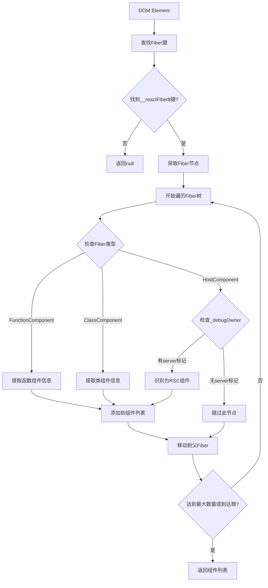

# 1. 从DOM元素反向追踪到组件：深入理解React和Vue的内部机制

在现代前端开发中，我们经常需要调试复杂的组件树结构。有时候，我们会遇到这样的场景：看到页面上的某个DOM元素，想要快速定位到对应的React或Vue组件。本文将深入探讨如何实现这一功能，并详细解析其背后的技术原理。

## 1.1. 技术背景

### 1.1.1. 为什么需要DOM到组件的映射？

在开发和调试过程中，我们经常面临以下挑战：

1. **调试复杂组件树**：当组件嵌套层级很深时，很难快速定位问题所在
2. **性能分析**：需要了解某个DOM元素对应的组件渲染性能
3. **开发工具增强**：为浏览器扩展或开发工具提供更好的用户体验

### 1.1.2. 技术挑战

实现DOM到组件的映射面临以下技术挑战：

- **框架内部API依赖**：需要访问React Fiber或Vue实例等内部数据结构
- **版本兼容性**：不同版本的框架内部实现可能不同
- **生产环境限制**：某些调试信息只在开发环境可用

## 1.2. React实现方案

### 1.2.1. React Fiber架构简介

React 16引入了Fiber架构，这是一个全新的协调算法实现。Fiber将渲染工作分解为小的工作单元，使得React能够：

- 暂停工作并稍后继续
- 为不同类型的工作分配优先级
- 重用之前完成的工作
- 如果不再需要则中止工作

### 1.2.2. 核心数据结构

```typescript
interface FiberNode {
  displayName?: string;
  name?: string;
  tag: number; // 标识Fiber类型的数字标记
  type: any; // 对于HostComponent是字符串(如'div')，对于组件是类/函数

  return: FiberNode | null; // 父Fiber节点的引用

  _debugOwner?: {
    name: string;
    env: string;
  };
  // 其他属性如stateNode、key、memoizedProps等
}
```

### 1.2.3. Fiber标签类型

```typescript
// Fiber标签的近似值（具体数值可在React源码中查看）
const FunctionComponent = 0; // 函数组件
const ClassComponent = 1; // 类组件
const HostComponent = 5; // 原生DOM元素
```

### 1.2.4. 实现原理详解

#### 1.2.4.1. 第一步：获取Fiber节点引用

React会在DOM元素上附加一个Fiber节点的引用，键名通常以`__reactFiber$`或`__reactInternalInstance$`开头：

```typescript
const fiberKey = Object.keys(element).find(
  (key) =>
    key.startsWith("__reactFiber$") ||
    key.startsWith("__reactInternalInstance$")
);
```

#### 1.2.4.2. 第二步：遍历Fiber树

一旦获得了Fiber节点，我们就可以通过`return`属性向上遍历Fiber树：

```typescript
while (currentFiber && components.length < maxComponents) {
  // 检查当前Fiber是否为组件
  if (
    currentFiber.tag === ClassComponent ||
    currentFiber.tag === FunctionComponent
  ) {
    // 提取组件信息
  }
  currentFiber = currentFiber.return; // 向上遍历
}
```

#### 1.2.4.3. 第三步：组件信息提取

对于不同类型的组件，我们采用不同的策略提取信息：

1. **常规组件**：直接从`type`属性获取组件定义
2. **服务端组件(RSC)**：通过`_debugOwner`属性识别

### 1.2.5. 完整实现代码

```typescript
export interface ComponentInfo {
  name: string;

  type: "regular" | "rsc";
}

/**
 * 尝试找到HTMLElement所属的React组件层次结构（最多3个）
 * 返回一个对象数组，每个对象包含组件名称和类型
 * 数组按从最近到最远的顺序排列
 *
 * 重要提示：此函数依赖于React的内部Fiber架构，
 * 这不是公共API，可能在React版本之间发生变化。
 * 在开发环境中最为可靠。
 */
export function getReactComponentHierarchy(
  element: HTMLElement | null
): ComponentInfo[] | null {
  if (!element) {
    return null;
  }

  const components: ComponentInfo[] = [];
  const maxComponents = 3;

  // 1. 查找内部React Fiber节点键
  const fiberKey = Object.keys(element).find(
    (key) =>
      key.startsWith("__reactFiber$") ||
      key.startsWith("__reactInternalInstance$")
  );

  if (!fiberKey) {
    return null;
  }

  let currentFiber: FiberNode | null = (element as any)[fiberKey];

  if (!currentFiber) {
    return null;
  }

  // 2. 向上遍历Fiber树
  while (currentFiber && components.length < maxComponents) {
    let componentData: ComponentInfo | null = null;

    // 情况1：当前fiber是用户定义的函数或类组件
    if (
      currentFiber.tag === ClassComponent ||
      currentFiber.tag === FunctionComponent
    ) {
      const componentDefinition = currentFiber.type;
      if (componentDefinition) {
        const name =
          componentDefinition.displayName ||
          componentDefinition.name ||
          currentFiber._debugOwner?.name ||
          "AnonymousComponent";
        componentData = { name, type: "regular" };
      }
    }
    // 情况2：当前fiber是HostComponent（DOM元素），检查其_debugOwner
    // 这是识别可能是服务器组件(RSC)的启发式方法
    else if (
      currentFiber.tag === HostComponent &&
      currentFiber._debugOwner &&
      currentFiber._debugOwner.env?.toLowerCase().includes("server")
    ) {
      componentData = { name: currentFiber._debugOwner.name, type: "rsc" };
    }

    if (componentData) {
      // 避免添加完全相同的组件信息
      const alreadyExists = components.some(
        (c) => c.name === componentData!.name && c.type === componentData!.type
      );
      if (!alreadyExists) {
        components.push(componentData);
      }
    }
    currentFiber = currentFiber.return;
  }

  return components.length > 0 ? components : null;
}
```

### 1.2.6. React流程图



## 1.3. Vue实现方案

### 1.3.1. Vue响应式系统简介

Vue采用了不同于React的架构设计。Vue的响应式系统基于依赖追踪，每个组件实例都会在渲染过程中追踪其依赖的响应式数据。Vue在DOM元素上保留了对组件实例的引用，这为我们提供了反向追踪的可能。

### 1.3.2. Vue版本差异

Vue在不同版本中使用了不同的内部属性来存储组件实例：

- **Vue 3**：使用`__vueParentComponent`属性
- **Vue 2**：使用`__vue__`属性
- **Vue 1**：使用`__vms__`属性（数组形式）

### 1.3.3. 实现原理详解

#### 1.3.3.1. Vue 3的实现策略

Vue 3在DOM元素上通过`__vueParentComponent`属性保存父组件的引用：

```typescript
const parentComponent = (currentElement as any).__vueParentComponent;
if (parentComponent?.type?.__name) {
  const componentName = parentComponent.type.__name;
  // 处理组件信息...
}
```

#### 1.3.3.2. Vue 2/1的实现策略

对于Vue 2和Vue 1，我们需要检查`__vue__`和`__vms__`属性：

```typescript
let vms: any[] = [];
if (
  (currentElement as any).__vms__ &&
  Array.isArray((currentElement as any).__vms__)
) {
  vms = (currentElement as any).__vms__;
} else if ((currentElement as any).__vue__) {
  vms = [(currentElement as any).__vue__];
}
```

#### 1.3.3.3. 组件名称提取策略

Vue组件的名称可能来自多个源：

1. `vm.$options.name` - 显式定义的组件名
2. `vm.$options.__file` - 文件路径（需要提取文件名）
3. `vm.$options._componentTag` - 组件标签名
4. 默认为`AnonymousComponent`

### 1.3.4. 完整实现代码

```typescript
export interface ComponentInfo {
  name: string;
  type: "regular";
}

let hasWarnedNoVue = false;

/**
 * 尝试找到HTMLElement所属的Vue组件层次结构（最多3个）
 * 返回一个对象数组，每个对象包含组件名称
 * 数组按从最近到最远的顺序排列
 *
 * 此函数支持Vue 3（通过__vueParentComponent）和Vue 1/2（通过__vue__/__vms__）
 * 它依赖于Vue的开发模式属性，这些属性仅在开发构建中可用
 */
export function getVueComponentHierarchy(
  element: HTMLElement | null
): ComponentInfo[] | null {
  if (!element) {
    return null;
  }

  const components: ComponentInfo[] = [];
  const maxComponents = 3;

  let currentElement: HTMLElement | null = element;

  while (currentElement && components.length < maxComponents) {
    // Vue 3的策略
    const parentComponent = (currentElement as any).__vueParentComponent;
    if (parentComponent?.type?.__name) {
      const componentName = parentComponent.type.__name;
      if (!components.some((c) => c.name === componentName)) {
        components.push({ name: componentName, type: "regular" });
      }
    }

    // Vue 1 & 2的策略
    let vms: any[] = [];
    if (
      (currentElement as any).__vms__ &&
      Array.isArray((currentElement as any).__vms__)
    ) {
      vms = (currentElement as any).__vms__;
    } else if ((currentElement as any).__vue__) {
      vms = [(currentElement as any).__vue__];
    }

    for (const vm of vms) {
      if (!vm || !vm.$options) continue;

      let name =
        vm.$options.name ||
        vm.$options.__file ||
        vm.$options._componentTag ||
        "AnonymousComponent";
      // 如果__file是路径，提取文件名
      if (name && typeof name === "string" && name.includes("/")) {
        name = (String(name).split("/").pop() || "").replace(/\.vue$/, "");
      }
      // 避免重复
      if (!components.some((c) => c.name === name)) {
        components.push({ name, type: "regular" });
      }
    }

    // 移动到下一个父元素
    currentElement = currentElement.parentElement;
  }

  if (components.length === 0 && !hasWarnedNoVue) {
    // 只警告一次
    console.warn(
      "[vue-component-tracker] 在选定元素上未检测到Vue安装。请确保您在开发模式下运行且Vue可用。"
    );
    hasWarnedNoVue = true;
  }

  return components.length > 0 ? components : null;
}

/**
 * Formats the Vue component hierarchy information into a human-readable string.
 *
 * @param hierarchy An array of ComponentInfo objects, or null.
 * @returns A string describing the component hierarchy, or a message if no components are found.
 */
export function formatVueComponentHierarchy(
  hierarchy: ComponentInfo[] | null
): string {
  if (!hierarchy || hierarchy.length === 0) {
    return "No Vue components found for this element.";
  }

  const parts = hierarchy.map(
    (info) => `{name: ${info.name}, type: ${info.type}}`
  );

  let description = `Vue component tree (from closest to farthest, ${hierarchy.length} closest element${hierarchy.length > 1 ? "s" : ""}): `;
  description += parts.join(" child of ");

  return description;
}

export function getSelectedElementAnnotation(element: HTMLElement) {
  const hierarchy = getVueComponentHierarchy(element);
  if (hierarchy?.[0]) {
    return {
      annotation: `${hierarchy[0].name}`,
    };
  }
  return { annotation: null };
}

export function getSelectedElementsPrompt(elements: HTMLElement[]) {
  const selectedComponentHierarchies = elements.map(
    (e) => getVueComponentHierarchy(e) || []
  );

  if (selectedComponentHierarchies.some((h) => h.length > 0)) {
    const content = `This is additional information on the elements that the user selected. Use this information to find the correct element in the codebase.

  ${selectedComponentHierarchies.map((h, index) => {
    return `
<element index="${index + 1}">
  ${h.length === 0 ? "No Vue component as parent detected" : `Vue component tree (from closest to farthest, 3 closest elements): ${h.map((c) => `{name: ${c.name}, type: ${c.type}}`).join(" child of ")}`}
</element>
    `;
  })}
  `;

    return content;
  }

  return null;
}
```

### 1.3.5. Vue流程图


## 1.4. 工具函数实现

为了更好地使用这些核心功能，我们还提供了一些辅助工具函数：

### 1.4.1. 格式化组件层次结构

```typescript
/**
 * 将组件层次结构信息格式化为可读字符串
 */
export function formatComponentHierarchy(
  hierarchy: ComponentInfo[] | null,
  framework: "react" | "vue"
): string {
  if (!hierarchy || hierarchy.length === 0) {
    return `未找到${framework === "react" ? "React" : "Vue"}组件`;
  }

  const parts = hierarchy.map(
    (info) => `{name: ${info.name}, type: ${info.type}}`
  );

  let description = `${framework === "react" ? "React" : "Vue"}组件树 (从最近到最远，${hierarchy.length}个最近元素): `;
  description += parts.join(" 的子组件 ");

  return description;
}
```

### 1.4.2. 获取元素注解

```typescript
/**
 * 获取选中元素的简短注解信息
 */
export function getSelectedElementAnnotation(
  element: HTMLElement,

  framework: "react" | "vue"
) {
  const hierarchy =
    framework === "react"
      ? getReactComponentHierarchy(element)
      : getVueComponentHierarchy(element);

  if (hierarchy?.[0]) {
    const annotation =
      framework === "react" && hierarchy[0].type === "rsc"
        ? `${hierarchy[0].name} (RSC)`
        : hierarchy[0].name;
    return { annotation };
  }
  return { annotation: null };
}
```

## 1.5. 实际应用场景

### 1.5.1. 浏览器开发工具扩展

这些函数可以用于开发浏览器扩展，帮助开发者快速定位页面元素对应的组件：

```typescript
// 在浏览器扩展中使用
document.addEventListener("click", (event) => {
  const element = event.target as HTMLElement;

  // 尝试React
  const reactHierarchy = getReactComponentHierarchy(element);
  if (reactHierarchy) {
    console.log(
      "React组件:",
      formatComponentHierarchy(reactHierarchy, "react")
    );
    return;
  }

  // 尝试Vue
  const vueHierarchy = getVueComponentHierarchy(element);
  if (vueHierarchy) {
    console.log("Vue组件:", formatComponentHierarchy(vueHierarchy, "vue"));
    return;
  }

  console.log("未检测到框架组件");
});
```

### 1.5.2. 自动化测试

在端到端测试中，可以使用这些函数来验证组件的正确渲染：

```typescript
// 在测试中验证组件
function verifyComponentRendered(selector: string, expectedComponent: string) {
  const element = document.querySelector(selector) as HTMLElement;
  const hierarchy = getReactComponentHierarchy(element);

  expect(hierarchy?.[0]?.name).toBe(expectedComponent);
}
```

### 1.5.3. 性能分析工具

结合性能监控，可以分析特定组件的渲染性能：

```typescript
// 性能分析示例
function analyzeComponentPerformance(element: HTMLElement) {
  const hierarchy = getReactComponentHierarchy(element);
  if (hierarchy) {
    console.log(`分析组件性能: ${hierarchy[0].name}`);
    // 执行性能分析逻辑...
  }
}
```

## 1.6. 注意事项和最佳实践

### 1.6.1. 开发环境限制

这些函数主要依赖于框架在开发环境中提供的调试信息：

- **React**: Fiber节点的调试属性在生产环境中可能被优化掉
- **Vue**: `__vue__`等属性只在开发构建中可用

### 1.6.2. 版本兼容性

不同版本的框架可能有不同的内部实现：

- 定期测试新版本的兼容性
- 提供降级策略处理不支持的版本
- 监控框架更新，及时调整实现

### 1.6.3. 性能考虑

- 避免在高频事件（如`mousemove`）中调用这些函数
- 考虑添加缓存机制减少重复计算
- 在生产环境中谨慎使用

### 1.6.4. 错误处理

```typescript
function safeGetComponentHierarchy(element: HTMLElement) {
  try {
    return (
      getReactComponentHierarchy(element) || getVueComponentHierarchy(element)
    );
  } catch (error) {
    console.warn("获取组件层次结构失败:", error);
    return null;
  }
}
```

## 1.7. 总结

通过深入理解React Fiber和Vue的内部机制，我们实现了从DOM元素反向追踪到组件的功能。这项技术在开发工具、调试、测试等场景中都有重要应用价值。

关键要点：

1. **React方案**基于Fiber架构，通过遍历Fiber树获取组件信息
2. **Vue方案**利用组件实例引用，支持多个Vue版本
3. **实际应用**包括开发工具、自动化测试、性能分析等
4. **注意事项**包括环境限制、版本兼容性、性能考虑等

虽然这些技术依赖于框架的内部API，但它们为前端开发者提供了强大的调试和分析能力。在使用时需要注意版本兼容性和性能影响，并做好适当的错误处理。
