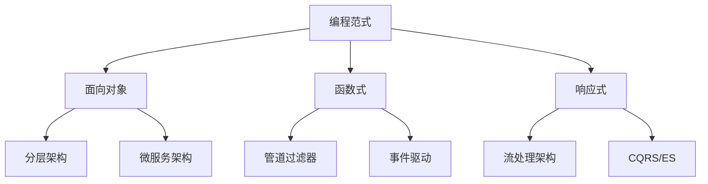

## 背景/引言

在软件开发的漫长历史中，程序员们创造了多种不同的编程思维方式和解决问题的方法，这些方法被称为编程范式（Programming Paradigm）。编程范式是一种编程的基本风格或方法，它定义了程序员如何构建程序的结构和元素。

随着软件复杂性的不断增加，理解和掌握不同的编程范式变得越来越重要。每种范式都有其独特的优势和适用场景，选择合适的编程范式可以大大提高开发效率、代码质量和项目的可维护性。

除了近年来备受关注的面向切面编程（AOP）之外，还有许多其他重要的编程范式值得我们深入了解。本文将系统地介绍主流的编程范式，包括它们的核心概念、实际应用场景和代码示例。

## 核心概念

### 什么是编程范式

编程范式是一种编程的基本风格或方法，它为程序员提供了一套解决问题的思维模式和工具。不同的编程范式强调不同的编程概念和技术，如对象、函数、过程、声明等。

### 编程范式的分类

编程范式可以从多个维度进行分类：

1. **按抽象程度分类**：
   - 低级范式：机器语言、汇编语言
   - 高级范式：面向对象、函数式、声明式等

2. **按执行模型分类**：
   - 命令式范式：描述如何执行
   - 声明式范式：描述要做什么

3. **按程序结构分类**：
   - 结构化范式：过程式编程
   - 非结构化范式：面向对象编程

## 主要编程范式详解

### 1. 面向对象编程（Object-Oriented Programming, OOP）

面向对象编程是最广泛使用的编程范式之一，它将现实世界的概念抽象为对象，通过对象之间的交互来解决问题。

#### 核心特征：

- **封装（Encapsulation）**：将数据和方法封装在对象内部
- **继承（Inheritance）**：子类可以继承父类的属性和方法
- **多态（Polymorphism）**：同一接口可以有不同的实现
- **抽象（Abstraction）**：隐藏实现细节，只暴露必要的接口

#### 代码示例（Java）：

```java
// 抽象类
abstract class Animal {
    protected String name;

    public Animal(String name) {
        this.name = name;
    }

    // 抽象方法
    public abstract void makeSound();

    // 具体方法
    public void eat() {
        System.out.println(name + " is eating.");
    }
}

// 继承和多态
class Dog extends Animal {
    public Dog(String name) {
        super(name);
    }

    @Override
    public void makeSound() {
        System.out.println(name + " says: Woof!");
    }
}

class Cat extends Animal {
    public Cat(String name) {
        super(name);
    }

    @Override
    public void makeSound() {
        System.out.println(name + " says: Meow!");
    }
}

// 使用多态
public class Main {
    public static void main(String[] args) {
        Animal[] animals = {
            new Dog("Buddy"),
            new Cat("Whiskers")
        };

        for (Animal animal : animals) {
            animal.makeSound(); // 多态调用
            animal.eat();
        }
    }
}
```

#### 适用场景：

- 大型软件系统开发
- 需要复用代码的项目
- 团队协作开发
- 需要扩展性和维护性的长期项目

### 2. 函数式编程（Functional Programming, FP）

函数式编程将计算视为函数的求值过程，强调函数的纯粹性和不可变性。

#### 核心特征：

- **纯函数（Pure Functions）**：输入相同时输出始终相同，无副作用
- **不可变性（Immutability）**：数据一旦创建就不能修改
- **高阶函数（Higher-Order Functions）**：可以接受函数作为参数或返回函数
- **函数组合（Function Composition）**：通过组合简单函数构建复杂功能

#### 代码示例（JavaScript）：

```javascript
// 纯函数示例
const add = (a, b) => a + b;
const multiply = (a, b) => a * b;

// 高阶函数
const createMultiplier = (factor) => (number) => number * factor;
const double = createMultiplier(2);
const triple = createMultiplier(3);

// 函数组合
const compose = (f, g) => (x) => f(g(x));
const addOne = (x) => x + 1;
const square = (x) => x * x;

const addOneAndSquare = compose(square, addOne);
console.log(addOneAndSquare(4)); // 25

// 使用数组的函数式方法
const numbers = [1, 2, 3, 4, 5];

const result = numbers
  .filter((n) => n % 2 === 0) // 过滤偶数
  .map((n) => n * 2) // 每个数乘以2
  .reduce((sum, n) => sum + n, 0); // 求和

console.log(result); // 12

// 不可变性示例
const updatePerson = (person, updates) => ({
  ...person,
  ...updates,
});

const person = { name: "John", age: 30 };
const updatedPerson = updatePerson(person, { age: 31 });
console.log(person); // { name: 'John', age: 30 } (原对象未改变)
console.log(updatedPerson); // { name: 'John', age: 31 }
```

#### 适用场景：

- 数据处理和转换
- 并发编程
- 数学计算密集型应用
- 需要高可靠性的系统

### 3. 过程式编程（Procedural Programming）

过程式编程是一种基于过程调用的编程范式，程序由一系列函数或过程组成，这些过程按照特定顺序执行。

#### 核心特征：

- **模块化设计**：将程序分解为独立的函数或过程
- **顺序执行**：程序按照从上到下的顺序执行
- **数据和函数分离**：数据结构和操作它们的函数是分开的
- **局部变量**：函数内部的变量只在函数内部有效

#### 代码示例（C）：

```c
#include <stdio.h>
#include <stdlib.h>

// 函数声明
int* createArray(int size);
void fillArray(int* arr, int size);
void printArray(int* arr, int size);
int findMax(int* arr, int size);
void sortArray(int* arr, int size);

// 主函数
int main() {
    int size = 5;
    int* numbers = createArray(size);

    fillArray(numbers, size);
    printf("Original array: ");
    printArray(numbers, size);

    int max = findMax(numbers, size);
    printf("Maximum value: %d\n", max);

    sortArray(numbers, size);
    printf("Sorted array: ");
    printArray(numbers, size);

    free(numbers);
    return 0;
}

// 创建数组
int* createArray(int size) {
    return (int*)malloc(size * sizeof(int));
}

// 填充数组
void fillArray(int* arr, int size) {
    for (int i = 0; i < size; i++) {
        arr[i] = rand() % 100;
    }
}

// 打印数组
void printArray(int* arr, int size) {
    for (int i = 0; i < size; i++) {
        printf("%d ", arr[i]);
    }
    printf("\n");
}

// 查找最大值
int findMax(int* arr, int size) {
    int max = arr[0];
    for (int i = 1; i < size; i++) {
        if (arr[i] > max) {
            max = arr[i];
        }
    }
    return max;
}

// 冒泡排序
void sortArray(int* arr, int size) {
    for (int i = 0; i < size - 1; i++) {
        for (int j = 0; j < size - i - 1; j++) {
            if (arr[j] > arr[j + 1]) {
                int temp = arr[j];
                arr[j] = arr[j + 1];
                arr[j + 1] = temp;
            }
        }
    }
}
```

#### 适用场景：

- 系统编程
- 嵌入式开发
- 算法实现
- 性能要求较高的应用

### 4. 声明式编程（Declarative Programming）

声明式编程关注的是"要做什么"而不是"如何做"，程序员只需要描述期望的结果，而不需要详细描述实现过程。

#### 核心特征：

- **描述性**：描述期望的结果而非实现步骤
- **抽象层次高**：隐藏底层实现细节
- **可读性强**：代码更接近自然语言
- **易于维护**：修改需求时通常只需修改描述

#### 代码示例（SQL 和 HTML）：

```sql
-- SQL 是声明式编程的典型例子
-- 查询员工信息，按工资降序排列
SELECT
    e.name,
    e.salary,
    d.department_name
FROM employees e
JOIN departments d ON e.department_id = d.id
WHERE e.salary > 50000
ORDER BY e.salary DESC
LIMIT 10;

-- 创建视图
CREATE VIEW high_salary_employees AS
SELECT
    name,
    salary,
    hire_date
FROM employees
WHERE salary > (
    SELECT AVG(salary) FROM employees
);
```

```html
<!-- HTML 也是声明式的例子 -->
<!DOCTYPE html>
<html>
  <head>
    <title>用户列表</title>
    <style>
      .user-card {
        border: 1px solid #ddd;
        padding: 10px;
        margin: 10px;
        border-radius: 5px;
      }
      .user-card:hover {
        background-color: #f0f0f0;
      }
    </style>
  </head>
  <body>
    <div id="user-list">
      <div class="user-card">
        <h3>张三</h3>
        <p>邮箱: zhang@example.com</p>
        <p>部门: 技术部</p>
      </div>
      <div class="user-card">
        <h3>李四</h3>
        <p>邮箱: li@example.com</p>
        <p>部门: 市场部</p>
      </div>
    </div>
  </body>
</html>
```

#### React 中的声明式编程：

```jsx
// 声明式的 React 组件
const UserList = ({ users, onUserClick }) => {
  return (
    <div className="user-list">
      {users
        .filter((user) => user.active)
        .map((user) => (
          <UserCard
            key={user.id}
            user={user}
            onClick={() => onUserClick(user.id)}
          />
        ))}
    </div>
  );
};

const UserCard = ({ user, onClick }) => (
  <div className="user-card" onClick={onClick}>
    <h3>{user.name}</h3>
    <p>邮箱: {user.email}</p>
    <p>部门: {user.department}</p>
  </div>
);
```

#### 适用场景：

- 数据库查询
- 配置文件
- 用户界面描述
- 规则引擎

### 5. 响应式编程（Reactive Programming）

响应式编程是一种面向数据流和变化传播的编程范式，它专注于异步数据流的处理。

#### 核心特征：

- **异步数据流**：处理随时间变化的数据流
- **观察者模式**：数据变化时自动通知订阅者
- **函数式组合**：使用函数式方法处理数据流
- **背压处理**：处理生产者比消费者快的情况

#### 代码示例（RxJS）：

```javascript
import { fromEvent, interval, combineLatest } from "rxjs";
import {
  map,
  filter,
  debounceTime,
  distinctUntilChanged,
} from "rxjs/operators";

// 创建搜索框的响应式处理
const searchInput = document.getElementById("search");
const searchStream = fromEvent(searchInput, "input").pipe(
  map((event) => event.target.value),
  filter((text) => text.length > 2),
  debounceTime(300),
  distinctUntilChanged()
);

// 订阅搜索流
searchStream.subscribe((searchTerm) => {
  console.log("搜索:", searchTerm);
  // 执行搜索逻辑
  performSearch(searchTerm);
});

// 创建定时器流
const timer = interval(1000).pipe(map((i) => `Timer: ${i}`));

// 鼠标移动流
const mouseMove = fromEvent(document, "mousemove").pipe(
  map((event) => ({ x: event.clientX, y: event.clientY }))
);

// 组合多个流
const combined = combineLatest([timer, mouseMove]).pipe(
  map(([time, mouse]) => ({
    time,
    mouse,
    timestamp: new Date().toISOString(),
  }))
);

combined.subscribe((data) => {
  console.log("组合数据:", data);
});

// 处理 HTTP 请求流
const httpRequest = fetch("/api/data")
  .then((response) => response.json())
  .catch((error) => console.error("请求失败:", error));

// 使用 Observable 包装 Promise
const httpStream = from(httpRequest);
httpStream.subscribe(
  (data) => console.log("数据:", data),
  (error) => console.error("错误:", error),
  () => console.log("完成")
);

// 创建自定义 Observable
const customObservable = new Observable((observer) => {
  let count = 0;
  const interval = setInterval(() => {
    observer.next(count++);
    if (count > 10) {
      observer.complete();
    }
  }, 1000);

  // 清理函数
  return () => clearInterval(interval);
});

customObservable.subscribe(
  (value) => console.log("值:", value),
  (error) => console.error("错误:", error),
  () => console.log("流结束")
);
```

#### 适用场景：

- 用户界面交互
- 实时数据处理
- 事件驱动系统
- 微服务架构

### 6. 泛型编程（Generic Programming）

泛型编程允许编写可以处理多种数据类型的代码，提高代码的重用性和类型安全性。

#### 核心特征：

- **类型参数化**：使用类型参数而不是具体类型
- **编译时类型检查**：在编译时确保类型安全
- **代码重用**：一套代码可以处理多种类型
- **性能优化**：避免运行时的类型转换

#### 代码示例（TypeScript）：

```typescript
// 泛型函数
function identity<T>(arg: T): T {
  return arg;
}

// 使用泛型函数
const numberResult = identity<number>(42);
const stringResult = identity<string>("Hello");
const booleanResult = identity<boolean>(true);

// 泛型约束
interface Lengthwise {
  length: number;
}

function loggingIdentity<T extends Lengthwise>(arg: T): T {
  console.log(arg.length);
  return arg;
}

// 泛型类
class GenericStack<T> {
  private items: T[] = [];

  push(item: T): void {
    this.items.push(item);
  }

  pop(): T | undefined {
    return this.items.pop();
  }

  peek(): T | undefined {
    return this.items[this.items.length - 1];
  }

  isEmpty(): boolean {
    return this.items.length === 0;
  }

  size(): number {
    return this.items.length;
  }
}

// 使用泛型类
const numberStack = new GenericStack<number>();
numberStack.push(1);
numberStack.push(2);
console.log(numberStack.pop()); // 2

const stringStack = new GenericStack<string>();
stringStack.push("Hello");
stringStack.push("World");
console.log(stringStack.pop()); // "World"

// 泛型接口
interface GenericRepository<T> {
  findById(id: string): Promise<T | null>;
  save(entity: T): Promise<T>;
  delete(id: string): Promise<void>;
  findAll(): Promise<T[]>;
}

// 实现泛型接口
class UserRepository implements GenericRepository<User> {
  async findById(id: string): Promise<User | null> {
    // 实现查找逻辑
    return null;
  }

  async save(user: User): Promise<User> {
    // 实现保存逻辑
    return user;
  }

  async delete(id: string): Promise<void> {
    // 实现删除逻辑
  }

  async findAll(): Promise<User[]> {
    // 实现查找所有逻辑
    return [];
  }
}

// 高级泛型用法
type ApiResponse<T> = {
  data: T;
  status: number;
  message: string;
};

function createApiResponse<T>(
  data: T,
  status: number,
  message: string
): ApiResponse<T> {
  return { data, status, message };
}

const userResponse = createApiResponse({ id: 1, name: "John" }, 200, "Success");
```

#### 适用场景：

- 数据结构和算法库
- 框架和库开发
- 类型安全的API设计
- 通用工具函数

## 最佳实践

### 1. 范式选择指南

选择合适的编程范式需要考虑以下因素：

- **项目规模**：小型项目可以使用过程式编程，大型项目建议使用面向对象
- **团队技能**：团队熟悉的范式通常是最佳选择
- **性能要求**：对性能要求极高的场景可以考虑过程式编程
- **维护性**：长期维护的项目建议使用面向对象或函数式编程
- **问题特性**：数据处理适合函数式，界面开发适合声明式

### 2. 混合使用范式

现代编程语言通常支持多种范式，我们可以根据需要混合使用：

```javascript
// 混合使用面向对象和函数式编程
class DataProcessor {
  constructor(data) {
    this.data = data;
  }

  // 使用函数式方法处理数据
  process() {
    return this.data
      .filter((item) => item.active)
      .map((item) => this.transform(item))
      .reduce((acc, item) => acc + item.value, 0);
  }

  // 纯函数
  transform(item) {
    return {
      ...item,
      value: item.value * 2,
      processed: true,
    };
  }
}

// 使用响应式编程处理异步操作
const processor = new DataProcessor(rawData);
const result$ = from(processor.process()).pipe(
  tap((result) => console.log("处理结果:", result)),
  catchError((error) => {
    console.error("处理错误:", error);
    return of(null);
  })
);
```

### 3. 常见陷阱和注意事项

#### 面向对象编程陷阱：

- **过度设计**：不要为了使用设计模式而使用
- **继承滥用**：优先使用组合而不是继承
- **违反单一职责**：一个类应该只有一个改变的理由

#### 函数式编程陷阱：

- **性能问题**：不可变数据结构可能影响性能
- **调试困难**：函数组合可能使调试变得复杂
- **学习曲线**：对于习惯命令式编程的开发者来说学习曲线较陡

#### 响应式编程陷阱：

- **内存泄漏**：忘记取消订阅可能导致内存泄漏
- **复杂性**：过度使用可能使代码变得难以理解
- **调试困难**：异步流的调试比同步代码更困难

## 进阶内容

### 1. 范式演化趋势

编程范式仍在不断演化，一些新的趋势包括：

- **并发编程范式**：如Actor模型、CSP（Communicating Sequential Processes）
- **领域特定语言**：针对特定领域的编程范式
- **量子编程**：量子计算带来的新编程范式
- **机器学习范式**：基于神经网络的可微编程

### 2. 范式与架构设计

不同的编程范式对软件架构有不同的影响：



### 3. 范式与设计模式

每种编程范式都有其对应的设计模式：

- **面向对象**：单例模式、工厂模式、观察者模式
- **函数式**：柯里化、偏函数应用、函子模式
- **响应式**：观察者模式、发布订阅模式、背压模式

## 总结

编程范式是程序员必须掌握的基础知识，不同的范式适用于不同的场景和问题。通过本文的介绍，我们可以看到：

### 关键要点：

1. **多范式语言的优势**：现代编程语言通常支持多种范式，可以根据需要灵活选择
2. **范式不是银弹**：没有万能的编程范式，需要根据具体情况选择
3. **学习多种范式**：掌握多种编程范式有助于提高编程思维和解决问题的能力
4. **实践中的混合使用**：现实项目中往往需要混合使用多种范式

### 实用建议：

1. **深入理解核心概念**：每种范式都有其核心思想，要深入理解而不是浅尝辄止
2. **多实践**：通过实际项目来体验不同范式的优缺点
3. **关注演化趋势**：编程范式仍在发展，要保持学习新范式的敏感性
4. **选择合适的工具**：不同范式需要不同的工具和框架支持

### 学习资源：

- **经典书籍**：《设计模式》、《函数式编程思维》、《响应式编程》
- **在线课程**：Coursera、edX上的编程范式课程
- **实践项目**：Github上的开源项目，观察不同范式的实际应用
- **社区讨论**：Stack Overflow、Reddit等技术社区的讨论

编程范式的选择和应用是一个需要不断实践和思考的过程。通过理解和掌握多种编程范式，我们可以成为更全面、更有效的程序员，写出更好的代码。记住，最好的编程范式就是最适合当前问题和团队的范式。
