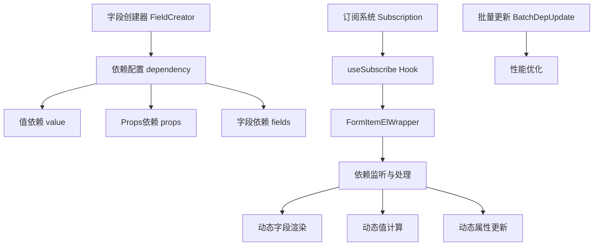

# 详细讲解Form组件的依赖关系

_Exported on 2025/7/16 at GMT+8 21:07:57 from Cursor (1.2.4)_

---

**User**

@/schema-components 给我讲清楚这个组件库Form的值依赖，props依赖以及字段依赖是怎么实现的，要求文档级级别给我阐述清楚

---

**Cursor**

我来帮您详细分析 schema-components 组件库中 Form 的依赖实现机制。让我先探索一下代码结构，了解具体的实现细节。

# Schema-Components Form 依赖机制深度解析

基于我对代码的深入分析，现在为您详细阐述 schema-components 组件库中 Form 的三种依赖实现机制。

## 🏗️ 整体架构概览

Schema-Components 的 Form 依赖系统基于以下核心组件构建：



## 📋 一、值依赖 (Value Dependency) 实现机制

### 1.1 核心原理

值依赖通过监听指定字段的变化，自动计算并更新当前字段的值。

### 1.2 API 设计

```typescript
// 字段创建器中的值依赖方法
DependencyValue<Key extends string>(
  deps: Key[],
  depFn: DependencyValueFn<AnyObject, Key>
) {
  this._mergeVal({ dependency: { deps, value: depFn } })
  return this
}
```

### 1.3 使用示例

```typescript
F("值依赖字段", "combinedValue").DependencyValue(
  ["gender", "hobby"],
  (depValues, ctx) => {
    // depValues: { gender: 'male', hobby: 'basketball' }
    // ctx: { allValues, changedDepKeys, formRef, batchUpdate }
    return [depValues.gender, depValues.hobby].filter(Boolean).join("-");
  }
);
```

### 1.4 底层实现机制

**1. 依赖监听设置**

```typescript
// FormItemElWrapper.tsx 中的实现
const deps = field.dependency?.fields ? undefined : field.dependency?.deps;
const { allDepValues: depValues, changedDepKeys } = useSubscribe<TData>(
  subscription,
  deps
);
```

**2. 值计算与更新**

```typescript
useDeepCompareEffect(() => {
  if (deps && deps.length > 0 && depValueFn) {
    // 计算新值
    const newValue = (depValueFn as DepValueFn<TData>)(depValues, {
      allValues: formValue.getValue(),
      changedDepKeys,
      formRef,
      batchUpdate: BatchDepUpdate.update,
    });

    // 批量更新处理
    const finalValue = BatchDepUpdate.getValues<TData>(
      field.dataIndex,
      newValue
    );

    // 异步更新避免循环依赖
    Schedular.nextMacro(() => {
      formRef.current?.mergeFieldsValue?.(finalValue);
    });
  }
}, [deps, depValues]);
```

### 1.5 特性与优势

- **自动计算**: 依赖字段变化时自动触发值计算
- **批量更新**: 支持一次性更新多个字段值
- **异步更新**: 避免循环依赖和性能问题
- **类型安全**: TypeScript 完整类型支持

## 🎛️ 二、Props依赖 (Props Dependency) 实现机制

### 2.1 核心原理

Props依赖根据依赖字段的值动态修改字段组件的属性，包括 `fieldProps`、`formItemProps` 和 `wrapperProps`。

### 2.2 API 设计

```typescript
// 字段属性依赖
DependencyMFP<Key extends string, ValueType extends ValueTypePresets = 'text'>(
  type: ValueType,
  deps: Key[],
  depFn: DependencyFieldPropsFn<AnyObject, Key, ExtractGetter<...>>
)

// 表单项属性依赖
DependencyMFIP<Key extends string>(
  deps: Key[],
  depFn: DependencyFormItemPropsFn<AnyObject, Key>
)

// 包装器属性依赖
DependencyMWP<Key extends string>(
  deps: Key[],
  depFn: DependencyWrapperPropsFn<AnyObject, Key, WrapperProps>
)
```

### 2.3 使用示例

```typescript
F("Props依赖示例", "dynamicField")
  .DependencyMFIP(["gender"], (depValues) => ({
    labelPlacement: depValues.gender === "male" ? "left" : "right",
  }))
  .DependencyMWP(["gender"], (depValues) => ({
    span: depValues.gender === "male" ? 12 : 24,
  }))
  .DependencyMFP("text", ["gender"], (depValues) => ({
    disabled: depValues.gender === "male",
    readOnly: depValues.gender === "female",
  }));
```

### 2.4 底层实现机制

**1. Props计算与缓存**

```typescript
// FormItemElWrapper.tsx 中的 props 依赖处理
const nextField = useDeepCompareMemo(() => {
  const { field, ...ctx } = depPropsCtxRef.current;
  return generateDepPropsField(field, ctx);
}, [deps, depValues, field, fieldControlState]);
```

**2. 动态字段生成**

```typescript
function generateDepPropsField<TData extends AnyObject>(
  field: FieldConfigType<TData>,
  ctx: GenerateDepFieldConfigCtxType<TData>
) {
  const {
    fieldProps: depFieldProps,
    wrapperProps: depWrapperProps,
    formItemProps: depFormItemProps,
  } = field.dependency?.props || {};

  if (
    depFieldProps ||
    depWrapperProps ||
    depFormItemProps ||
    fieldControlState
  ) {
    const { depValues, allValues, changedDepKeys, formRef } = ctx;
    const nextCtx = { field, allValues, changedDepKeys, formRef };

    // 计算各种属性
    const fieldProps = (depFieldProps as DepFieldPropsFn<TData>)?.(
      depValues,
      nextCtx
    );
    const formItemProps = (depFormItemProps as DepFormItemPropsFn<TData>)?.(
      depValues,
      nextCtx
    );
    const wrapperProps = (depWrapperProps as DepWrapperPropsFn<TData>)?.(
      depValues,
      nextCtx
    );

    // 使用字段创建器辅助类动态更新
    const helper = new FieldCreatorHelper(EditableFieldCreator);
    helper.setInstance(field);
    helper.setPipeGetter("fieldProps", fieldProps);
    helper.setPipeGetter("formItemProps", formItemProps);
    helper.mergeVal({ wrapperProps: wrapperProps || {} });

    return helper.val as FieldConfigType<TData>;
  }

  return field;
}
```

### 2.5 特性与优势

- **细粒度控制**: 分别控制字段属性、表单项属性、包装器属性
- **动态响应**: 依赖变化时实时更新组件属性
- **性能优化**: 基于深度比较的记忆化计算
- **灵活配置**: 支持复杂的条件逻辑

## 🔄 三、字段依赖 (Fields Dependency) 实现机制

### 3.1 核心原理

字段依赖根据依赖字段的值动态生成完全不同的字段配置，实现字段的动态切换。

### 3.2 API 设计

```typescript
// 主字段依赖 - 完全替换当前字段
DependencyFields<Key extends string>(
  deps: Key[],
  depFn: DependencyFieldsFn<AnyObject, Key>
) {
  this._setVal('dependency', { deps, fields: depFn })
  return this
}

// 子字段依赖 - 用于复杂字段内部
ChildDependencyFields<Key extends string>(
  deps: Key[],
  depFn: DependencyFieldsFn<AnyObject, Key>
) {
  this._setVal('dependency', { deps, childFields: depFn })
  return this
}
```

### 3.3 使用示例

```typescript
F("爱好(字段依赖)", "hobby").DependencyFields(["gender"], (depValues, ctx) => {
  // 手动重置字段值避免残留
  if (ctx.allValues.hobby) {
    ctx.formRef.current?.setFieldsValueAsync({ hobby: null });
  }

  if (depValues.gender === "male") {
    return [
      F("爱好", "hobby")
        .Update()
        .MFP("radio", {
          data: [
            { title: "篮球", id: "basketball" },
            { title: "足球", id: "football" },
          ],
        }).val,
    ];
  } else if (depValues.gender === "female") {
    return [
      F("爱好", "hobby")
        .Update()
        .MFP("radio", {
          data: [
            { title: "游泳", id: "swimming" },
            { title: "跑步", id: "running" },
          ],
        }).val,
    ];
  }

  return []; // 返回空数组表示不渲染任何字段
});
```

### 3.4 底层实现机制

**1. 字段依赖验证**

```typescript
function validateDependency(field: FieldConfigType): void {
  if (!field.dependency) return;

  // 检查 deps 是否存在
  if (!field.dependency.deps || !field.dependency.deps.length) {
    console.error(`字段 ${field.key} 的 dependency 配置缺少必需的 deps 属性`);
    return;
  }

  // fields 与 value/props 互斥
  if (field.dependency.fields) {
    if (field.dependency.value || field.dependency.props) {
      field.dependency.value = undefined;
      field.dependency.props = undefined;
      console.error(
        `字段 ${field.key} 的 dependency: fields 不能与 value 或 props 同时使用`
      );
    }
  }
}
```

**2. 动态字段处理**

```typescript
// FormFieldsMapper.tsx 中的依赖处理
const processDependency = (
  field: FormFieldConfigType
): FormFieldConfigType[] => {
  if (!field.dependency) return [field];

  const { deps } = field.dependency;
  const depFields = field.dependency[
    depFieldsPropName
  ] as typeof field.dependency.fields;

  // 检查是否有相关依赖变化
  const hasRelevantChanges = deps.some((dep) => changedDepKeys.includes(dep));

  // 缓存机制优化性能
  if (!hasRelevantChanges && depFieldsCacheRef.current.has(field.key)) {
    return depFieldsCacheRef.current.get(field.key) || [];
  }

  // 获取依赖值并执行字段生成函数
  const currentDepValues = pick(depValues, deps);

  if (depFields) {
    const _newFields = depFields(currentDepValues, {
      allValues: props.allValues,
      changedDepKeys,
      formRef: props.formRef,
      parentDataIndex: props.parentDataIndex,
    });

    // 标准化并缓存结果
    const newFields = _newFields.map(
      props.normalizeChildField || dftNormalizeChildField
    );
    depFieldsCacheRef.current.set(field.key, newFields);

    // 递归处理新字段的依赖
    return newFields.flatMap(processDependency);
  }

  return [field];
};
```

### 3.5 特性与优势

- **完全动态**: 可以完全替换字段配置
- **缓存机制**: 避免不必要的重复计算
- **递归支持**: 新生成的字段也可以有依赖
- **灵活控制**: 支持条件性渲染和复杂逻辑

## ⚡ 四、底层订阅系统

### 4.1 Subscription 类

这是整个依赖系统的核心，提供了强大的状态管理和订阅能力：

```typescript
export class Subscription<T> {
  // 核心方法
  setValue(newValue: T | ((prev: T) => T)): void;
  mergeValue(patch: PatchType<T>): BatchUpdateResult<T> | null;
  async batchMerge(patch: PatchType<T>): Promise<BatchUpdateResult<T> | null>;
  subscribe(
    listener: EventListenerType<T>,
    opts?: SubscribeOptions
  ): () => void;
}
```

### 4.2 useSubscribe Hook

提供了 React 友好的订阅接口：

```typescript
export function useSubscribe<T extends AnyObject, Key extends keyof T = keyof T>(
  subscription: Subscription<T>,
  deps?: Key[]
): SubscribeResult<T, Key> {
  return {
    allDepValues: Pick<T, Key>, // 所有依赖字段的值
    changedDepKeys: Key[],      // 发生变化的依赖字段
    changedDepValues: Partial<Pick<T, Key>> // 变化的依赖字段值
  }
}
```

### 4.3 路径订阅优化

对于复杂数据结构（如表格），系统支持路径订阅避免性能问题：

```typescript
// 路径订阅避免广播给数量众多的末端订阅者
return subscription.subscribe(listener, {
  path: [
    [0, "name"],
    [1, "age"],
  ], // 仅订阅特定路径
});
```

## 🚀 五、批量更新机制

### 5.1 BatchDepUpdate 工具类

```typescript
export class BatchDepUpdate {
  // 标记为批量更新
  static update<TData extends AnyObject>(values: Partial<TData>) {
    return { _IS_BATCH_UPDATE_: true as const, values };
  }

  // 检查是否为批量更新
  static isBatch<TData extends AnyObject>(
    value: unknown
  ): value is BatchUpdatePayloadType<TData>;

  // 获取最终的更新值
  static getValues<TData extends AnyObject>(
    key: FieldPath,
    value: unknown
  ): Partial<TData>;
}
```

### 5.2 批量更新优势

- **性能优化**: 多个字段变化时合并为一次更新
- **避免循环**: 防止依赖链造成的无限循环
- **异步处理**: 使用宏任务队列避免阻塞

## 🔍 六、依赖执行优先级与冲突处理

### 6.1 优先级规则

1. **字段依赖** > 值依赖 + Props依赖
2. 字段依赖会完全替换原字段，其他依赖失效
3. 值依赖和 Props依赖可以同时使用

### 6.2 冲突检测

```typescript
// 自动检测并处理冲突配置
if (field.dependency.fields) {
  if (field.dependency.value || field.dependency.props) {
    field.dependency.value = undefined;
    field.dependency.props = undefined;
    console.error("fields 不能与 value 或 props 同时使用");
  }
}
```

## 🎯 七、最佳实践与注意事项

### 7.1 性能优化建议

1. **合理使用缓存**: 字段依赖会自动缓存计算结果
2. **避免深度依赖**: 过深的依赖链会影响性能
3. **批量更新**: 多个字段变化时使用 `batchUpdate`

### 7.2 常见陷阱

1. **循环依赖**: A 依赖 B，B 依赖 A
2. **值残留**: 字段依赖切换时需要手动重置值
3. **异步时序**: 依赖计算是异步的，注意时序问题

### 7.3 推荐用法

```typescript
// 推荐：明确的依赖关系
F("计算字段", "computed").DependencyValue(
  ["a", "b"],
  (deps) => deps.a + deps.b
);

// 推荐：条件性字段渲染
F("动态字段", "dynamic").DependencyFields(["type"], (deps) => {
  return deps.type === "advanced" ? advancedFields : basicFields;
});

// 推荐：响应式属性更新
F("响应式字段", "responsive").DependencyMFP("select", ["category"], (deps) => ({
  data: getOptionsByCategory(deps.category),
}));
```

## 📊 八、总结

Schema-Components 的 Form 依赖系统通过以下核心机制实现了强大而灵活的表单动态能力：

1. **订阅驱动**: 基于 Subscription 类的响应式状态管理
2. **三种依赖**: 值依赖、Props依赖、字段依赖满足不同场景
3. **性能优化**: 缓存、批量更新、路径订阅等优化策略
4. **类型安全**: 完整的 TypeScript 类型支持
5. **易用 API**: 通过字段创建器提供链式调用接口

这套依赖系统为复杂表单场景提供了完整的解决方案，支持从简单的值计算到复杂的字段动态生成，是一个设计精良的企业级表单解决方案。

```plaintext
graph TD
    A[字段创建器 FieldCreator] --> B[依赖配置 dependency]
    B --> C[值依赖 value]
    B --> D[Props依赖 props]
    B --> E[字段依赖 fields]

    F[订阅系统 Subscription] --> G[useSubscribe Hook]
    G --> H[FormItemElWrapper]
    H --> I[依赖监听与处理]

    J[批量更新 BatchDepUpdate] --> K[性能优化]

    I --> L[动态字段渲染]
    I --> M[动态值计算]
    I --> N[动态属性更新]
```

```typescript
// 字段创建器中的值依赖方法
DependencyValue<Key extends string>(
  deps: Key[],
  depFn: DependencyValueFn<AnyObject, Key>
) {
  this._mergeVal({ dependency: { deps, value: depFn } })
  return this
}
```

```typescript
F("值依赖字段", "combinedValue").DependencyValue(
  ["gender", "hobby"],
  (depValues, ctx) => {
    // depValues: { gender: 'male', hobby: 'basketball' }
    // ctx: { allValues, changedDepKeys, formRef, batchUpdate }
    return [depValues.gender, depValues.hobby].filter(Boolean).join("-");
  }
);
```

```typescript
// FormItemElWrapper.tsx 中的实现
const deps = field.dependency?.fields ? undefined : field.dependency?.deps;
const { allDepValues: depValues, changedDepKeys } = useSubscribe<TData>(
  subscription,
  deps
);
```

```typescript
useDeepCompareEffect(() => {
  if (deps && deps.length > 0 && depValueFn) {
    // 计算新值
    const newValue = (depValueFn as DepValueFn<TData>)(depValues, {
      allValues: formValue.getValue(),
      changedDepKeys,
      formRef,
      batchUpdate: BatchDepUpdate.update,
    });

    // 批量更新处理
    const finalValue = BatchDepUpdate.getValues<TData>(
      field.dataIndex,
      newValue
    );

    // 异步更新避免循环依赖
    Schedular.nextMacro(() => {
      formRef.current?.mergeFieldsValue?.(finalValue);
    });
  }
}, [deps, depValues]);
```

```typescript
// 字段属性依赖
DependencyMFP<Key extends string, ValueType extends ValueTypePresets = 'text'>(
  type: ValueType,
  deps: Key[],
  depFn: DependencyFieldPropsFn<AnyObject, Key, ExtractGetter<...>>
)

// 表单项属性依赖
DependencyMFIP<Key extends string>(
  deps: Key[],
  depFn: DependencyFormItemPropsFn<AnyObject, Key>
)

// 包装器属性依赖
DependencyMWP<Key extends string>(
  deps: Key[],
  depFn: DependencyWrapperPropsFn<AnyObject, Key, WrapperProps>
)
```

```typescript
F("Props依赖示例", "dynamicField")
  .DependencyMFIP(["gender"], (depValues) => ({
    labelPlacement: depValues.gender === "male" ? "left" : "right",
  }))
  .DependencyMWP(["gender"], (depValues) => ({
    span: depValues.gender === "male" ? 12 : 24,
  }))
  .DependencyMFP("text", ["gender"], (depValues) => ({
    disabled: depValues.gender === "male",
    readOnly: depValues.gender === "female",
  }));
```

```typescript
// FormItemElWrapper.tsx 中的 props 依赖处理
const nextField = useDeepCompareMemo(() => {
  const { field, ...ctx } = depPropsCtxRef.current;
  return generateDepPropsField(field, ctx);
}, [deps, depValues, field, fieldControlState]);
```

```typescript
function generateDepPropsField<TData extends AnyObject>(
  field: FieldConfigType<TData>,
  ctx: GenerateDepFieldConfigCtxType<TData>
) {
  const {
    fieldProps: depFieldProps,
    wrapperProps: depWrapperProps,
    formItemProps: depFormItemProps,
  } = field.dependency?.props || {};

  if (
    depFieldProps ||
    depWrapperProps ||
    depFormItemProps ||
    fieldControlState
  ) {
    const { depValues, allValues, changedDepKeys, formRef } = ctx;
    const nextCtx = { field, allValues, changedDepKeys, formRef };

    // 计算各种属性
    const fieldProps = (depFieldProps as DepFieldPropsFn<TData>)?.(
      depValues,
      nextCtx
    );
    const formItemProps = (depFormItemProps as DepFormItemPropsFn<TData>)?.(
      depValues,
      nextCtx
    );
    const wrapperProps = (depWrapperProps as DepWrapperPropsFn<TData>)?.(
      depValues,
      nextCtx
    );

    // 使用字段创建器辅助类动态更新
    const helper = new FieldCreatorHelper(EditableFieldCreator);
    helper.setInstance(field);
    helper.setPipeGetter("fieldProps", fieldProps);
    helper.setPipeGetter("formItemProps", formItemProps);
    helper.mergeVal({ wrapperProps: wrapperProps || {} });

    return helper.val as FieldConfigType<TData>;
  }

  return field;
}
```

```typescript
// 主字段依赖 - 完全替换当前字段
DependencyFields<Key extends string>(
  deps: Key[],
  depFn: DependencyFieldsFn<AnyObject, Key>
) {
  this._setVal('dependency', { deps, fields: depFn })
  return this
}

// 子字段依赖 - 用于复杂字段内部
ChildDependencyFields<Key extends string>(
  deps: Key[],
  depFn: DependencyFieldsFn<AnyObject, Key>
) {
  this._setVal('dependency', { deps, childFields: depFn })
  return this
}
```

```typescript
F("爱好(字段依赖)", "hobby").DependencyFields(["gender"], (depValues, ctx) => {
  // 手动重置字段值避免残留
  if (ctx.allValues.hobby) {
    ctx.formRef.current?.setFieldsValueAsync({ hobby: null });
  }

  if (depValues.gender === "male") {
    return [
      F("爱好", "hobby")
        .Update()
        .MFP("radio", {
          data: [
            { title: "篮球", id: "basketball" },
            { title: "足球", id: "football" },
          ],
        }).val,
    ];
  } else if (depValues.gender === "female") {
    return [
      F("爱好", "hobby")
        .Update()
        .MFP("radio", {
          data: [
            { title: "游泳", id: "swimming" },
            { title: "跑步", id: "running" },
          ],
        }).val,
    ];
  }

  return []; // 返回空数组表示不渲染任何字段
});
```

```typescript
function validateDependency(field: FieldConfigType): void {
  if (!field.dependency) return;

  // 检查 deps 是否存在
  if (!field.dependency.deps || !field.dependency.deps.length) {
    console.error(`字段 ${field.key} 的 dependency 配置缺少必需的 deps 属性`);
    return;
  }

  // fields 与 value/props 互斥
  if (field.dependency.fields) {
    if (field.dependency.value || field.dependency.props) {
      field.dependency.value = undefined;
      field.dependency.props = undefined;
      console.error(
        `字段 ${field.key} 的 dependency: fields 不能与 value 或 props 同时使用`
      );
    }
  }
}
```

```typescript
// FormFieldsMapper.tsx 中的依赖处理
const processDependency = (
  field: FormFieldConfigType
): FormFieldConfigType[] => {
  if (!field.dependency) return [field];

  const { deps } = field.dependency;
  const depFields = field.dependency[
    depFieldsPropName
  ] as typeof field.dependency.fields;

  // 检查是否有相关依赖变化
  const hasRelevantChanges = deps.some((dep) => changedDepKeys.includes(dep));

  // 缓存机制优化性能
  if (!hasRelevantChanges && depFieldsCacheRef.current.has(field.key)) {
    return depFieldsCacheRef.current.get(field.key) || [];
  }

  // 获取依赖值并执行字段生成函数
  const currentDepValues = pick(depValues, deps);

  if (depFields) {
    const _newFields = depFields(currentDepValues, {
      allValues: props.allValues,
      changedDepKeys,
      formRef: props.formRef,
      parentDataIndex: props.parentDataIndex,
    });

    // 标准化并缓存结果
    const newFields = _newFields.map(
      props.normalizeChildField || dftNormalizeChildField
    );
    depFieldsCacheRef.current.set(field.key, newFields);

    // 递归处理新字段的依赖
    return newFields.flatMap(processDependency);
  }

  return [field];
};
```

```typescript
export class Subscription<T> {
  // 核心方法
  setValue(newValue: T | ((prev: T) => T)): void;
  mergeValue(patch: PatchType<T>): BatchUpdateResult<T> | null;
  async batchMerge(patch: PatchType<T>): Promise<BatchUpdateResult<T> | null>;
  subscribe(
    listener: EventListenerType<T>,
    opts?: SubscribeOptions
  ): () => void;
}
```

```typescript
export function useSubscribe<T extends AnyObject, Key extends keyof T = keyof T>(
  subscription: Subscription<T>,
  deps?: Key[]
): SubscribeResult<T, Key> {
  return {
    allDepValues: Pick<T, Key>, // 所有依赖字段的值
    changedDepKeys: Key[],      // 发生变化的依赖字段
    changedDepValues: Partial<Pick<T, Key>> // 变化的依赖字段值
  }
}
```

```typescript
// 路径订阅避免广播给数量众多的末端订阅者
return subscription.subscribe(listener, {
  path: [
    [0, "name"],
    [1, "age"],
  ], // 仅订阅特定路径
});
```

```typescript
export class BatchDepUpdate {
  // 标记为批量更新
  static update<TData extends AnyObject>(values: Partial<TData>) {
    return { _IS_BATCH_UPDATE_: true as const, values };
  }

  // 检查是否为批量更新
  static isBatch<TData extends AnyObject>(
    value: unknown
  ): value is BatchUpdatePayloadType<TData>;

  // 获取最终的更新值
  static getValues<TData extends AnyObject>(
    key: FieldPath,
    value: unknown
  ): Partial<TData>;
}
```

```typescript
// 自动检测并处理冲突配置
if (field.dependency.fields) {
  if (field.dependency.value || field.dependency.props) {
    field.dependency.value = undefined;
    field.dependency.props = undefined;
    console.error("fields 不能与 value 或 props 同时使用");
  }
}
```

```typescript
// 推荐：明确的依赖关系
F("计算字段", "computed").DependencyValue(
  ["a", "b"],
  (deps) => deps.a + deps.b
);

// 推荐：条件性字段渲染
F("动态字段", "dynamic").DependencyFields(["type"], (deps) => {
  return deps.type === "advanced" ? advancedFields : basicFields;
});

// 推荐：响应式属性更新
F("响应式字段", "responsive").DependencyMFP("select", ["category"], (deps) => ({
  data: getOptionsByCategory(deps.category),
}));
```
