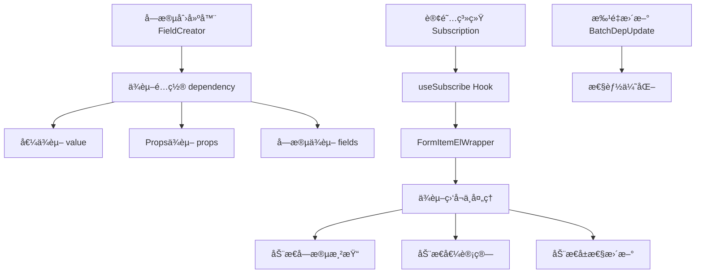

# 详细讲解Form组件的ä¾èµ–关系

_Exported on 2025/7/16 at GMT+8 21:07:57 from Cursor (1.2.4)_

---

**User**

@/schema-components 给我讲清楚这个组件库Form的值ä¾èµ–，propsä¾èµ–以åŠå­—段ä¾èµ–是æ€ä¹ˆå®ç°çš„，è¦æ±‚文档级级别给我é˜è¿°æ¸…楚

---

**Cursor**

我æ¥å¸®æ‚¨è¯¦ç»†åˆ†æ schema-components 组件库中 Form çš„ä¾èµ–å®ç°æœºåˆ¶ã€‚让我先æ¢ç´¢ä¸€ä¸‹ä»£ç ç»“æ„，了解具体的å®ç°ç»†èŠ‚。

# Schema-Components Form ä¾èµ–机制深度解æ

基äºæˆ‘对代ç çš„深入分æ，ç°åœ¨ä¸ºæ‚¨è¯¦ç»†é˜è¿° schema-components 组件库中 Form 的三ç§ä¾èµ–å®ç°æœºåˆ¶ã€‚

## ğŸ—ï¸ æ•´ä½“æ¶æ„概览

Schema-Components çš„ Form ä¾èµ–系统基äºä»¥ä¸‹æ ¸å¿ƒç»„件æ„建：



## 📋 一ã€å€¼ä¾èµ– (Value Dependency) å®ç°æœºåˆ¶

### 1.1 核心åŸç†

值ä¾èµ–通过监å¬æŒ‡å®šå­—段的å˜åŒ–，自动计算并更新当å‰å­—段的值。

### 1.2 API 设计

```typescript
// 字段创建器中的值ä¾èµ–方法
DependencyValue<Key extends string>(
  deps: Key[],
  depFn: DependencyValueFn<AnyObject, Key>
) {
  this._mergeVal({ dependency: { deps, value: depFn } })
  return this
}
```

### 1.3 使用示例

```typescript
F("值ä¾èµ–字段", "combinedValue").DependencyValue(
  ["gender", "hobby"],
  (depValues, ctx) => {
    // depValues: { gender: 'male', hobby: 'basketball' }
    // ctx: { allValues, changedDepKeys, formRef, batchUpdate }
    return [depValues.gender, depValues.hobby].filter(Boolean).join("-");
  }
);
```

### 1.4 底层å®ç°æœºåˆ¶

**1. ä¾èµ–监å¬è®¾ç½®**

```typescript
// FormItemElWrapper.tsx 中的å®ç°
const deps = field.dependency?.fields ? undefined : field.dependency?.deps;
const { allDepValues: depValues, changedDepKeys } = useSubscribe<TData>(
  subscription,
  deps
);
```

**2. 值计算ä¸æ›´æ–°**

```typescript
useDeepCompareEffect(() => {
  if (deps && deps.length > 0 && depValueFn) {
    // 计算新值
    const newValue = (depValueFn as DepValueFn<TData>)(depValues, {
      allValues: formValue.getValue(),
      changedDepKeys,
      formRef,
      batchUpdate: BatchDepUpdate.update,
    });

    // 批é‡æ›´æ–°å¤„ç†
    const finalValue = BatchDepUpdate.getValues<TData>(
      field.dataIndex,
      newValue
    );

    // 异步更新é¿å…循ç¯ä¾èµ–
    Schedular.nextMacro(() => {
      formRef.current?.mergeFieldsValue?.(finalValue);
    });
  }
}, [deps, depValues]);
```

### 1.5 特性ä¸ä¼˜åŠ¿

- **自动计算**: ä¾èµ–字段å˜åŒ–时自动触å‘值计算
- **批é‡æ›´æ–°**: 支æŒä¸€æ¬¡æ€§æ›´æ–°å¤šä¸ªå­—段值
- **异步更新**: é¿å…循ç¯ä¾èµ–和性能问题
- **ç±»å‹å®‰å…¨**: TypeScript 完整类å‹æ”¯æŒ

## ğŸ›ï¸ 二ã€Propsä¾èµ– (Props Dependency) å®ç°æœºåˆ¶

### 2.1 核心åŸç†

Propsä¾èµ–æ ¹æ®ä¾èµ–字段的值动æ€ä¿®æ”¹å­—段组件的å±æ€§ï¼ŒåŒ…括 `fieldProps`ã€`formItemProps` å’Œ `wrapperProps`。

### 2.2 API 设计

```typescript
// 字段å±æ€§ä¾èµ–
DependencyMFP<Key extends string, ValueType extends ValueTypePresets = 'text'>(
  type: ValueType,
  deps: Key[],
  depFn: DependencyFieldPropsFn<AnyObject, Key, ExtractGetter<...>>
)

// 表å•é¡¹å±æ€§ä¾èµ–
DependencyMFIP<Key extends string>(
  deps: Key[],
  depFn: DependencyFormItemPropsFn<AnyObject, Key>
)

// 包装器å±æ€§ä¾èµ–
DependencyMWP<Key extends string>(
  deps: Key[],
  depFn: DependencyWrapperPropsFn<AnyObject, Key, WrapperProps>
)
```

### 2.3 使用示例

```typescript
F("Propsä¾èµ–示例", "dynamicField")
  .DependencyMFIP(["gender"], (depValues) => ({
    labelPlacement: depValues.gender === "male" ? "left" : "right",
  }))
  .DependencyMWP(["gender"], (depValues) => ({
    span: depValues.gender === "male" ? 12 : 24,
  }))
  .DependencyMFP("text", ["gender"], (depValues) => ({
    disabled: depValues.gender === "male",
    readOnly: depValues.gender === "female",
  }));
```

### 2.4 底层å®ç°æœºåˆ¶

**1. Props计算ä¸ç¼“å­˜**

```typescript
// FormItemElWrapper.tsx 中的 props ä¾èµ–处ç†
const nextField = useDeepCompareMemo(() => {
  const { field, ...ctx } = depPropsCtxRef.current;
  return generateDepPropsField(field, ctx);
}, [deps, depValues, field, fieldControlState]);
```

**2. 动æ€å­—段生æˆ**

```typescript
function generateDepPropsField<TData extends AnyObject>(
  field: FieldConfigType<TData>,
  ctx: GenerateDepFieldConfigCtxType<TData>
) {
  const {
    fieldProps: depFieldProps,
    wrapperProps: depWrapperProps,
    formItemProps: depFormItemProps,
  } = field.dependency?.props || {};

  if (
    depFieldProps ||
    depWrapperProps ||
    depFormItemProps ||
    fieldControlState
  ) {
    const { depValues, allValues, changedDepKeys, formRef } = ctx;
    const nextCtx = { field, allValues, changedDepKeys, formRef };

    // 计算å„ç§å±æ€§
    const fieldProps = (depFieldProps as DepFieldPropsFn<TData>)?.(
      depValues,
      nextCtx
    );
    const formItemProps = (depFormItemProps as DepFormItemPropsFn<TData>)?.(
      depValues,
      nextCtx
    );
    const wrapperProps = (depWrapperProps as DepWrapperPropsFn<TData>)?.(
      depValues,
      nextCtx
    );

    // 使用字段创建器辅助类动æ€æ›´æ–°
    const helper = new FieldCreatorHelper(EditableFieldCreator);
    helper.setInstance(field);
    helper.setPipeGetter("fieldProps", fieldProps);
    helper.setPipeGetter("formItemProps", formItemProps);
    helper.mergeVal({ wrapperProps: wrapperProps || {} });

    return helper.val as FieldConfigType<TData>;
  }

  return field;
}
```

### 2.5 特性ä¸ä¼˜åŠ¿

- **细粒度æ§åˆ¶**: 分别æ§åˆ¶å­—段å±æ€§ã€è¡¨å•é¡¹å±æ€§ã€åŒ…装器å±æ€§
- **动æ€å“应**: ä¾èµ–å˜åŒ–æ—¶å®æ—¶æ›´æ–°ç»„件å±æ€§
- **性能优化**: 基äºæ·±åº¦æ¯”较的记忆化计算
- **çµæ´»é…ç½®**: 支æŒå¤æ‚çš„æ¡ä»¶é€»è¾‘

## 🔄 三ã€å­—段ä¾èµ– (Fields Dependency) å®ç°æœºåˆ¶

### 3.1 核心åŸç†

字段ä¾èµ–æ ¹æ®ä¾èµ–字段的值动æ€ç”Ÿæˆå®Œå…¨ä¸åŒçš„字段é…置，å®ç°å­—段的动æ€åˆ‡æ¢ã€‚

### 3.2 API 设计

```typescript
// 主字段ä¾èµ– - 完全替æ¢å½“å‰å­—段
DependencyFields<Key extends string>(
  deps: Key[],
  depFn: DependencyFieldsFn<AnyObject, Key>
) {
  this._setVal('dependency', { deps, fields: depFn })
  return this
}

// å­å­—段ä¾èµ– - 用äºå¤æ‚字段内部
ChildDependencyFields<Key extends string>(
  deps: Key[],
  depFn: DependencyFieldsFn<AnyObject, Key>
) {
  this._setVal('dependency', { deps, childFields: depFn })
  return this
}
```

### 3.3 使用示例

```typescript
F("爱好(字段ä¾èµ–)", "hobby").DependencyFields(["gender"], (depValues, ctx) => {
  // 手动é‡ç½®å­—段值é¿å…残留
  if (ctx.allValues.hobby) {
    ctx.formRef.current?.setFieldsValueAsync({ hobby: null });
  }

  if (depValues.gender === "male") {
    return [
      F("爱好", "hobby")
        .Update()
        .MFP("radio", {
          data: [
            { title: "篮çƒ", id: "basketball" },
            { title: "足çƒ", id: "football" },
          ],
        }).val,
    ];
  } else if (depValues.gender === "female") {
    return [
      F("爱好", "hobby")
        .Update()
        .MFP("radio", {
          data: [
            { title: "游泳", id: "swimming" },
            { title: "è·‘æ­¥", id: "running" },
          ],
        }).val,
    ];
  }

  return []; // è¿”å›ç©ºæ•°ç»„表示ä¸æ¸²æŸ“任何字段
});
```

### 3.4 底层å®ç°æœºåˆ¶

**1. 字段ä¾èµ–验è¯**

```typescript
function validateDependency(field: FieldConfigType): void {
  if (!field.dependency) return;

  // 检查 deps 是å¦å­˜åœ¨
  if (!field.dependency.deps || !field.dependency.deps.length) {
    console.error(`字段 ${field.key} çš„ dependency é…置缺少必需的 deps å±æ€§`);
    return;
  }

  // fields ä¸ value/props 互斥
  if (field.dependency.fields) {
    if (field.dependency.value || field.dependency.props) {
      field.dependency.value = undefined;
      field.dependency.props = undefined;
      console.error(
        `字段 ${field.key} çš„ dependency: fields ä¸èƒ½ä¸ value 或 props åŒæ—¶ä½¿ç”¨`
      );
    }
  }
}
```

**2. 动æ€å­—段处ç†**

```typescript
// FormFieldsMapper.tsx 中的ä¾èµ–处ç†
const processDependency = (
  field: FormFieldConfigType
): FormFieldConfigType[] => {
  if (!field.dependency) return [field];

  const { deps } = field.dependency;
  const depFields = field.dependency[
    depFieldsPropName
  ] as typeof field.dependency.fields;

  // 检查是å¦æœ‰ç›¸å…³ä¾èµ–å˜åŒ–
  const hasRelevantChanges = deps.some((dep) => changedDepKeys.includes(dep));

  // 缓存机制优化性能
  if (!hasRelevantChanges && depFieldsCacheRef.current.has(field.key)) {
    return depFieldsCacheRef.current.get(field.key) || [];
  }

  // è·å–ä¾èµ–值并执行字段生æˆå‡½æ•°
  const currentDepValues = pick(depValues, deps);

  if (depFields) {
    const _newFields = depFields(currentDepValues, {
      allValues: props.allValues,
      changedDepKeys,
      formRef: props.formRef,
      parentDataIndex: props.parentDataIndex,
    });

    // 标准化并缓存结æœ
    const newFields = _newFields.map(
      props.normalizeChildField || dftNormalizeChildField
    );
    depFieldsCacheRef.current.set(field.key, newFields);

    // 递归处ç†æ–°å­—段的ä¾èµ–
    return newFields.flatMap(processDependency);
  }

  return [field];
};
```

### 3.5 特性ä¸ä¼˜åŠ¿

- **完全动æ€**: å¯ä»¥å®Œå…¨æ›¿æ¢å­—段é…ç½®
- **缓存机制**: é¿å…ä¸å¿…è¦çš„é‡å¤è®¡ç®—
- **递归支æŒ**: 新生æˆçš„字段也å¯ä»¥æœ‰ä¾èµ–
- **çµæ´»æ§åˆ¶**: 支æŒæ¡ä»¶æ€§æ¸²æŸ“å’Œå¤æ‚逻辑

## âš¡ å››ã€åº•å±‚订阅系统

### 4.1 Subscription ç±»

这是整个ä¾èµ–系统的核心，æ供了强大的状æ€ç®¡ç†å’Œè®¢é˜…能力：

```typescript
export class Subscription<T> {
  // 核心方法
  setValue(newValue: T | ((prev: T) => T)): void;
  mergeValue(patch: PatchType<T>): BatchUpdateResult<T> | null;
  async batchMerge(patch: PatchType<T>): Promise<BatchUpdateResult<T> | null>;
  subscribe(
    listener: EventListenerType<T>,
    opts?: SubscribeOptions
  ): () => void;
}
```

### 4.2 useSubscribe Hook

æ供了 React å‹å¥½çš„订阅æ¥å£ï¼š

```typescript
export function useSubscribe<T extends AnyObject, Key extends keyof T = keyof T>(
  subscription: Subscription<T>,
  deps?: Key[]
): SubscribeResult<T, Key> {
  return {
    allDepValues: Pick<T, Key>, // 所有ä¾èµ–字段的值
    changedDepKeys: Key[],      // å‘生å˜åŒ–çš„ä¾èµ–字段
    changedDepValues: Partial<Pick<T, Key>> // å˜åŒ–çš„ä¾èµ–字段值
  }
}
```

### 4.3 路径订阅优化

对äºå¤æ‚æ•°æ®ç»“æ„（如表格），系统支æŒè·¯å¾„订阅é¿å…性能问题：

```typescript
// 路径订阅é¿å…广播给数é‡ä¼—多的末端订阅者
return subscription.subscribe(listener, {
  path: [
    [0, "name"],
    [1, "age"],
  ], // 仅订阅特定路径
});
```

## 🚀 五ã€æ‰¹é‡æ›´æ–°æœºåˆ¶

### 5.1 BatchDepUpdate 工具类

```typescript
export class BatchDepUpdate {
  // 标记为批é‡æ›´æ–°
  static update<TData extends AnyObject>(values: Partial<TData>) {
    return { _IS_BATCH_UPDATE_: true as const, values };
  }

  // 检查是å¦ä¸ºæ‰¹é‡æ›´æ–°
  static isBatch<TData extends AnyObject>(
    value: unknown
  ): value is BatchUpdatePayloadType<TData>;

  // è·å–最终的更新值
  static getValues<TData extends AnyObject>(
    key: FieldPath,
    value: unknown
  ): Partial<TData>;
}
```

### 5.2 批é‡æ›´æ–°ä¼˜åŠ¿

- **性能优化**: 多个字段å˜åŒ–æ—¶åˆå¹¶ä¸ºä¸€æ¬¡æ›´æ–°
- **é¿å…循ç¯**: 防止ä¾èµ–链造æˆçš„æ— é™å¾ªç¯
- **异步处ç†**: 使用å®ä»»åŠ¡é˜Ÿåˆ—é¿å…阻å¡

## 🔠六ã€ä¾èµ–执行优先级ä¸å†²çªå¤„ç†

### 6.1 优先级规则

1. **字段ä¾èµ–** > 值ä¾èµ– + Propsä¾èµ–
2. 字段ä¾èµ–会完全替æ¢åŸå­—段，其他ä¾èµ–失效
3. 值ä¾èµ–å’Œ Propsä¾èµ–å¯ä»¥åŒæ—¶ä½¿ç”¨

### 6.2 冲çªæ£€æµ‹

```typescript
// 自动检测并处ç†å†²çªé…ç½®
if (field.dependency.fields) {
  if (field.dependency.value || field.dependency.props) {
    field.dependency.value = undefined;
    field.dependency.props = undefined;
    console.error("fields ä¸èƒ½ä¸ value 或 props åŒæ—¶ä½¿ç”¨");
  }
}
```

## 🯠七ã€æœ€ä½³å®è·µä¸æ³¨æ„事项

### 7.1 性能优化建议

1. **åˆç†ä½¿ç”¨ç¼“å­˜**: 字段ä¾èµ–会自动缓存计算结æœ
2. **é¿å…深度ä¾èµ–**: 过深的ä¾èµ–链会影å“性能
3. **批é‡æ›´æ–°**: 多个字段å˜åŒ–时使用 `batchUpdate`

### 7.2 常è§é™·é˜±

1. **循ç¯ä¾èµ–**: A ä¾èµ– B，B ä¾èµ– A
2. **值残留**: 字段ä¾èµ–切æ¢æ—¶éœ€è¦æ‰‹åŠ¨é‡ç½®å€¼
3. **异步时åº**: ä¾èµ–计算是异步的，注æ„æ—¶åºé—®é¢˜

### 7.3 æ¨è用法

```typescript
// æ¨è：æ˜ç¡®çš„ä¾èµ–关系
F("计算字段", "computed").DependencyValue(
  ["a", "b"],
  (deps) => deps.a + deps.b
);

// æ¨è：æ¡ä»¶æ€§å­—段渲染
F("动æ€å­—段", "dynamic").DependencyFields(["type"], (deps) => {
  return deps.type === "advanced" ? advancedFields : basicFields;
});

// æ¨è：å“应å¼å±æ€§æ›´æ–°
F("å“应å¼å­—段", "responsive").DependencyMFP("select", ["category"], (deps) => ({
  data: getOptionsByCategory(deps.category),
}));
```

## 📊 å…«ã€æ€»ç»“

Schema-Components çš„ Form ä¾èµ–系统通过以下核心机制å®ç°äº†å¼ºå¤§è€Œçµæ´»çš„表å•åŠ¨æ€èƒ½åŠ›ï¼š

1. **订阅驱动**: åŸºäº Subscription 类的å“应å¼çŠ¶æ€ç®¡ç†
2. **三ç§ä¾èµ–**: 值ä¾èµ–ã€Propsä¾èµ–ã€å­—段ä¾èµ–满足ä¸åŒåœºæ™¯
3. **性能优化**: 缓存ã€æ‰¹é‡æ›´æ–°ã€è·¯å¾„订阅等优化策略
4. **ç±»å‹å®‰å…¨**: 完整的 TypeScript ç±»å‹æ”¯æŒ
5. **易用 API**: 通过字段创建器æ供链å¼è°ƒç”¨æ¥å£

这套ä¾èµ–系统为å¤æ‚表å•åœºæ™¯æ供了完整的解决方案，支æŒä»ç®€å•çš„值计算到å¤æ‚的字段动æ€ç”Ÿæˆï¼Œæ˜¯ä¸€ä¸ªè®¾è®¡ç²¾è‰¯çš„ä¼ä¸šçº§è¡¨å•è§£å†³æ–¹æ¡ˆã€‚

```plaintext
graph TD
    A[字段创建器 FieldCreator] --> B[ä¾èµ–é…ç½® dependency]
    B --> C[值ä¾èµ– value]
    B --> D[Propsä¾èµ– props]
    B --> E[字段ä¾èµ– fields]

    F[订阅系统 Subscription] --> G[useSubscribe Hook]
    G --> H[FormItemElWrapper]
    H --> I[ä¾èµ–监å¬ä¸å¤„ç†]

    J[批é‡æ›´æ–° BatchDepUpdate] --> K[性能优化]

    I --> L[动æ€å­—段渲染]
    I --> M[动æ€å€¼è®¡ç®—]
    I --> N[动æ€å±æ€§æ›´æ–°]
```

```typescript
// 字段创建器中的值ä¾èµ–方法
DependencyValue<Key extends string>(
  deps: Key[],
  depFn: DependencyValueFn<AnyObject, Key>
) {
  this._mergeVal({ dependency: { deps, value: depFn } })
  return this
}
```

```typescript
F("值ä¾èµ–字段", "combinedValue").DependencyValue(
  ["gender", "hobby"],
  (depValues, ctx) => {
    // depValues: { gender: 'male', hobby: 'basketball' }
    // ctx: { allValues, changedDepKeys, formRef, batchUpdate }
    return [depValues.gender, depValues.hobby].filter(Boolean).join("-");
  }
);
```

```typescript
// FormItemElWrapper.tsx 中的å®ç°
const deps = field.dependency?.fields ? undefined : field.dependency?.deps;
const { allDepValues: depValues, changedDepKeys } = useSubscribe<TData>(
  subscription,
  deps
);
```

```typescript
useDeepCompareEffect(() => {
  if (deps && deps.length > 0 && depValueFn) {
    // 计算新值
    const newValue = (depValueFn as DepValueFn<TData>)(depValues, {
      allValues: formValue.getValue(),
      changedDepKeys,
      formRef,
      batchUpdate: BatchDepUpdate.update,
    });

    // 批é‡æ›´æ–°å¤„ç†
    const finalValue = BatchDepUpdate.getValues<TData>(
      field.dataIndex,
      newValue
    );

    // 异步更新é¿å…循ç¯ä¾èµ–
    Schedular.nextMacro(() => {
      formRef.current?.mergeFieldsValue?.(finalValue);
    });
  }
}, [deps, depValues]);
```

```typescript
// 字段å±æ€§ä¾èµ–
DependencyMFP<Key extends string, ValueType extends ValueTypePresets = 'text'>(
  type: ValueType,
  deps: Key[],
  depFn: DependencyFieldPropsFn<AnyObject, Key, ExtractGetter<...>>
)

// 表å•é¡¹å±æ€§ä¾èµ–
DependencyMFIP<Key extends string>(
  deps: Key[],
  depFn: DependencyFormItemPropsFn<AnyObject, Key>
)

// 包装器å±æ€§ä¾èµ–
DependencyMWP<Key extends string>(
  deps: Key[],
  depFn: DependencyWrapperPropsFn<AnyObject, Key, WrapperProps>
)
```

```typescript
F("Propsä¾èµ–示例", "dynamicField")
  .DependencyMFIP(["gender"], (depValues) => ({
    labelPlacement: depValues.gender === "male" ? "left" : "right",
  }))
  .DependencyMWP(["gender"], (depValues) => ({
    span: depValues.gender === "male" ? 12 : 24,
  }))
  .DependencyMFP("text", ["gender"], (depValues) => ({
    disabled: depValues.gender === "male",
    readOnly: depValues.gender === "female",
  }));
```

```typescript
// FormItemElWrapper.tsx 中的 props ä¾èµ–处ç†
const nextField = useDeepCompareMemo(() => {
  const { field, ...ctx } = depPropsCtxRef.current;
  return generateDepPropsField(field, ctx);
}, [deps, depValues, field, fieldControlState]);
```

```typescript
function generateDepPropsField<TData extends AnyObject>(
  field: FieldConfigType<TData>,
  ctx: GenerateDepFieldConfigCtxType<TData>
) {
  const {
    fieldProps: depFieldProps,
    wrapperProps: depWrapperProps,
    formItemProps: depFormItemProps,
  } = field.dependency?.props || {};

  if (
    depFieldProps ||
    depWrapperProps ||
    depFormItemProps ||
    fieldControlState
  ) {
    const { depValues, allValues, changedDepKeys, formRef } = ctx;
    const nextCtx = { field, allValues, changedDepKeys, formRef };

    // 计算å„ç§å±æ€§
    const fieldProps = (depFieldProps as DepFieldPropsFn<TData>)?.(
      depValues,
      nextCtx
    );
    const formItemProps = (depFormItemProps as DepFormItemPropsFn<TData>)?.(
      depValues,
      nextCtx
    );
    const wrapperProps = (depWrapperProps as DepWrapperPropsFn<TData>)?.(
      depValues,
      nextCtx
    );

    // 使用字段创建器辅助类动æ€æ›´æ–°
    const helper = new FieldCreatorHelper(EditableFieldCreator);
    helper.setInstance(field);
    helper.setPipeGetter("fieldProps", fieldProps);
    helper.setPipeGetter("formItemProps", formItemProps);
    helper.mergeVal({ wrapperProps: wrapperProps || {} });

    return helper.val as FieldConfigType<TData>;
  }

  return field;
}
```

```typescript
// 主字段ä¾èµ– - 完全替æ¢å½“å‰å­—段
DependencyFields<Key extends string>(
  deps: Key[],
  depFn: DependencyFieldsFn<AnyObject, Key>
) {
  this._setVal('dependency', { deps, fields: depFn })
  return this
}

// å­å­—段ä¾èµ– - 用äºå¤æ‚字段内部
ChildDependencyFields<Key extends string>(
  deps: Key[],
  depFn: DependencyFieldsFn<AnyObject, Key>
) {
  this._setVal('dependency', { deps, childFields: depFn })
  return this
}
```

```typescript
F("爱好(字段ä¾èµ–)", "hobby").DependencyFields(["gender"], (depValues, ctx) => {
  // 手动é‡ç½®å­—段值é¿å…残留
  if (ctx.allValues.hobby) {
    ctx.formRef.current?.setFieldsValueAsync({ hobby: null });
  }

  if (depValues.gender === "male") {
    return [
      F("爱好", "hobby")
        .Update()
        .MFP("radio", {
          data: [
            { title: "篮çƒ", id: "basketball" },
            { title: "足çƒ", id: "football" },
          ],
        }).val,
    ];
  } else if (depValues.gender === "female") {
    return [
      F("爱好", "hobby")
        .Update()
        .MFP("radio", {
          data: [
            { title: "游泳", id: "swimming" },
            { title: "è·‘æ­¥", id: "running" },
          ],
        }).val,
    ];
  }

  return []; // è¿”å›ç©ºæ•°ç»„表示ä¸æ¸²æŸ“任何字段
});
```

```typescript
function validateDependency(field: FieldConfigType): void {
  if (!field.dependency) return;

  // 检查 deps 是å¦å­˜åœ¨
  if (!field.dependency.deps || !field.dependency.deps.length) {
    console.error(`字段 ${field.key} çš„ dependency é…置缺少必需的 deps å±æ€§`);
    return;
  }

  // fields ä¸ value/props 互斥
  if (field.dependency.fields) {
    if (field.dependency.value || field.dependency.props) {
      field.dependency.value = undefined;
      field.dependency.props = undefined;
      console.error(
        `字段 ${field.key} çš„ dependency: fields ä¸èƒ½ä¸ value 或 props åŒæ—¶ä½¿ç”¨`
      );
    }
  }
}
```

```typescript
// FormFieldsMapper.tsx 中的ä¾èµ–处ç†
const processDependency = (
  field: FormFieldConfigType
): FormFieldConfigType[] => {
  if (!field.dependency) return [field];

  const { deps } = field.dependency;
  const depFields = field.dependency[
    depFieldsPropName
  ] as typeof field.dependency.fields;

  // 检查是å¦æœ‰ç›¸å…³ä¾èµ–å˜åŒ–
  const hasRelevantChanges = deps.some((dep) => changedDepKeys.includes(dep));

  // 缓存机制优化性能
  if (!hasRelevantChanges && depFieldsCacheRef.current.has(field.key)) {
    return depFieldsCacheRef.current.get(field.key) || [];
  }

  // è·å–ä¾èµ–值并执行字段生æˆå‡½æ•°
  const currentDepValues = pick(depValues, deps);

  if (depFields) {
    const _newFields = depFields(currentDepValues, {
      allValues: props.allValues,
      changedDepKeys,
      formRef: props.formRef,
      parentDataIndex: props.parentDataIndex,
    });

    // 标准化并缓存结æœ
    const newFields = _newFields.map(
      props.normalizeChildField || dftNormalizeChildField
    );
    depFieldsCacheRef.current.set(field.key, newFields);

    // 递归处ç†æ–°å­—段的ä¾èµ–
    return newFields.flatMap(processDependency);
  }

  return [field];
};
```

```typescript
export class Subscription<T> {
  // 核心方法
  setValue(newValue: T | ((prev: T) => T)): void;
  mergeValue(patch: PatchType<T>): BatchUpdateResult<T> | null;
  async batchMerge(patch: PatchType<T>): Promise<BatchUpdateResult<T> | null>;
  subscribe(
    listener: EventListenerType<T>,
    opts?: SubscribeOptions
  ): () => void;
}
```

```typescript
export function useSubscribe<T extends AnyObject, Key extends keyof T = keyof T>(
  subscription: Subscription<T>,
  deps?: Key[]
): SubscribeResult<T, Key> {
  return {
    allDepValues: Pick<T, Key>, // 所有ä¾èµ–字段的值
    changedDepKeys: Key[],      // å‘生å˜åŒ–çš„ä¾èµ–字段
    changedDepValues: Partial<Pick<T, Key>> // å˜åŒ–çš„ä¾èµ–字段值
  }
}
```

```typescript
// 路径订阅é¿å…广播给数é‡ä¼—多的末端订阅者
return subscription.subscribe(listener, {
  path: [
    [0, "name"],
    [1, "age"],
  ], // 仅订阅特定路径
});
```

```typescript
export class BatchDepUpdate {
  // 标记为批é‡æ›´æ–°
  static update<TData extends AnyObject>(values: Partial<TData>) {
    return { _IS_BATCH_UPDATE_: true as const, values };
  }

  // 检查是å¦ä¸ºæ‰¹é‡æ›´æ–°
  static isBatch<TData extends AnyObject>(
    value: unknown
  ): value is BatchUpdatePayloadType<TData>;

  // è·å–最终的更新值
  static getValues<TData extends AnyObject>(
    key: FieldPath,
    value: unknown
  ): Partial<TData>;
}
```

```typescript
// 自动检测并处ç†å†²çªé…ç½®
if (field.dependency.fields) {
  if (field.dependency.value || field.dependency.props) {
    field.dependency.value = undefined;
    field.dependency.props = undefined;
    console.error("fields ä¸èƒ½ä¸ value 或 props åŒæ—¶ä½¿ç”¨");
  }
}
```

```typescript
// æ¨è：æ˜ç¡®çš„ä¾èµ–关系
F("计算字段", "computed").DependencyValue(
  ["a", "b"],
  (deps) => deps.a + deps.b
);

// æ¨è：æ¡ä»¶æ€§å­—段渲染
F("动æ€å­—段", "dynamic").DependencyFields(["type"], (deps) => {
  return deps.type === "advanced" ? advancedFields : basicFields;
});

// æ¨è：å“应å¼å±æ€§æ›´æ–°
F("å“应å¼å­—段", "responsive").DependencyMFP("select", ["category"], (deps) => ({
  data: getOptionsByCategory(deps.category),
}));
```
