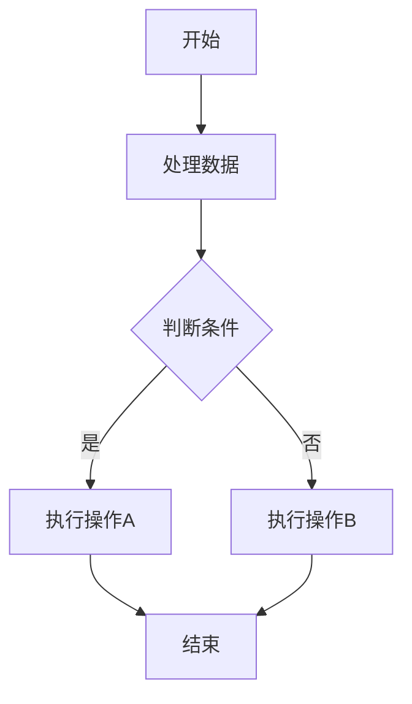
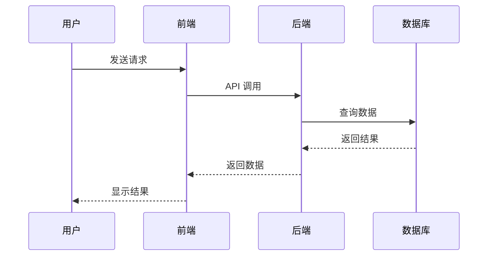

# 文章主标题

> 这是一段引言或重要提示

## 📋 概述

在这里写一段概述，介绍文章的主要内容和目标读者。

## 🎯 核心内容

### 1. 第一部分标题

这里是第一部分的内容。可以包含：

- 无序列表项 1
- 无序列表项 2
- 无序列表项 3

### 2. 代码示例

```typescript
// TypeScript 代码示例
interface User {
  id: string;
  name: string;
  email: string;
}

function greetUser(user: User): string {
  return `Hello, ${user.name}!`;
}
```

```javascript
// JavaScript 代码示例
const fetchData = async () => {
  try {
    const response = await fetch("https://api.example.com/data");
    const data = await response.json();
    return data;
  } catch (error) {
    console.error("Error:", error);
  }
};
```

### 3. 表格示例

| 功能     | 描述             | 状态      |
| -------- | ---------------- | --------- |
| 用户认证 | 支持邮箱密码登录 | ✅ 已完成 |
| 文章管理 | CRUD 操作        | ✅ 已完成 |
| 评论系统 | 待开发           | ⏳ 进行中 |

### 4. 引用和提示

> **提示**：这是一个重要的提示信息。

> **注意**：这是一个需要注意的地方。

> **警告**：这是一个警告信息。

## 🔧 技术细节

### Mermaid 图表示例



### 流程图示例



## 💡 最佳实践

1. **第一个要点**

   详细说明第一个最佳实践。

2. **第二个要点**

   详细说明第二个最佳实践。

3. **第三个要点**

   详细说明第三个最佳实践。

## 🎨 实战案例

### 案例一：xxx 实现

```typescript
// 完整的实现代码
import { useState, useEffect } from 'react';

export default function Example() {
  const [data, setData] = useState(null);

  useEffect(() => {
    fetchData();
  }, []);

  return (
    <div>
      {/* 你的 JSX 代码 */}
    </div>
  );
}
```

**实现要点**：

- 要点 1
- 要点 2
- 要点 3

## 📊 性能优化

### 优化前

```javascript
// 未优化的代码
function slowFunction() {
  // ...
}
```

### 优化后

```javascript
// 优化后的代码
function optimizedFunction() {
  // ...
}
```

**优化效果**：

- 性能提升：50%
- 内存占用减少：30%

## 🐛 常见问题

### 问题1：如何解决 xxx 问题？

**解决方案**：

```bash
# 执行以下命令
npm install xxx
```

### 问题2：为什么会出现 yyy 错误？

**原因分析**：

这个错误通常是因为...

**解决方法**：

1. 第一步
2. 第二步
3. 第三步

## 🔗 相关资源

- [官方文档](https://example.com/docs)
- [GitHub 仓库](https://github.com/example/repo)
- [相关文章](https://example.com/article)

## 📝 总结

在这里总结文章的核心内容：

1. 学习了什么
2. 解决了什么问题
3. 下一步可以做什么

## 🎓 延伸阅读

- [深入理解 xxx](https://example.com/deep-dive)
- [xxx 进阶指南](https://example.com/advanced)
- [xxx 最佳实践](https://example.com/best-practices)

---

**更新日志**：

- 2025-10-17：初始版本
- 2025-10-18：添加 xxx 章节

**作者**：SpringLament Blog
**标签**：#React #Next.js #TypeScript
